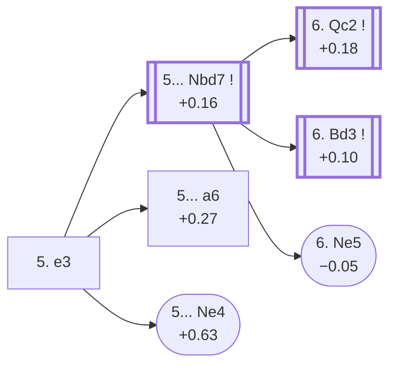

<a name="_TOP_"></a>

# D45 Queen's Gambit Declined: Semi-Slav, 5. e3 <br> 1. d4 d5 2. c4 e6 3. Nc3 Nf6 4. Nf3 c6 5. e3 #

Spun off from [D43's own "4... c6" card](https://github.com/onclemarcel/chess_flashcards/blob/main/d4_openings/D43_Semi_Slav_Defense.md#_initial_move_) — a real, roughly even main try there (41.8% masters), already live-tagged its own code. `eco.md` leaves this bare tabiya named only "5.e3"; the live explorer independently names it the ***Main Line*** — a name it reuses, one ply deeper, at D46's own root too.

### Overview

*Quick map of every move covered on this card — see the [shape key](https://github.com/onclemarcel/chess_flashcards/blob/main/start.md#content-diagram-optional) in start.md.*

<!-- content-diagram:start -->

<!-- content-diagram:end -->

<a name="_initial_move_"></a>

[](https://lichess.org/analysis/standard/rnbqkb1r/pp3ppp/2p1pn2/3p4/2PP4/2N1PN2/PP3PPP/R1BQKB1R_b_KQkq_-_0_5)

*... 5. e3 — live-tagged the Main Line*

```
rnbqkb1r/pp3ppp/2p1pn2/3p4/2PP4/2N1PN2/PP3PPP/R1BQKB1R b KQkq - 0 5
```

|  | +0.16 |
| --- | --- |

<!-- lichess-stats:start fen="rnbqkb1r/pp3ppp/2p1pn2/3p4/2PP4/2N1PN2/PP3PPP/R1BQKB1R b KQkq - 0 5" db="lichess,masters" speeds="bullet,blitz" ratings="1800,2000,2200,2500" moves="6" -->
| Move | Online | W/D/B | Masters | W/D/B | |
| :--- | ---: | :--- | ---: | :--- | :-- |
| Nbd7 | 1.3 M (29.3%) | ⬜⬜⬜⬜⬜🟫⬛⬛⬛⬛ 48/6/46 | 34 k (91.9%) | ⬜⬜⬜🟫🟫🟫🟫🟫⬛⬛ 26/56/18 |  |
| Be7 | 1.2 M (26.8%) | ⬜⬜⬜⬜⬜🟫⬛⬛⬛⬛ 52/5/44 | 447 (1.2%) | ⬜⬜⬜⬜⬜🟫🟫🟫🟫⬛ 46/40/14 |  |
| Bd6 | 899 k (20.5%) | ⬜⬜⬜⬜⬜🟫⬛⬛⬛⬛ 51/5/45 | 601 (1.6%) | ⬜⬜⬜⬜🟫🟫🟫🟫⬛⬛ 44/39/17 |  |
| Bb4 | 580 k (13.2%) | ⬜⬜⬜⬜⬜🟫⬛⬛⬛⬛ 54/4/41 | 39 (0.1%) | ⬜⬜⬜⬜🟫🟫🟫🟫🟫⬛ 41/49/10 |  |
| dxc4 | 129 k (2.9%) | ⬜⬜⬜⬜⬜🟫⬛⬛⬛⬛ 53/4/42 | 0 | — | ⚠ |
| a6 | 98 k (2.2%) | ⬜⬜⬜⬜⬜🟫⬛⬛⬛⬛ 50/5/45 | 1.8 k (4.8%) | ⬜⬜⬜🟫🟫🟫🟫🟫⬛⬛ 27/51/22 |  |
| Ne4 | 0 | — | 64 (0.2%) | ⬜⬜⬜⬜⬜🟫🟫🟫⬛⬛ 47/36/17 |  |

*Online: bullet/blitz, 1800+ — 4.4 M games. Masters: 37 k games. [Open in the explorer](https://lichess.org/analysis/standard/rnbqkb1r/pp3ppp/2p1pn2/3p4/2PP4/2N1PN2/PP3PPP/R1BQKB1R_b_KQkq_-_0_5#explorer) — updated 2026-09-07*
<!-- lichess-stats:end -->

Masters' overwhelming reply is **5... Nbd7** (91.9%), preparing to meet either 6.Bd3 or 6.Qc2 flexibly. **5... a6** (4.8%) is the real, secondary *Accelerated Meran*; **5... Ne4** is a genuine rarity, the *Stonewall Defence*.

* [**5... Nbd7**](#_Nbd7_) (91.9% masters): see below.
* [**5... a6**](#_AccelMeran_) (4.8% masters): the *Accelerated Meran (Alekhine Variation)* — covered below.
* [**5... Ne4 6. Bd3 f5**](#_Stonewall_) (+0.63, 0.2% masters): the *Stonewall Defence* — covered below.

[*Back to TOP*](#_TOP_)

---

<a name="_Stonewall_"></a>

## 5... Ne4 6. Bd3 f5 — Stonewall Defence

[](https://lichess.org/analysis/standard/rnbqkb1r/pp4pp/2p1p3/3p1p2/2PPn3/2NBPN2/PP3PPP/R1BQK2R_w_KQkq_f6_0_7)

*... 6... f5 — Stonewall Defence*

```
rnbqkb1r/pp4pp/2p1p3/3p1p2/2PPn3/2NBPN2/PP3PPP/R1BQK2R w KQkq f6 0 7
```

|  | +0.63 |
| --- | --- |

`eco.md`'s name matches the live explorer here — the same Stonewall structure D30's own unrelated "Slav Defence" transposition already reached, this time via 4...c6 and 5.e3 instead. A genuine database rarity (0.2% masters). Not built out further here (backlog).

[*Back to 5. e3*](#_initial_move_)
[*Back to TOP*](#_TOP_)

---

<a name="_AccelMeran_"></a>

## 5... a6 — Accelerated Meran (Alekhine Variation)

[](https://lichess.org/analysis/standard/rnbqkb1r/1p3ppp/p1p1pn2/3p4/2PP4/2N1PN2/PP3PPP/R1BQKB1R_w_KQkq_-_0_6)

*... 5... a6 — Accelerated Meran*

```
rnbqkb1r/1p3ppp/p1p1pn2/3p4/2PP4/2N1PN2/PP3PPP/R1BQKB1R w KQkq - 0 6
```

|  | +0.27 |
| --- | --- |

`eco.md`'s name matches the live explorer here — named after fourth World Champion Alexander Alekhine, the same figure already lending his name to unrelated lines elsewhere in this repo (D10, D21, D22). Prepares ... b5 immediately, a move ahead of the main Meran, rather than developing the queenside knight first. A real, secondary try (4.8% masters). Not built out further here (backlog).

[*Back to 5. e3*](#_initial_move_)
[*Back to TOP*](#_TOP_)

---

<a name="_Nbd7_"></a>

## 5... Nbd7 — Normal Variation

[](https://lichess.org/analysis/standard/r1bqkb1r/pp1n1ppp/2p1pn2/3p4/2PP4/2N1PN2/PP3PPP/R1BQKB1R_w_KQkq_-_1_6)

*... 5... Nbd7 — live-tagged the Normal Variation*

```
r1bqkb1r/pp1n1ppp/2p1pn2/3p4/2PP4/2N1PN2/PP3PPP/R1BQKB1R w KQkq - 1 6
```

|  | +0.16 |
| --- | --- |

<!-- lichess-stats:start fen="r1bqkb1r/pp1n1ppp/2p1pn2/3p4/2PP4/2N1PN2/PP3PPP/R1BQKB1R w KQkq - 1 6" db="lichess,masters" speeds="bullet,blitz" ratings="1800,2000,2200,2500" moves="3" -->
| Move | Online | W/D/B | Masters | W/D/B | |
| :--- | ---: | :--- | ---: | :--- | :-- |
| Bd3 | 622 k (42.2%) | ⬜⬜⬜⬜⬜🟫⬛⬛⬛⬛ 49/6/46 | 11 k (32.6%) | ⬜⬜⬜🟫🟫🟫🟫🟫⬛⬛ 29/50/21 |  |
| Qc2 | 273 k (18.6%) | ⬜⬜⬜⬜⬜🟫⬛⬛⬛⬛ 51/6/42 | 21 k (60.4%) | ⬜⬜🟫🟫🟫🟫🟫🟫⬛⬛ 25/59/17 |  |
| Be2 | 193 k (13.1%) | ⬜⬜⬜⬜⬜⬛⬛⬛⬛⬛ 47/6/47 | 1.4 k (4.2%) | ⬜⬜⬜🟫🟫🟫🟫🟫⬛⬛ 28/51/21 |  |

*Online: bullet/blitz, 1800+ — 1.5 M games. Masters: 35 k games. [Open in the explorer](https://lichess.org/analysis/standard/r1bqkb1r/pp1n1ppp/2p1pn2/3p4/2PP4/2N1PN2/PP3PPP/R1BQKB1R_w_KQkq_-_1_6#explorer) — updated 2026-09-07*
<!-- lichess-stats:end -->

`eco.md` leaves this bare tabiya named only "5...Nd7"; the live explorer independently names it the ***Normal Variation***. Masters split between **6. Qc2** (60.4%), heading for the *Stoltz Variation*, and **6. Bd3** (32.6%), escalating to its own deeper code, [D46](https://github.com/onclemarcel/chess_flashcards/blob/main/d4_openings/D46_Semi_Slav_Bogoljubow.md). **6. Ne5** is a genuine rarity, the *Rubinstein (Anti-Meran) System*.

* [**6. Qc2**](#_Stoltz_) (60.4% masters): the *Stoltz Variation* — covered below.
* **6. Bd3** (+0.10, 32.6% masters): its own code, [D46](https://github.com/onclemarcel/chess_flashcards/blob/main/d4_openings/D46_Semi_Slav_Bogoljubow.md).
* [**6. Ne5**](#_Rubinstein_) (0.1% masters): the *Rubinstein (Anti-Meran) System* — covered below.

[*Back to 5. e3*](#_initial_move_)
[*Back to TOP*](#_TOP_)

---

<a name="_Stoltz_"></a>

## 6. Qc2 — Stoltz Variation

[](https://lichess.org/analysis/standard/r1bqkb1r/pp1n1ppp/2p1pn2/3p4/2PP4/2N1PN2/PPQ2PPP/R1B1KB1R_b_KQkq_-_2_6)

*... 6. Qc2 — Stoltz Variation*

```
r1bqkb1r/pp1n1ppp/2p1pn2/3p4/2PP4/2N1PN2/PPQ2PPP/R1B1KB1R b KQkq - 2 6
```

|  | +0.18 |
| --- | --- |

`eco.md`'s name matches the live explorer here — the same Gösta Stoltz already lending his name to D34's own unrelated Tarrasch-tree line. Prepares e3-e4 without blocking the c1-bishop's diagonal. Not built out further here (backlog).

[*Back to 5... Nbd7*](#_Nbd7_)
[*Back to TOP*](#_TOP_)

---

<a name="_Rubinstein_"></a>

## 6. Ne5 — Rubinstein (Anti-Meran) System

[](https://lichess.org/analysis/standard/r1bqkb1r/pp1n1ppp/2p1pn2/3pN3/2PP4/2N1P3/PP3PPP/R1BQKB1R_b_KQkq_-_2_6)

*... 6. Ne5 — Rubinstein (Anti-Meran) System*

```
r1bqkb1r/pp1n1ppp/2p1pn2/3pN3/2PP4/2N1P3/PP3PPP/R1BQKB1R b KQkq - 2 6
```

|  | −0.05 |
| --- | --- |

`eco.md`'s name matches the live explorer's own inherited tag here (no independent name live at this exact node) — named for Akiba Rubinstein, already lending his name to D27's own unrelated Classical-tree variation. Occupies the outpost immediately rather than completing development first — a genuine database rarity (0.1% masters). Not built out further here (backlog).

[*Back to 5... Nbd7*](#_Nbd7_)
[*Back to TOP*](#_TOP_)
