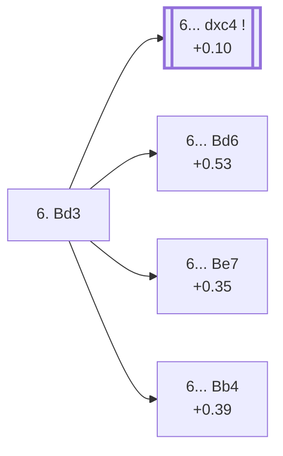

<a name="_TOP_"></a>

# D46 Queen's Gambit Declined: Semi-Slav, 6. Bd3 <br> 1. d4 d5 2. c4 e6 3. Nc3 Nf6 4. Nf3 c6 5. e3 Nbd7 6. Bd3 #

Spun off from [D45's own "5... Nbd7" card](https://github.com/onclemarcel/chess_flashcards/blob/main/d4_openings/D45_Semi_Slav_Main_Line.md#_Nbd7_) — a real, secondary try there (32.6% masters), already live-tagged its own code. `eco.md` leaves this bare tabiya named only "6.Bd3"; the live explorer independently names it, again, the ***Main Line*** — the third time this exact name has been reused across D43-D49 at three different depths.

### Overview

*Quick map of every move covered on this card — see the [shape key](https://github.com/onclemarcel/chess_flashcards/blob/main/start.md#content-diagram-optional) in start.md.*

<!-- content-diagram:start -->

<!-- content-diagram:end -->

<a name="_initial_move_"></a>

[](https://lichess.org/analysis/standard/r1bqkb1r/pp1n1ppp/2p1pn2/3p4/2PP4/2NBPN2/PP3PPP/R1BQK2R_b_KQkq_-_2_6)

*... 6. Bd3 — live-tagged the Main Line*

```
r1bqkb1r/pp1n1ppp/2p1pn2/3p4/2PP4/2NBPN2/PP3PPP/R1BQK2R b KQkq - 2 6
```

|  | +0.10 |
| --- | --- |

<!-- lichess-stats:start fen="r1bqkb1r/pp1n1ppp/2p1pn2/3p4/2PP4/2NBPN2/PP3PPP/R1BQK2R b KQkq - 2 6" db="lichess,masters" speeds="bullet,blitz" ratings="1800,2000,2200,2500" moves="4" -->
| Move | Online | W/D/B | Masters | W/D/B | |
| :--- | ---: | :--- | ---: | :--- | :-- |
| dxc4 | 330 k (51.2%) | ⬜⬜⬜⬜⬜⬛⬛⬛⬛⬛ 47/6/47 | 9.7 k (85.6%) | ⬜⬜⬜🟫🟫🟫🟫🟫⬛⬛ 27/51/22 |  |
| Bd6 | 153 k (23.7%) | ⬜⬜⬜⬜⬜🟫⬛⬛⬛⬛ 49/6/45 | 1.1 k (9.8%) | ⬜⬜⬜⬜🟫🟫🟫🟫⬛⬛ 42/42/15 |  |
| Be7 | 79 k (12.2%) | ⬜⬜⬜⬜⬜🟫⬛⬛⬛⬛ 51/5/43 | 245 (2.2%) | ⬜⬜⬜⬜🟫🟫🟫🟫🟫⬛ 39/47/14 |  |
| Bb4 | 34 k (5.3%) | ⬜⬜⬜⬜⬜🟫⬛⬛⬛⬛ 53/4/42 | 124 (1.1%) | ⬜⬜⬜🟫🟫🟫🟫🟫🟫⬛ 31/55/15 |  |

*Online: bullet/blitz, 1800+ — 645 k games. Masters: 11 k games. [Open in the explorer](https://lichess.org/analysis/standard/r1bqkb1r/pp1n1ppp/2p1pn2/3p4/2PP4/2NBPN2/PP3PPP/R1BQK2R_b_KQkq_-_2_6#explorer) — updated 2026-09-07*
<!-- lichess-stats:end -->

Masters' overwhelming reply is **6... dxc4** (85.6%), finally grabbing the c4 pawn — the exact continuation escalating to its own deeper code, [D47](https://github.com/onclemarcel/chess_flashcards/blob/main/d4_openings/D47_Semi_Slav_Semi_Meran.md). **6... Bd6** (9.8%) is a real, secondary try, the *Chigorin Defence*; **6... Be7** and **6... Bb4** are both genuine minority tries.

* **6... dxc4** (+0.10): its own code, [D47](https://github.com/onclemarcel/chess_flashcards/blob/main/d4_openings/D47_Semi_Slav_Semi_Meran.md).
* [**6... Bd6**](#_Chigorin_) (9.8% masters): the *Chigorin Defence* — covered below.
* [**6... Be7**](#_Bogolyubov_) (2.2% masters): live-spelled the *Bogoljubow Variation* — covered below.
* [**6... Bb4**](#_Romih_) (1.1% masters): the *Romih Variation* — covered below.

[*Back to TOP*](#_TOP_)

---

<a name="_Bogolyubov_"></a>

## 6... Be7 — Queen's Gambit, Bogolyubov Variation

[](https://lichess.org/analysis/standard/r1bqk2r/pp1nbppp/2p1pn2/3p4/2PP4/2NBPN2/PP3PPP/R1BQK2R_w_KQkq_-_3_7)

*... 6... Be7 — live-tagged the Bogoljubow Variation*

```
r1bqk2r/pp1nbppp/2p1pn2/3p4/2PP4/2NBPN2/PP3PPP/R1BQK2R w KQkq - 3 7
```

|  | +0.35 |
| --- | --- |

`eco.md` names this entry just "Queen's Gambit, Bogolyubov Variation" — dropping the "Declined" qualifier every other entry in this whole D-series carries, an odd one-off quirk of `eco.md`'s own listing. The live explorer spells it the ***Bogoljubow Variation*** — the same live-vs-eco.md spelling divergence already seen at C91 and D24. Completes development conservatively without committing the bishop to d6 or b4. A genuine database rarity (2.2% masters). Masters' clear main try in reply is **7. O-O**. Not built out further here (backlog).

[*Back to 6. Bd3*](#_initial_move_)
[*Back to TOP*](#_TOP_)

---

<a name="_Romih_"></a>

## 6... Bb4 — Romih Variation

[](https://lichess.org/analysis/standard/r1bqk2r/pp1n1ppp/2p1pn2/3p4/1bPP4/2NBPN2/PP3PPP/R1BQK2R_w_KQkq_-_3_7)

*... 6... Bb4 — Romih Variation*

```
r1bqk2r/pp1n1ppp/2p1pn2/3p4/1bPP4/2NBPN2/PP3PPP/R1BQK2R w KQkq - 3 7
```

|  | +0.39 |
| --- | --- |

`eco.md`'s name matches the live explorer here — named for American master Anthony Santasiere's contemporary, Adolf Romih. Pins the c3-knight, a Ragozin-flavoured idea transplanted into the Semi-Slav's own move order. A genuine database rarity (1.1% masters). Not built out further here (backlog).

[*Back to 6. Bd3*](#_initial_move_)
[*Back to TOP*](#_TOP_)

---

<a name="_Chigorin_"></a>

## 6... Bd6 — Chigorin Defence

[](https://lichess.org/analysis/standard/r1bqk2r/pp1n1ppp/2pbpn2/3p4/2PP4/2NBPN2/PP3PPP/R1BQK2R_w_KQkq_-_3_7)

*... 6... Bd6 — Chigorin Defence*

```
r1bqk2r/pp1n1ppp/2pbpn2/3p4/2PP4/2NBPN2/PP3PPP/R1BQK2R w KQkq - 3 7
```

|  | +0.53 |
| --- | --- |

`eco.md`'s name matches the live explorer here — the same Mikhail Chigorin already lending his name to D07's own unrelated Chigorin Defense and several unrelated Ruy Lopez lines elsewhere in this repo. Develops the bishop actively, eyeing h2 and preparing a quick ... e5. A real, secondary try (9.8% masters). Not built out further here (backlog).

[*Back to 6. Bd3*](#_initial_move_)
[*Back to TOP*](#_TOP_)
