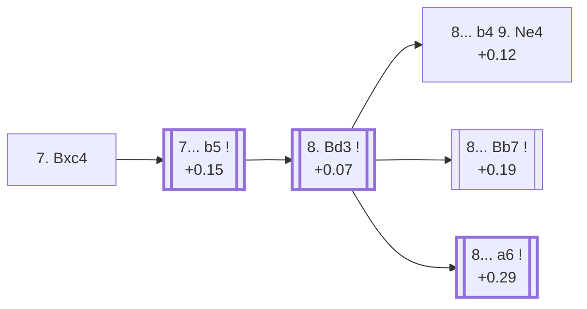

<a name="_TOP_"></a>

# D47 Queen's Gambit Declined: Semi-Slav, Semi-Meran Variation <br> 1. d4 d5 2. c4 e6 3. Nc3 Nf6 4. Nf3 c6 5. e3 Nbd7 6. Bd3 dxc4 7. Bxc4 #

Spun off from [D46's own "6. Bd3" card](https://github.com/onclemarcel/chess_flashcards/blob/main/d4_openings/D46_Semi_Slav_Bogoljubow.md#_initial_move_) — masters' overwhelming reply there (85.6%), already live-tagged its own code. `eco.md` leaves this bare tabiya named only "7.Bc4"; the live explorer independently names it the ***Semi-Meran Variation***.

### Overview

*Quick map of every move covered on this card — see the [shape key](https://github.com/onclemarcel/chess_flashcards/blob/main/start.md#content-diagram-optional) in start.md.*

<!-- content-diagram:start -->

<!-- content-diagram:end -->

<a name="_initial_move_"></a>

[](https://lichess.org/analysis/standard/r1bqkb1r/pp1n1ppp/2p1pn2/8/2BP4/2N1PN2/PP3PPP/R1BQK2R_b_KQkq_-_0_7)

*... 7. Bxc4 — live-tagged the Semi-Meran Variation*

```
r1bqkb1r/pp1n1ppp/2p1pn2/8/2BP4/2N1PN2/PP3PPP/R1BQK2R b KQkq - 0 7
```

|  | +0.15 |
| --- | --- |

<!-- lichess-stats:start fen="r1bqkb1r/pp1n1ppp/2p1pn2/8/2BP4/2N1PN2/PP3PPP/R1BQK2R b KQkq - 0 7" db="lichess,masters" speeds="bullet,blitz" ratings="1800,2000,2200,2500" moves="4" -->
| Move | Online | W/D/B | Masters | W/D/B | |
| :--- | ---: | :--- | ---: | :--- | :-- |
| b5 | 341 k (91.9%) | ⬜⬜⬜⬜⬜⬛⬛⬛⬛⬛ 46/6/48 | 9.7 k (99.1%) | ⬜⬜⬜🟫🟫🟫🟫🟫⬛⬛ 27/52/22 |  |
| Bd6 | 10 k (2.8%) | ⬜⬜⬜⬜⬜🟫⬛⬛⬛⬛ 50/5/45 | 42 (0.4%) | ⬜⬜⬜⬜⬜🟫🟫🟫⬛⬛ 50/33/17 |  |
| Nb6 | 5.8 k (1.6%) | ⬜⬜⬜⬜⬜⬜⬛⬛⬛⬛ 57/4/38 | 0 | — | ⚠ |
| Be7 | 4.5 k (1.2%) | ⬜⬜⬜⬜⬜🟫⬛⬛⬛⬛ 53/5/43 | 0 | — | ⚠ |
| a6 | 0 | — | 26 (0.3%) | ⬜⬜⬜⬜🟫🟫🟫🟫⬛⬛ 38/38/23 |  |
| c5 | 0 | — | 10 (0.1%) | — |  |

*Online: bullet/blitz, 1800+ — 371 k games. Masters: 9.8 k games. [Open in the explorer](https://lichess.org/analysis/standard/r1bqkb1r/pp1n1ppp/2p1pn2/8/2BP4/2N1PN2/PP3PPP/R1BQK2R_b_KQkq_-_0_7#explorer) — updated 2026-09-15*
<!-- lichess-stats:end -->

Masters' near-forced reply is **7... b5** (99.1%), grabbing queenside space and holding onto tempo.

* [**7... b5**](#_Meran_) (+0.15, 99.1% masters): the *Meran Variation* — covered below.

[*Back to TOP*](#_TOP_)

---

<a name="_Meran_"></a>

## 7... b5 — Meran Variation

[](https://lichess.org/analysis/standard/r1bqkb1r/p2n1ppp/2p1pn2/1p6/2BP4/2N1PN2/PP3PPP/R1BQK2R_w_KQkq_b6_0_8)

*... 7... b5 — Meran Variation*

```
r1bqkb1r/p2n1ppp/2p1pn2/1p6/2BP4/2N1PN2/PP3PPP/R1BQK2R w KQkq b6 0 8
```

|  | +0.07 |
| --- | --- |

<!-- lichess-stats:start fen="r1bqkb1r/p2n1ppp/2p1pn2/1p6/2BP4/2N1PN2/PP3PPP/R1BQK2R w KQkq b6 0 8" db="lichess,masters" speeds="bullet,blitz" ratings="1800,2000,2200,2500" moves="3" -->
| Move | Online | W/D/B | Masters | W/D/B | |
| :--- | ---: | :--- | ---: | :--- | :-- |
| Bd3 | 247 k (72.5%) | ⬜⬜⬜⬜⬜⬛⬛⬛⬛⬛ 46/6/48 | 8.1 k (83.4%) | ⬜⬜⬜🟫🟫🟫🟫🟫⬛⬛ 27/51/22 |  |
| Bb3 | 51 k (14.9%) | ⬜⬜⬜⬜⬜⬛⬛⬛⬛⬛ 47/5/48 | 267 (2.8%) | ⬜⬜⬜🟫🟫🟫🟫⬛⬛⬛ 33/37/30 |  |
| Be2 | 42 k (12.3%) | ⬜⬜⬜⬜⬜🟫⬛⬛⬛⬛ 47/8/45 | 1.3 k (13.8%) | ⬜⬜⬜🟫🟫🟫🟫🟫⬛⬛ 26/55/19 |  |

*Online: bullet/blitz, 1800+ — 341 k games. Masters: 9.7 k games. [Open in the explorer](https://lichess.org/analysis/standard/r1bqkb1r/p2n1ppp/2p1pn2/1p6/2BP4/2N1PN2/PP3PPP/R1BQK2R_w_KQkq_b6_0_8#explorer) — updated 2026-09-15*
<!-- lichess-stats:end -->

`eco.md`'s name matches the live explorer here — the classical bishop-attacking counter, named for the 1924 Meran tournament, the single most heavily analysed structure to arise anywhere in the whole D-series. Masters' clear main try is **8. Bd3** (83.4%), retreating the bishop to keep it aimed at the h7 diagonal.

* [**8. Bd3**](#_Bd3_) (+0.07, 83.4% masters): see below.

[*Back to 7. Bxc4*](#_initial_move_)
[*Back to TOP*](#_TOP_)

---

<a name="_Bd3_"></a>

## 8. Bd3

[](https://lichess.org/analysis/standard/r1bqkb1r/p2n1ppp/2p1pn2/1p6/3P4/2NBPN2/PP3PPP/R1BQK2R_b_KQkq_-_1_8)

*... 8. Bd3*

```
r1bqkb1r/p2n1ppp/2p1pn2/1p6/3P4/2NBPN2/PP3PPP/R1BQK2R b KQkq - 1 8
```

|  | +0.29 |
| --- | --- |

<!-- lichess-stats:start fen="r1bqkb1r/p2n1ppp/2p1pn2/1p6/3P4/2NBPN2/PP3PPP/R1BQK2R b KQkq - 1 8" db="lichess,masters" speeds="bullet,blitz" ratings="1800,2000,2200,2500" moves="4" -->
| Move | Online | W/D/B | Masters | W/D/B | |
| :--- | ---: | :--- | ---: | :--- | :-- |
| a6 | 105 k (42.3%) | ⬜⬜⬜⬜🟫⬛⬛⬛⬛⬛ 45/6/49 | 2.4 k (29.9%) | ⬜⬜⬜🟫🟫🟫🟫⬛⬛⬛ 32/44/25 |  |
| Bb7 | 102 k (41.2%) | ⬜⬜⬜⬜⬜⬛⬛⬛⬛⬛ 47/6/47 | 4.0 k (49.8%) | ⬜⬜🟫🟫🟫🟫🟫🟫⬛⬛ 23/56/20 |  |
| Bd6 | 28 k (11.3%) | ⬜⬜⬜⬜🟫⬛⬛⬛⬛⬛ 46/6/48 | 1.1 k (13.1%) | ⬜⬜⬜🟫🟫🟫🟫🟫⬛⬛ 27/48/25 |  |
| b4 | 9.1 k (3.7%) | ⬜⬜⬜⬜🟫⬛⬛⬛⬛⬛ 46/6/48 | 578 (7.1%) | ⬜⬜⬜🟫🟫🟫🟫🟫⬛⬛ 30/53/16 |  |

*Online: bullet/blitz, 1800+ — 248 k games. Masters: 8.1 k games. [Open in the explorer](https://lichess.org/analysis/standard/r1bqkb1r/p2n1ppp/2p1pn2/1p6/3P4/2NBPN2/PP3PPP/R1BQK2R_b_KQkq_-_1_8#explorer) — updated 2026-09-15*
<!-- lichess-stats:end -->

Left completely untagged live (`opening=None`) at this exact node, the true crossroads of the whole Meran complex. Masters split between **8... Bb7** (49.8%), the classical *Wade Variation*, and **8... a6** (29.9%), escalating to its own deeper code, [D48](https://github.com/onclemarcel/chess_flashcards/blob/main/d4_openings/D48_Semi_Slav_Meran_Old_Variation.md). **8... b4** (7.1%) is the real, secondary *neo-Meran (Lundin Variation)*.

* [**8... b4 9. Ne4**](#_neoMeran_) (+0.12, 7.1% masters): the *neo-Meran (Lundin Variation)* — covered below.
* [**8... Bb7**](#_Wade_) (49.8% masters): the *Wade Variation* — covered below.
* **8... a6** (+0.29, 29.9% masters): its own code, [D48](https://github.com/onclemarcel/chess_flashcards/blob/main/d4_openings/D48_Semi_Slav_Meran_Old_Variation.md).

[*Back to 7... b5*](#_Meran_)
[*Back to TOP*](#_TOP_)

---

<a name="_neoMeran_"></a>

## 8... b4 9. Ne4 — neo-Meran (Lundin Variation)

[](https://lichess.org/analysis/standard/r1bqkb1r/p2n1ppp/2p1pn2/8/1p1P4/2NBPN2/PP3PPP/R1BQK2R_w_KQkq_-_0_9)

*... 8... b4 — neo-Meran, before 9. Ne4*

```
r1bqkb1r/p2n1ppp/2p1pn2/8/1p1P4/2NBPN2/PP3PPP/R1BQK2R w KQkq - 0 9
```

|  | +0.12 |
| --- | --- |

`eco.md` calls this the *neo-Meran (Lundin Variation)*, named for Swedish master Erik Lundin — a live-independent tag doesn't appear at this exact node either (inherits no distinct name from the explorer). Pushes the pawn to gain a further tempo on the c3-knight rather than developing the bishop first — a real, secondary try (7.1% masters). Not built out further here (backlog).

[*Back to 8. Bd3*](#_Bd3_)
[*Back to TOP*](#_TOP_)

---

<a name="_Wade_"></a>

## 8... Bb7 — Wade Variation

[](https://lichess.org/analysis/standard/r2qkb1r/pb1n1ppp/2p1pn2/1p6/3P4/2NBPN2/PP3PPP/R1BQK2R_w_KQkq_-_2_9)

*... 8... Bb7 — Wade Variation*

```
r2qkb1r/pb1n1ppp/2p1pn2/1p6/3P4/2NBPN2/PP3PPP/R1BQK2R w KQkq - 2 9
```

|  | +0.19 |
| --- | --- |

`eco.md`'s name matches the live explorer's own inherited tag here — named for English master Robert Wade. Fianchettoes immediately, masters' actual main try at this exact fork (49.8%). Not built out further here (backlog).

[*Back to 8. Bd3*](#_Bd3_)
[*Back to TOP*](#_TOP_)
