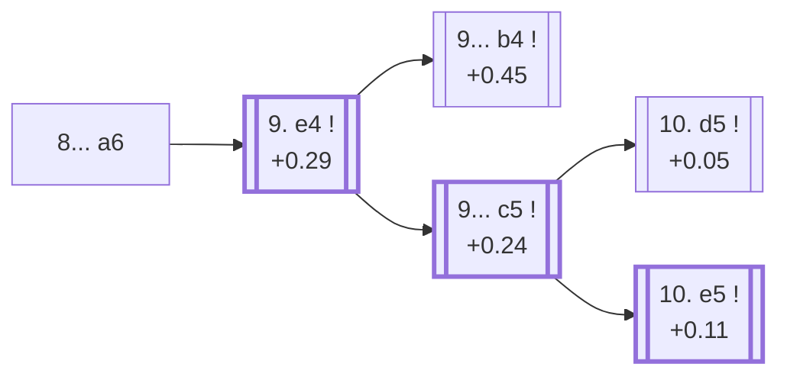

<a name="_TOP_"></a>

# D48 Queen's Gambit Declined: Semi-Slav, Meran Variation, 8... a6 <br> 1. d4 d5 2. c4 e6 3. Nc3 Nf6 4. Nf3 c6 5. e3 Nbd7 6. Bd3 dxc4 7. Bxc4 b5 8. Bd3 a6 #

Spun off from [D47's own "8. Bd3" card](https://github.com/onclemarcel/chess_flashcards/blob/main/d4_openings/D47_Semi_Slav_Semi_Meran.md#_Bd3_) — a real, secondary try there (29.9% masters), already live-tagged its own code, reusing the same "Meran Variation" name as D47's own root.

### Overview

*Quick map of every move covered on this card — see the [shape key](https://github.com/onclemarcel/chess_flashcards/blob/main/start.md#content-diagram-optional) in start.md.*

<!-- content-diagram:start -->

<!-- content-diagram:end -->

<a name="_initial_move_"></a>

[](https://lichess.org/analysis/standard/r1bqkb1r/3n1ppp/p1p1pn2/1p6/3P4/2NBPN2/PP3PPP/R1BQK2R_w_KQkq_-_0_9)

*... 8... a6 — Meran Variation*

```
r1bqkb1r/3n1ppp/p1p1pn2/1p6/3P4/2NBPN2/PP3PPP/R1BQK2R w KQkq - 0 9
```

|  | +0.29 |
| --- | --- |

<!-- lichess-stats:start fen="r1bqkb1r/3n1ppp/p1p1pn2/1p6/3P4/2NBPN2/PP3PPP/R1BQK2R w KQkq - 0 9" db="lichess,masters" speeds="bullet,blitz" ratings="1800,2000,2200,2500" moves="3" -->
| Move | Online | W/D/B | Masters | W/D/B | |
| :--- | ---: | :--- | ---: | :--- | :-- |
| O-O | 56 k (52.3%) | ⬜⬜⬜⬜🟫⬛⬛⬛⬛⬛ 44/6/51 | 252 (10.4%) | ⬜⬜⬜🟫🟫🟫🟫⬛⬛⬛ 25/44/31 |  |
| e4 | 28 k (26.4%) | ⬜⬜⬜⬜⬜🟫⬛⬛⬛⬛ 51/5/44 | 1.9 k (77.0%) | ⬜⬜⬜🟫🟫🟫🟫⬛⬛⬛ 33/43/24 |  |
| a3 | 11 k (10.0%) | ⬜⬜⬜⬜🟫⬛⬛⬛⬛⬛ 40/6/54 | 0 | — | ⚠ |
| a4 | 0 | — | 288 (11.8%) | ⬜⬜⬜🟫🟫🟫🟫🟫⬛⬛ 31/47/23 |  |

*Online: bullet/blitz, 1800+ — 108 k games. Masters: 2.4 k games. [Open in the explorer](https://lichess.org/analysis/standard/r1bqkb1r/3n1ppp/p1p1pn2/1p6/3P4/2NBPN2/PP3PPP/R1BQK2R_w_KQkq_-_0_9#explorer) — updated 2026-09-14*
<!-- lichess-stats:end -->

Prepares ... c5 or ... b4 with the a6 pawn already covering b5. Masters' clear main try is **9. e4** (77.0%), grabbing the centre before Black can strike back.

* [**9. e4**](#_e4_) (+0.29, 77.0% masters): see below.

[*Back to TOP*](#_TOP_)

---

<a name="_e4_"></a>

## 9. e4

[](https://lichess.org/analysis/standard/r1bqkb1r/3n1ppp/p1p1pn2/8/1p1PP3/2NB1N2/PP3PPP/R1BQK2R_b_KQkq_-_0_9)

*... 9. e4*

```
r1bqkb1r/3n1ppp/p1p1pn2/8/1p1PP3/2NB1N2/PP3PPP/R1BQK2R b KQkq - 0 9
```

|  | +0.45 |
| --- | --- |

Left completely untagged live (`opening=None`) at this exact node. Masters split almost exactly evenly between **9... c5** (50.1%), striking back in the centre, and **9... b4** (49.7%), gaining a further tempo on the c3-knight first — the *Pirc Variation*.

* [**9... b4**](#_Pirc_) (49.7% masters): the *Pirc Variation* — covered below.
* [**9... c5**](#_c5_) (50.1% masters): see below.

[*Back to 8... a6*](#_initial_move_)
[*Back to TOP*](#_TOP_)

---

<a name="_Pirc_"></a>

## 9... b4 — Pirc Variation

[](https://lichess.org/analysis/standard/r1bqkb1r/3n1ppp/p3pn2/8/1p1PP3/2NB1N2/PP3PPP/R1BQK2R_w_KQkq_-_0_10)

*... 9... b4 — Pirc Variation*

```
r1bqkb1r/3n1ppp/p3pn2/8/1p1PP3/2NB1N2/PP3PPP/R1BQK2R w KQkq - 0 10
```

|  | +0.45 |
| --- | --- |

`eco.md`'s name matches the live explorer's own inherited tag here — the same Václav Pirc already lending his name to the unrelated Pirc Defense elsewhere in this repo. Gains a tempo on the c3-knight before deciding on the central pawn structure. Not built out further here (backlog).

[*Back to 9. e4*](#_e4_)
[*Back to TOP*](#_TOP_)

---

<a name="_c5_"></a>

## 9... c5

[](https://lichess.org/analysis/standard/r1bqkb1r/3n1ppp/p3pn2/1pp5/3PP3/2NB1N2/PP3PPP/R1BQK2R_w_KQkq_-_0_10)

*... 9... c5*

```
r1bqkb1r/3n1ppp/p3pn2/1pp5/3PP3/2NB1N2/PP3PPP/R1BQK2R w KQkq - 0 10
```

|  | +0.24 |
| --- | --- |

`eco.md` leaves this bare tabiya named only "Meran" (reusing the parent's own name); live-tagged, again, the *Meran Variation*. White's 10th move is the sharpest fork in the whole complex, near-exactly split between the *Reynolds' Variation* and the *old Main line*.

* [**10. d5**](#_Reynolds_) (49.7% masters): the *Reynolds' Variation* — covered below.
* **10. e5** (+0.11): the *old Main line* — its own code, [D49](https://github.com/onclemarcel/chess_flashcards/blob/main/d4_openings/D49_Semi_Slav_Meran_Blumenfeld.md).

[*Back to 9. e4*](#_e4_)
[*Back to TOP*](#_TOP_)

---

<a name="_Reynolds_"></a>

## 10. d5 — Reynolds' Variation

[](https://lichess.org/analysis/standard/r1bqkb1r/3n1ppp/p3pn2/1ppP4/4P3/2NB1N2/PP3PPP/R1BQK2R_b_KQkq_-_0_10)

*... 10. d5 — Reynolds' Variation*

```
r1bqkb1r/3n1ppp/p3pn2/1ppP4/4P3/2NB1N2/PP3PPP/R1BQK2R b KQkq - 0 10
```

|  | +0.05 |
| --- | --- |

`eco.md`'s name matches the live explorer's own inherited tag here — named for English amateur R.G. Reynolds. Pushes past rather than allowing further central tension, closing the position and gaining space. A real, secondary try (49.7% masters — a genuinely near-even fork). Not built out further here (backlog).

[*Back to 9... c5*](#_c5_)
[*Back to TOP*](#_TOP_)
