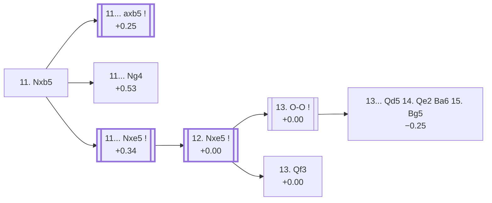

<a name="_TOP_"></a>

# D49 Queen's Gambit Declined: Semi-Slav, Meran Variation, Old Variation <br> 1. d4 d5 2. c4 e6 3. Nc3 Nf6 4. Nf3 c6 5. e3 Nbd7 6. Bd3 dxc4 7. Bxc4 b5 8. Bd3 a6 9. e4 c5 10. e5 cxd4 11. Nxb5 #

Spun off from [D48's own "9... c5" card](https://github.com/onclemarcel/chess_flashcards/blob/main/d4_openings/D48_Semi_Slav_Meran_Old_Variation.md#_c5_) — the real, near-even other half of that fork (50.1% masters), already live-tagged its own code, live-spelled the ***Old Variation*** (`eco.md`: "old Main line"). The deepest and sharpest tree in this entire D-series sweep, running to move 15.

### Overview

*Quick map of every move covered on this card — see the [shape key](https://github.com/onclemarcel/chess_flashcards/blob/main/start.md#content-diagram-optional) in start.md.*

<!-- content-diagram:start -->

<!-- content-diagram:end -->

<a name="_initial_move_"></a>

[](https://lichess.org/analysis/standard/r1bqkb1r/3n1ppp/p3pn2/1N2P3/3p4/3B1N2/PP3PPP/R1BQK2R_b_KQkq_-_0_11)

*... 11. Nxb5 — Blumenfeld Variation*

```
r1bqkb1r/3n1ppp/p3pn2/1N2P3/3p4/3B1N2/PP3PPP/R1BQK2R b KQkq - 0 11
```

|  | +0.25 |
| --- | --- |

<!-- lichess-stats:start fen="r1bqkb1r/3n1ppp/p3pn2/1N2P3/3p4/3B1N2/PP3PPP/R1BQK2R b KQkq - 0 11" db="lichess,masters" speeds="bullet,blitz" ratings="1800,2000,2200,2500" moves="3" -->
| Move | Online | W/D/B | Masters | W/D/B | |
| :--- | ---: | :--- | ---: | :--- | :-- |
| axb5 | 5.3 k (77.2%) | ⬜⬜⬜⬜⬜🟫⬛⬛⬛⬛ 52/6/42 | 499 (58.6%) | ⬜⬜⬜🟫🟫🟫🟫🟫⬛⬛ 32/48/20 |  |
| Nxe5 | 1.1 k (15.4%) | ⬜⬜⬜⬜🟫⬛⬛⬛⬛⬛ 44/8/48 | 224 (26.3%) | ⬜⬜⬜🟫🟫🟫🟫🟫⬛⬛ 32/49/19 |  |
| Ng4 | 305 (4.5%) | ⬜⬜⬜⬜🟫⬛⬛⬛⬛⬛ 46/9/46 | 123 (14.5%) | ⬜⬜⬜🟫🟫🟫🟫🟫⬛⬛ 33/44/23 |  |

*Online: bullet/blitz, 1800+ — 6.8 k games. Masters: 851 games. [Open in the explorer](https://lichess.org/analysis/standard/r1bqkb1r/3n1ppp/p3pn2/1N2P3/3p4/3B1N2/PP3PPP/R1BQK2R_b_KQkq_-_0_11#explorer) — updated 2026-09-15*
<!-- lichess-stats:end -->

`eco.md`'s name matches the live explorer here — named for Soviet theoretician Benjamin Blumenfeld, unrelated to the Blumenfeld Countergambit found elsewhere in this repo's A-series. Grabs the pawn back at once with the knight, exploiting the pin on the d4-pawn's own defender. Masters' clear main try is **11... axb5** (58.6%), simply recapturing; **11... Nxe5** (26.3%) counterattacks instead, the *Sozin Variation*; **11... Ng4** is a real, secondary *Rabinovich Variation*.

* **11... axb5** (+0.25, 58.6% masters): see below.
* [**11... Ng4**](#_Rabinovich_) (14.5% masters): the *Rabinovich Variation* — covered below.
* [**11... Nxe5**](#_Sozin_) (26.3% masters): the *Sozin Variation* — covered below.

[*Back to TOP*](#_TOP_)

---

<a name="_Rabinovich_"></a>

## 11... Ng4 — Rabinovich Variation

[](https://lichess.org/analysis/standard/r1bqkb1r/3n1ppp/p3p3/1N2P3/3p2n1/3B1N2/PP3PPP/R1BQK2R_w_KQkq_-_1_12)

*... 11... Ng4 — Rabinovich Variation*

```
r1bqkb1r/3n1ppp/p3p3/1N2P3/3p2n1/3B1N2/PP3PPP/R1BQK2R w KQkq - 1 12
```

|  | +0.53 |
| --- | --- |

`eco.md`'s name matches the live explorer's own inherited tag here — named for Soviet master Ilya Rabinovich. Attacks the e5-pawn from the flank rather than recapturing the piece or the pawn immediately — a real, secondary try (14.5% masters). Not built out further here (backlog).

[*Back to 11. Nxb5*](#_initial_move_)
[*Back to TOP*](#_TOP_)

---

<a name="_Sozin_"></a>

## 11... Nxe5 — Sozin Variation

[](https://lichess.org/analysis/standard/r1bqkb1r/5ppp/p3pn2/1N2n3/3p4/3B1N2/PP3PPP/R1BQK2R_w_KQkq_-_0_12)

*... 11... Nxe5 — Sozin Variation*

```
r1bqkb1r/5ppp/p3pn2/1N2n3/3p4/3B1N2/PP3PPP/R1BQK2R w KQkq - 0 12
```

|  | +0.34 |
| --- | --- |

`eco.md`'s name matches the live explorer here — named for Soviet-American theoretician Veniamin Sozin. Grabs the e5-pawn back with the other knight instead of simply recapturing on b5. Masters' forced reply is **12. Nxe5** (100%), and the line continues below.

* [**12. Nxe5**](#_Nxe5_) (+0.00, 100% masters): see below.

[*Back to 11. Nxb5*](#_initial_move_)
[*Back to TOP*](#_TOP_)

---

<a name="_Nxe5_"></a>

## 12. Nxe5 axb5

[](https://lichess.org/analysis/standard/r1bqkb1r/5ppp/4pn2/1p2N3/3p4/3B1N2/PP3PPP/R1BQK2R_w_KQkq_-_0_13)

*... 12... axb5 — Old Variation tabiya*

```
r1bqkb1r/5ppp/4pn2/1p2N3/3p4/3B1N2/PP3PPP/R1BQK2R w KQkq - 0 13
```

|  | +0.00 |
| --- | --- |

Left completely untagged live (`opening=None`) at this exact node. Masters' actual clear main try is **13. Bxb5+** (70.0%), an intermezzo check `eco.md` doesn't name here at all; the two named entries in this D49 range are both real, secondary tries: **13. O-O** (22.0%), the *Sozin Variation* reused a second time, and **13. Qf3** (7.6%), the *Stahlberg Variation*.

* **13. Bxb5+** (70.0% masters): a real, secondary check uncoded in this range — not covered further here.
* [**13. O-O**](#_Sozin2_) (22.0% masters): a second, unrelated reuse of the *Sozin Variation* name — covered below.
* [**13. Qf3**](#_Stahlberg_) (7.6% masters): the *Stahlberg Variation* — covered below.

[*Back to 11... Nxe5*](#_Sozin_)
[*Back to TOP*](#_TOP_)

---

<a name="_Stahlberg_"></a>

## 13. Qf3 — Stahlberg Variation

[](https://lichess.org/analysis/standard/r1bqkb1r/5ppp/4pn2/1p2N3/3p4/3B1Q2/PP3PPP/R1B1K2R_b_KQkq_-_1_13)

*... 13. Qf3 — Stahlberg Variation*

```
r1bqkb1r/5ppp/4pn2/1p2N3/3p4/3B1Q2/PP3PPP/R1B1K2R b KQkq - 1 13
```

|  | +0.00 |
| --- | --- |

`eco.md`'s name matches the live explorer's own inherited tag here — named for Swedish grandmaster Gideon Ståhlberg. Develops the queen actively, eyeing the a8-rook down the long diagonal, rather than castling immediately. A real, secondary try (7.6% masters). Dead level according to Stockfish. Not built out further here (backlog).

[*Back to 12. Nxe5*](#_Nxe5_)
[*Back to TOP*](#_TOP_)

---

<a name="_Sozin2_"></a>

## 13. O-O — Sozin Variation

[](https://lichess.org/analysis/standard/r1bqkb1r/5ppp/4pn2/1p2N3/3p4/3B4/PP3PPP/R1BQ1RK1_b_kq_-_1_13)

*... 13. O-O — Sozin Variation*

```
r1bqkb1r/5ppp/4pn2/1p2N3/3p4/3B4/PP3PPP/R1BQ1RK1 b kq - 1 13
```

|  | +0.00 |
| --- | --- |

`eco.md` reuses the *Sozin Variation* name here — the second, unrelated node in this same D49 range to carry it, alongside 11...Nxe5 above; both named for Veniamin Sozin but otherwise unconnected. Simply castles into safety, a real, secondary try (22.0% masters). Dead level according to Stockfish. Masters' clear main try in reply is **13... Qd5**, centralising the queen — the exact continuation escalating to the named *Rellstab Attack* below.

* [**13... Qd5 14. Qe2 Ba6 15. Bg5**](#_Rellstab_) (−0.25): the *Rellstab Attack* — covered below.

[*Back to 12. Nxe5*](#_Nxe5_)
[*Back to TOP*](#_TOP_)

---

<a name="_Rellstab_"></a>

## 13. O-O Qd5 14. Qe2 Ba6 15. Bg5 — Rellstab Attack

[](https://lichess.org/analysis/standard/r3kb1r/5ppp/b3pn2/1p1qN1B1/3p4/3B4/PP2QPPP/R4RK1_b_kq_-_5_15)

*... 15. Bg5 — Rellstab Attack*

```
r3kb1r/5ppp/b3pn2/1p1qN1B1/3p4/3B4/PP2QPPP/R4RK1 b kq - 5 15
```

|  | −0.25 |
| --- | --- |

`eco.md`'s name matches the live explorer here — named for German master Ludwig Rellstab, the deepest named line in this entire D-series sweep (15 moves). Black centralises the queen and pins the bishop with counterplay against White's own advanced knight and bishop pair; Stockfish now gives Black a slight edge. Not built out further here — the true end of the whole Meran Old Variation tree as `eco.md` documents it.

[*Back to 13. O-O*](#_Sozin2_)
[*Back to TOP*](#_TOP_)
