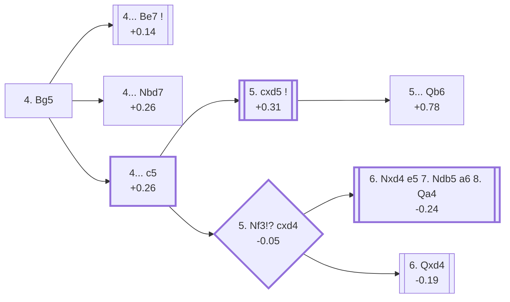

<a name="_TOP_"></a>

# D50 Queen's Gambit Declined: 4.Bg5 <br> 1. d4 d5 2. c4 e6 3. Nc3 Nf6 4. Bg5 #

Spun off from [D35's own "3... Nf6" card](https://github.com/onclemarcel/chess_flashcards/blob/main/d4_openings/D35_Queens_Gambit_Declined_Normal_Defense.md#_initial_move_) — a real secondary try there (23.0% masters). D35 previously described this move as transposing toward D30's own Traditional Variation tree; that claim was wrong (`apply_san.py` confirms a different knight placement — Nc3 here, Nf3 there — makes this a distinct position) and has been corrected there in this same batch to point here instead: this is its own code, D50, not a transposition. `eco.md` leaves this bare tabiya named only "4.Bg5"; the live explorer independently calls it the ***Modern Variation*** — the first of three occurrences of this exact name in this batch, reused again (unrelated) at D51's and D55's own roots.

### Overview

*Quick map of every move covered on this card — see the [shape key](https://github.com/onclemarcel/chess_flashcards/blob/main/start.md#content-diagram-optional) in start.md.*

<!-- content-diagram:start -->

<!-- content-diagram:end -->

<a name="_initial_move_"></a>

[](https://lichess.org/analysis/standard/rnbqkb1r/ppp2ppp/4pn2/3p2B1/2PP4/2N5/PP2PPPP/R2QKBNR_b_KQkq_-_3_4)

*... 4. Bg5 — live-tagged the Modern Variation*

```
rnbqkb1r/ppp2ppp/4pn2/3p2B1/2PP4/2N5/PP2PPPP/R2QKBNR b KQkq - 3 4
```

|  | +0.00 |
| --- | --- |

<!-- lichess-stats:start fen="rnbqkb1r/ppp2ppp/4pn2/3p2B1/2PP4/2N5/PP2PPPP/R2QKBNR b KQkq - 3 4" db="lichess,masters" speeds="bullet,blitz" ratings="1800,2000,2200,2500" moves="8" -->
| Move | Online | W/D/B | Masters | W/D/B | |
| :--- | ---: | :--- | ---: | :--- | :-- |
| Be7 | 4.3 M (63.1%) | ⬜⬜⬜⬜⬜🟫⬛⬛⬛⬛ 50/6/44 | 5.2 k (66.2%) | ⬜⬜⬜🟫🟫🟫🟫🟫⬛⬛ 30/54/16 |  |
| Bb4 | 663 k (9.8%) | ⬜⬜⬜⬜⬜🟫⬛⬛⬛⬛ 52/5/43 | 226 (2.9%) | ⬜⬜⬜⬜🟫🟫🟫🟫⬛⬛ 42/40/19 |  |
| c6 | 638 k (9.4%) | ⬜⬜⬜⬜⬜⬛⬛⬛⬛⬛ 50/5/45 | 630 (8.0%) | ⬜⬜⬜⬜🟫🟫🟫🟫⬛⬛ 37/44/19 |  |
| Nbd7 | 552 k (8.2%) | ⬜⬜⬜⬜⬜⬛⬛⬛⬛⬛ 48/6/46 | 1.4 k (17.2%) | ⬜⬜⬜⬜🟫🟫🟫🟫⬛⬛ 36/43/20 |  |
| dxc4 | 259 k (3.8%) | ⬜⬜⬜⬜⬜⬛⬛⬛⬛⬛ 49/5/46 | 289 (3.7%) | ⬜⬜⬜🟫🟫🟫🟫🟫⬛⬛ 33/48/19 |  |
| c5 | 176 k (2.6%) | ⬜⬜⬜⬜⬜⬛⬛⬛⬛⬛ 48/5/47 | 158 (2.0%) | ⬜⬜⬜🟫🟫🟫🟫⬛⬛⬛ 34/37/28 |  |
| h6 | 108 k (1.6%) | ⬜⬜⬜⬜⬜🟫⬛⬛⬛⬛ 54/5/41 | 9 (0.1%) | — |  |
| a6 | 38 k (0.6%) | ⬜⬜⬜⬜⬜⬛⬛⬛⬛⬛ 50/5/45 | 2 (0.0%) | — | ⚠ |

*Online: bullet/blitz, 1800+ — 6.8 M games. Masters: 7.9 k games. [Open in the explorer](https://lichess.org/analysis/standard/rnbqkb1r/ppp2ppp/4pn2/3p2B1/2PP4/2N5/PP2PPPP/R2QKBNR_b_KQkq_-_3_4#explorer) — updated 2026-09-14*
<!-- lichess-stats:end -->

Pins the knight against the queen at once, the classical treatment of the Queen's Gambit Declined. Masters' clear main try is **4... Be7** (66.2%), heading straight for the Classical/Orthodox complex. **4... Nbd7** (17.2%) develops the other knight first. **4... c6** (8.0%), **4... dxc4** (3.7%) and **4... Bb4** (2.9%) are all real, secondary tries with no code of their own in this D50-D59 range. **4... c5**, the *Been-Koomen Variation*, is a database rarity at masters level (2.0%) yet still carries its own code — a pattern worth remembering for the rest of this batch (D58/D59's own Tartakower complex shows the mirror image, a heavily-coded line masters barely reach for).

* [**4... Be7**](https://github.com/onclemarcel/chess_flashcards/blob/main/d4_openings/D53_Queens_Gambit_Declined_Be7.md) (+0.14, 66.2% masters): its own code, D53.
* [**4... Nbd7**](https://github.com/onclemarcel/chess_flashcards/blob/main/d4_openings/D51_Queens_Gambit_Declined_Knight_Defense.md) (+0.26, 17.2% masters): its own code, D51.
* **4... c6** (8.0% masters): a real, secondary try with no code of its own in this range.
* **4... dxc4** (3.7% masters): a real, secondary try with no code of its own in this range.
* **4... Bb4** (2.9% masters): a real, secondary try with no code of its own in this range.
* [**4... c5**](#_BeenKoomen_) (+0.26, 2.0% masters): the *Been-Koomen Variation* — covered below.

[*Back to TOP*](#_TOP_)

---

<a name="_BeenKoomen_"></a>

## 4... c5 — Been-Koomen Variation

[](https://lichess.org/analysis/standard/rnbqkb1r/pp3ppp/4pn2/2pp2B1/2PP4/2N5/PP2PPPP/R2QKBNR_w_KQkq_c6_0_5)

*... 4... c5 — Been-Koomen Variation*

```
rnbqkb1r/pp3ppp/4pn2/2pp2B1/2PP4/2N5/PP2PPPP/R2QKBNR w KQkq c6 0 5
```

|  | +0.26 |
| --- | --- |

<!-- lichess-stats:start fen="rnbqkb1r/pp3ppp/4pn2/2pp2B1/2PP4/2N5/PP2PPPP/R2QKBNR w KQkq c6 0 5" db="lichess,masters" speeds="bullet,blitz" ratings="1800,2000,2200,2500" moves="4" -->
| Move | Online | W/D/B | Masters | W/D/B | |
| :--- | ---: | :--- | ---: | :--- | :-- |
| e3 | 72 k (39.1%) | ⬜⬜⬜⬜⬜⬛⬛⬛⬛⬛ 49/5/46 | 32 (20.3%) | ⬜⬜🟫🟫🟫🟫⬛⬛⬛⬛ 22/38/41 |  |
| cxd5 | 54 k (29.5%) | ⬜⬜⬜⬜⬜⬛⬛⬛⬛⬛ 49/5/45 | 122 (77.2%) | ⬜⬜⬜⬜🟫🟫🟫🟫⬛⬛ 37/38/25 |  |
| Nf3 | 25 k (13.5%) | ⬜⬜⬜⬜⬜⬛⬛⬛⬛⬛ 48/5/47 | 2 (1.3%) | — | ⚠ |
| dxc5 | 16 k (8.6%) | ⬜⬜⬜⬜🟫⬛⬛⬛⬛⬛ 44/4/52 | 2 (1.3%) | — | ⚠ |

*Online: bullet/blitz, 1800+ — 184 k games. Masters: 158 games. [Open in the explorer](https://lichess.org/analysis/standard/rnbqkb1r/pp3ppp/4pn2/2pp2B1/2PP4/2N5/PP2PPPP/R2QKBNR_w_KQkq_c6_0_5#explorer) — updated 2026-09-14*
<!-- lichess-stats:end -->

`eco.md`'s name matches the live explorer here. A rare-at-masters-level (2.0%) but still independently named try, striking straight at the centre before completing development. Masters' clear main reply is **5. cxd5** (77.2%), resolving the tension at once — covered below. **5. e3** (20.3% masters) is a real, secondary try with no code of its own in this range. **5. Nf3** is a genuine blitz trap: barely seen at masters level (1.3%) but a real online choice (13.5%, roughly 10× its masters share) — covered below via the forced-looking 5...cxd4.

* [**5. cxd5**](#_SemiTarrasch_) (77.2% masters): see below.
* **5. e3** (20.3% masters): a real, secondary try with no code of its own in this range.
* [**5. Nf3 cxd4**](#_Nf3cxd4_) (-0.05, 1.3% masters, 13.5% online — a genuine blitz trap): covered below.

[*Back to 4. Bg5*](#_initial_move_)
[*Back to TOP*](#_TOP_)

---

<a name="_SemiTarrasch_"></a>

## 4... c5 5. cxd5 — Semi-Tarrasch

[](https://lichess.org/analysis/standard/rnbqkb1r/pp3ppp/4pn2/2pP2B1/3P4/2N5/PP2PPPP/R2QKBNR_b_KQkq_-_0_5)

*... 5. cxd5 — live-tagged the Pseudo-Tarrasch Variation*

```
rnbqkb1r/pp3ppp/4pn2/2pP2B1/3P4/2N5/PP2PPPP/R2QKBNR b KQkq - 0 5
```

|  | +0.31 |
| --- | --- |

<!-- lichess-stats:start fen="rnbqkb1r/pp3ppp/4pn2/2pP2B1/3P4/2N5/PP2PPPP/R2QKBNR b KQkq - 0 5" db="lichess,masters" speeds="bullet,blitz" ratings="1800,2000,2200,2500" moves="3" -->
| Move | Online | W/D/B | Masters | W/D/B | |
| :--- | ---: | :--- | ---: | :--- | :-- |
| exd5 | 40 k (71.0%) | ⬜⬜⬜⬜⬜⬛⬛⬛⬛⬛ 50/5/45 | 1 (0.8%) | — | ⚠ |
| cxd4 | 13 k (23.3%) | ⬜⬜⬜⬜⬜⬛⬛⬛⬛⬛ 48/6/46 | 104 (85.2%) | ⬜⬜⬜🟫🟫🟫🟫⬛⬛⬛ 33/40/27 |  |
| Qb6 | 1.6 k (2.9%) | ⬜⬜⬜🟫⬛⬛⬛⬛⬛⬛ 36/7/57 | 17 (13.9%) | — |  |

*Online: bullet/blitz, 1800+ — 56 k games. Masters: 122 games. [Open in the explorer](https://lichess.org/analysis/standard/rnbqkb1r/pp3ppp/4pn2/2pP2B1/3P4/2N5/PP2PPPP/R2QKBNR_b_KQkq_-_0_5#explorer) — updated 2026-09-14*
<!-- lichess-stats:end -->

`eco.md` calls this bare "Semi-Tarrasch"; the live explorer independently names it the ***Pseudo-Tarrasch Variation*** — a real, notable divergence worth flagging plainly. Masters' overwhelming reply is **5... cxd4** (85.2%) — but this is a *different* position from D40's own Semi-Tarrasch Defense tree (a different move order, with the bishop already committed to g5 instead of the knight to f3), and it carries no code of its own anywhere in this D50-D59 range; not verified to transpose into D40 and not claimed to. **5... Qb6** (13.9% masters, only 2.9% online — masters favour it far more than online play does, the inverse of the usual blitz-trap gap) heads for the named *Canal Variation* below.

* **5... cxd4** (85.2% masters): a real, secondary try with no code of its own in this range — a different position from D40's Semi-Tarrasch tree, not claimed to transpose there.
* [**5... Qb6**](#_Canal_) (+0.78, 13.9% masters, 2.9% online): the *Canal Variation* — covered below.
* **5... exd5** (0.8% masters): a real, secondary try with no code of its own in this range.

[*Back to 4... c5*](#_BeenKoomen_)
[*Back to TOP*](#_TOP_)

---

<a name="_Canal_"></a>

## 4... c5 5. cxd5 Qb6 — Canal Variation

[](https://lichess.org/analysis/standard/rnb1kb1r/pp3ppp/1q2pn2/2pP2B1/3P4/2N5/PP2PPPP/R2QKBNR_w_KQkq_-_1_6)

*... 5... Qb6 — Canal Variation*

```
rnb1kb1r/pp3ppp/1q2pn2/2pP2B1/3P4/2N5/PP2PPPP/R2QKBNR w KQkq - 1 6
```

|  | +0.78 |
| --- | --- |

`eco.md`'s name matches the live explorer here — named for Cuban-Argentine master Esteban Canal. Counterattacks the b2-pawn and d4-square immediately instead of recapturing. A notably large evaluation swing for a named theoretical line, from the near-equal Semi-Tarrasch fork one ply above straight to a real White edge — worth remembering, since named theory doesn't always sit near 0.00. Not built out further here (backlog).

[*Back to 5. cxd5*](#_SemiTarrasch_)
[*Back to TOP*](#_TOP_)

---

<a name="_Nf3cxd4_"></a>

## 4... c5 5. Nf3 cxd4

[](https://lichess.org/analysis/standard/rnbqkb1r/pp3ppp/4pn2/3p2B1/2Pp4/2N2N2/PP2PPPP/R2QKB1R_w_KQkq_-_0_6)

*... 5... cxd4*

```
rnbqkb1r/pp3ppp/4pn2/3p2B1/2Pp4/2N2N2/PP2PPPP/R2QKB1R w KQkq - 0 6
```

|  | -0.05 |
| --- | --- |

<!-- lichess-stats:start fen="rnbqkb1r/pp3ppp/4pn2/3p2B1/2Pp4/2N2N2/PP2PPPP/R2QKB1R w KQkq - 0 6" db="lichess,masters" speeds="bullet,blitz" ratings="1800,2000,2200,2500" moves="3" -->
| Move | Online | W/D/B | Masters | W/D/B | |
| :--- | ---: | :--- | ---: | :--- | :-- |
| Nxd4 | 204 k (72.1%) | ⬜⬜⬜⬜⬜⬛⬛⬛⬛⬛ 47/6/48 | 21 (65.6%) | ⬜⬜⬜🟫🟫🟫🟫🟫🟫🟫 29/67/5 |  |
| Qxd4 | 60 k (21.2%) | ⬜⬜⬜⬜⬜⬛⬛⬛⬛⬛ 46/5/49 | 10 (31.2%) | — |  |
| Bxf6 | 15 k (5.4%) | ⬜⬜⬜⬜⬜🟫⬛⬛⬛⬛ 51/7/42 | 1 (3.1%) | — | ⚠ |

*Online: bullet/blitz, 1800+ — 284 k games. Masters: 32 games. [Open in the explorer](https://lichess.org/analysis/standard/rnbqkb1r/pp3ppp/4pn2/3p2B1/2Pp4/2N2N2/PP2PPPP/R2QKB1R_w_KQkq_-_0_6#explorer) — updated 2026-09-14*
<!-- lichess-stats:end -->

Left completely untagged live (`opening=None`) at this exact node. White's simple developing **5. Nf3** (−0.17, one ply above) invites **5... cxd4** as `eco.md`'s own line assumes. Masters' clear main reply here is **6. Nxd4** (65.6%), heading for the named *Krause Variation* below via 6...e5 7.Ndb5 a6 8.Qa4. **6. Qxd4** (31.2%) reaches the *Primitive Pillsbury Variation* directly. **6. Bxf6** (3.1%) is a real, secondary try with no code of its own in this range.

* [**6. Nxd4 e5 7. Ndb5 a6 8. Qa4**](#_Krause_) (-0.24, 65.6% masters): the *Krause Variation* — covered below.
* [**6. Qxd4**](#_PrimitivePillsbury_) (−0.19, 31.2% masters): the *Primitive Pillsbury Variation* — covered below.
* **6. Bxf6** (3.1% masters): a real, secondary try with no code of its own in this range.

[*Back to 4... c5*](#_BeenKoomen_)
[*Back to TOP*](#_TOP_)

---

<a name="_Krause_"></a>

## 6. Nxd4 e5 7. Ndb5 a6 8. Qa4 — Krause Variation

[](https://lichess.org/analysis/standard/rnbqkb1r/1p3ppp/p4n2/1N1pp1B1/Q1P5/2N5/PP2PPPP/R3KB1R_b_KQkq_-_1_8)

*... 8. Qa4 — Krause Variation*

```
rnbqkb1r/1p3ppp/p4n2/1N1pp1B1/Q1P5/2N5/PP2PPPP/R3KB1R b KQkq - 1 8
```

|  | -0.24 |
| --- | --- |

`eco.md`'s name matches the live explorer here. The knight sidesteps to b5 rather than recapture directly, and after the a6 nudge the queen pins the a6-pawn to the rook from a4 — a real, if slightly awkward-looking, tactical justification for White's whole 6th-move choice. Not built out further here (backlog).

[*Back to 5. Nf3 cxd4*](#_Nf3cxd4_)
[*Back to TOP*](#_TOP_)

---

<a name="_PrimitivePillsbury_"></a>

## 6. Qxd4 — Primitive Pillsbury Variation

[](https://lichess.org/analysis/standard/rnbqkb1r/pp3ppp/4pn2/3p2B1/2PQ4/2N2N2/PP2PPPP/R3KB1R_b_KQkq_-_0_6)

*... 6. Qxd4 — Primitive Pillsbury Variation*

```
rnbqkb1r/pp3ppp/4pn2/3p2B1/2PQ4/2N2N2/PP2PPPP/R3KB1R b KQkq - 0 6
```

|  | -0.19 |
| --- | --- |

`eco.md`'s name matches the live explorer here — named for the early, unrefined treatment associated with Harry Nelson Pillsbury, distinct from the fully developed *Pillsbury Attack* named later in this same batch (D55). Recaptures with the queen at once rather than the knight, developing early but exposed to a further tempo loss. Not built out further here (backlog).

[*Back to 5. Nf3 cxd4*](#_Nf3cxd4_)
[*Back to TOP*](#_TOP_)
