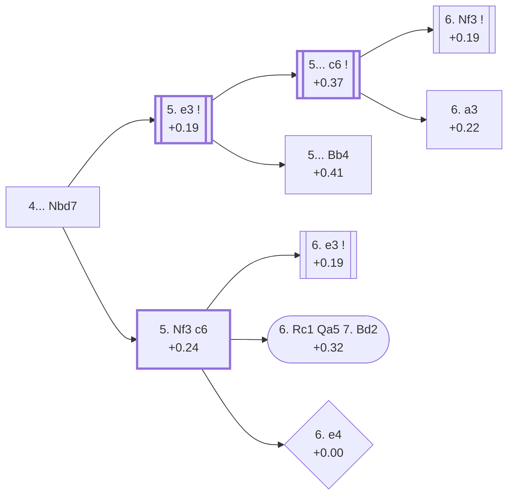

<a name="_TOP_"></a>

# D51 Queen's Gambit Declined: 4.Bg5 Nbd7 <br> 1. d4 d5 2. c4 e6 3. Nc3 Nf6 4. Bg5 Nbd7 #

Spun off from [D50's own root card](https://github.com/onclemarcel/chess_flashcards/blob/main/d4_openings/D50_Queens_Gambit_Declined_Bg5.md#_initial_move_) — a real secondary try there (17.2% masters), already live-tagged its own code. `eco.md` leaves this bare tabiya named only "4.Bg5 Nbd7"; the live explorer independently calls it the ***Modern Variation, Knight Defense*** — the same live tag reused, unrelated, at D50's own root, and a name this card's own root, 5th-move, and 6th-move nodes all end up sharing at once (see below).

### Overview

*Quick map of every move covered on this card — see the [shape key](https://github.com/onclemarcel/chess_flashcards/blob/main/start.md#content-diagram-optional) in start.md.*

<!-- content-diagram:start -->

<!-- content-diagram:end -->

<a name="_initial_move_"></a>

[](https://lichess.org/analysis/standard/r1bqkb1r/pppn1ppp/4pn2/3p2B1/2PP4/2N5/PP2PPPP/R2QKBNR_w_KQkq_-_4_5)

*... 4... Nbd7 — live-tagged the Modern Variation, Knight Defense*

```
r1bqkb1r/pppn1ppp/4pn2/3p2B1/2PP4/2N5/PP2PPPP/R2QKBNR w KQkq - 4 5
```

|  | +0.26 |
| --- | --- |

<!-- lichess-stats:start fen="r1bqkb1r/pppn1ppp/4pn2/3p2B1/2PP4/2N5/PP2PPPP/R2QKBNR w KQkq - 4 5" db="lichess,masters" speeds="bullet,blitz" ratings="1800,2000,2200,2500" moves="3" -->
| Move | Online | W/D/B | Masters | W/D/B | |
| :--- | ---: | :--- | ---: | :--- | :-- |
| e3 | 304 k (54.8%) | ⬜⬜⬜⬜⬜🟫⬛⬛⬛⬛ 49/6/45 | 930 (68.4%) | ⬜⬜⬜⬜🟫🟫🟫🟫⬛⬛ 37/44/19 |  |
| Nf3 | 126 k (22.8%) | ⬜⬜⬜⬜⬜⬛⬛⬛⬛⬛ 48/5/47 | 131 (9.6%) | ⬜⬜⬜🟫🟫🟫🟫⬛⬛⬛ 30/45/25 |  |
| cxd5 | 74 k (13.3%) | ⬜⬜⬜⬜🟫⬛⬛⬛⬛⬛ 45/6/49 | 295 (21.7%) | ⬜⬜⬜⬜🟫🟫🟫🟫⬛⬛ 36/41/23 |  |

*Online: bullet/blitz, 1800+ — 554 k games. Masters: 1.4 k games. [Open in the explorer](https://lichess.org/analysis/standard/r1bqkb1r/pppn1ppp/4pn2/3p2B1/2PP4/2N5/PP2PPPP/R2QKBNR_w_KQkq_-_4_5#explorer) — updated 2026-09-07*
<!-- lichess-stats:end -->

Develops the queen's knight before deciding on the bishop's diagonal. Masters' clear main try is **5. e3** (68.4%), the quiet classical treatment — covered below. **5. cxd5** (21.7%) is a real, secondary Exchange-type try with no code of its own in this range. **5. Nf3** (9.6%), heading toward **c6**, is also covered below.

* [**5. e3**](#_e3_) (+0.19, 68.4% masters): covered below.
* **5. cxd5** (21.7% masters): a real, secondary try with no code of its own in this range.
* [**5. Nf3 c6**](#_Nf3c6_) (+0.24, 9.6% masters): covered below.

[*Back to TOP*](#_TOP_)

---

<a name="_e3_"></a>

## 5. e3

[](https://lichess.org/analysis/standard/r1bqkb1r/pppn1ppp/4pn2/3p2B1/2PP4/2N1P3/PP3PPP/R2QKBNR_b_KQkq_-_0_5)

*... 5. e3 — live-tagged the Modern Variation, Knight Defense*

```
r1bqkb1r/pppn1ppp/4pn2/3p2B1/2PP4/2N1P3/PP3PPP/R2QKBNR b KQkq - 0 5
```

|  | +0.19 |
| --- | --- |

<!-- lichess-stats:start fen="r1bqkb1r/pppn1ppp/4pn2/3p2B1/2PP4/2N1P3/PP3PPP/R2QKBNR b KQkq - 0 5" db="lichess,masters" speeds="bullet,blitz" ratings="1800,2000,2200,2500" moves="4" -->
| Move | Online | W/D/B | Masters | W/D/B | |
| :--- | ---: | :--- | ---: | :--- | :-- |
| c6 | 164 k (52.9%) | ⬜⬜⬜⬜⬜🟫⬛⬛⬛⬛ 49/6/45 | 534 (56.8%) | ⬜⬜⬜⬜🟫🟫🟫🟫⬛⬛ 38/42/20 |  |
| Be7 | 101 k (32.6%) | ⬜⬜⬜⬜⬜🟫⬛⬛⬛⬛ 49/6/44 | 285 (30.3%) | ⬜⬜⬜🟫🟫🟫🟫🟫⬛⬛ 36/47/17 |  |
| Bb4 | 21 k (6.8%) | ⬜⬜⬜⬜⬜🟫⬛⬛⬛⬛ 50/5/45 | 51 (5.4%) | ⬜⬜⬜⬜⬜🟫🟫🟫⬛⬛ 47/27/25 |  |
| h6 | 11 k (3.5%) | ⬜⬜⬜⬜⬜🟫⬛⬛⬛⬛ 50/6/44 | 69 (7.3%) | ⬜⬜⬜🟫🟫🟫🟫🟫⬛⬛ 28/52/20 |  |

*Online: bullet/blitz, 1800+ — 311 k games. Masters: 940 games. [Open in the explorer](https://lichess.org/analysis/standard/r1bqkb1r/pppn1ppp/4pn2/3p2B1/2PP4/2N1P3/PP3PPP/R2QKBNR_b_KQkq_-_0_5#explorer) — updated 2026-09-07*
<!-- lichess-stats:end -->

The live explorer reuses the exact same name here as this card's own root — the first of two further reuses (the "5... c6" node below carries it a third time). Masters' clear main try is **5... c6** (56.8%), covered below. **5... Be7** (30.3%) is a real, secondary try with no code of its own in this range. **5... Bb4** (5.4%) heads for the named *Manhattan Variation*. **5... h6** (7.3%) is a real, secondary try with no code of its own in this range.

* [**5... c6**](#_c6_) (+0.37, 56.8% masters): covered below.
* **5... Be7** (30.3% masters): a real, secondary try with no code of its own in this range.
* [**5... Bb4**](#_Manhattan_) (+0.41, 5.4% masters): the *Manhattan Variation* — covered below.
* **5... h6** (7.3% masters): a real, secondary try with no code of its own in this range.

[*Back to 4... Nbd7*](#_initial_move_)
[*Back to TOP*](#_TOP_)

---

<a name="_Manhattan_"></a>

## 5. e3 Bb4 — Manhattan Variation

[](https://lichess.org/analysis/standard/r1bqk2r/pppn1ppp/4pn2/3p2B1/1bPP4/2N1P3/PP3PPP/R2QKBNR_w_KQkq_-_1_6)

*... 5... Bb4 — Manhattan Variation*

```
r1bqk2r/pppn1ppp/4pn2/3p2B1/1bPP4/2N1P3/PP3PPP/R2QKBNR w KQkq - 1 6
```

|  | +0.41 |
| --- | --- |

`eco.md`'s name matches the live explorer here. Pins the c3-knight à la Nimzo-Indian instead of preparing ...c6/...Be7, a real, secondary try (5.4% masters). Not built out further here (backlog).

[*Back to 5. e3*](#_e3_)
[*Back to TOP*](#_TOP_)

---

<a name="_c6_"></a>

## 5. e3 c6

[](https://lichess.org/analysis/standard/r1bqkb1r/pp1n1ppp/2p1pn2/3p2B1/2PP4/2N1P3/PP3PPP/R2QKBNR_w_KQkq_-_0_6)

*... 5... c6*

```
r1bqkb1r/pp1n1ppp/2p1pn2/3p2B1/2PP4/2N1P3/PP3PPP/R2QKBNR w KQkq - 0 6
```

|  | +0.37 |
| --- | --- |

<!-- lichess-stats:start fen="r1bqkb1r/pp1n1ppp/2p1pn2/3p2B1/2PP4/2N1P3/PP3PPP/R2QKBNR w KQkq - 0 6" db="lichess,masters" speeds="bullet,blitz" ratings="1800,2000,2200,2500" moves="3" -->
| Move | Online | W/D/B | Masters | W/D/B | |
| :--- | ---: | :--- | ---: | :--- | :-- |
| Nf3 | 263 k (64.3%) | ⬜⬜⬜⬜⬜🟫⬛⬛⬛⬛ 49/6/45 | 436 (44.7%) | ⬜⬜⬜🟫🟫🟫🟫🟫⬛⬛ 35/46/19 |  |
| cxd5 | 46 k (11.3%) | ⬜⬜⬜⬜⬜🟫⬛⬛⬛⬛ 51/6/43 | 397 (40.7%) | ⬜⬜⬜⬜🟫🟫🟫🟫⬛⬛ 39/42/19 |  |
| Bd3 | 31 k (7.6%) | ⬜⬜⬜⬜⬜⬛⬛⬛⬛⬛ 45/5/51 | 0 | — | ⚠ |
| a3 | 0 | — | 63 (6.5%) | ⬜⬜⬜⬜⬜🟫🟫🟫🟫⬛ 49/41/10 |  |

*Online: bullet/blitz, 1800+ — 409 k games. Masters: 976 games. [Open in the explorer](https://lichess.org/analysis/standard/r1bqkb1r/pp1n1ppp/2p1pn2/3p2B1/2PP4/2N1P3/PP3PPP/R2QKBNR_w_KQkq_-_0_6#explorer) — updated 2026-09-07*
<!-- lichess-stats:end -->

Left completely untagged by `eco.md` at this exact node (it just calls it "5...c6") — yet the live explorer reuses the *Modern Variation, Knight Defense* name here for a third time, the same tag already seen at this card's own root and its 5.e3 node. Masters' clear main try is **6. Nf3** (44.7%) — a **verified transposition**, not a guess: this exact SAN move order (4...Nbd7 5.e3 c6 6.Nf3) reaches the exact same position as D52's own root, confirmed via `apply_san.py`. **6. a3** (6.5%) heads for the named *Capablanca Anti-Cambridge Springs Variation* below. **6. cxd5** (40.7%) is a real, secondary try with no code of its own in this range.

* [**6. Nf3**](https://github.com/onclemarcel/chess_flashcards/blob/main/d4_openings/D52_Queens_Gambit_Declined_Cambridge_Springs.md) (+0.19, 44.7% masters): reaches D52's own root exactly — its own code, D52.
* **6. cxd5** (40.7% masters): a real, secondary try with no code of its own in this range.
* [**6. a3**](#_CapaAntiCS_) (+0.22, 6.5% masters): the *Capablanca Anti-Cambridge Springs Variation* — covered below.

[*Back to 5. e3*](#_e3_)
[*Back to TOP*](#_TOP_)

---

<a name="_CapaAntiCS_"></a>

## 5. e3 c6 6. a3 — Capablanca Anti-Cambridge Springs Variation

[](https://lichess.org/analysis/standard/r1bqkb1r/pp1n1ppp/2p1pn2/3p2B1/2PP4/P1N1P3/1P3PPP/R2QKBNR_b_KQkq_-_0_6)

*... 6. a3 — Capablanca Anti-Cambridge Springs Variation*

```
r1bqkb1r/pp1n1ppp/2p1pn2/3p2B1/2PP4/P1N1P3/1P3PPP/R2QKBNR b KQkq - 0 6
```

|  | +0.22 |
| --- | --- |

<!-- lichess-stats:start fen="r1bqkb1r/pp1n1ppp/2p1pn2/3p2B1/2PP4/P1N1P3/1P3PPP/R2QKBNR b KQkq - 0 6" db="lichess,masters" speeds="bullet,blitz" ratings="1800,2000,2200,2500" moves="5" -->
| Move | Online | W/D/B | Masters | W/D/B | |
| :--- | ---: | :--- | ---: | :--- | :-- |
| Be7 | 7.8 k (42.6%) | ⬜⬜⬜⬜⬜🟫⬛⬛⬛⬛ 49/7/44 | 53 (84.1%) | ⬜⬜⬜⬜⬜🟫🟫🟫🟫⬛ 49/42/9 |  |
| Qa5 | 2.9 k (16.1%) | ⬜⬜⬜⬜⬜⬛⬛⬛⬛⬛ 49/5/47 | 0 | — | ⚠ |
| Bd6 | 2.7 k (14.8%) | ⬜⬜⬜⬜⬜⬛⬛⬛⬛⬛ 50/5/45 | 0 | — | ⚠ |
| h6 | 1.6 k (8.9%) | ⬜⬜⬜⬜⬜🟫⬛⬛⬛⬛ 53/6/41 | 6 (9.5%) | — |  |
| dxc4 | 1.1 k (6.2%) | ⬜⬜⬜⬜⬜🟫⬛⬛⬛⬛ 48/6/45 | 1 (1.6%) | — | ⚠ |
| a6 | 0 | — | 2 (3.2%) | — |  |
| a5 | 0 | — | 1 (1.6%) | — |  |

*Online: bullet/blitz, 1800+ — 18 k games. Masters: 63 games. [Open in the explorer](https://lichess.org/analysis/standard/r1bqkb1r/pp1n1ppp/2p1pn2/3p2B1/2PP4/P1N1P3/1P3PPP/R2QKBNR_b_KQkq_-_0_6#explorer) — updated 2026-09-07*
<!-- lichess-stats:end -->

`eco.md`'s name matches the live explorer here — named for José Raúl Capablanca, since the whole point of the early **a3** is to rule out ...Qa5/...Bb4 ideas before they arise, pre-empting the Cambridge Springs Defence that D52 builds out in full. Masters' clear main reply is **6... Be7** (84.1%). Not built out further here (backlog, per `eco.md`'s own single-entry treatment of this line).

[*Back to 5. e3 c6*](#_c6_)
[*Back to TOP*](#_TOP_)

---

<a name="_Nf3c6_"></a>

## 5. Nf3 c6

[](https://lichess.org/analysis/standard/r1bqkb1r/pp1n1ppp/2p1pn2/3p2B1/2PP4/2N2N2/PP2PPPP/R2QKB1R_w_KQkq_-_0_6)

*... 5. Nf3 c6*

```
r1bqkb1r/pp1n1ppp/2p1pn2/3p2B1/2PP4/2N2N2/PP2PPPP/R2QKB1R w KQkq - 0 6
```

|  | +0.24 |
| --- | --- |

<!-- lichess-stats:start fen="r1bqkb1r/pp1n1ppp/2p1pn2/3p2B1/2PP4/2N2N2/PP2PPPP/R2QKB1R w KQkq - 0 6" db="lichess,masters" speeds="bullet,blitz" ratings="1800,2000,2200,2500" moves="6" -->
| Move | Online | W/D/B | Masters | W/D/B | |
| :--- | ---: | :--- | ---: | :--- | :-- |
| e3 | 1.2 M (79.9%) | ⬜⬜⬜⬜⬜🟫⬛⬛⬛⬛ 50/5/45 | 3.3 k (66.9%) | ⬜⬜⬜🟫🟫🟫🟫🟫⬛⬛ 33/50/17 |  |
| cxd5 | 101 k (6.9%) | ⬜⬜⬜⬜⬜🟫⬛⬛⬛⬛ 51/6/44 | 1.6 k (31.3%) | ⬜⬜⬜🟫🟫🟫🟫🟫⬛⬛ 35/48/17 |  |
| e4 | 66 k (4.5%) | ⬜⬜⬜⬜⬜⬛⬛⬛⬛⬛ 48/5/47 | 10 (0.2%) | — |  |
| Bxf6 | 33 k (2.2%) | ⬜⬜⬜⬜⬜⬛⬛⬛⬛⬛ 49/5/46 | 0 | — | ⚠ |
| Qc2 | 24 k (1.6%) | ⬜⬜⬜⬜⬜⬛⬛⬛⬛⬛ 51/4/44 | 32 (0.6%) | ⬜⬜⬜⬜🟫🟫🟫🟫⬛⬛ 41/38/22 |  |
| c5 | 22 k (1.5%) | ⬜⬜⬜⬜⬜⬜⬛⬛⬛⬛ 55/5/40 | 0 | — | ⚠ |
| Qb3 | 0 | — | 38 (0.8%) | ⬜⬜⬜⬜🟫🟫🟫🟫⬛⬛ 34/42/24 |  |
| a3 | 0 | — | 5 (0.1%) | — |  |

*Online: bullet/blitz, 1800+ — 1.5 M games. Masters: 5.0 k games. [Open in the explorer](https://lichess.org/analysis/standard/r1bqkb1r/pp1n1ppp/2p1pn2/3p2B1/2PP4/2N2N2/PP2PPPP/R2QKB1R_w_KQkq_-_0_6#explorer) — updated 2026-09-07*
<!-- lichess-stats:end -->

Left completely untagged live (`opening=None`) at this exact node. Masters' clear main try is **6. e3** (66.9%) — the **second, independent verified transposition** into D52's own root found in this batch: this move order (4...Nbd7 5.Nf3 c6 6.e3) reaches the exact same position as the 5.e3 c6 6.Nf3 order above, confirmed via `apply_san.py` — the position readers land on either way. **6. cxd5** (31.3%) is a real, secondary try with no code of its own in this range. **6. Rc1** heads for the named *Rochlin Variation*, played in barely 1 masters game out of 4,985 at this node (0.0%) and only 0.6% online — a genuine near-extinct try, understudied everywhere. **6. e4** heads for the named *Alekhine Variation*: a real blitz trap by `start.md`'s own numeric rule (0.2% masters, 4.5% online — over 20× the masters share, clearing the 8× bar comfortably) despite looking, at first glance, like too small a gap to qualify.

* [**6. e3**](https://github.com/onclemarcel/chess_flashcards/blob/main/d4_openings/D52_Queens_Gambit_Declined_Cambridge_Springs.md) (+0.19, 66.9% masters): reaches D52's own root exactly — its own code, D52.
* **6. cxd5** (31.3% masters): a real, secondary try with no code of its own in this range.
* [**6. Rc1 Qa5 7. Bd2**](#_Rochlin_) (+0.32, 0.0% masters, 0.6% online): the *Rochlin Variation* — covered below.
* [**6. e4**](#_Alekhine_) (+0.00, 0.2% masters, 4.5% online): the *Alekhine Variation* — covered below.

[*Back to 4... Nbd7*](#_initial_move_)
[*Back to TOP*](#_TOP_)

---

<a name="_Rochlin_"></a>

## 5. Nf3 c6 6. Rc1 Qa5 7. Bd2 — Rochlin Variation

[](https://lichess.org/analysis/standard/r1b1kb1r/pp1n1ppp/2p1pn2/q2p4/2PP4/2N2N2/PP1BPPPP/2RQKB1R_b_Kkq_-_3_7)

*... 7. Bd2 — Rochlin Variation*

```
r1b1kb1r/pp1n1ppp/2p1pn2/q2p4/2PP4/2N2N2/PP1BPPPP/2RQKB1R b Kkq - 3 7
```

|  | +0.32 |
| --- | --- |

`eco.md`'s name matches the live explorer here. A near-extinct try today — barely a single game in the masters sample at its own starting branch point (0.0%), a real, honest finding rather than a dressed-up one: this is essentially a name attached to a move nobody actually plays any more. Not built out further here (backlog).

[*Back to 5. Nf3 c6*](#_Nf3c6_)
[*Back to TOP*](#_TOP_)

---

<a name="_Alekhine_"></a>

## 5. Nf3 c6 6. e4 — Alekhine Variation

[](https://lichess.org/analysis/standard/r1bqkb1r/pp1n1ppp/2p1pn2/3p2B1/2PPP3/2N2N2/PP3PPP/R2QKB1R_b_KQkq_e3_0_6)

*... 6. e4 — Alekhine Variation*

```
r1bqkb1r/pp1n1ppp/2p1pn2/3p2B1/2PPP3/2N2N2/PP3PPP/R2QKB1R b KQkq e3 0 6
```

|  | +0.00 |
| --- | --- |

`eco.md`'s name matches the live explorer here — named for Alexander Alekhine, unrelated to D22's own Queen's Gambit Accepted Alekhine Defense or D45's own Semi-Slav Accelerated Meran (Alekhine Variation), both elsewhere in this D-series sweep. Grabs the centre with a second pawn immediately rather than the quieter 6. e3. A genuine blitz trap by `start.md`'s own numeric rule: 0.2% masters against 4.5% online is a 22.5× gap, comfortably clearing the 8× bar even though the raw masters share (0.2%) looks almost too small to bother naming — worth double-checking the actual ratio rather than dismissing a low online percentage by eye. Dead level according to Stockfish. Not built out further here (backlog).

[*Back to 5. Nf3 c6*](#_Nf3c6_)
[*Back to TOP*](#_TOP_)
