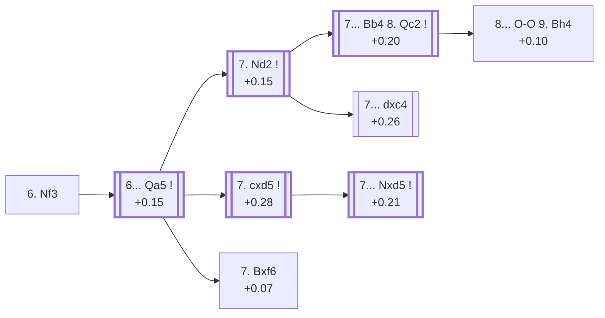

<a name="_TOP_"></a>

# D52 Queen's Gambit Declined: Cambridge Springs Defence <br> 1. d4 d5 2. c4 e6 3. Nc3 Nf6 4. Bg5 Nbd7 5. e3 c6 6. Nf3 #

Spun off from [D51's own card](https://github.com/onclemarcel/chess_flashcards/blob/main/d4_openings/D51_Queens_Gambit_Declined_Knight_Defense.md), reached by **two independently verified move orders** — 5.e3 c6 6.Nf3 and 5.Nf3 c6 6.e3, both confirmed via `apply_san.py` to land on the exact same position — the ground the whole Cambridge Springs complex grows from. `eco.md` leaves this bare tabiya named only "6.Nf3"; the live explorer independently calls it plain ***Queen's Gambit Declined***.

### Overview

*Quick map of every move covered on this card — see the [shape key](https://github.com/onclemarcel/chess_flashcards/blob/main/start.md#content-diagram-optional) in start.md.*

<!-- content-diagram:start -->

<!-- content-diagram:end -->

<a name="_initial_move_"></a>

[](https://lichess.org/analysis/standard/r1bqkb1r/pp1n1ppp/2p1pn2/3p2B1/2PP4/2N1PN2/PP3PPP/R2QKB1R_b_KQkq_-_1_6)

*... 6. Nf3*

```
r1bqkb1r/pp1n1ppp/2p1pn2/3p2B1/2PP4/2N1PN2/PP3PPP/R2QKB1R b KQkq - 1 6
```

|  | +0.19 |
| --- | --- |

<!-- lichess-stats:start fen="r1bqkb1r/pp1n1ppp/2p1pn2/3p2B1/2PP4/2N1PN2/PP3PPP/R2QKB1R b KQkq - 1 6" db="lichess,masters" speeds="bullet,blitz" ratings="1800,2000,2200,2500" moves="4" -->
| Move | Online | W/D/B | Masters | W/D/B | |
| :--- | ---: | :--- | ---: | :--- | :-- |
| Qa5 | 620 k (41.6%) | ⬜⬜⬜⬜⬜⬛⬛⬛⬛⬛ 48/6/46 | 3.0 k (77.8%) | ⬜⬜⬜🟫🟫🟫🟫🟫⬛⬛ 32/51/17 |  |
| Be7 | 414 k (27.8%) | ⬜⬜⬜⬜⬜🟫⬛⬛⬛⬛ 51/6/44 | 545 (14.2%) | ⬜⬜⬜⬜🟫🟫🟫🟫🟫⬛ 40/47/13 |  |
| Bb4 | 208 k (13.9%) | ⬜⬜⬜⬜⬜⬛⬛⬛⬛⬛ 48/5/47 | 59 (1.5%) | ⬜⬜⬜⬜🟫🟫🟫🟫⬛⬛ 44/39/17 |  |
| Bd6 | 102 k (6.9%) | ⬜⬜⬜⬜⬜🟫⬛⬛⬛⬛ 52/5/43 | 0 | — | ⚠ |
| h6 | 0 | — | 204 (5.3%) | ⬜⬜⬜⬜🟫🟫🟫🟫⬛⬛ 34/43/23 |  |

*Online: bullet/blitz, 1800+ — 1.5 M games. Masters: 3.9 k games. [Open in the explorer](https://lichess.org/analysis/standard/r1bqkb1r/pp1n1ppp/2p1pn2/3p2B1/2PP4/2N1PN2/PP3PPP/R2QKB1R_b_KQkq_-_1_6#explorer) — updated 2026-09-14*
<!-- lichess-stats:end -->

Completes kingside development. Masters' clear main try is **6... Qa5** (77.8%), pinning the c3-knight and preparing to meet cxd5 with ...Nxd5 — the *Cambridge Springs Defence*, covered below. **6... Be7** (14.2%), **6... h6** (5.3%) and **6... Bb4** (1.5%) are all real, secondary tries with no code of their own in this range.

* [**6... Qa5**](#_CSD_) (+0.15, 77.8% masters): the *Cambridge Springs Defence* — covered below.
* **6... Be7** (14.2% masters): a real, secondary try with no code of its own in this range.
* **6... h6** (5.3% masters): a real, secondary try with no code of its own in this range.
* **6... Bb4** (1.5% masters): a real, secondary try with no code of its own in this range.

[*Back to TOP*](#_TOP_)

---

<a name="_CSD_"></a>

## 6... Qa5 — Cambridge Springs Defence

[](https://lichess.org/analysis/standard/r1b1kb1r/pp1n1ppp/2p1pn2/q2p2B1/2PP4/2N1PN2/PP3PPP/R2QKB1R_w_KQkq_-_2_7)

*... 6... Qa5 — Cambridge Springs Defence*

```
r1b1kb1r/pp1n1ppp/2p1pn2/q2p2B1/2PP4/2N1PN2/PP3PPP/R2QKB1R w KQkq - 2 7
```

|  | +0.15 |
| --- | --- |

<!-- lichess-stats:start fen="r1b1kb1r/pp1n1ppp/2p1pn2/q2p2B1/2PP4/2N1PN2/PP3PPP/R2QKB1R w KQkq - 2 7" db="lichess,masters" speeds="bullet,blitz" ratings="1800,2000,2200,2500" moves="3" -->
| Move | Online | W/D/B | Masters | W/D/B | |
| :--- | ---: | :--- | ---: | :--- | :-- |
| Bxf6 | 190 k (30.5%) | ⬜⬜⬜⬜⬜🟫⬛⬛⬛⬛ 50/7/43 | 115 (3.8%) | ⬜⬜🟫🟫🟫🟫🟫⬛⬛⬛ 22/49/30 |  |
| Nd2 | 138 k (22.2%) | ⬜⬜⬜⬜⬜🟫⬛⬛⬛⬛ 50/7/42 | 1.6 k (52.6%) | ⬜⬜⬜🟫🟫🟫🟫🟫⬛⬛ 29/54/17 |  |
| cxd5 | 79 k (12.7%) | ⬜⬜⬜⬜⬜🟫⬛⬛⬛⬛ 51/5/44 | 1.2 k (41.7%) | ⬜⬜⬜⬜🟫🟫🟫🟫🟫⬛ 36/49/15 |  |

*Online: bullet/blitz, 1800+ — 622 k games. Masters: 3.0 k games. [Open in the explorer](https://lichess.org/analysis/standard/r1b1kb1r/pp1n1ppp/2p1pn2/q2p2B1/2PP4/2N1PN2/PP3PPP/R2QKB1R_w_KQkq_-_2_7#explorer) — updated 2026-09-14*
<!-- lichess-stats:end -->

`eco.md`'s name matches the live explorer here — named for the 1904 Cambridge Springs tournament where the line first attracted attention. Masters' clear main try is **7. Nd2** (52.6%), sidestepping the pin — covered below. **7. cxd5** (41.7%), the "7.cd" node `eco.md` gives its own entry, is covered below too. **7. Bxf6** (3.8%), the *Capablanca Variation*, is covered further down. A genuine masters/online gap runs through this whole fork: **Bxf6** is far more popular online (30.5%) than at masters level (3.8%), while **Nd2** is masters' clear favourite (52.6%) but only online's second choice (22.2%, behind online's own preference for Bxf6) — worth a one-line remark rather than assuming either database's ranking transfers to the other.

* [**7. Nd2**](#_Nd2_) (52.6% masters): covered below.
* [**7. cxd5**](#_cxd5node_) (+0.28, 41.7% masters): the "7.cd" node — covered below.
* [**7. Bxf6**](#_Capablanca_) (+0.07, 3.8% masters): the *Capablanca Variation* — covered below.

[*Back to 6. Nf3*](#_initial_move_)
[*Back to TOP*](#_TOP_)

---

<a name="_Nd2_"></a>

## 7. Nd2

[](https://lichess.org/analysis/standard/r1b1kb1r/pp1n1ppp/2p1pn2/q2p2B1/2PP4/2N1P3/PP1N1PPP/R2QKB1R_b_KQkq_-_3_7)

*... 7. Nd2*

```
r1b1kb1r/pp1n1ppp/2p1pn2/q2p2B1/2PP4/2N1P3/PP1N1PPP/R2QKB1R b KQkq - 3 7
```

|  | +0.15 |
| --- | --- |

<!-- lichess-stats:start fen="r1b1kb1r/pp1n1ppp/2p1pn2/q2p2B1/2PP4/2N1P3/PP1N1PPP/R2QKB1R b KQkq - 3 7" db="lichess,masters" speeds="bullet,blitz" ratings="1800,2000,2200,2500" moves="4" -->
| Move | Online | W/D/B | Masters | W/D/B | |
| :--- | ---: | :--- | ---: | :--- | :-- |
| Bb4 | 81 k (58.8%) | ⬜⬜⬜⬜⬜🟫⬛⬛⬛⬛ 50/7/42 | 1.0 k (65.7%) | ⬜⬜⬜🟫🟫🟫🟫🟫⬛⬛ 30/53/17 |  |
| dxc4 | 37 k (26.5%) | ⬜⬜⬜⬜⬜🟫⬛⬛⬛⬛ 49/8/43 | 502 (31.8%) | ⬜⬜⬜🟫🟫🟫🟫🟫⬛⬛ 27/56/18 |  |
| Ne4 | 9.1 k (6.6%) | ⬜⬜⬜⬜⬜🟫⬛⬛⬛⬛ 52/7/41 | 20 (1.3%) | ⬜⬜⬜⬜⬜⬜🟫🟫🟫⬛ 60/30/10 |  |
| Be7 | 4.1 k (3.0%) | ⬜⬜⬜⬜⬜🟫⬛⬛⬛⬛ 53/6/41 | 14 (0.9%) | — |  |

*Online: bullet/blitz, 1800+ — 138 k games. Masters: 1.6 k games. [Open in the explorer](https://lichess.org/analysis/standard/r1b1kb1r/pp1n1ppp/2p1pn2/q2p2B1/2PP4/2N1P3/PP1N1PPP/R2QKB1R_b_KQkq_-_3_7#explorer) — updated 2026-09-14*
<!-- lichess-stats:end -->

Retreats the knight, breaking the pin on the c3-knight without allowing ...Ne4. Masters' clear main try is **7... Bb4** (65.7%), pinning the newly-arrived knight in turn — heading, after 8. Qc2, for the named *Bogoljubow Variation* below. **7... dxc4** (31.8%) heads directly for the named *Rubinstein Variation*.

* [**7... Bb4 8. Qc2**](#_Bogoljubow_) (+0.20, 65.7% masters): the *Bogoljubow Variation* — covered below.
* [**7... dxc4**](#_Rubinstein_) (+0.26, 31.8% masters): the *Rubinstein Variation* — covered below.

[*Back to 6... Qa5*](#_CSD_)
[*Back to TOP*](#_TOP_)

---

<a name="_Bogoljubow_"></a>

## 7... Bb4 8. Qc2 — Bogoljubow Variation

[](https://lichess.org/analysis/standard/r1b1k2r/pp1n1ppp/2p1pn2/q2p2B1/1bPP4/2N1P3/PPQN1PPP/R3KB1R_b_KQkq_-_5_8)

*... 8. Qc2 — Bogoljubow Variation*

```
r1b1k2r/pp1n1ppp/2p1pn2/q2p2B1/1bPP4/2N1P3/PPQN1PPP/R3KB1R b KQkq - 5 8
```

|  | +0.20 |
| --- | --- |

`eco.md`'s name matches the live explorer here — named for Efim Bogoljubow. Unpins the c3-knight while keeping the queenside intact, rather than the immediate 8. Bxf6 or 8. Bd3. Masters' clear main try is castling, leading straight to the named *Argentine Variation* below.

* [**8... O-O 9. Bh4**](#_Argentine_) (+0.10): the *Argentine Variation* — covered below.

[*Back to 7. Nd2*](#_Nd2_)
[*Back to TOP*](#_TOP_)

---

<a name="_Argentine_"></a>

## 8... O-O 9. Bh4 — Argentine Variation

[](https://lichess.org/analysis/standard/r1b2rk1/pp1n1ppp/2p1pn2/q2p4/1bPP3B/2N1P3/PPQN1PPP/R3KB1R_b_KQ_-_7_9)

*... 9. Bh4 — Argentine Variation*

```
r1b2rk1/pp1n1ppp/2p1pn2/q2p4/1bPP3B/2N1P3/PPQN1PPP/R3KB1R b KQ - 7 9
```

|  | +0.10 |
| --- | --- |

`eco.md`'s name matches the live explorer here. Retreats the bishop off the newly-vulnerable g5 square while keeping the pin on f6 alive from a distance. Not built out further here — the deepest line of the whole Bogoljubow branch.

[*Back to 7... Bb4 8. Qc2*](#_Bogoljubow_)
[*Back to TOP*](#_TOP_)

---

<a name="_Rubinstein_"></a>

## 7... dxc4 — Rubinstein Variation

[](https://lichess.org/analysis/standard/r1b1kb1r/pp1n1ppp/2p1pn2/q5B1/2pP4/2N1P3/PP1N1PPP/R2QKB1R_w_KQkq_-_0_8)

*... 7... dxc4 — Rubinstein Variation*

```
r1b1kb1r/pp1n1ppp/2p1pn2/q5B1/2pP4/2N1P3/PP1N1PPP/R2QKB1R w KQkq - 0 8
```

|  | +0.26 |
| --- | --- |

`eco.md`'s name matches the live explorer here — named for Akiba Rubinstein, unrelated to the several other Rubinstein-named lines elsewhere in this D-series sweep (D20's Rubinstein System, D33's Rubinstein System, D47's own transposed structures). Grabs the c4-pawn while the knight is momentarily undefended, a real, secondary try (31.8% masters) to the more popular 7...Bb4. Not built out further here (backlog).

[*Back to 7. Nd2*](#_Nd2_)
[*Back to TOP*](#_TOP_)

---

<a name="_Capablanca_"></a>

## 7. Bxf6 — Capablanca Variation

[](https://lichess.org/analysis/standard/r1b1kb1r/pp1n1ppp/2p1pB2/q2p4/2PP4/2N1PN2/PP3PPP/R2QKB1R_b_KQkq_-_0_7)

*... 7. Bxf6 — Capablanca Variation*

```
r1b1kb1r/pp1n1ppp/2p1pB2/q2p4/2PP4/2N1PN2/PP3PPP/R2QKB1R b KQkq - 0 7
```

|  | +0.07 |
| --- | --- |

`eco.md`'s name matches the live explorer here — named for José Raúl Capablanca. Resolves the pin by trade immediately rather than retreating the bishop or defending the c3-knight. A real, secondary try at masters level (3.8%) despite being a genuine database favourite online (30.5%, see the fork note above). Not built out further here (backlog).

[*Back to 6... Qa5*](#_CSD_)
[*Back to TOP*](#_TOP_)

---

<a name="_cxd5node_"></a>

## 7. cxd5 — "7.cd"

[](https://lichess.org/analysis/standard/r1b1kb1r/pp1n1ppp/2p1pn2/q2P2B1/3P4/2N1PN2/PP3PPP/R2QKB1R_b_KQkq_-_0_7)

*... 7. cxd5 — live-tagged the Cambridge Springs Defense at this exact node*

```
r1b1kb1r/pp1n1ppp/2p1pn2/q2P2B1/3P4/2N1PN2/PP3PPP/R2QKB1R b KQkq - 0 7
```

|  | +0.28 |
| --- | --- |

<!-- lichess-stats:start fen="r1b1kb1r/pp1n1ppp/2p1pn2/q2P2B1/3P4/2N1PN2/PP3PPP/R2QKB1R b KQkq - 0 7" db="lichess,masters" speeds="bullet,blitz" ratings="1800,2000,2200,2500" moves="4" -->
| Move | Online | W/D/B | Masters | W/D/B | |
| :--- | ---: | :--- | ---: | :--- | :-- |
| Nxd5 | 44 k (56.4%) | ⬜⬜⬜⬜⬜🟫⬛⬛⬛⬛ 51/5/44 | 1.0 k (83.5%) | ⬜⬜⬜🟫🟫🟫🟫🟫⬛⬛ 34/50/16 |  |
| exd5 | 30 k (37.6%) | ⬜⬜⬜⬜⬜🟫⬛⬛⬛⬛ 51/5/43 | 188 (15.0%) | ⬜⬜⬜⬜⬜🟫🟫🟫🟫⬛ 47/43/10 |  |
| cxd5 | 2.3 k (2.9%) | ⬜⬜⬜⬜⬜🟫⬛⬛⬛⬛ 51/5/44 | 9 (0.7%) | — |  |
| Ne4 | 1.9 k (2.4%) | ⬜⬜⬜⬜⬜🟫⬛⬛⬛⬛ 52/4/44 | 9 (0.7%) | — |  |

*Online: bullet/blitz, 1800+ — 79 k games. Masters: 1.2 k games. [Open in the explorer](https://lichess.org/analysis/standard/r1b1kb1r/pp1n1ppp/2p1pn2/q2P2B1/3P4/2N1PN2/PP3PPP/R2QKB1R_b_KQkq_-_0_7#explorer) — updated 2026-09-14*
<!-- lichess-stats:end -->

`eco.md` calls this "7.cd"; the live explorer independently tags it plain *Cambridge Springs Defense*, same generic label as the parent node. Resolves the central tension at once. Masters' overwhelming main reply is **7... Nxd5** (83.5%), the exact justification for 6...Qa5's whole pin-first idea — heading for the named *Yugoslav Variation* below. **7... exd5** (15.0%) is a real, secondary try with no code of its own in this range.

* [**7... Nxd5**](#_Yugoslav_) (+0.21, 83.5% masters): the *Yugoslav Variation* — covered below.
* **7... exd5** (15.0% masters): a real, secondary try with no code of its own in this range.

[*Back to 6... Qa5*](#_CSD_)
[*Back to TOP*](#_TOP_)

---

<a name="_Yugoslav_"></a>

## 7. cxd5 Nxd5 — Yugoslav Variation

[](https://lichess.org/analysis/standard/r1b1kb1r/pp1n1ppp/2p1p3/q2n2B1/3P4/2N1PN2/PP3PPP/R2QKB1R_w_KQkq_-_0_8)

*... 7... Nxd5 — Yugoslav Variation*

```
r1b1kb1r/pp1n1ppp/2p1p3/q2n2B1/3P4/2N1PN2/PP3PPP/R2QKB1R w KQkq - 0 8
```

|  | +0.21 |
| --- | --- |

`eco.md`'s name matches the live explorer here. Recaptures with the knight, keeping the pawn structure symmetrical and the a5-queen's pin on the c3-knight fully justified. Not built out further here — the deepest line of the whole "7.cd" branch.

[*Back to 7. cxd5*](#_cxd5node_)
[*Back to TOP*](#_TOP_)
