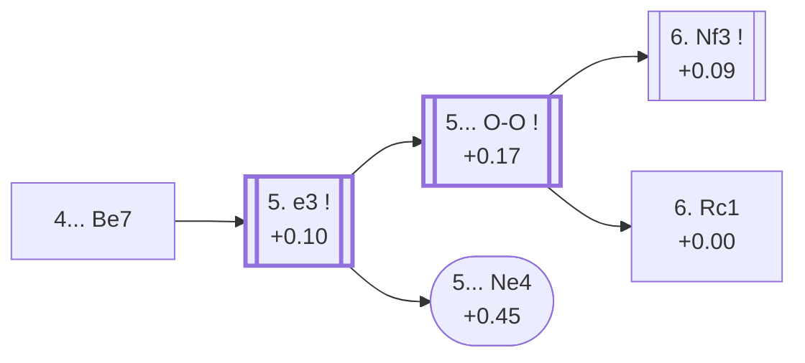

<a name="_TOP_"></a>

# D53 Queen's Gambit Declined: 4.Bg5 Be7 <br> 1. d4 d5 2. c4 e6 3. Nc3 Nf6 4. Bg5 Be7 #

Spun off from [D50's own root card](https://github.com/onclemarcel/chess_flashcards/blob/main/d4_openings/D50_Queens_Gambit_Declined_Bg5.md#_initial_move_) — masters' clear main try there (66.2% masters), already live-tagged its own code. `eco.md` leaves this bare tabiya named only "4.Bg5 Be7"; the live explorer independently calls it plain ***Queen's Gambit Declined***. Note throughout this whole D50-D59 batch: `eco.md`'s own spelling is consistently "Defence" (British) where the live explorer consistently spells it "Defense" (American) — a systematic, not per-card, divergence, mentioned here once rather than repeated on every card.

### Overview

*Quick map of every move covered on this card — see the [shape key](https://github.com/onclemarcel/chess_flashcards/blob/main/start.md#content-diagram-optional) in start.md.*

<!-- content-diagram:start -->

<!-- content-diagram:end -->

<a name="_initial_move_"></a>

[](https://lichess.org/analysis/standard/rnbqk2r/ppp1bppp/4pn2/3p2B1/2PP4/2N5/PP2PPPP/R2QKBNR_w_KQkq_-_4_5)

*... 4... Be7*

```
rnbqk2r/ppp1bppp/4pn2/3p2B1/2PP4/2N5/PP2PPPP/R2QKBNR w KQkq - 4 5
```

|  | +0.14 |
| --- | --- |

<!-- lichess-stats:start fen="rnbqk2r/ppp1bppp/4pn2/3p2B1/2PP4/2N5/PP2PPPP/R2QKBNR w KQkq - 4 5" db="lichess,masters" speeds="bullet,blitz" ratings="1800,2000,2200,2500" moves="3" -->
| Move | Online | W/D/B | Masters | W/D/B | |
| :--- | ---: | :--- | ---: | :--- | :-- |
| e3 | 2.4 M (56.3%) | ⬜⬜⬜⬜⬜🟫⬛⬛⬛⬛ 50/6/44 | 3.9 k (73.7%) | ⬜⬜⬜🟫🟫🟫🟫🟫⬛⬛ 30/55/15 |  |
| Nf3 | 1.1 M (25.1%) | ⬜⬜⬜⬜⬜⬛⬛⬛⬛⬛ 49/6/46 | 975 (18.6%) | ⬜⬜⬜🟫🟫🟫🟫🟫⬛⬛ 31/53/16 |  |
| cxd5 | 309 k (7.1%) | ⬜⬜⬜⬜⬜🟫⬛⬛⬛⬛ 50/6/45 | 392 (7.5%) | ⬜⬜⬜🟫🟫🟫🟫🟫⬛⬛ 31/48/21 |  |

*Online: bullet/blitz, 1800+ — 4.3 M games. Masters: 5.2 k games. [Open in the explorer](https://lichess.org/analysis/standard/rnbqk2r/ppp1bppp/4pn2/3p2B1/2PP4/2N5/PP2PPPP/R2QKBNR_w_KQkq_-_4_5#explorer) — updated 2026-09-09*
<!-- lichess-stats:end -->

The classical reply, breaking the pin's threat by preparing to meet Bxf6 with a recapture that keeps the structure sound. Masters' clear main try is **5. e3** (73.7%), the quiet classical treatment — covered below, the trunk this whole rest of the batch (D54 through D59) grows from. **5. Nf3** (18.6%) and **5. cxd5** (7.5%) are both real, secondary tries with no code of their own in this range.

* [**5. e3**](#_e3_) (+0.10, 73.7% masters): covered below.
* **5. Nf3** (18.6% masters): a real, secondary try with no code of its own in this range.
* **5. cxd5** (7.5% masters): a real, secondary try with no code of its own in this range.

[*Back to TOP*](#_TOP_)

---

<a name="_e3_"></a>

## 5. e3

[](https://lichess.org/analysis/standard/rnbqk2r/ppp1bppp/4pn2/3p2B1/2PP4/2N1P3/PP3PPP/R2QKBNR_b_KQkq_-_0_5)

*... 5. e3*

```
rnbqk2r/ppp1bppp/4pn2/3p2B1/2PP4/2N1P3/PP3PPP/R2QKBNR b KQkq - 0 5
```

|  | +0.10 |
| --- | --- |

<!-- lichess-stats:start fen="rnbqk2r/ppp1bppp/4pn2/3p2B1/2PP4/2N1P3/PP3PPP/R2QKBNR b KQkq - 0 5" db="lichess,masters" speeds="bullet,blitz" ratings="1800,2000,2200,2500" moves="5" -->
| Move | Online | W/D/B | Masters | W/D/B | |
| :--- | ---: | :--- | ---: | :--- | :-- |
| O-O | 1.2 M (47.6%) | ⬜⬜⬜⬜⬜🟫⬛⬛⬛⬛ 50/6/44 | 2.2 k (55.4%) | ⬜⬜⬜🟫🟫🟫🟫🟫🟫⬛ 30/56/14 |  |
| h6 | 384 k (15.6%) | ⬜⬜⬜⬜⬜🟫⬛⬛⬛⬛ 50/6/43 | 1.2 k (30.5%) | ⬜⬜⬜🟫🟫🟫🟫🟫⬛⬛ 29/54/17 |  |
| c6 | 272 k (11.1%) | ⬜⬜⬜⬜⬜🟫⬛⬛⬛⬛ 52/5/42 | 109 (2.8%) | ⬜⬜⬜⬜🟫🟫🟫🟫🟫⬛ 42/47/11 |  |
| Nbd7 | 188 k (7.6%) | ⬜⬜⬜⬜⬜🟫⬛⬛⬛⬛ 50/6/44 | 405 (10.4%) | ⬜⬜⬜🟫🟫🟫🟫🟫⬛⬛ 33/52/15 |  |
| a6 | 110 k (4.5%) | ⬜⬜⬜⬜⬜🟫⬛⬛⬛⬛ 49/6/45 | 0 | — | ⚠ |
| b6 | 0 | — | 15 (0.4%) | — |  |

*Online: bullet/blitz, 1800+ — 2.5 M games. Masters: 3.9 k games. [Open in the explorer](https://lichess.org/analysis/standard/rnbqk2r/ppp1bppp/4pn2/3p2B1/2PP4/2N1P3/PP3PPP/R2QKBNR_b_KQkq_-_0_5#explorer) — updated 2026-09-09*
<!-- lichess-stats:end -->

A real fork worth stating plainly rather than treating **5... O-O** as forced: masters actually split it **55.4%** O-O against a genuinely substantial **30.5%** for **5... h6**, with **5... Nbd7** (10.4%) and **5... c6** (2.8%) both real, secondary tries with no code of their own in this range, and **5... Ne4** a real database rarity (0.3% masters, 2.1% online) heading for the named *Lasker Variation*.

* [**5... O-O**](#_OO_) (+0.17, 55.4% masters): covered below.
* **5... h6** (30.5% masters): a real, secondary try with no code of its own in this range.
* **5... Nbd7** (10.4% masters): a real, secondary try with no code of its own in this range.
* **5... c6** (2.8% masters): a real, secondary try with no code of its own in this range.
* [**5... Ne4**](#_Lasker_) (+0.45, 0.3% masters, 2.1% online): the *Lasker Variation* — covered below.

[*Back to 4... Be7*](#_initial_move_)
[*Back to TOP*](#_TOP_)

---

<a name="_Lasker_"></a>

## 5. e3 Ne4 — Lasker Variation

[](https://lichess.org/analysis/standard/rnbqk2r/ppp1bppp/4p3/3p2B1/2PPn3/2N1P3/PP3PPP/R2QKBNR_w_KQkq_-_1_6)

*... 5... Ne4 — Lasker Variation*

```
rnbqk2r/ppp1bppp/4p3/3p2B1/2PPn3/2N1P3/PP3PPP/R2QKBNR w KQkq - 1 6
```

|  | +0.45 |
| --- | --- |

`eco.md` names this the *Lasker Variation* — Black plays ...Ne4 *before* castling, a genuinely different move-order idea from D56's own, much better-known *Lasker Defence* (7.Bh4 Ne4, after ...O-O and 6.Nf3 h6 have both already been played). The live explorer tags both the same way ("Lasker Defense"), so the two are only distinguishable by move order and by `eco.md`'s own separate naming — a real, worth-noting collision, not a duplication (cross-referenced from D56 too). Meets the numeric bar for "understudied everywhere" (masters < 2%, online < 3%): masters' own sample here is tiny (12 games total, all met with **6. Bxe7**) — this exact standalone move order is essentially never played; nearly everyone either transposes into it via a different order or plays 5...O-O first. Not built out further here (backlog).

[*Back to 5. e3*](#_e3_)
[*Back to TOP*](#_TOP_)

---

<a name="_OO_"></a>

## 5. e3 O-O

[](https://lichess.org/analysis/standard/rnbq1rk1/ppp1bppp/4pn2/3p2B1/2PP4/2N1P3/PP3PPP/R2QKBNR_w_KQ_-_1_6)

*... 5... O-O*

```
rnbq1rk1/ppp1bppp/4pn2/3p2B1/2PP4/2N1P3/PP3PPP/R2QKBNR w KQ - 1 6
```

|  | +0.17 |
| --- | --- |

<!-- lichess-stats:start fen="rnbq1rk1/ppp1bppp/4pn2/3p2B1/2PP4/2N1P3/PP3PPP/R2QKBNR w KQ - 1 6" db="lichess,masters" speeds="bullet,blitz" ratings="1800,2000,2200,2500" moves="3" -->
| Move | Online | W/D/B | Masters | W/D/B | |
| :--- | ---: | :--- | ---: | :--- | :-- |
| Nf3 | 839 k (71.2%) | ⬜⬜⬜⬜⬜🟫⬛⬛⬛⬛ 49/6/44 | 1.6 k (76.0%) | ⬜⬜⬜🟫🟫🟫🟫🟫🟫⬛ 27/59/14 |  |
| Bd3 | 88 k (7.4%) | ⬜⬜⬜⬜⬜⬛⬛⬛⬛⬛ 46/5/49 | 0 | — | ⚠ |
| cxd5 | 76 k (6.4%) | ⬜⬜⬜⬜⬜🟫⬛⬛⬛⬛ 50/6/44 | 137 (6.3%) | ⬜⬜⬜🟫🟫🟫🟫🟫⬛⬛ 34/46/20 |  |
| Rc1 | 0 | — | 249 (11.5%) | ⬜⬜⬜⬜🟫🟫🟫🟫🟫⬛ 41/47/12 |  |

*Online: bullet/blitz, 1800+ — 1.2 M games. Masters: 2.2 k games. [Open in the explorer](https://lichess.org/analysis/standard/rnbq1rk1/ppp1bppp/4pn2/3p2B1/2PP4/2N1P3/PP3PPP/R2QKBNR_w_KQ_-_1_6#explorer) — updated 2026-09-09*
<!-- lichess-stats:end -->

Left completely untagged live (`opening=None`) at this exact node — a clean finding worth stating plainly: both this node's own parent (D53's own "5. e3" fork above) and both of its real children (D55's own 6.Nf3 root and D54's own 6.Rc1) are separately live-tagged, but the node in between them carries no name at all. Masters' clear main try is **6. Nf3** (76.0%), its own code, D55, covered there — the trunk the rest of this batch (D55 through D59) grows from. **6. Rc1** (11.5%) is its own code too, D54, covered there. **6. cxd5** (6.3%), **6. Qc2** (4.9%) and **6. Bd3** (0.9%) are all real, secondary tries with no code of their own in this range.

* [**6. Nf3**](https://github.com/onclemarcel/chess_flashcards/blob/main/d4_openings/D55_Queens_Gambit_Declined_Neo_Orthodox.md) (+0.09, 76.0% masters): its own code, D55.
* [**6. Rc1**](https://github.com/onclemarcel/chess_flashcards/blob/main/d4_openings/D54_Queens_Gambit_Declined_Anti_Neo_Orthodox.md) (+0.00, 11.5% masters): its own code, D54.
* **6. cxd5** (6.3% masters): a real, secondary try with no code of its own in this range.
* **6. Qc2** (4.9% masters): a real, secondary try with no code of its own in this range.
* **6. Bd3** (0.9% masters): a real, secondary try with no code of its own in this range.

[*Back to 5. e3*](#_e3_)
[*Back to TOP*](#_TOP_)
