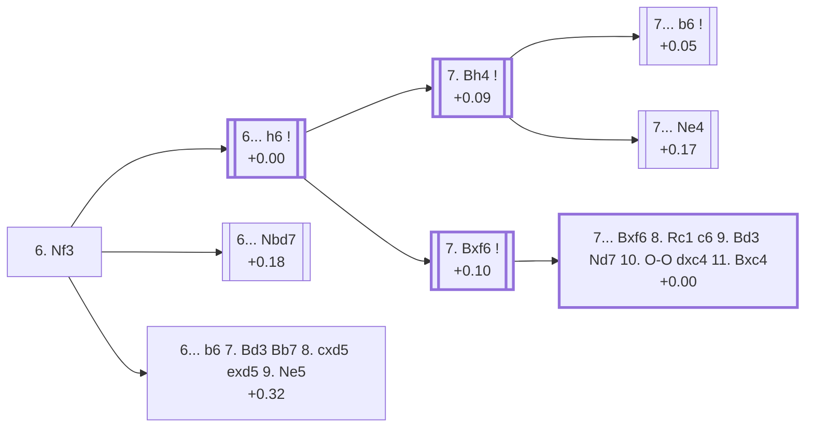

<a name="_TOP_"></a>

# D55 Queen's Gambit Declined: 6.Nf3 <br> 1. d4 d5 2. c4 e6 3. Nc3 Nf6 4. Bg5 Be7 5. e3 O-O 6. Nf3 #

Spun off from [D53's own "5. e3 O-O" card](https://github.com/onclemarcel/chess_flashcards/blob/main/d4_openings/D53_Queens_Gambit_Declined_Be7.md#_OO_) — masters' clear main try there (76.0% masters), already live-tagged its own code. `eco.md` leaves this bare tabiya named only "6.Nf3"; the live explorer independently calls it the ***Modern Variation, Normal Line*** — the third occurrence of the "Modern Variation" family name in this batch, after D50's and D51's own roots, each an unrelated node.

### Overview

*Quick map of every move covered on this card — see the [shape key](https://github.com/onclemarcel/chess_flashcards/blob/main/start.md#content-diagram-optional) in start.md.*

<!-- content-diagram:start -->

<!-- content-diagram:end -->

<a name="_initial_move_"></a>

[](https://lichess.org/analysis/standard/rnbq1rk1/ppp1bppp/4pn2/3p2B1/2PP4/2N1PN2/PP3PPP/R2QKB1R_b_KQ_-_2_6)

*... 6. Nf3 — live-tagged the Modern Variation, Normal Line*

```
rnbq1rk1/ppp1bppp/4pn2/3p2B1/2PP4/2N1PN2/PP3PPP/R2QKB1R b KQ - 2 6
```

|  | +0.09 |
| --- | --- |

<!-- lichess-stats:start fen="rnbq1rk1/ppp1bppp/4pn2/3p2B1/2PP4/2N1PN2/PP3PPP/R2QKB1R b KQ - 2 6" db="lichess,masters" speeds="bullet,blitz" ratings="1800,2000,2200,2500" moves="6" -->
| Move | Online | W/D/B | Masters | W/D/B | |
| :--- | ---: | :--- | ---: | :--- | :-- |
| h6 | 785 k (25.3%) | ⬜⬜⬜⬜⬜🟫⬛⬛⬛⬛ 49/6/45 | 4.2 k (52.8%) | ⬜⬜⬜🟫🟫🟫🟫🟫🟫⬛ 29/57/15 |  |
| Nbd7 | 536 k (17.2%) | ⬜⬜⬜⬜⬜🟫⬛⬛⬛⬛ 49/6/45 | 2.6 k (32.8%) | ⬜⬜⬜🟫🟫🟫🟫🟫⬛⬛ 32/52/15 |  |
| b6 | 525 k (16.9%) | ⬜⬜⬜⬜⬜🟫⬛⬛⬛⬛ 48/6/46 | 596 (7.6%) | ⬜⬜⬜🟫🟫🟫🟫🟫⬛⬛ 35/46/20 |  |
| c6 | 491 k (15.8%) | ⬜⬜⬜⬜⬜🟫⬛⬛⬛⬛ 51/6/43 | 259 (3.3%) | ⬜⬜⬜⬜🟫🟫🟫🟫🟫⬛ 43/49/8 |  |
| a6 | 252 k (8.1%) | ⬜⬜⬜⬜⬜🟫⬛⬛⬛⬛ 48/6/46 | 86 (1.1%) | ⬜⬜⬜⬜🟫🟫🟫🟫🟫⬛ 38/49/13 |  |
| c5 | 228 k (7.3%) | ⬜⬜⬜⬜⬜🟫⬛⬛⬛⬛ 49/6/45 | 0 | — | ⚠ |
| Ne4 | 0 | — | 145 (1.8%) | ⬜⬜⬜⬜🟫🟫🟫🟫🟫⬛ 36/49/15 |  |

*Online: bullet/blitz, 1800+ — 3.1 M games. Masters: 7.9 k games. [Open in the explorer](https://lichess.org/analysis/standard/rnbq1rk1/ppp1bppp/4pn2/3p2B1/2PP4/2N1PN2/PP3PPP/R2QKB1R_b_KQ_-_2_6#explorer) — updated 2026-09-15*
<!-- lichess-stats:end -->

Completes kingside development. Masters' clear main try is **6... h6** (52.8%), the *Neo-orthodox Variation* — covered below, and the trunk this whole rest of the batch (D56 through D59) grows from. **6... Nbd7** (32.8%) heads for the Orthodox Defence complex — its own code, D60, now built out in a later batch; this forward link is now completed. **6... b6** (7.6%) heads directly for the named *Pillsbury Attack*, covered below. **6... c6**, **6... Ne4**, **6... a6**, **6... dxc4** and **6... c5** are all real, secondary tries with no code of their own in this range.

* [**6... h6**](#_NeoOrthodox_) (+0.00, 52.8% masters): the *Neo-orthodox Variation* — covered below.
* [**6... Nbd7**](https://github.com/onclemarcel/chess_flashcards/blob/main/d4_openings/D60_Queens_Gambit_Declined_Orthodox_Defense.md) (+0.18, 32.8% masters): heads for the Orthodox Defence complex — its own code, D60.
* [**6... b6 7. Bd3 Bb7 8. cxd5 exd5 9. Ne5**](#_Pillsbury_) (+0.32, 7.6% masters): the *Pillsbury Attack* — covered below.
* **6... c6** (3.3% masters), **6... Ne4** (1.8%), **6... a6** (1.1%), **6... dxc4** (0.3%), **6... c5** (0.1%): all real, secondary tries with no code of their own in this range.

[*Back to TOP*](#_TOP_)

---

<a name="_Pillsbury_"></a>

## 6... b6 7. Bd3 Bb7 8. cxd5 exd5 9. Ne5 — Pillsbury Attack

[](https://lichess.org/analysis/standard/rn1q1rk1/pbp1bppp/1p3n2/3pN1B1/3P4/2NBP3/PP3PPP/R2QK2R_b_KQ_-_1_9)

*... 9. Ne5 — Pillsbury Attack*

```
rn1q1rk1/pbp1bppp/1p3n2/3pN1B1/3P4/2NBP3/PP3PPP/R2QK2R b KQ - 1 9
```

|  | +0.32 |
| --- | --- |

`eco.md`'s name matches the live explorer here — named for Harry Nelson Pillsbury, unrelated to D50's own *Primitive Pillsbury Variation* elsewhere in this batch. Fianchettoes the queenside bishop and resolves the centre before planting the knight on its most aggressive outpost — a classical attacking plan against the Queen's Gambit Declined structure. A real, secondary try (7.6% masters) to the dominant 6...h6. Not built out further here (backlog).

[*Back to 6. Nf3*](#_initial_move_)
[*Back to TOP*](#_TOP_)

---

<a name="_NeoOrthodox_"></a>

## 6... h6 — Neo-orthodox Variation

[](https://lichess.org/analysis/standard/rnbq1rk1/ppp1bpp1/4pn1p/3p2B1/2PP4/2N1PN2/PP3PPP/R2QKB1R_w_KQ_-_0_7)

*... 6... h6 — Neo-Orthodox Variation*

```
rnbq1rk1/ppp1bpp1/4pn1p/3p2B1/2PP4/2N1PN2/PP3PPP/R2QKB1R w KQ - 0 7
```

|  | +0.00 |
| --- | --- |

<!-- lichess-stats:start fen="rnbq1rk1/ppp1bpp1/4pn1p/3p2B1/2PP4/2N1PN2/PP3PPP/R2QKB1R w KQ - 0 7" db="lichess,masters" speeds="bullet,blitz" ratings="1800,2000,2200,2500" moves="3" -->
| Move | Online | W/D/B | Masters | W/D/B | |
| :--- | ---: | :--- | ---: | :--- | :-- |
| Bh4 | 606 k (76.9%) | ⬜⬜⬜⬜⬜🟫⬛⬛⬛⬛ 48/7/45 | 3.1 k (75.5%) | ⬜⬜⬜🟫🟫🟫🟫🟫🟫⬛ 27/59/14 |  |
| Bxf6 | 121 k (15.4%) | ⬜⬜⬜⬜⬜🟫⬛⬛⬛⬛ 52/7/42 | 967 (23.2%) | ⬜⬜⬜🟫🟫🟫🟫🟫⬛⬛ 33/50/17 |  |
| Bf4 | 42 k (5.3%) | ⬜⬜⬜⬜⬜🟫⬛⬛⬛⬛ 50/5/45 | 50 (1.2%) | ⬜⬜⬜⬜⬜🟫🟫🟫⬛⬛ 46/34/20 |  |

*Online: bullet/blitz, 1800+ — 787 k games. Masters: 4.2 k games. [Open in the explorer](https://lichess.org/analysis/standard/rnbq1rk1/ppp1bpp1/4pn1p/3p2B1/2PP4/2N1PN2/PP3PPP/R2QKB1R_w_KQ_-_0_7#explorer) — updated 2026-09-15*
<!-- lichess-stats:end -->

`eco.md`'s name matches the live explorer here — the same "Neo-Orthodox Variation" name D54 carries two codes earlier, minus D54's own "Anti-" prefix (see the cross-reference there). Challenges the bishop at once. Masters' clear main try is **7. Bh4** (75.5%), retreating to keep the pin — covered below, and the launch point for the whole D56-D59 range. **7. Bxf6** (23.2%) trades immediately instead, covered below. **7. Bf4** (1.2%) is a real, secondary try with no code of its own in this range.

* [**7. Bh4**](#_Bh4_) (+0.09, 75.5% masters): covered below.
* [**7. Bxf6**](#_Bxf6_) (+0.10, 23.2% masters): covered below.
* **7. Bf4** (1.2% masters): a real, secondary try with no code of its own in this range.

[*Back to 6. Nf3*](#_initial_move_)
[*Back to TOP*](#_TOP_)

---

<a name="_Bxf6_"></a>

## 6... h6 7. Bxf6 — Neo-orthodox Variation, 7.Bxf6

[](https://lichess.org/analysis/standard/rnbq1rk1/ppp1bpp1/4pB1p/3p4/2PP4/2N1PN2/PP3PPP/R2QKB1R_b_KQ_-_0_7)

*... 7. Bxf6 — live-tagged Neo-Orthodox Variation, 7.Bxf6*

```
rnbq1rk1/ppp1bpp1/4pB1p/3p4/2PP4/2N1PN2/PP3PPP/R2QKB1R b KQ - 0 7
```

|  | +0.10 |
| --- | --- |

`eco.md`'s name matches the live explorer here. Resolves the pin by trade rather than retreating, a real, secondary try (23.2% masters) to the more popular 7.Bh4. `eco.md`'s own follow-up runs a full five plies deep from here (7... Bxf6 8. Rc1 c6 9. Bd3 Nd7 10. O-O dxc4 11. Bxc4) to the named *Petrosian Variation*, covered below.

* [**7... Bxf6 8. Rc1 c6 9. Bd3 Nd7 10. O-O dxc4 11. Bxc4**](#_Petrosian_) (+0.00): the *Petrosian Variation* — covered below.

[*Back to 6... h6*](#_NeoOrthodox_)
[*Back to TOP*](#_TOP_)

---

<a name="_Petrosian_"></a>

## 7. Bxf6 Bxf6 8. Rc1 c6 9. Bd3 Nd7 10. O-O dxc4 11. Bxc4 — Petrosian Variation

[](https://lichess.org/analysis/standard/r1bq1rk1/pp1n1pp1/2p1pb1p/8/2BP4/2N1PN2/PP3PPP/2RQ1RK1_b_-_-_0_11)

*... 11. Bxc4 — Petrosian Variation*

```
r1bq1rk1/pp1n1pp1/2p1pb1p/8/2BP4/2N1PN2/PP3PPP/2RQ1RK1 b - - 0 11
```

|  | +0.00 |
| --- | --- |

`eco.md`'s name matches the live explorer here — named for Tigran Petrosian. A full strategic plan rather than a single tactical point: White trades off the dark-squared bishops, develops naturally, and only then resolves the central tension by recapturing on c4 with the bishop, reaching a dead-level but very playable structure. Not built out further here — the deepest line of the whole 7.Bxf6 branch.

[*Back to 7. Bxf6*](#_Bxf6_)
[*Back to TOP*](#_TOP_)

---

<a name="_Bh4_"></a>

## 6... h6 7. Bh4 — Neo-orthodox Variation, 7.Bh4

[](https://lichess.org/analysis/standard/rnbq1rk1/ppp1bpp1/4pn1p/3p4/2PP3B/2N1PN2/PP3PPP/R2QKB1R_b_KQ_-_1_7)

*... 7. Bh4 — live-tagged Neo-Orthodox Variation, Main Line*

```
rnbq1rk1/ppp1bpp1/4pn1p/3p4/2PP3B/2N1PN2/PP3PPP/R2QKB1R b KQ - 1 7
```

|  | +0.09 |
| --- | --- |

<!-- lichess-stats:start fen="rnbq1rk1/ppp1bpp1/4pn1p/3p4/2PP3B/2N1PN2/PP3PPP/R2QKB1R b KQ - 1 7" db="lichess,masters" speeds="bullet,blitz" ratings="1800,2000,2200,2500" moves="3" -->
| Move | Online | W/D/B | Masters | W/D/B | |
| :--- | ---: | :--- | ---: | :--- | :-- |
| b6 | 346 k (35.4%) | ⬜⬜⬜⬜🟫⬛⬛⬛⬛⬛ 46/7/47 | 6.1 k (72.6%) | ⬜⬜🟫🟫🟫🟫🟫🟫⬛⬛ 25/59/16 |  |
| Nbd7 | 144 k (14.8%) | ⬜⬜⬜⬜⬜🟫⬛⬛⬛⬛ 49/7/45 | 441 (5.2%) | ⬜⬜🟫🟫🟫🟫🟫🟫⬛⬛ 24/61/15 |  |
| Ne4 | 133 k (13.6%) | ⬜⬜⬜⬜⬜🟫⬛⬛⬛⬛ 47/8/45 | 1.8 k (21.2%) | ⬜⬜🟫🟫🟫🟫🟫🟫🟫⬛ 24/64/12 |  |

*Online: bullet/blitz, 1800+ — 978 k games. Masters: 8.4 k games. [Open in the explorer](https://lichess.org/analysis/standard/rnbq1rk1/ppp1bpp1/4pn1p/3p4/2PP3B/2N1PN2/PP3PPP/R2QKB1R_b_KQ_-_1_7#explorer) — updated 2026-09-15*
<!-- lichess-stats:end -->

`eco.md` names this entry "Neo-orthodox Variation, 7.Bh4"; the live explorer independently calls it *Neo-Orthodox Variation, Main Line* — a real, if minor, phrasing divergence. **A genuine correction to make here, not just a naming note**: masters' actual overwhelming main reply is **7... b6** (72.6%), heading directly into the *Tartakower System* — its own code, D58, covered there. The historically far more famous **7... Ne4**, the *Lasker Defence* — its own code, D56 — is real and well-studied, but it is only masters' second choice at this exact fork (21.2%), not the main line the older literature's emphasis might suggest. **7... Nbd7** (5.2%) is a real, secondary try with no code of its own in this range.

* [**7... b6**](https://github.com/onclemarcel/chess_flashcards/blob/main/d4_openings/D58_Queens_Gambit_Declined_Tartakower_System.md) (+0.05, 72.6% masters): the *Tartakower System* — its own code, D58.
* [**7... Ne4**](https://github.com/onclemarcel/chess_flashcards/blob/main/d4_openings/D56_Queens_Gambit_Declined_Lasker_Defense.md) (+0.17, 21.2% masters): the *Lasker Defence* — its own code, D56.
* **7... Nbd7** (5.2% masters): a real, secondary try with no code of its own in this range.

[*Back to 6... h6*](#_NeoOrthodox_)
[*Back to TOP*](#_TOP_)
