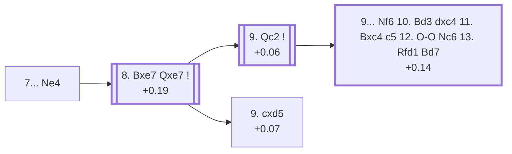

<a name="_TOP_"></a>

# D56 Queen's Gambit Declined: Lasker Defence <br> 1. d4 d5 2. c4 e6 3. Nc3 Nf6 4. Bg5 Be7 5. e3 O-O 6. Nf3 h6 7. Bh4 Ne4 #

Spun off from [D55's own "7. Bh4" card](https://github.com/onclemarcel/chess_flashcards/blob/main/d4_openings/D55_Queens_Gambit_Declined_Neo_Orthodox.md#_Bh4_) — the historically famous line, though only masters' second choice there (21.2%) behind the *Tartakower System* (72.6%, D58). `eco.md`'s name matches the live explorer here: the ***Lasker Defence***, named for World Champion Emanuel Lasker. Worth a direct cross-reference back to [D53's own "Lasker Variation"](https://github.com/onclemarcel/chess_flashcards/blob/main/d4_openings/D53_Queens_Gambit_Declined_Be7.md#_Lasker_): the live explorer tags both nodes with the identical name ("Lasker Defense"), but `eco.md` deliberately distinguishes them — D53's is ...Ne4 played *before* castling (5...Ne4, essentially unplayed in practice), while this is the real, heavily-analysed line, ...Ne4 played after 6...h6 7.Bh4.

### Overview

*Quick map of every move covered on this card — see the [shape key](https://github.com/onclemarcel/chess_flashcards/blob/main/start.md#content-diagram-optional) in start.md.*

<!-- content-diagram:start -->

<!-- content-diagram:end -->

<a name="_initial_move_"></a>

[](https://lichess.org/analysis/standard/rnbq1rk1/ppp1bpp1/4p2p/3p4/2PPn2B/2N1PN2/PP3PPP/R2QKB1R_w_KQ_-_2_8)

*... 7... Ne4 — Lasker Defense*

```
rnbq1rk1/ppp1bpp1/4p2p/3p4/2PPn2B/2N1PN2/PP3PPP/R2QKB1R w KQ - 2 8
```

|  | +0.17 |
| --- | --- |

<!-- lichess-stats:start fen="rnbq1rk1/ppp1bpp1/4p2p/3p4/2PPn2B/2N1PN2/PP3PPP/R2QKB1R w KQ - 2 8" db="lichess,masters" speeds="bullet,blitz" ratings="1800,2000,2200,2500" moves="3" -->
| Move | Online | W/D/B | Masters | W/D/B | |
| :--- | ---: | :--- | ---: | :--- | :-- |
| Bxe7 | 120 k (90.3%) | ⬜⬜⬜⬜⬜🟫⬛⬛⬛⬛ 47/9/45 | 1.7 k (97.2%) | ⬜⬜🟫🟫🟫🟫🟫🟫🟫⬛ 24/65/11 |  |
| Bg3 | 9.3 k (7.0%) | ⬜⬜⬜⬜⬜🟫⬛⬛⬛⬛ 51/6/42 | 49 (2.7%) | ⬜⬜⬜⬜🟫🟫🟫🟫⬛⬛ 35/41/24 |  |
| Nxe4 | 2.7 k (2.0%) | ⬜⬜⬜⬜🟫⬛⬛⬛⬛⬛ 43/6/51 | 0 | — | ⚠ |
| Rc1 | 0 | — | 1 (0.1%) | — |  |

*Online: bullet/blitz, 1800+ — 133 k games. Masters: 1.8 k games. [Open in the explorer](https://lichess.org/analysis/standard/rnbq1rk1/ppp1bpp1/4p2p/3p4/2PPn2B/2N1PN2/PP3PPP/R2QKB1R_w_KQ_-_2_8#explorer) — updated 2026-09-14*
<!-- lichess-stats:end -->

Challenges the bishop pair immediately, offering simplification in exchange for easy equality — Lasker's own pragmatic solution to the pin. Masters' overwhelming, near-forced reply is **8. Bxe7** (97.2%), covered below. **8. Bg3** (2.7%) is a real, secondary try with no code of its own in this range.

* [**8. Bxe7**](#_Qxe7_) (+0.19, 97.2% masters): see below.

[*Back to TOP*](#_TOP_)

---

<a name="_Qxe7_"></a>

## 8. Bxe7 Qxe7

[](https://lichess.org/analysis/standard/rnb2rk1/ppp1qpp1/4p2p/3p4/2PPn3/2N1PN2/PP3PPP/R2QKB1R_w_KQ_-_0_9)

*... 8. Bxe7 Qxe7*

```
rnb2rk1/ppp1qpp1/4p2p/3p4/2PPn3/2N1PN2/PP3PPP/R2QKB1R w KQ - 0 9
```

|  | +0.19 |
| --- | --- |

<!-- lichess-stats:start fen="rnb2rk1/ppp1qpp1/4p2p/3p4/2PPn3/2N1PN2/PP3PPP/R2QKB1R w KQ - 0 9" db="lichess,masters" speeds="bullet,blitz" ratings="1800,2000,2200,2500" moves="4" -->
| Move | Online | W/D/B | Masters | W/D/B | |
| :--- | ---: | :--- | ---: | :--- | :-- |
| Nxe4 | 30 k (25.0%) | ⬜⬜⬜⬜🟫⬛⬛⬛⬛⬛ 42/7/51 | 0 | — | ⚠ |
| cxd5 | 29 k (24.4%) | ⬜⬜⬜⬜⬜🟫⬛⬛⬛⬛ 50/8/41 | 254 (14.6%) | ⬜⬜⬜🟫🟫🟫🟫🟫🟫⬛ 30/59/11 |  |
| Bd3 | 23 k (19.7%) | ⬜⬜⬜⬜⬜🟫⬛⬛⬛⬛ 46/8/46 | 67 (3.8%) | ⬜⬜⬜🟫🟫🟫🟫🟫🟫⬛ 24/63/13 |  |
| Rc1 | 18 k (15.1%) | ⬜⬜⬜⬜⬜🟫⬛⬛⬛⬛ 48/11/41 | 1.0 k (58.9%) | ⬜⬜🟫🟫🟫🟫🟫🟫🟫⬛ 24/65/11 |  |
| Qc2 | 0 | — | 338 (19.4%) | ⬜⬜🟫🟫🟫🟫🟫🟫🟫⬛ 20/72/8 |  |

*Online: bullet/blitz, 1800+ — 118 k games. Masters: 1.7 k games. [Open in the explorer](https://lichess.org/analysis/standard/rnb2rk1/ppp1qpp1/4p2p/3p4/2PPn3/2N1PN2/PP3PPP/R2QKB1R_w_KQ_-_0_9#explorer) — updated 2026-09-14*
<!-- lichess-stats:end -->

Left completely untagged live (`opening=None`) at this exact node. **A genuine finding worth stating plainly**: neither of the two named continuations `eco.md` gives its own codes to here is actually masters' most common choice. Masters' real main try is **9. Rc1** (58.9%), simply developing the rook — a real, secondary try with no code of its own in this range. **9. Qc2** (19.4%) heads for the named *Teichmann Variation* below, this card's own deeper line. **9. cxd5** (14.6%) heads for the named *Main line* — its own code, D57. **9. Bd3** (3.8%), **9. Qb3** (1.9%) and **9. Nxe4** (1.1%) are all real, secondary tries with no code of their own in this range.

* **9. Rc1** (58.9% masters): a real, secondary try with no code of its own in this range — masters' actual most common choice at this fork.
* [**9. Qc2**](#_Teichmann_) (+0.06, 19.4% masters): the *Teichmann Variation* — covered below.
* [**9. cxd5**](https://github.com/onclemarcel/chess_flashcards/blob/main/d4_openings/D57_Queens_Gambit_Declined_Lasker_Defense_Main_Line.md) (+0.07, 14.6% masters): the *Main line* — its own code, D57.
* **9. Bd3** (3.8% masters), **9. Qb3** (1.9%), **9. Nxe4** (1.1%): all real, secondary tries with no code of their own in this range.

[*Back to 7... Ne4*](#_initial_move_)
[*Back to TOP*](#_TOP_)

---

<a name="_Teichmann_"></a>

## 9. Qc2 — Teichmann Variation

[](https://lichess.org/analysis/standard/rnb2rk1/ppp1qpp1/4p2p/3p4/2PPn3/2N1PN2/PPQ2PPP/R3KB1R_b_KQ_-_1_9)

*... 9. Qc2 — Teichmann Variation*

```
rnb2rk1/ppp1qpp1/4p2p/3p4/2PPn3/2N1PN2/PPQ2PPP/R3KB1R b KQ - 1 9
```

|  | +0.06 |
| --- | --- |

`eco.md`'s name matches the live explorer here — named for Richard Teichmann. Develops the queen off the back rank while eyeing the e4-knight and keeping castling long as a real option, a real, secondary try (19.4% masters) behind the uncoded 9.Rc1. Leads into the named *Russian Variation* below.

* [**9... Nf6 10. Bd3 dxc4 11. Bxc4 c5 12. O-O Nc6 13. Rfd1 Bd7**](#_Russian_) (+0.14): the *Russian Variation* — covered below.

[*Back to 8. Bxe7 Qxe7*](#_Qxe7_)
[*Back to TOP*](#_TOP_)

---

<a name="_Russian_"></a>

## 9... Nf6 10. Bd3 dxc4 11. Bxc4 c5 12. O-O Nc6 13. Rfd1 Bd7 — Russian Variation

[](https://lichess.org/analysis/standard/r4rk1/pp1bqpp1/2n1pn1p/2p5/2BP4/2N1PN2/PPQ2PPP/R2R2K1_w_-_-_4_14)

*... 13... Bd7 — Russian Variation*

```
r4rk1/pp1bqpp1/2n1pn1p/2p5/2BP4/2N1PN2/PPQ2PPP/R2R2K1 w - - 4 14
```

|  | +0.14 |
| --- | --- |

`eco.md`'s name matches the live explorer here. Retreats the knight from e4, regroups, castles into safety, strikes at the centre with ...c5, and finishes development with a full seven-move plan — a genuine strategic sequence rather than a single tactical point, reaching a balanced middlegame with both sides fully developed. Not built out further here — the deepest line of the whole Teichmann branch.

[*Back to 9. Qc2*](#_Teichmann_)
[*Back to TOP*](#_TOP_)
