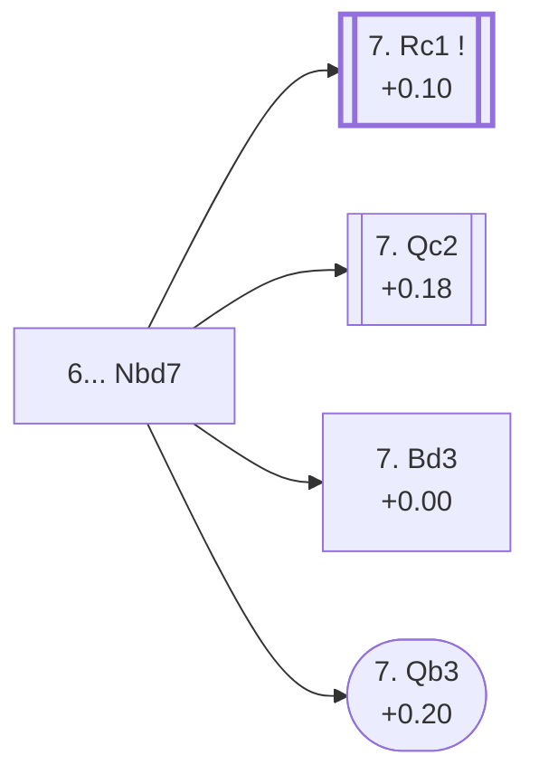

<a name="_TOP_"></a>

# D60 Queen's Gambit Declined: Orthodox Defence <br> 1. d4 d5 2. c4 e6 3. Nc3 Nf6 4. Bg5 Be7 5. e3 O-O 6. Nf3 Nbd7 #

Spun off from [D55's own "6. Nf3" card](https://github.com/onclemarcel/chess_flashcards/blob/main/d4_openings/D55_Queens_Gambit_Declined_Neo_Orthodox.md#_initial_move_) — masters' second-most-popular reply there (32.8%), already flagged there at the time as a real code simply not yet built in this repo; that forward link is now completed. `eco.md`'s name matches the live explorer here: the ***Orthodox Defence*** — note the British spelling throughout `eco.md`'s own D60-D69 range against the live explorer's consistent American "Defense," already flagged once in the D50-D59 batch and not repeated card by card here. This is the deepest, most heavily-forked tree of the whole D-series QGD sweep: the spine from this root (7. Rc1) runs all the way to D69, fifteen moves deep.

### Overview

*Quick map of every move covered on this card — see the [shape key](https://github.com/onclemarcel/chess_flashcards/blob/main/start.md#content-diagram-optional) in start.md.*

<!-- content-diagram:start -->

<!-- content-diagram:end -->

<a name="_initial_move_"></a>

[](https://lichess.org/analysis/standard/r1bq1rk1/pppnbppp/4pn2/3p2B1/2PP4/2N1PN2/PP3PPP/R2QKB1R_w_KQ_-_3_7)

*... 6... Nbd7 — Orthodox Defense*

```
r1bq1rk1/pppnbppp/4pn2/3p2B1/2PP4/2N1PN2/PP3PPP/R2QKB1R w KQ - 3 7
```

|  | +0.18 |
| --- | --- |

<!-- lichess-stats:start fen="r1bq1rk1/pppnbppp/4pn2/3p2B1/2PP4/2N1PN2/PP3PPP/R2QKB1R w KQ - 3 7" db="lichess,masters" speeds="bullet,blitz" ratings="1800,2000,2200,2500" moves="8" -->
| Move | Online | W/D/B | Masters | W/D/B | |
| :--- | ---: | :--- | ---: | :--- | :-- |
| Bd3 | 269 k (33.7%) | ⬜⬜⬜⬜⬜⬛⬛⬛⬛⬛ 47/6/47 | 314 (8.1%) | ⬜⬜⬜🟫🟫🟫🟫🟫⬛⬛ 35/47/18 |  |
| Rc1 | 165 k (20.7%) | ⬜⬜⬜⬜⬜🟫⬛⬛⬛⬛ 50/7/44 | 2.0 k (50.7%) | ⬜⬜⬜🟫🟫🟫🟫🟫⬛⬛ 32/54/14 |  |
| cxd5 | 117 k (14.7%) | ⬜⬜⬜⬜⬜🟫⬛⬛⬛⬛ 48/6/45 | 447 (11.5%) | ⬜⬜⬜🟫🟫🟫🟫🟫⬛⬛ 32/51/17 |  |
| Qc2 | 100 k (12.5%) | ⬜⬜⬜⬜⬜🟫⬛⬛⬛⬛ 51/6/42 | 1.1 k (28.0%) | ⬜⬜⬜🟫🟫🟫🟫🟫⬛⬛ 36/48/16 |  |
| Be2 | 63 k (7.9%) | ⬜⬜⬜⬜🟫⬛⬛⬛⬛⬛ 46/6/48 | 30 (0.8%) | ⬜⬜🟫🟫🟫🟫🟫🟫⬛⬛ 17/60/23 |  |
| c5 | 32 k (4.0%) | ⬜⬜⬜⬜⬜🟫⬛⬛⬛⬛ 54/5/40 | 7 (0.2%) | — |  |
| a3 | 19 k (2.4%) | ⬜⬜⬜⬜⬜🟫⬛⬛⬛⬛ 48/6/46 | 10 (0.3%) | — |  |
| h3 | 12 k (1.5%) | ⬜⬜⬜⬜⬜🟫⬛⬛⬛⬛ 48/6/46 | 0 | — | ⚠ |
| Qb3 | 0 | — | 16 (0.4%) | — |  |

*Online: bullet/blitz, 1800+ — 799 k games. Masters: 3.9 k games. [Open in the explorer](https://lichess.org/analysis/standard/r1bq1rk1/pppnbppp/4pn2/3p2B1/2PP4/2N1PN2/PP3PPP/R2QKB1R_w_KQ_-_3_7#explorer) — updated 2026-09-09*
<!-- lichess-stats:end -->

Develops the other knight rather than the bishop, the classical treatment against the Bg5 pin. Masters' clear main try is **7. Rc1** (50.7%), simply developing — covered below, its own code D63, and the trunk feeding the entire rest of this batch (D63 through D69). **7. Qc2** (28.0%) is D61's own root. **7. cxd5** (11.5%) is a real, secondary try with no code of its own in this range — and, on the actual numbers, it outranks *both* of this card's own named children below (Botvinnik 8.1%, Rauzer only 0.4%), the first instance in this batch of an `eco.md`-coded line trailing an uncoded rival at its own fork. **7. Bd3** (8.1% masters) is a genuinely large online outlier (33.7% online, over 4× its masters share) — worth a clear sentence, though the gap doesn't clear the numeric blitz-trap bar (masters must sit under 2%, and 8.1% doesn't). **7. Qb3** (only 0.4% masters, 0.6% online) is a database rarity despite carrying its own code — mirrors the Been-Koomen/Rochlin pattern already seen in the D50-D59 batch.

* [**7. Rc1**](https://github.com/onclemarcel/chess_flashcards/blob/main/d4_openings/D63_Queens_Gambit_Declined_7Rc1.md) (+0.10, 50.7% masters): its own code, D63.
* [**7. Qc2**](https://github.com/onclemarcel/chess_flashcards/blob/main/d4_openings/D61_Queens_Gambit_Declined_Rubinstein_Variation.md) (+0.18, 28.0% masters): the *Rubinstein Variation* — its own code, D61.
* **7. cxd5** (11.5% masters): a real, secondary try with no code of its own in this range — outranks both named children below.
* [**7. Bd3**](#_Botvinnik_) (+0.00, 8.1% masters, 33.7% online): the *Botvinnik Variation* — covered below.
* [**7. Qb3**](#_Rauzer_) (+0.20, 0.4% masters, 0.6% online): the *Rauzer Variation* — covered below.

[*Back to TOP*](#_TOP_)

---

<a name="_Botvinnik_"></a>

## 7. Bd3 — Botvinnik Variation

[](https://lichess.org/analysis/standard/r1bq1rk1/pppnbppp/4pn2/3p2B1/2PP4/2NBPN2/PP3PPP/R2QK2R_b_KQ_-_4_7)

*... 7. Bd3 — Botvinnik Variation*

```
r1bq1rk1/pppnbppp/4pn2/3p2B1/2PP4/2NBPN2/PP3PPP/R2QK2R b KQ - 4 7
```

|  | +0.00 |
| --- | --- |

`eco.md`'s name matches the live explorer here — named for Mikhail Botvinnik. Develops the bishop actively toward the kingside rather than joining the queenside pressure on d5, a real, secondary try (8.1% masters) that's meaningfully more popular online (33.7%) — a genuinely large gap, though it stays a plain, unclassified line rather than a formal blitz trap since masters' own share doesn't clear the 2% bar the shape key requires. Not built out further here (backlog).

[*Back to 6... Nbd7*](#_initial_move_)
[*Back to TOP*](#_TOP_)

---

<a name="_Rauzer_"></a>

## 7. Qb3 — Rauzer Variation

[](https://lichess.org/analysis/standard/r1bq1rk1/pppnbppp/4pn2/3p2B1/2PP4/1QN1PN2/PP3PPP/R3KB1R_b_KQ_-_4_7)

*... 7. Qb3 — Rauzer Variation*

```
r1bq1rk1/pppnbppp/4pn2/3p2B1/2PP4/1QN1PN2/PP3PPP/R3KB1R b KQ - 4 7
```

|  | +0.20 |
| --- | --- |

`eco.md`'s name matches the live explorer here — named for Vsevolod Rauzer. Eyes b7 and d5 from the queenside at once instead of developing quietly. A genuine database rarity: under the shape key's own numbers (masters 0.4% < 2%, online 0.6% < 3%) this is **understudied everywhere**, not a blitz trap — nobody plays it much online either, the mirror image of Botvinnik's own gap one section above. `eco.md` still gives it a full code despite the near-extinction, the same pattern already seen at D50's Been-Koomen Variation and D51's Rochlin Variation in the prior batch. Not built out further here (backlog).

[*Back to 6... Nbd7*](#_initial_move_)
[*Back to TOP*](#_TOP_)
