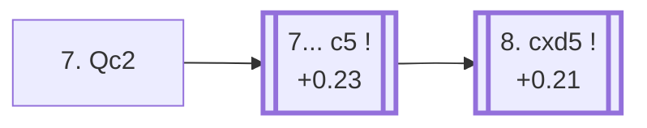

<a name="_TOP_"></a>

# D61 Queen's Gambit Declined: Rubinstein Variation <br> 1. d4 d5 2. c4 e6 3. Nc3 Nf6 4. Bg5 Be7 5. e3 O-O 6. Nf3 Nbd7 7. Qc2 #

Spun off from [D60's own root card](https://github.com/onclemarcel/chess_flashcards/blob/main/d4_openings/D60_Queens_Gambit_Declined_Orthodox_Defense.md#_initial_move_) — masters' second choice there (28.0%), behind D63's own 7. Rc1 (50.7%). `eco.md`'s name matches the live explorer here: the ***Rubinstein Variation***, named for Akiba Rubinstein — unrelated to D20's and D33's own, separately-named Rubinstein lines elsewhere in this D-series.

### Overview

*Quick map of every move covered on this card — see the [shape key](https://github.com/onclemarcel/chess_flashcards/blob/main/start.md#content-diagram-optional) in start.md.*

<!-- content-diagram:start -->

<!-- content-diagram:end -->

<a name="_initial_move_"></a>

[](https://lichess.org/analysis/standard/r1bq1rk1/pppnbppp/4pn2/3p2B1/2PP4/2N1PN2/PPQ2PPP/R3KB1R_b_KQ_-_4_7)

*... 7. Qc2 — Rubinstein Variation*

```
r1bq1rk1/pppnbppp/4pn2/3p2B1/2PP4/2N1PN2/PPQ2PPP/R3KB1R b KQ - 4 7
```

|  | +0.18 |
| --- | --- |

<!-- lichess-stats:start fen="r1bq1rk1/pppnbppp/4pn2/3p2B1/2PP4/2N1PN2/PPQ2PPP/R3KB1R b KQ - 4 7" db="lichess,masters" speeds="bullet,blitz" ratings="1800,2000,2200,2500" moves="8" -->
| Move | Online | W/D/B | Masters | W/D/B | |
| :--- | ---: | :--- | ---: | :--- | :-- |
| c6 | 25 k (21.8%) | ⬜⬜⬜⬜⬜🟫⬛⬛⬛⬛ 53/6/41 | 313 (25.7%) | ⬜⬜⬜⬜🟫🟫🟫🟫⬛⬛ 40/42/18 |  |
| h6 | 23 k (20.0%) | ⬜⬜⬜⬜⬜🟫⬛⬛⬛⬛ 51/6/43 | 210 (17.2%) | ⬜⬜⬜🟫🟫🟫🟫🟫⬛⬛ 32/52/16 |  |
| b6 | 22 k (18.7%) | ⬜⬜⬜⬜⬜🟫⬛⬛⬛⬛ 52/5/43 | 77 (6.3%) | ⬜⬜⬜⬜⬜🟫🟫🟫⬛⬛ 45/35/19 |  |
| c5 | 18 k (15.2%) | ⬜⬜⬜⬜⬜🟫⬛⬛⬛⬛ 49/7/44 | 441 (36.2%) | ⬜⬜⬜🟫🟫🟫🟫🟫🟫⬛ 31/55/14 |  |
| a6 | 17 k (14.7%) | ⬜⬜⬜⬜⬜🟫⬛⬛⬛⬛ 50/6/44 | 125 (10.3%) | ⬜⬜⬜⬜🟫🟫🟫🟫⬛⬛ 43/38/18 |  |
| Re8 | 5.8 k (4.9%) | ⬜⬜⬜⬜⬜🟫⬛⬛⬛⬛ 54/6/41 | 37 (3.0%) | ⬜⬜⬜⬜🟫🟫🟫🟫⬛⬛ 38/38/24 |  |
| dxc4 | 4.9 k (4.2%) | ⬜⬜⬜⬜⬜🟫⬛⬛⬛⬛ 51/6/43 | 14 (1.1%) | — |  |
| Nb6 | 165 (0.1%) | ⬜⬜⬜⬜⬜⬜⬜⬛⬛⬛ 64/3/33 | 0 | — | ⚠ |
| Ne4 | 0 | — | 1 (0.1%) | — |  |

*Online: bullet/blitz, 1800+ — 117 k games. Masters: 1.2 k games. [Open in the explorer](https://lichess.org/analysis/standard/r1bq1rk1/pppnbppp/4pn2/3p2B1/2PP4/2N1PN2/PPQ2PPP/R3KB1R_b_KQ_-_4_7#explorer) — updated 2026-09-15*
<!-- lichess-stats:end -->

Keeps the queen flexible on c2 rather than committing to Rc1 at once. Masters' clear main try is **7... c5** (36.2%), striking the centre immediately — covered below, and, notably, the exact move `eco.md`'s own D62 entry is built around. Online play instead favours the quieter **7... c6** (21.8% online, only 25.7% masters — the two databases are close here, unlike the sharper gaps found elsewhere in this batch) fractionally ahead of c5 (15.2% online). **7... h6**, **7... a6**, **7... b6** and **7... Re8** are all real, secondary tries with no code of their own in this range.

* [**7... c5**](#_c5_) (+0.23, 36.2% masters, 15.2% online): see below.
* **7... c6** (25.7% masters, 21.8% online): a real, secondary try with no code of its own in this range.
* **7... h6** (17.2% masters), **7... a6** (10.3%), **7... b6** (6.3%), **7... Re8** (3.0%), **7... dxc4** (1.1%): all real, secondary tries with no code of their own in this range.

[*Back to TOP*](#_TOP_)

---

<a name="_c5_"></a>

## 7... c5

[](https://lichess.org/analysis/standard/r1bq1rk1/pp1nbppp/4pn2/2pp2B1/2PP4/2N1PN2/PPQ2PPP/R3KB1R_w_KQ_c6_0_8)

*... 7... c5*

```
r1bq1rk1/pp1nbppp/4pn2/2pp2B1/2PP4/2N1PN2/PPQ2PPP/R3KB1R w KQ c6 0 8
```

|  | +0.23 |
| --- | --- |

<!-- lichess-stats:start fen="r1bq1rk1/pp1nbppp/4pn2/2pp2B1/2PP4/2N1PN2/PPQ2PPP/R3KB1R w KQ c6 0 8" db="lichess,masters" speeds="bullet,blitz" ratings="1800,2000,2200,2500" moves="4" -->
| Move | Online | W/D/B | Masters | W/D/B | |
| :--- | ---: | :--- | ---: | :--- | :-- |
| cxd5 | 8.0 k (43.1%) | ⬜⬜⬜⬜⬜🟫⬛⬛⬛⬛ 49/7/43 | 253 (57.4%) | ⬜⬜⬜🟫🟫🟫🟫🟫🟫⬛ 26/64/10 |  |
| dxc5 | 3.7 k (20.2%) | ⬜⬜⬜⬜⬜🟫⬛⬛⬛⬛ 49/7/44 | 35 (7.9%) | ⬜⬜⬜🟫🟫🟫🟫⬛⬛⬛ 29/40/31 |  |
| Rd1 | 2.4 k (12.8%) | ⬜⬜⬜⬜⬜🟫⬛⬛⬛⬛ 52/7/42 | 88 (20.0%) | ⬜⬜⬜⬜🟫🟫🟫🟫⬛⬛ 41/44/15 |  |
| O-O-O | 1.8 k (9.7%) | ⬜⬜⬜⬜⬜⬛⬛⬛⬛⬛ 49/5/47 | 62 (14.1%) | ⬜⬜⬜⬜🟫🟫🟫🟫⬛⬛ 40/44/16 |  |

*Online: bullet/blitz, 1800+ — 18 k games. Masters: 441 games. [Open in the explorer](https://lichess.org/analysis/standard/r1bq1rk1/pp1nbppp/4pn2/2pp2B1/2PP4/2N1PN2/PPQ2PPP/R3KB1R_w_KQ_c6_0_8#explorer) — updated 2026-09-15*
<!-- lichess-stats:end -->

Left tagged with the same "Rubinstein Variation" name at this exact node (the live explorer doesn't distinguish it from its own parent). Masters' clear main reply is **8. cxd5** (57.4%), resolving the centre — covered below, the exact continuation `eco.md` names D62 for. **8. Rd1** (20.0%) and **8. O-O-O** (14.1%) are both real, secondary tries with no code of their own in this range, and **8. dxc5** (7.9%) likewise.

* [**8. cxd5**](https://github.com/onclemarcel/chess_flashcards/blob/main/d4_openings/D62_Queens_Gambit_Declined_Rubinstein_8cd.md) (+0.21, 57.4% masters): the *Rubinstein Variation, Flohr Line* — its own code, D62.
* **8. Rd1** (20.0% masters), **8. O-O-O** (14.1%), **8. dxc5** (7.9%): all real, secondary tries with no code of their own in this range.

[*Back to 7. Qc2*](#_initial_move_)
[*Back to TOP*](#_TOP_)
