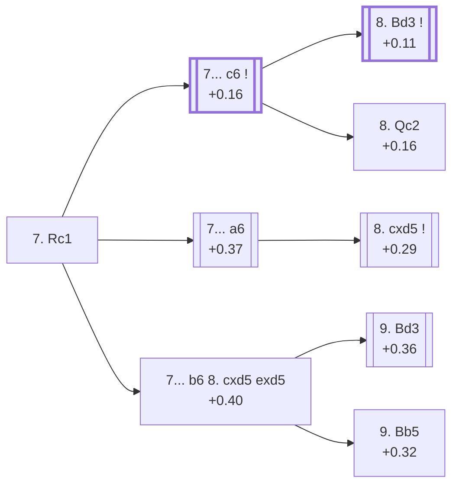

<a name="_TOP_"></a>

# D63 Queen's Gambit Declined: 7.Rc1 <br> 1. d4 d5 2. c4 e6 3. Nc3 Nf6 4. Bg5 Be7 5. e3 O-O 6. Nf3 Nbd7 7. Rc1 #

Spun off from [D60's own root card](https://github.com/onclemarcel/chess_flashcards/blob/main/d4_openings/D60_Queens_Gambit_Declined_Orthodox_Defense.md#_initial_move_) — masters' clear main try there (50.7%). `eco.md`'s name matches the live explorer here: the ***Main Line*** — the first of three unrelated occurrences of this exact generic live tag in this batch, reused again a few plies deeper on this very card (7...c6, below) and a third time at D67's own "11.O-O" node. This card holds the widest single fork of the batch: six named `eco.md` entries hang directly or indirectly off this one root.

### Overview

*Quick map of every move covered on this card — see the [shape key](https://github.com/onclemarcel/chess_flashcards/blob/main/start.md#content-diagram-optional) in start.md.*

<!-- content-diagram:start -->

<!-- content-diagram:end -->

<a name="_initial_move_"></a>

[](https://lichess.org/analysis/standard/r1bq1rk1/pppnbppp/4pn2/3p2B1/2PP4/2N1PN2/PP3PPP/2RQKB1R_b_K_-_4_7)

*... 7. Rc1 — Main Line*

```
r1bq1rk1/pppnbppp/4pn2/3p2B1/2PP4/2N1PN2/PP3PPP/2RQKB1R b K - 4 7
```

|  | +0.10 |
| --- | --- |

<!-- lichess-stats:start fen="r1bq1rk1/pppnbppp/4pn2/3p2B1/2PP4/2N1PN2/PP3PPP/2RQKB1R b K - 4 7" db="lichess,masters" speeds="bullet,blitz" ratings="1800,2000,2200,2500" moves="8" -->
| Move | Online | W/D/B | Masters | W/D/B | |
| :--- | ---: | :--- | ---: | :--- | :-- |
| c6 | 54 k (30.8%) | ⬜⬜⬜⬜⬜🟫⬛⬛⬛⬛ 51/7/42 | 987 (46.7%) | ⬜⬜⬜🟫🟫🟫🟫🟫🟫⬛ 32/56/12 |  |
| b6 | 32 k (18.2%) | ⬜⬜⬜⬜⬜🟫⬛⬛⬛⬛ 50/6/44 | 87 (4.1%) | ⬜⬜⬜⬜⬜⬜🟫🟫🟫⬛ 56/31/13 |  |
| a6 | 29 k (16.5%) | ⬜⬜⬜⬜⬜🟫⬛⬛⬛⬛ 47/7/46 | 580 (27.5%) | ⬜⬜⬜🟫🟫🟫🟫🟫⬛⬛ 32/50/18 |  |
| h6 | 24 k (13.6%) | ⬜⬜⬜⬜⬜🟫⬛⬛⬛⬛ 49/7/43 | 159 (7.5%) | ⬜⬜⬜🟫🟫🟫🟫🟫🟫⬛ 31/62/7 |  |
| c5 | 19 k (10.8%) | ⬜⬜⬜⬜⬜🟫⬛⬛⬛⬛ 51/7/43 | 12 (0.6%) | — |  |
| dxc4 | 9.5 k (5.4%) | ⬜⬜⬜⬜⬜🟫⬛⬛⬛⬛ 47/7/45 | 228 (10.8%) | ⬜⬜🟫🟫🟫🟫🟫🟫⬛⬛ 22/61/17 |  |
| Re8 | 6.1 k (3.5%) | ⬜⬜⬜⬜⬜🟫⬛⬛⬛⬛ 51/6/44 | 58 (2.7%) | ⬜⬜⬜⬜🟫🟫🟫🟫⬛⬛ 45/38/17 |  |
| Ne4 | 1.5 k (0.8%) | ⬜⬜⬜⬜⬜🟫⬛⬛⬛⬛ 55/6/39 | 0 | — | ⚠ |
| g6 | 0 | — | 1 (0.0%) | — |  |

*Online: bullet/blitz, 1800+ — 174 k games. Masters: 2.1 k games. [Open in the explorer](https://lichess.org/analysis/standard/r1bq1rk1/pppnbppp/4pn2/3p2B1/2PP4/2N1PN2/PP3PPP/2RQKB1R_b_K_-_4_7#explorer) — updated 2026-09-09*
<!-- lichess-stats:end -->

Simply develops the rook, keeping every option open. Masters' clear main try is **7... c6** (46.7%), reinforcing d5 — covered below, and the deepest sub-tree of this whole batch (it alone feeds D64 through D69). **7... a6** (27.5%) heads for the named *Swiss (Henneberger) Variation*, covered below. **7... dxc4** (10.8%), **7... h6** (7.5%) and **7... Re8** (2.7%) are all real, secondary tries with no code of their own in this range. **7... b6** (4.1%) is a comparatively minor try at this fork despite feeding two of `eco.md`'s own named lines below (Pillsbury Attack, Capablanca Variation). **7... c5**, at only 0.6% masters but 10.8% online (an 18× gap), clears the numeric blitz-trap bar cleanly — a genuine finding, though it's too thin to build out here.

* [**7... c6**](#_c6_) (+0.16, 46.7% masters): see below.
* [**7... a6**](#_Swiss_) (+0.37, 27.5% masters): the *Swiss (Henneberger) Variation* — covered below.
* **7... dxc4** (10.8% masters), **7... h6** (7.5%), **7... Re8** (2.7%): all real, secondary tries with no code of their own in this range.
* [**7... b6**](#_b6_) (+0.40, 4.1% masters): a real, secondary try feeding two named branches below.
* **7... c5** (0.6% masters, 10.8% online — a genuine blitz trap by the numbers): not built out further here.

[*Back to TOP*](#_TOP_)

---

<a name="_c6_"></a>

## 7... c6

[](https://lichess.org/analysis/standard/r1bq1rk1/pp1nbppp/2p1pn2/3p2B1/2PP4/2N1PN2/PP3PPP/2RQKB1R_w_K_-_0_8)

*... 7... c6 — Main Line*

```
r1bq1rk1/pp1nbppp/2p1pn2/3p2B1/2PP4/2N1PN2/PP3PPP/2RQKB1R w K - 0 8
```

|  | +0.16 |
| --- | --- |

<!-- lichess-stats:start fen="r1bq1rk1/pp1nbppp/2p1pn2/3p2B1/2PP4/2N1PN2/PP3PPP/2RQKB1R w K - 0 8" db="lichess,masters" speeds="bullet,blitz" ratings="1800,2000,2200,2500" moves="8" -->
| Move | Online | W/D/B | Masters | W/D/B | |
| :--- | ---: | :--- | ---: | :--- | :-- |
| Bd3 | 191 k (53.5%) | ⬜⬜⬜⬜⬜🟫⬛⬛⬛⬛ 52/6/42 | 1.0 k (74.2%) | ⬜⬜⬜🟫🟫🟫🟫🟫🟫⬛ 34/56/10 |  |
| a3 | 52 k (14.6%) | ⬜⬜⬜⬜⬜🟫⬛⬛⬛⬛ 52/6/42 | 140 (10.3%) | ⬜⬜⬜⬜🟫🟫🟫🟫🟫⬛ 38/49/14 |  |
| Qc2 | 41 k (11.4%) | ⬜⬜⬜⬜⬜🟫⬛⬛⬛⬛ 53/7/41 | 160 (11.8%) | ⬜⬜⬜⬜🟫🟫🟫🟫🟫⬛ 36/51/13 |  |
| cxd5 | 30 k (8.4%) | ⬜⬜⬜⬜⬜🟫⬛⬛⬛⬛ 50/6/44 | 29 (2.1%) | ⬜🟫🟫🟫🟫🟫🟫🟫⬛⬛ 14/69/17 |  |
| Be2 | 17 k (4.9%) | ⬜⬜⬜⬜⬜🟫⬛⬛⬛⬛ 49/7/44 | 10 (0.7%) | — |  |
| h3 | 11 k (3.2%) | ⬜⬜⬜⬜⬜🟫⬛⬛⬛⬛ 53/6/41 | 6 (0.4%) | — |  |
| c5 | 4.4 k (1.2%) | ⬜⬜⬜⬜⬜🟫⬛⬛⬛⬛ 51/5/44 | 0 | — | ⚠ |
| Qb3 | 3.2 k (0.9%) | ⬜⬜⬜⬜⬜🟫⬛⬛⬛⬛ 53/6/41 | 2 (0.1%) | — | ⚠ |
| a4 | 0 | — | 2 (0.1%) | — |  |

*Online: bullet/blitz, 1800+ — 357 k games. Masters: 1.4 k games. [Open in the explorer](https://lichess.org/analysis/standard/r1bq1rk1/pp1nbppp/2p1pn2/3p2B1/2PP4/2N1PN2/PP3PPP/2RQKB1R_w_K_-_0_8#explorer) — updated 2026-09-09*
<!-- lichess-stats:end -->

Live-tagged the same generic "Main Line" name as this card's own root, a second unrelated occurrence one ply deeper. Masters' overwhelming reply is **8. Bd3** (74.2%), by far the actual main trunk of this entire batch — deeper and more heavily played than the Rubinstein Attack complex it sits alongside. **8. Qc2** (11.8%) heads for the *Rubinstein Attack* — its own code, D64 — but despite carrying `eco.md`'s own code, it's only the *second* choice here, well behind Bd3's D66-D69 tree; worth stating plainly. **8. a3** (10.3%) is a real, secondary try with no code of its own in this range.

* [**8. Bd3**](https://github.com/onclemarcel/chess_flashcards/blob/main/d4_openings/D66_Queens_Gambit_Declined_Bd3_Line.md) (+0.11, 74.2% masters): the *Bd3 line* — its own code, D66, the actual main trunk of the whole batch.
* [**8. Qc2**](https://github.com/onclemarcel/chess_flashcards/blob/main/d4_openings/D64_Queens_Gambit_Declined_Rubinstein_Attack.md) (+0.16, 11.8% masters): the *Rubinstein Attack* — its own code, D64, only the second choice here.
* **8. a3** (10.3% masters): a real, secondary try with no code of its own in this range.

[*Back to 7. Rc1*](#_initial_move_)
[*Back to TOP*](#_TOP_)

---

<a name="_b6_"></a>

## 7... b6 8. cxd5 exd5

[](https://lichess.org/analysis/standard/r1bq1rk1/p1pnbppp/1p3n2/3p2B1/3P4/2N1PN2/PP3PPP/2RQKB1R_w_K_-_0_9)

*... 7... b6 8. cxd5 exd5*

```
r1bq1rk1/p1pnbppp/1p3n2/3p2B1/3P4/2N1PN2/PP3PPP/2RQKB1R w K - 0 9
```

|  | +0.40 |
| --- | --- |

<!-- lichess-stats:start fen="r1bq1rk1/p1pnbppp/1p3n2/3p2B1/3P4/2N1PN2/PP3PPP/2RQKB1R w K - 0 9" db="lichess,masters" speeds="bullet,blitz" ratings="1800,2000,2200,2500" moves="6" -->
| Move | Online | W/D/B | Masters | W/D/B | |
| :--- | ---: | :--- | ---: | :--- | :-- |
| Bd3 | 9.8 k (70.3%) | ⬜⬜⬜⬜⬜🟫⬛⬛⬛⬛ 52/6/42 | 32 (37.2%) | ⬜⬜⬜⬜⬜⬜⬜🟫🟫⬛ 69/22/9 |  |
| Bb5 | 1.5 k (10.6%) | ⬜⬜⬜⬜⬜🟫⬛⬛⬛⬛ 52/6/43 | 17 (19.8%) | — |  |
| Be2 | 722 (5.2%) | ⬜⬜⬜⬜⬜🟫⬛⬛⬛⬛ 53/7/40 | 10 (11.6%) | — |  |
| Qa4 | 506 (3.6%) | ⬜⬜⬜⬜⬜⬜🟫⬛⬛⬛ 58/6/35 | 23 (26.7%) | ⬜⬜⬜⬜⬜⬜🟫🟫⬛⬛ 57/26/17 |  |
| Ne5 | 361 (2.6%) | ⬜⬜⬜⬜⬜⬛⬛⬛⬛⬛ 46/6/48 | 3 (3.5%) | — | ⚠ |
| Nb5 | 288 (2.1%) | ⬜⬜⬜⬜⬜⬛⬛⬛⬛⬛ 50/4/47 | 0 | — | ⚠ |
| Bxf6 | 0 | — | 1 (1.2%) | — |  |

*Online: bullet/blitz, 1800+ — 14 k games. Masters: 86 games. [Open in the explorer](https://lichess.org/analysis/standard/r1bq1rk1/p1pnbppp/1p3n2/3p2B1/3P4/2N1PN2/PP3PPP/2RQKB1R_w_K_-_0_9#explorer) — updated 2026-09-09*
<!-- lichess-stats:end -->

A compressed multi-ply span: `eco.md` itself names the *Pillsbury Attack* and *Capablanca Variation* three plies past this card's own root, differing only in White's 9th move. Left completely untagged live (`opening=None`) at this exact node, on a small sample (86 masters games — say so plainly). Masters' actual plurality here is **9. Bd3** (37.2%), heading for the *Pillsbury Attack* below. A genuine finding worth flagging on its own: the uncoded **9. Qa4** (26.7%) actually *outranks* the named *Capablanca Variation* (9. Bb5, only 19.8%) at this fork — another instance of the same "coded line loses to an uncoded rival" shape recurring across this batch. **9. Be2** (11.6%) is a further real, secondary try with no code of its own in this range.

* [**9. Bd3**](#_Pillsbury_) (+0.36, 37.2% masters): the *Pillsbury Attack* — covered below.
* **9. Qa4** (26.7% masters): a real, secondary try with no code of its own in this range — outranks the named Capablanca Variation immediately below.
* [**9. Bb5**](#_Capablanca_) (+0.32, 19.8% masters): the *Capablanca Variation* — covered below.
* **9. Be2** (11.6% masters): a real, secondary try with no code of its own in this range.

[*Back to 7. Rc1*](#_initial_move_)
[*Back to TOP*](#_TOP_)

---

<a name="_Pillsbury_"></a>

## 7... b6 8. cxd5 exd5 9. Bd3 — Pillsbury Attack

[](https://lichess.org/analysis/standard/r1bq1rk1/p1pnbppp/1p3n2/3p2B1/3P4/2NBPN2/PP3PPP/2RQK2R_b_K_-_1_9)

*... 9. Bd3 — Pillsbury Attack*

```
r1bq1rk1/p1pnbppp/1p3n2/3p2B1/3P4/2NBPN2/PP3PPP/2RQK2R b K - 1 9
```

|  | +0.36 |
| --- | --- |

`eco.md`'s name matches the live explorer here — named for Harry Nelson Pillsbury, unrelated to D55's own, separately-named Pillsbury Attack elsewhere in this D-series (that one from a different move order entirely). Develops the bishop to its most active square, aiming straight at h7 with the centre already resolved. Not built out further here (backlog).

[*Back to 7... b6 8. cxd5 exd5*](#_b6_)
[*Back to TOP*](#_TOP_)

---

<a name="_Capablanca_"></a>

## 7... b6 8. cxd5 exd5 9. Bb5 — Capablanca Variation

[](https://lichess.org/analysis/standard/r1bq1rk1/p1pnbppp/1p3n2/1B1p2B1/3P4/2N1PN2/PP3PPP/2RQK2R_b_K_-_1_9)

*... 9. Bb5 — Capablanca Variation*

```
r1bq1rk1/p1pnbppp/1p3n2/1B1p2B1/3P4/2N1PN2/PP3PPP/2RQK2R b K - 1 9
```

|  | +0.32 |
| --- | --- |

`eco.md`'s name matches the live explorer here — named for José Raúl Capablanca, unrelated to D67's own, separately-named "Capablanca System" elsewhere on this same D60-D69 batch's own longest branch (see the D67 card). Pins the c6-pawn to the king's rook rather than developing to d3, a real, secondary try (19.8% masters at its own fork) trailing both the named Pillsbury Attack and the uncoded 9.Qa4. Not built out further here (backlog).

[*Back to 7... b6 8. cxd5 exd5*](#_b6_)
[*Back to TOP*](#_TOP_)

---

<a name="_Swiss_"></a>

## 7... a6 — Swiss (Henneberger) Variation

[](https://lichess.org/analysis/standard/r1bq1rk1/1ppnbppp/p3pn2/3p2B1/2PP4/2N1PN2/PP3PPP/2RQKB1R_w_K_-_0_8)

*... 7... a6 — Henneberger Variation*

```
r1bq1rk1/1ppnbppp/p3pn2/3p2B1/2PP4/2N1PN2/PP3PPP/2RQKB1R w K - 0 8
```

|  | +0.37 |
| --- | --- |

<!-- lichess-stats:start fen="r1bq1rk1/1ppnbppp/p3pn2/3p2B1/2PP4/2N1PN2/PP3PPP/2RQKB1R w K - 0 8" db="lichess,masters" speeds="bullet,blitz" ratings="1800,2000,2200,2500" moves="6" -->
| Move | Online | W/D/B | Masters | W/D/B | |
| :--- | ---: | :--- | ---: | :--- | :-- |
| Bd3 | 14 k (27.6%) | ⬜⬜⬜⬜🟫⬛⬛⬛⬛⬛ 44/6/51 | 0 | — | ⚠ |
| cxd5 | 13 k (26.0%) | ⬜⬜⬜⬜⬜🟫⬛⬛⬛⬛ 50/7/43 | 312 (51.7%) | ⬜⬜⬜🟫🟫🟫🟫🟫⬛⬛ 28/55/16 |  |
| a3 | 8.1 k (16.4%) | ⬜⬜⬜⬜⬜🟫⬛⬛⬛⬛ 47/7/46 | 33 (5.5%) | ⬜⬜🟫🟫🟫🟫🟫⬛⬛⬛ 24/48/27 |  |
| c5 | 4.8 k (9.8%) | ⬜⬜⬜⬜⬜🟫⬛⬛⬛⬛ 53/6/41 | 165 (27.4%) | ⬜⬜⬜⬜🟫🟫🟫🟫⬛⬛ 39/41/20 |  |
| Qc2 | 3.8 k (7.8%) | ⬜⬜⬜⬜⬜🟫⬛⬛⬛⬛ 48/7/45 | 30 (5.0%) | ⬜⬜⬜🟫🟫🟫🟫🟫⬛⬛ 33/47/20 |  |
| a4 | 2.0 k (4.0%) | ⬜⬜⬜⬜⬜🟫⬛⬛⬛⬛ 51/6/43 | 38 (6.3%) | ⬜⬜⬜⬜🟫🟫🟫🟫🟫⬛ 42/45/13 |  |
| b3 | 0 | — | 10 (1.7%) | — |  |

*Online: bullet/blitz, 1800+ — 49 k games. Masters: 603 games. [Open in the explorer](https://lichess.org/analysis/standard/r1bq1rk1/1ppnbppp/p3pn2/3p2B1/2PP4/2N1PN2/PP3PPP/2RQKB1R_w_K_-_0_8#explorer) — updated 2026-09-09*
<!-- lichess-stats:end -->

`eco.md` names this "Swiss (Henneberger) Variation"; the live explorer independently confirms the same identity, tagging it plain ***Henneberger Variation*** — named for Swiss master Walter Henneberger. Prepares ...b5 queenside expansion before committing the c-pawn. Masters' clear main reply is **8. cxd5** (51.7%), heading for the named *Karlsbad Variation* below. **8. c5** (27.4%) is a real, secondary try with no code of its own in this range.

* [**8. cxd5**](#_Karlsbad_) (+0.29, 51.7% masters): the *Karlsbad Variation* — covered below.
* **8. c5** (27.4% masters): a real, secondary try with no code of its own in this range.

[*Back to 7. Rc1*](#_initial_move_)
[*Back to TOP*](#_TOP_)

---

<a name="_Karlsbad_"></a>

## 7... a6 8. cxd5 — Swiss, Karlsbad Variation

[](https://lichess.org/analysis/standard/r1bq1rk1/1ppnbppp/p3pn2/3P2B1/3P4/2N1PN2/PP3PPP/2RQKB1R_b_K_-_0_8)

*... 8. cxd5 — Karlsbad Variation*

```
r1bq1rk1/1ppnbppp/p3pn2/3P2B1/3P4/2N1PN2/PP3PPP/2RQKB1R b K - 0 8
```

|  | +0.29 |
| --- | --- |

`eco.md`'s name matches the live explorer here (still tagged under the "Henneberger Variation" family). Resolves the centre into the Carlsbad structure a tempo up on the more common ...c6 move orders elsewhere in this D-series, thanks to the earlier ...a6. Worth a light cross-reference: this "Karlsbad" name is reused, unrelated, at D64's own Rubinstein Attack, Karlsbad Variation deeper in this same batch — two different Karlsbad-structure lines under two different codes. Not built out further here (backlog).

[*Back to 7... a6*](#_Swiss_)
[*Back to TOP*](#_TOP_)
