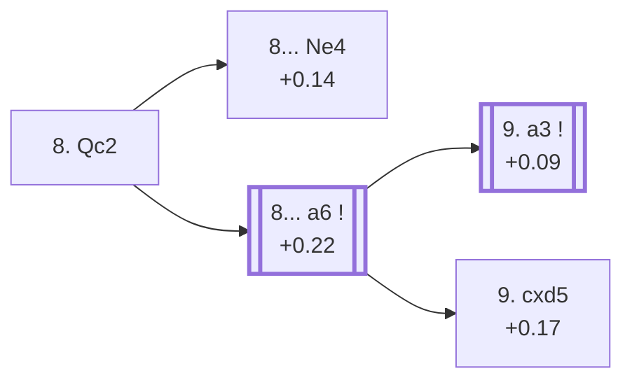

<a name="_TOP_"></a>

# D64 Queen's Gambit Declined: Rubinstein Attack <br> 1. d4 d5 2. c4 e6 3. Nc3 Nf6 4. Bg5 Be7 5. e3 O-O 6. Nf3 Nbd7 7. Rc1 c6 8. Qc2 #

Spun off from [D63's own "7... c6" node](https://github.com/onclemarcel/chess_flashcards/blob/main/d4_openings/D63_Queens_Gambit_Declined_7Rc1.md#_c6_) — only the second choice there (11.8% masters), well behind D66's own 8. Bd3 (74.2%), despite carrying its own `eco.md` code (worth restating plainly, per D63's own note). `eco.md`'s name matches the live explorer here: the ***Rubinstein Attack***.

### Overview

*Quick map of every move covered on this card — see the [shape key](https://github.com/onclemarcel/chess_flashcards/blob/main/start.md#content-diagram-optional) in start.md.*

<!-- content-diagram:start -->

<!-- content-diagram:end -->

<a name="_initial_move_"></a>

[](https://lichess.org/analysis/standard/r1bq1rk1/pp1nbppp/2p1pn2/3p2B1/2PP4/2N1PN2/PPQ2PPP/2R1KB1R_b_K_-_1_8)

*... 8. Qc2 — Rubinstein Attack*

```
r1bq1rk1/pp1nbppp/2p1pn2/3p2B1/2PP4/2N1PN2/PPQ2PPP/2R1KB1R b K - 1 8
```

|  | +0.16 |
| --- | --- |

<!-- lichess-stats:start fen="r1bq1rk1/pp1nbppp/2p1pn2/3p2B1/2PP4/2N1PN2/PPQ2PPP/2R1KB1R b K - 1 8" db="lichess,masters" speeds="bullet,blitz" ratings="1800,2000,2200,2500" moves="8" -->
| Move | Online | W/D/B | Masters | W/D/B | |
| :--- | ---: | :--- | ---: | :--- | :-- |
| h6 | 20 k (33.1%) | ⬜⬜⬜⬜⬜🟫⬛⬛⬛⬛ 53/7/41 | 55 (26.7%) | ⬜⬜🟫🟫🟫🟫🟫🟫🟫⬛ 25/69/5 |  |
| Re8 | 12 k (19.7%) | ⬜⬜⬜⬜⬜🟫⬛⬛⬛⬛ 53/6/41 | 56 (27.2%) | ⬜⬜⬜⬜⬜🟫🟫🟫🟫⬛ 50/36/14 |  |
| b6 | 9.0 k (15.2%) | ⬜⬜⬜⬜⬜🟫⬛⬛⬛⬛ 50/7/43 | 13 (6.3%) | — |  |
| a6 | 8.6 k (14.4%) | ⬜⬜⬜⬜⬜🟫⬛⬛⬛⬛ 51/7/43 | 47 (22.8%) | ⬜⬜🟫🟫🟫🟫🟫🟫⬛⬛ 23/57/19 |  |
| dxc4 | 5.9 k (9.9%) | ⬜⬜⬜⬜⬜🟫⬛⬛⬛⬛ 54/6/39 | 8 (3.9%) | — |  |
| Nb6 | 843 (1.4%) | ⬜⬜⬜⬜⬜⬜⬛⬛⬛⬛ 56/4/40 | 0 | — | ⚠ |
| Qa5 | 744 (1.2%) | ⬜⬜⬜⬜⬜🟫⬛⬛⬛⬛ 56/7/37 | 0 | — | ⚠ |
| a5 | 574 (1.0%) | ⬜⬜⬜⬜⬜⬜⬛⬛⬛⬛ 58/5/37 | 0 | — | ⚠ |
| Ne4 | 0 | — | 20 (9.7%) | ⬜⬜⬜⬜🟫🟫🟫🟫⬛⬛ 40/40/20 |  |
| Nh5 | 0 | — | 4 (1.9%) | — |  |
| Ne8 | 0 | — | 2 (1.0%) | — |  |

*Online: bullet/blitz, 1800+ — 60 k games. Masters: 206 games. [Open in the explorer](https://lichess.org/analysis/standard/r1bq1rk1/pp1nbppp/2p1pn2/3p2B1/2PP4/2N1PN2/PPQ2PPP/2R1KB1R_b_K_-_1_8#explorer) — updated 2026-09-09*
<!-- lichess-stats:end -->

Keeps the queen flexible on c2 rather than developing the bishop at once. A small masters sample at this exact node (206 games — say so plainly). **A genuine finding worth stating clearly**: both of this node's own `eco.md`-named children — the *Wolf Variation* (8...Ne4, only 9.7% masters) and the *Karlsbad Variation* (8...a6, 22.8%) — are actually beaten by two *uncoded* tries: **8... Re8** (27.2% masters) and **8... h6** (26.7%). Because 8...a6 is nonetheless the highest-frequency *named* try, it's the branch this card dives into deeper below, consistent with this project's standing convention of prioritising coded content — but Re8/h6 genuinely outrank it among real replies here. **8... b6** (6.3%) and **8... dxc4** (3.9%) are further real, secondary tries with no code of their own in this range.

* **8... Re8** (27.2% masters), **8... h6** (26.7%): real, secondary tries with no code of their own in this range — both outrank the two named children below.
* [**8... a6**](#_Karlsbad_) (+0.22, 22.8% masters): the *Karlsbad Variation* — highest-frequency named try, covered below.
* [**8... Ne4**](#_Wolf_) (+0.14, 9.7% masters): the *Wolf Variation* — covered below.
* **8... b6** (6.3% masters), **8... dxc4** (3.9%): real, secondary tries with no code of their own in this range.

[*Back to TOP*](#_TOP_)

---

<a name="_Wolf_"></a>

## 8... Ne4 — Wolf Variation

[](https://lichess.org/analysis/standard/r1bq1rk1/pp1nbppp/2p1p3/3p2B1/2PPn3/2N1PN2/PPQ2PPP/2R1KB1R_w_K_-_2_9)

*... 8... Ne4 — Wolf Variation*

```
r1bq1rk1/pp1nbppp/2p1p3/3p2B1/2PPn3/2N1PN2/PPQ2PPP/2R1KB1R w K - 2 9
```

|  | +0.14 |
| --- | --- |

`eco.md`'s name matches the live explorer here — named for Heinrich Wolf. Challenges the pin's own knight immediately rather than expanding queenside first, a real, secondary try (9.7% masters) trailing both uncoded siblings above. Not built out further here (backlog).

[*Back to 8. Qc2*](#_initial_move_)
[*Back to TOP*](#_TOP_)

---

<a name="_Karlsbad_"></a>

## 8... a6 — Rubinstein Attack, Karlsbad Variation

[](https://lichess.org/analysis/standard/r1bq1rk1/1p1nbppp/p1p1pn2/3p2B1/2PP4/2N1PN2/PPQ2PPP/2R1KB1R_w_K_-_0_9)

*... 8... a6 — Karlsbad Variation*

```
r1bq1rk1/1p1nbppp/p1p1pn2/3p2B1/2PP4/2N1PN2/PPQ2PPP/2R1KB1R w K - 0 9
```

|  | +0.22 |
| --- | --- |

<!-- lichess-stats:start fen="r1bq1rk1/1p1nbppp/p1p1pn2/3p2B1/2PP4/2N1PN2/PPQ2PPP/2R1KB1R w K - 0 9" db="lichess,masters" speeds="bullet,blitz" ratings="1800,2000,2200,2500" moves="5" -->
| Move | Online | W/D/B | Masters | W/D/B | |
| :--- | ---: | :--- | ---: | :--- | :-- |
| a3 | 3.7 k (31.1%) | ⬜⬜⬜⬜⬜🟫⬛⬛⬛⬛ 51/7/42 | 26 (44.8%) | ⬜⬜⬜⬜🟫🟫🟫🟫🟫🟫 38/58/4 |  |
| Bd3 | 2.6 k (22.3%) | ⬜⬜⬜⬜⬜🟫⬛⬛⬛⬛ 48/6/46 | 8 (13.8%) | — |  |
| cxd5 | 1.9 k (16.1%) | ⬜⬜⬜⬜⬜🟫⬛⬛⬛⬛ 51/6/43 | 16 (27.6%) | — |  |
| c5 | 1.5 k (12.8%) | ⬜⬜⬜⬜⬜🟫⬛⬛⬛⬛ 53/5/42 | 5 (8.6%) | — |  |
| a4 | 639 (5.4%) | ⬜⬜⬜⬜⬜🟫⬛⬛⬛⬛ 50/6/44 | 3 (5.2%) | — | ⚠ |

*Online: bullet/blitz, 1800+ — 12 k games. Masters: 58 games. [Open in the explorer](https://lichess.org/analysis/standard/r1bq1rk1/1p1nbppp/p1p1pn2/3p2B1/2PP4/2N1PN2/PPQ2PPP/2R1KB1R_w_K_-_0_9#explorer) — updated 2026-09-09*
<!-- lichess-stats:end -->

`eco.md`'s name matches the live explorer here. A small masters sample at this exact node (58 games — say so plainly). Prepares ...b5 before White resolves the centre. Masters' clear main reply is **9. a3** (44.8%), heading for the named *Gruenfeld Variation* below. **9. cxd5** (27.6%) heads for the named *Main line* — its own code, D65. **9. Bd3** (13.8%) is a real, secondary try with no code of its own in this range.

* [**9. a3**](#_Gruenfeld_) (+0.09, 44.8% masters): the *Gruenfeld Variation* — covered below.
* [**9. cxd5**](https://github.com/onclemarcel/chess_flashcards/blob/main/d4_openings/D65_Queens_Gambit_Declined_Rubinstein_Attack_Main_Line.md) (+0.17, 27.6% masters): the *Main line* — its own code, D65.
* **9. Bd3** (13.8% masters): a real, secondary try with no code of its own in this range.

[*Back to 8. Qc2*](#_initial_move_)
[*Back to TOP*](#_TOP_)

---

<a name="_Gruenfeld_"></a>

## 9. a3 — Rubinstein Attack, Gruenfeld Variation

[](https://lichess.org/analysis/standard/r1bq1rk1/1p1nbppp/p1p1pn2/3p2B1/2PP4/P1N1PN2/1PQ2PPP/2R1KB1R_b_K_-_0_9)

*... 9. a3 — Gruenfeld Variation*

```
r1bq1rk1/1p1nbppp/p1p1pn2/3p2B1/2PP4/P1N1PN2/1PQ2PPP/2R1KB1R b K - 0 9
```

|  | +0.09 |
| --- | --- |

`eco.md`'s name matches the live explorer here — named for the Austrian master Ernst Grünfeld, and worth flagging: entirely unrelated to the Grünfeld Defence proper elsewhere in this repo's own D-series (D80-D99), just a name reuse. Prevents ...Bb4 pins and prepares b4 expansion before White finally resolves the centre. Masters' clear main try at this fork; not built out further here — the deepest line of the whole Karlsbad branch on this card.

[*Back to 8... a6*](#_Karlsbad_)
[*Back to TOP*](#_TOP_)
