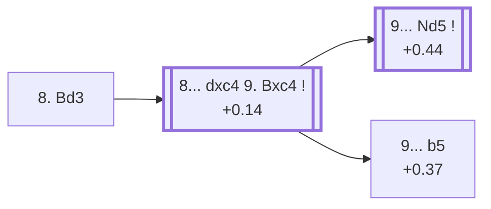

<a name="_TOP_"></a>

# D66 Queen's Gambit Declined: Bd3 Line <br> 1. d4 d5 2. c4 e6 3. Nc3 Nf6 4. Bg5 Be7 5. e3 O-O 6. Nf3 Nbd7 7. Rc1 c6 8. Bd3 #

Spun off from [D63's own "7... c6" card](https://github.com/onclemarcel/chess_flashcards/blob/main/d4_openings/D63_Queens_Gambit_Declined_7Rc1.md#_c6_) — masters' overwhelming main try there (74.2%), the actual main trunk of this whole batch. `eco.md`'s name matches the live explorer here: the ***Bd3 Line***. This is the deepest sub-tree of the whole D60-D69 batch: six more named `eco.md` codes (D66's own second entry plus all of D67-D69) hang off this one root.

### Overview

*Quick map of every move covered on this card — see the [shape key](https://github.com/onclemarcel/chess_flashcards/blob/main/start.md#content-diagram-optional) in start.md.*

<!-- content-diagram:start -->

<!-- content-diagram:end -->

<a name="_initial_move_"></a>

[](https://lichess.org/analysis/standard/r1bq1rk1/pp1nbppp/2p1pn2/3p2B1/2PP4/2NBPN2/PP3PPP/2RQK2R_b_K_-_1_8)

*... 8. Bd3 — Bd3 Line*

```
r1bq1rk1/pp1nbppp/2p1pn2/3p2B1/2PP4/2NBPN2/PP3PPP/2RQK2R b K - 1 8
```

|  | +0.11 |
| --- | --- |

<!-- lichess-stats:start fen="r1bq1rk1/pp1nbppp/2p1pn2/3p2B1/2PP4/2NBPN2/PP3PPP/2RQK2R b K - 1 8" db="lichess,masters" speeds="bullet,blitz" ratings="1800,2000,2200,2500" moves="6" -->
| Move | Online | W/D/B | Masters | W/D/B | |
| :--- | ---: | :--- | ---: | :--- | :-- |
| dxc4 | 79 k (37.8%) | ⬜⬜⬜⬜⬜🟫⬛⬛⬛⬛ 51/7/43 | 717 (69.7%) | ⬜⬜⬜🟫🟫🟫🟫🟫🟫⬛ 33/59/8 |  |
| h6 | 48 k (23.0%) | ⬜⬜⬜⬜⬜🟫⬛⬛⬛⬛ 54/6/40 | 129 (12.5%) | ⬜⬜⬜🟫🟫🟫🟫🟫🟫⬛ 28/61/11 |  |
| Re8 | 29 k (13.8%) | ⬜⬜⬜⬜⬜🟫⬛⬛⬛⬛ 52/5/42 | 52 (5.1%) | ⬜⬜⬜⬜⬜⬜🟫🟫🟫⬛ 60/29/12 |  |
| b6 | 23 k (11.1%) | ⬜⬜⬜⬜⬜🟫⬛⬛⬛⬛ 51/6/43 | 44 (4.3%) | ⬜⬜⬜⬜🟫🟫🟫🟫⬛⬛ 36/39/25 |  |
| a6 | 16 k (7.8%) | ⬜⬜⬜⬜⬜🟫⬛⬛⬛⬛ 52/6/42 | 83 (8.1%) | ⬜⬜⬜⬜🟫🟫🟫🟫🟫⬛ 34/53/13 |  |
| Nb6 | 2.2 k (1.1%) | ⬜⬜⬜⬜⬜⬜⬛⬛⬛⬛ 57/4/39 | 0 | — | ⚠ |
| Ne8 | 0 | — | 3 (0.3%) | — |  |

*Online: bullet/blitz, 1800+ — 208 k games. Masters: 1.0 k games. [Open in the explorer](https://lichess.org/analysis/standard/r1bq1rk1/pp1nbppp/2p1pn2/3p2B1/2PP4/2NBPN2/PP3PPP/2RQK2R_b_K_-_1_8#explorer) — updated 2026-09-09*
<!-- lichess-stats:end -->

Develops the bishop straight to its most active diagonal instead of the queen. Masters' clear main try is **8... dxc4** (69.7%), releasing the central tension — covered below, and the trunk feeding the deepest sub-tree of this whole batch. **8... h6** (12.5%), **8... a6** (8.1%), **8... Re8** (5.1%) and **8... b6** (4.3%) are all real, secondary tries with no code of their own in this range.

* [**8... dxc4**](#_dxc4_) (+0.14, 69.7% masters): see below.
* **8... h6** (12.5% masters), **8... a6** (8.1%), **8... Re8** (5.1%), **8... b6** (4.3%): all real, secondary tries with no code of their own in this range.

[*Back to TOP*](#_TOP_)

---

<a name="_dxc4_"></a>

## 8... dxc4 9. Bxc4

[](https://lichess.org/analysis/standard/r1bq1rk1/pp1nbppp/2p1pn2/6B1/2BP4/2N1PN2/PP3PPP/2RQK2R_b_K_-_0_9)

*... 8... dxc4 9. Bxc4*

```
r1bq1rk1/pp1nbppp/2p1pn2/6B1/2BP4/2N1PN2/PP3PPP/2RQK2R b K - 0 9
```

|  | +0.14 |
| --- | --- |

<!-- lichess-stats:start fen="r1bq1rk1/pp1nbppp/2p1pn2/6B1/2BP4/2N1PN2/PP3PPP/2RQK2R b K - 0 9" db="lichess,masters" speeds="bullet,blitz" ratings="1800,2000,2200,2500" moves="4" -->
| Move | Online | W/D/B | Masters | W/D/B | |
| :--- | ---: | :--- | ---: | :--- | :-- |
| b5 | 46 k (54.6%) | ⬜⬜⬜⬜⬜🟫⬛⬛⬛⬛ 50/6/43 | 66 (9.1%) | ⬜⬜⬜⬜⬜🟫🟫🟫🟫⬛ 45/44/11 |  |
| Nd5 | 23 k (27.5%) | ⬜⬜⬜⬜⬜🟫⬛⬛⬛⬛ 49/8/43 | 611 (84.4%) | ⬜⬜⬜🟫🟫🟫🟫🟫🟫⬛ 32/61/7 |  |
| Nb6 | 6.2 k (7.3%) | ⬜⬜⬜⬜⬜⬜⬛⬛⬛⬛ 56/5/39 | 0 | — | ⚠ |
| c5 | 1.9 k (2.2%) | ⬜⬜⬜⬜⬜🟫⬛⬛⬛⬛ 49/7/45 | 10 (1.4%) | — |  |
| h6 | 0 | — | 21 (2.9%) | ⬜⬜🟫🟫🟫🟫🟫🟫⬛⬛ 24/62/14 |  |

*Online: bullet/blitz, 1800+ — 85 k games. Masters: 724 games. [Open in the explorer](https://lichess.org/analysis/standard/r1bq1rk1/pp1nbppp/2p1pn2/6B1/2BP4/2N1PN2/PP3PPP/2RQK2R_b_K_-_0_9#explorer) — updated 2026-09-09*
<!-- lichess-stats:end -->

White's recapture is essentially forced (100% masters, 99.5% online — confirmed live), so this node compresses the two plies into one, mirroring D63's own "7...b6 8.cxd5 exd5" compression and the D49 Rellstab Attack precedent. Left completely untagged live (`opening=None`) at this exact node. **A genuine, large online/masters inversion, worth flagging plainly**: masters overwhelmingly continue **9... Nd5** (84.4%), heading straight for the *Capablanca freeing manoeuvre* — its own code, D67 — while online play instead strongly favours the quieter **9... b5** (only 27.5% online for Nd5, against 54.6% online for b5). **9... h6** (2.9% masters) is a real, secondary try with no code of its own in this range.

* [**9... Nd5**](https://github.com/onclemarcel/chess_flashcards/blob/main/d4_openings/D67_Queens_Gambit_Declined_Bd3_Line_Capablanca.md) (+0.44, 84.4% masters, 27.5% online): the *Capablanca freeing manoeuvre* — its own code, D67.
* [**9... b5**](#_Fianchetto_) (+0.37, 9.1% masters, 54.6% online): the *Fianchetto Variation* — covered below, masters' distant second choice despite dominating online play.

[*Back to 8. Bd3*](#_initial_move_)
[*Back to TOP*](#_TOP_)

---

<a name="_Fianchetto_"></a>

## 9... b5 — Bd3 Line, Fianchetto Variation

[](https://lichess.org/analysis/standard/r1bq1rk1/p2nbppp/2p1pn2/1p4B1/2BP4/2N1PN2/PP3PPP/2RQK2R_w_K_b6_0_10)

*... 9... b5 — Fianchetto Variation*

```
r1bq1rk1/p2nbppp/2p1pn2/1p4B1/2BP4/2N1PN2/PP3PPP/2RQK2R w K b6 0 10
```

|  | +0.37 |
| --- | --- |

`eco.md`'s name matches the live explorer here. Gains queenside space and hits the bishop, keeping the position closed rather than freeing the knight — a real, secondary try (9.1% masters) that dominates online play instead (54.6%), a large inversion already flagged one section above. Sibling of the whole D67-D69 tree under the "9.Bxc4" fork, not a step on the way to it. Not built out further here (backlog).

[*Back to 8... dxc4 9. Bxc4*](#_dxc4_)
[*Back to TOP*](#_TOP_)
