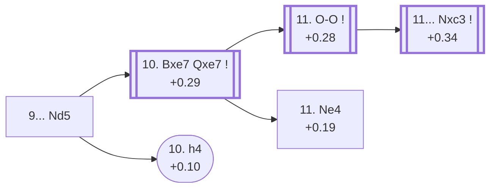

<a name="_TOP_"></a>

# D67 Queen's Gambit Declined: Bd3 Line, Capablanca System <br> 1. d4 d5 2. c4 e6 3. Nc3 Nf6 4. Bg5 Be7 5. e3 O-O 6. Nf3 Nbd7 7. Rc1 c6 8. Bd3 dxc4 9. Bxc4 Nd5 #

Spun off from [D66's own "8...dxc4 9.Bxc4" card](https://github.com/onclemarcel/chess_flashcards/blob/main/d4_openings/D66_Queens_Gambit_Declined_Bd3_Line.md#_dxc4_) — masters' overwhelming main try there (84.4%), against online play's own preference for the Fianchetto Variation instead. `eco.md` names this entry "Bd3 line, Capablanca freeing manoevre"; the live explorer gives it a genuinely different name, not just a shortened form of the same words — the ***Capablanca System***. This card holds the single deepest chain in the whole D60-D69 batch, running all the way to D69 at move 15.

### Overview

*Quick map of every move covered on this card — see the [shape key](https://github.com/onclemarcel/chess_flashcards/blob/main/start.md#content-diagram-optional) in start.md.*

<!-- content-diagram:start -->

<!-- content-diagram:end -->

<a name="_initial_move_"></a>

[](https://lichess.org/analysis/standard/r1bq1rk1/pp1nbppp/2p1p3/3n2B1/2BP4/2N1PN2/PP3PPP/2RQK2R_w_K_-_1_10)

*... 9... Nd5 — Capablanca System*

```
r1bq1rk1/pp1nbppp/2p1p3/3n2B1/2BP4/2N1PN2/PP3PPP/2RQK2R w K - 1 10
```

|  | +0.44 |
| --- | --- |

<!-- lichess-stats:start fen="r1bq1rk1/pp1nbppp/2p1p3/3n2B1/2BP4/2N1PN2/PP3PPP/2RQK2R w K - 1 10" db="lichess,masters" speeds="bullet,blitz" ratings="1800,2000,2200,2500" moves="3" -->
| Move | Online | W/D/B | Masters | W/D/B | |
| :--- | ---: | :--- | ---: | :--- | :-- |
| Bxe7 | 22 k (94.8%) | ⬜⬜⬜⬜⬜🟫⬛⬛⬛⬛ 49/8/43 | 598 (97.9%) | ⬜⬜⬜🟫🟫🟫🟫🟫🟫⬛ 31/62/7 |  |
| h4 | 490 (2.1%) | ⬜⬜⬜⬜⬜🟫⬛⬛⬛⬛ 50/5/45 | 11 (1.8%) | — |  |
| Bf4 | 192 (0.8%) | ⬜⬜⬜⬜⬜🟫⬛⬛⬛⬛ 48/8/43 | 2 (0.3%) | — | ⚠ |

*Online: bullet/blitz, 1800+ — 23 k games. Masters: 611 games. [Open in the explorer](https://lichess.org/analysis/standard/r1bq1rk1/pp1nbppp/2p1p3/3n2B1/2BP4/2N1PN2/PP3PPP/2RQK2R_w_K_-_1_10#explorer) — updated 2026-09-09*
<!-- lichess-stats:end -->

Frees the knight from f6 while sidestepping the bishop pin's own pressure — Capablanca's own practical solution. Masters' near-forced reply is **10. Bxe7** (97.9%), trading off immediately — covered below, and the launch point for the whole remaining spine of this batch. **10. h4** (only 1.8% masters, 2.1% online) is genuinely understudied everywhere, under both the masters and online floor of the shape key — covered below.

* [**10. Bxe7 Qxe7**](#_BdLine_) (+0.29, 97.9% masters): see below.
* [**10. h4**](#_Janowski_) (+0.10, 1.8% masters, 2.1% online — understudied everywhere): the *Janowski Variation* — covered below.

[*Back to TOP*](#_TOP_)

---

<a name="_Janowski_"></a>

## 10. h4 — Bd3 Line, Janowski Variation

[](https://lichess.org/analysis/standard/r1bq1rk1/pp1nbppp/2p1p3/3n2B1/2BP3P/2N1PN2/PP3PP1/2RQK2R_b_K_h3_0_10)

*... 10. h4 — Janowski Variation*

```
r1bq1rk1/pp1nbppp/2p1p3/3n2B1/2BP3P/2N1PN2/PP3PP1/2RQK2R b K h3 0 10
```

|  | +0.10 |
| --- | --- |

`eco.md`'s name matches the live explorer here — named for Dawid Janowski. A sharp, committal thrust at the kingside instead of resolving the bishop pin, genuinely understudied by both databases' own numbers (1.8% masters, 2.1% online, both under the shape key's own floor) rather than a blitz trap. Not built out further here (backlog).

[*Back to 9... Nd5*](#_initial_move_)
[*Back to TOP*](#_TOP_)

---

<a name="_BdLine_"></a>

## 10. Bxe7 Qxe7 — Bd3 Line

[](https://lichess.org/analysis/standard/r1b2rk1/pp1nqppp/2p1p3/3n4/2BP4/2N1PN2/PP3PPP/2RQK2R_w_K_-_0_11)

*... 10... Qxe7 — Bd3 Line*

```
r1b2rk1/pp1nqppp/2p1p3/3n4/2BP4/2N1PN2/PP3PPP/2RQK2R w K - 0 11
```

|  | +0.29 |
| --- | --- |

<!-- lichess-stats:start fen="r1b2rk1/pp1nqppp/2p1p3/3n4/2BP4/2N1PN2/PP3PPP/2RQK2R w K - 0 11" db="lichess,masters" speeds="bullet,blitz" ratings="1800,2000,2200,2500" moves="3" -->
| Move | Online | W/D/B | Masters | W/D/B | |
| :--- | ---: | :--- | ---: | :--- | :-- |
| O-O | 18 k (81.9%) | ⬜⬜⬜⬜⬜🟫⬛⬛⬛⬛ 49/9/42 | 380 (62.6%) | ⬜⬜⬜🟫🟫🟫🟫🟫🟫⬛ 28/63/9 |  |
| e4 | 1.3 k (5.8%) | ⬜⬜⬜⬜🟫⬛⬛⬛⬛⬛ 45/7/47 | 0 | — | ⚠ |
| Ne4 | 1.2 k (5.2%) | ⬜⬜⬜⬜⬜🟫⬛⬛⬛⬛ 53/10/37 | 213 (35.1%) | ⬜⬜⬜⬜🟫🟫🟫🟫🟫🟫 38/57/6 |  |
| Qd2 | 0 | — | 3 (0.5%) | — |  |

*Online: bullet/blitz, 1800+ — 22 k games. Masters: 607 games. [Open in the explorer](https://lichess.org/analysis/standard/r1b2rk1/pp1nqppp/2p1p3/3n4/2BP4/2N1PN2/PP3PPP/2RQK2R_w_K_-_0_11#explorer) — updated 2026-09-09*
<!-- lichess-stats:end -->

Live-tagged plain "Bd3 Line" — the same generic name D66's own root carries, an *expected*, consistent recurrence of `eco.md`'s own hierarchical "Bd3 line, X" sub-naming (the same shape already seen at D52's own Cambridge Springs Defence sub-entries in the prior batch), not a surprising collision the way the Capablanca System's own name divergence above is. Masters' clear main try is **11. O-O** (62.6%), simply castling — covered below, feeding D68. **11. Ne4** (35.1%) heads for the named *Alekhine Variation* below.

* [**11. O-O**](#_OO_) (+0.28, 62.6% masters): see below.
* [**11. Ne4**](#_Alekhine_) (+0.19, 35.1% masters): the *Alekhine Variation* — covered below.

[*Back to 9... Nd5*](#_initial_move_)
[*Back to TOP*](#_TOP_)

---

<a name="_Alekhine_"></a>

## 11. Ne4 — Bd3 Line, Alekhine Variation

[](https://lichess.org/analysis/standard/r1b2rk1/pp1nqppp/2p1p3/3n4/2BPN3/4PN2/PP3PPP/2RQK2R_b_K_-_1_11)

*... 11. Ne4 — Alekhine Variation*

```
r1b2rk1/pp1nqppp/2p1p3/3n4/2BPN3/4PN2/PP3PPP/2RQK2R b K - 1 11
```

|  | +0.19 |
| --- | --- |

`eco.md`'s name matches the live explorer here — named for Alexander Alekhine, and worth a light cross-reference: at least the third independent "Alekhine Variation" name reuse across this whole D-series sweep by now, after D51's own (D50-D59 batch) and D22's own (D20-D29 batch). Delays castling to hop the knight to e4 first, offering trades before committing the king. A real, secondary try (35.1% masters) to the more popular 11.O-O. Not built out further here (backlog).

[*Back to 10. Bxe7 Qxe7*](#_BdLine_)
[*Back to TOP*](#_TOP_)

---

<a name="_OO_"></a>

## 11. O-O

[](https://lichess.org/analysis/standard/r1b2rk1/pp1nqppp/2p1p3/3n4/2BP4/2N1PN2/PP3PPP/2RQ1RK1_b_-_-_1_11)

*... 11. O-O — Main Line*

```
r1b2rk1/pp1nqppp/2p1p3/3n4/2BP4/2N1PN2/PP3PPP/2RQ1RK1 b - - 1 11
```

|  | +0.28 |
| --- | --- |

<!-- lichess-stats:start fen="r1b2rk1/pp1nqppp/2p1p3/3n4/2BP4/2N1PN2/PP3PPP/2RQ1RK1 b - - 1 11" db="lichess,masters" speeds="bullet,blitz" ratings="1800,2000,2200,2500" moves="3" -->
| Move | Online | W/D/B | Masters | W/D/B | |
| :--- | ---: | :--- | ---: | :--- | :-- |
| Nxc3 | 19 k (61.2%) | ⬜⬜⬜⬜⬜🟫⬛⬛⬛⬛ 47/9/44 | 375 (88.2%) | ⬜⬜⬜🟫🟫🟫🟫🟫🟫⬛ 29/62/9 |  |
| N7f6 | 3.9 k (12.5%) | ⬜⬜⬜⬜⬜🟫⬛⬛⬛⬛ 53/6/41 | 0 | — | ⚠ |
| N7b6 | 2.4 k (7.8%) | ⬜⬜⬜⬜⬜🟫⬛⬛⬛⬛ 54/6/41 | 0 | — | ⚠ |
| Rd8 | 0 | — | 16 (3.8%) | — |  |
| b6 | 0 | — | 13 (3.1%) | — |  |

*Online: bullet/blitz, 1800+ — 31 k games. Masters: 425 games. [Open in the explorer](https://lichess.org/analysis/standard/r1b2rk1/pp1nqppp/2p1p3/3n4/2BP4/2N1PN2/PP3PPP/2RQ1RK1_b_-_-_1_11#explorer) — updated 2026-09-09*
<!-- lichess-stats:end -->

Live-tagged plain "Main Line" — the *third*, unrelated recurrence of this exact generic label in this batch (after D63's own root and D63's own "7...c6" node, two completely different positions), worth stating plainly. Masters' near-forced reply is **11... Nxc3** (88.2%), trading off the strong knight — covered on its own card, D68's *Classical Variation*.

* [**11... Nxc3**](https://github.com/onclemarcel/chess_flashcards/blob/main/d4_openings/D68_Queens_Gambit_Declined_Classical_Variation.md) (+0.34, 88.2% masters): the *Classical Variation* — its own code, D68.

[*Back to 10. Bxe7 Qxe7*](#_BdLine_)
[*Back to TOP*](#_TOP_)
