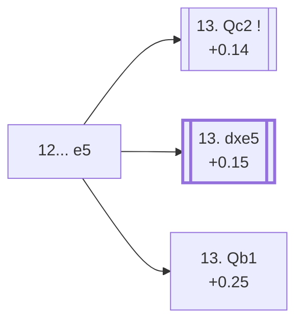

<a name="_TOP_"></a>

# D68 Queen's Gambit Declined: Classical Variation <br> 1. d4 d5 2. c4 e6 3. Nc3 Nf6 4. Bg5 Be7 5. e3 O-O 6. Nf3 Nbd7 7. Rc1 c6 8. Bd3 dxc4 9. Bxc4 Nd5 10. Bxe7 Qxe7 11. O-O Nxc3 12. Rxc3 e5 #

Spun off from [D67's own "11. O-O" card](https://github.com/onclemarcel/chess_flashcards/blob/main/d4_openings/D67_Queens_Gambit_Declined_Bd3_Line_Capablanca.md#_OO_) — masters' near-forced reply there (88.2%). `eco.md` compresses the whole recapture sequence (11...Nxc3 12.Rxc3) into this one entry, the same style already seen at D62's own "8.cd" node earlier in this batch; White's own 12.Rxc3 recapture is forced (the rook is the only piece that can retake on c3). `eco.md`'s name matches the live explorer here: the ***Classical Variation***.

### Overview

*Quick map of every move covered on this card — see the [shape key](https://github.com/onclemarcel/chess_flashcards/blob/main/start.md#content-diagram-optional) in start.md.*

<!-- content-diagram:start -->

<!-- content-diagram:end -->

<a name="_initial_move_"></a>

[](https://lichess.org/analysis/standard/r1b2rk1/pp1nqppp/2p5/4p3/2BP4/2R1PN2/PP3PPP/3Q1RK1_w_-_-_0_13)

*... 12... e5 — Classical Variation*

```
r1b2rk1/pp1nqppp/2p5/4p3/2BP4/2R1PN2/PP3PPP/3Q1RK1 w - - 0 13
```

|  | +0.34 |
| --- | --- |

<!-- lichess-stats:start fen="r1b2rk1/pp1nqppp/2p5/4p3/2BP4/2R1PN2/PP3PPP/3Q1RK1 w - - 0 13" db="lichess,masters" speeds="bullet,blitz" ratings="1800,2000,2200,2500" moves="6" -->
| Move | Online | W/D/B | Masters | W/D/B | |
| :--- | ---: | :--- | ---: | :--- | :-- |
| dxe5 | 6.3 k (48.0%) | ⬜⬜⬜⬜🟫⬛⬛⬛⬛⬛ 42/13/45 | 77 (23.8%) | ⬜🟫🟫🟫🟫🟫🟫🟫🟫🟫 13/84/3 |  |
| d5 | 1.7 k (13.4%) | ⬜⬜⬜⬜⬜🟫⬛⬛⬛⬛ 52/8/40 | 13 (4.0%) | — |  |
| Bb3 | 1.6 k (12.3%) | ⬜⬜⬜⬜⬜🟫⬛⬛⬛⬛ 53/9/39 | 75 (23.1%) | ⬜⬜⬜🟫🟫🟫🟫🟫🟫⬛ 32/61/7 |  |
| Qc2 | 1.0 k (7.7%) | ⬜⬜⬜⬜⬜🟫⬛⬛⬛⬛ 49/9/42 | 96 (29.6%) | ⬜⬜⬜⬜🟫🟫🟫🟫🟫🟫 35/59/5 |  |
| Re1 | 703 (5.4%) | ⬜⬜⬜⬜🟫⬛⬛⬛⬛⬛ 43/9/48 | 0 | — | ⚠ |
| Nxe5 | 490 (3.8%) | ⬜⬜⬜⬜🟫⬛⬛⬛⬛⬛ 44/8/48 | 29 (9.0%) | ⬜⬜🟫🟫🟫🟫🟫🟫🟫⬛ 17/69/14 |  |
| Qb1 | 0 | — | 18 (5.6%) | — |  |

*Online: bullet/blitz, 1800+ — 13 k games. Masters: 324 games. [Open in the explorer](https://lichess.org/analysis/standard/r1b2rk1/pp1nqppp/2p5/4p3/2BP4/2R1PN2/PP3PPP/3Q1RK1_w_-_-_0_13#explorer) — updated 2026-09-15*
<!-- lichess-stats:end -->

Strikes straight back at the centre, the point of trading off on c3 first. **A genuine, clean finding worth double-checking against `eco.md`'s own move list, as always in this batch**: masters' actual plurality here is **13. Qc2** (29.6%) — this *is* the *Vidmar Variation*, `eco.md`'s own second-named entry here, not an uncoded try, and it's ahead of both **13. dxe5** (23.8%, the *D69*-coded continuation, only masters' second choice) and **13. Qb1** (5.6%, the *Maroczy Variation* — the lowest-frequency of the three coded tries at this node despite being listed first in `eco.md`'s own entry order). **13. Bb3** (23.1% masters) is a real, secondary try with no code of its own in this range, nearly as common as 13.dxe5 — not to be confused with either named line above. This is the third instance in this batch of an `eco.md`-coded line trailing a rival at its own fork, after D60's own root and D64's own root.

* [**13. Qc2**](#_Vidmar_) (+0.14, 29.6% masters): the *Vidmar Variation* — masters' actual main try here, covered below.
* [**13. dxe5**](https://github.com/onclemarcel/chess_flashcards/blob/main/d4_openings/D69_Queens_Gambit_Declined_Classical_13de.md) (+0.15, 23.8% masters): its own code, D69 — the deepest, final line of the whole batch, but only masters' second choice at this exact fork.
* **13. Bb3** (23.1% masters): a real, secondary try with no code of its own in this range.
* [**13. Qb1**](#_Maroczy_) (+0.25, 5.6% masters): the *Maroczy Variation* — covered below, the least-played of the three coded tries here.

[*Back to TOP*](#_TOP_)

---

<a name="_Vidmar_"></a>

## 13. Qc2 — Classical, Vidmar Variation

[](https://lichess.org/analysis/standard/r1b2rk1/pp1nqppp/2p5/4p3/2BP4/2R1PN2/PPQ2PPP/5RK1_b_-_-_1_13)

*... 13. Qc2 — Vidmar Variation*

```
r1b2rk1/pp1nqppp/2p5/4p3/2BP4/2R1PN2/PPQ2PPP/5RK1 b - - 1 13
```

|  | +0.14 |
| --- | --- |

`eco.md`'s name matches the live explorer here — named for Milan Vidmar. Keeps the queen flexible on the c-file rather than resolving the centre, masters' actual most common choice at this fork (29.6%), ahead of both other named tries. Not built out further here (backlog).

[*Back to 12... e5*](#_initial_move_)
[*Back to TOP*](#_TOP_)

---

<a name="_Maroczy_"></a>

## 13. Qb1 — Classical, Maroczy Variation

[](https://lichess.org/analysis/standard/r1b2rk1/pp1nqppp/2p5/4p3/2BP4/2R1PN2/PP3PPP/1Q3RK1_b_-_-_1_13)

*... 13. Qb1 — Maroczy Variation*

```
r1b2rk1/pp1nqppp/2p5/4p3/2BP4/2R1PN2/PP3PPP/1Q3RK1 b - - 1 13
```

|  | +0.25 |
| --- | --- |

`eco.md`'s name matches the live explorer here — named for Géza Maróczy. Tucks the queen onto the long diagonal's own back rank, eyeing a future b3/Bb2 regrouping. `eco.md` lists this entry first among the three named tries at this fork, but it's actually the least-played of the three in practice (5.6% masters) — worth stating plainly. Not built out further here (backlog).

[*Back to 12... e5*](#_initial_move_)
[*Back to TOP*](#_TOP_)
