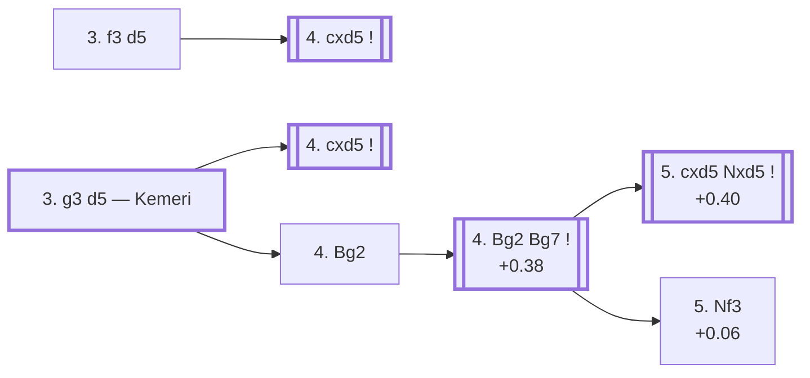

<a name="_TOP_"></a>

# D70 Neo-Grünfeld Defence <br> 1. d4 Nf6 2. c4 g6 3. f3 d5 / 3. g3 d5 #

Spun off from [A40's 1... Nf6 2. c4 g6 note](https://github.com/onclemarcel/chess_flashcards/blob/main/d4_openings/A40_QPG.md#_Nf6_c4_g6_), which asserted White's 3. Nc3 share (80.0% masters) in prose without ever showing a real stats table for the alternatives — a genuine zero-coverage gap surfaced by a full A00-E99 ECO-code audit, covering all twelve D70-D79 codes (this session's own D70-D79 batch, the first of three planned sub-batches through D99). `eco.md` lists **two** independent entries under D70, not one: the bare **3. f3 d5** and the fianchetto **3. g3 d5**, nicknamed the ***Kemeri*** Variation. They don't share a parent position beyond A40's own "2... g6" fork (see the cross-linked table there for White's full 3rd-move spread: Nc3 80.0% / g3 8.7% / Nf3 7.8% / f3 2.8% / e3 2.4%⚠), so both get their own full treatment below rather than one being folded into a NOTE on the other.

**A retrofit, not a fresh build, worth stating plainly**: this file predates the current systematic D-series sweep — it already covered the Kemeri line (3. g3 d5) with sound, live-verified content before this batch started (an earlier zero-coverage audit had built it directly off the A40 gap above). This batch modernised its wrapper (added the Overview diagram and shape classifications, matching the current template) and added the missing 3. f3 d5 entry, but kept its genuinely good prior analysis and its already-verified "the D71 code starts later than the practical branch point" finding intact rather than redoing that legwork.

### Overview

*Quick map of every move covered on this card — see the [shape key](https://github.com/onclemarcel/chess_flashcards/blob/main/start.md#content-diagram-optional) in start.md.*

<!-- content-diagram:start -->

<!-- content-diagram:end -->

---

> [!NOTE]
> **3. f3 d5** — the bare, un-nicknamed Neo-Grünfeld Defence entry, `eco.md`'s own first D70 listing.
>
> <a name="_f3_"></a>
>
> ### 3. f3 d5
>
> [](https://lichess.org/analysis/standard/rnbqkb1r/ppp1pp1p/5np1/3p4/2PP4/5P2/PP2P1PP/RNBQKBNR_w_KQkq_d6_0_4)
>
> *... 1. d4 Nf6 2. c4 g6 3. f3 d5*
>
> ```
> rnbqkb1r/ppp1pp1p/5np1/3p4/2PP4/5P2/PP2P1PP/RNBQKBNR w KQkq d6 0 4
> ```
>
> |  | +0.32 |
> | --- | --- |
>
> <!-- lichess-stats:start fen="rnbqkb1r/ppp1pp1p/5np1/3p4/2PP4/5P2/PP2P1PP/RNBQKBNR w KQkq d6 0 4" db="lichess,masters" speeds="bullet,blitz" ratings="1800,2000,2200,2500" moves="4" -->
> | Move | Online | W/D/B | Masters | W/D/B | |
> | :--- | ---: | :--- | ---: | :--- | :-- |
> | cxd5 | 75 k (88.7%) | ⬜⬜⬜⬜⬜🟫⬛⬛⬛⬛ 51/5/44 | 1.3 k (99.9%) | ⬜⬜⬜⬜🟫🟫🟫🟫⬛⬛ 38/42/20 |  |
> | Nc3 | 4.3 k (5.1%) | ⬜⬜⬜⬜⬜⬛⬛⬛⬛⬛ 47/5/49 | 1 (0.1%) | — | ⚠ |
> | e4 | 3.1 k (3.6%) | ⬜⬜⬜⬜🟫⬛⬛⬛⬛⬛ 41/5/54 | 0 | — | ⚠ |
> | e3 | 819 (1.0%) | ⬜⬜⬜⬜🟫⬛⬛⬛⬛⬛ 39/7/54 | 0 | — | ⚠ |
> 
> *Online: bullet/blitz, 1800+ — 85 k games. Masters: 1.3 k games. [Open in the explorer](https://lichess.org/analysis/standard/rnbqkb1r/ppp1pp1p/5np1/3p4/2PP4/5P2/PP2P1PP/RNBQKBNR_w_KQkq_d6_0_4#explorer) — updated 2026-09-15*
> <!-- lichess-stats:end -->
>
> Live-tagged **D70 · Neo-Grünfeld Defense: Goglidze Attack** — 3. f3 pre-commits the f-pawn to support a coming e4, a slower echo of the Sämisch idea against the King's Indian. Masters treat White's reply as essentially automatic: **4. cxd5** is played in 1,328 of 1,329 sampled masters games (99.9%), so this whole entry compresses to a single node rather than a further fork — the only real alternative, 4. Nc3, is a single-game rarity. A real, secondary try with no code of its own past this point in this range; not built out further here (backlog, and genuinely thin theory besides this near-forced capture).
>
> [*Back to TOP*](#_TOP_)

---

<a name="_initial_move_"></a>

## 3. g3 d5 — Kemeri

Instead of committing the king's knight to c3 immediately, White fianchettoes first; if Black answers with the same central strike used against the classical Grünfeld (... d5), the resulting positions carry White's g3/Bg2 setup a move earlier than the classical Grünfeld's own Exchange Variation — hence "Neo." This is the trunk feeding the whole D71-D79 tree below.

**A naming precision worth stating up front, verified live rather than assumed**: the D70-D79 code range doesn't attach all the way down the tree — Lichess's own explorer tags this exact position **D70** ("Neo-Grünfeld Defense: with g3"), but two plies later, once White fianchettoes and Black replies ... Bg7 without yet resolving the central tension, the tag reverts to the generic King's Indian/Grünfeld umbrella (**E60**, "Grünfeld Defense: Counterthrust Variation") — the Neo-Grünfeld-specific codes (D71/D73) only resume once White actually commits to 5. cxd5 or 5. Nf3. The same "the code can start a few plies after the practical branch point" pattern already documented for the Richter-Veresov Attack (`D01_Richter_Veresov_Attack.md`), preserved here from this file's own pre-sweep finding.

[](https://lichess.org/analysis/standard/rnbqkb1r/ppp1pp1p/5np1/3p4/2PP4/6P1/PP2PP1P/RNBQKBNR_w_KQkq_d6_0_4)

*... 1. d4 Nf6 2. c4 g6 3. g3 d5*

```
rnbqkb1r/ppp1pp1p/5np1/3p4/2PP4/6P1/PP2PP1P/RNBQKBNR w KQkq d6 0 4
```

|  | +0.20 |
| --- | --- |

<!-- lichess-stats:start fen="rnbqkb1r/ppp1pp1p/5np1/3p4/2PP4/6P1/PP2PP1P/RNBQKBNR w KQkq d6 0 4" db="lichess,masters" speeds="bullet,blitz" ratings="1800,2000,2200,2500" moves="4" -->
| Move | Online | W/D/B | Masters | W/D/B | |
| :--- | ---: | :--- | ---: | :--- | :-- |
| Bg2 | 58 k (60.2%) | ⬜⬜⬜⬜⬜🟫⬛⬛⬛⬛ 50/6/45 | 44 (15.7%) | ⬜⬜⬜🟫🟫🟫🟫⬛⬛⬛ 30/36/34 |  |
| cxd5 | 30 k (30.9%) | ⬜⬜⬜⬜⬜🟫⬛⬛⬛⬛ 51/7/42 | 231 (82.5%) | ⬜⬜⬜⬜🟫🟫🟫🟫🟫⬛ 35/50/14 |  |
| Nf3 | 5.6 k (5.8%) | ⬜⬜⬜⬜⬜🟫⬛⬛⬛⬛ 49/6/44 | 5 (1.8%) | — |  |
| Nc3 | 1.5 k (1.6%) | ⬜⬜⬜⬜⬜⬛⬛⬛⬛⬛ 49/5/46 | 0 | — | ⚠ |

*Online: bullet/blitz, 1800+ — 96 k games. Masters: 280 games. [Open in the explorer](https://lichess.org/analysis/standard/rnbqkb1r/ppp1pp1p/5np1/3p4/2PP4/6P1/PP2PP1P/RNBQKBNR_w_KQkq_d6_0_4#explorer) — updated 2026-09-15*
<!-- lichess-stats:end -->

> [!NOTE]
> **3... d5** is a genuine minority pick after 3. g3 — only a small slice of masters games, well behind **3... Bg7**, which simply transposes into the generic King's Indian Fianchetto complex instead of Neo-Grünfeld theory. Real, but rare: worth knowing it exists rather than expecting to face it often. Sample sizes from here on are small (low hundreds of masters games, sometimes tens) since this whole branch is a minority choice off an already-minority choice — read the percentages as directional, not precise.

**4. cxd5** is masters' clear main try (82.5%) — capturing immediately, before Black's bishop even reaches g7, rather than developing the bishop first. This is worth stating plainly since it's easy to assume the fianchetto comes first: **4. Bg2** (15.7%) is real but clearly secondary, and is `eco.md`'s own listed move order into D71/D73. **4. Nf3** (1.8%) and **4. Nc3** (0%⚠, a real online-only try) are minor, uncoded tries — backlog.

* [**4. cxd5**](#_cxd5_) (+0.20, 82.5% masters): see below — verified to transpose into the same D71 tabiya as `eco.md`'s own move order.
* [**4. Bg2**](#_Bg2_) (+0.20, 15.7% masters): `eco.md`'s own listed order — see below.
* **4. Nf3** (1.8% masters), **4. Nc3** (0% masters, 1.6% online ⚠): real, secondary tries with no code of their own in this range.

[*Back to TOP*](#_TOP_)

---

<a name="_cxd5_"></a>

## 4. cxd5 Nxd5 5. Bg2 Bg7 — a verified transposition into D71

[](https://lichess.org/analysis/standard/rnbqk2r/ppp1ppbp/6p1/3n4/3P4/6P1/PP2PPBP/RNBQK1NR_w_KQkq_-_2_6)

*... 4. cxd5 Nxd5 5. Bg2 Bg7*

```
rnbqk2r/ppp1ppbp/6p1/3n4/3P4/6P1/PP2PPBP/RNBQK1NR w KQkq - 2 6
```

**4... Nxd5** is masters' clear main try (88.8%) — recapturing with the knight to keep the position simple; **5. Bg2** (90.2%) completes the fianchetto, and **5... Bg7** (90.9%) matches it. This reaches the exact same tabiya as `eco.md`'s own listed order (4. Bg2 Bg7 5. cxd5 Nxd5), confirmed via `tools/apply_san.py` — an identical FEN in every field but the halfmove-clock (which differs only because the two capture-plies land at a different point in the move sequence, not because the position itself differs). A harmless move-order transposition, not duplicated content: continue on [D71's own file](https://github.com/onclemarcel/chess_flashcards/blob/main/d4_openings/D71_Neo_Grunfeld_Exchange_Variation.md), which uses `eco.md`'s canonical move order throughout.

[*Back to 3. g3 d5*](#_initial_move_)
[*Back to TOP*](#_TOP_)

---

<a name="_Bg2_"></a>

## 4. Bg2 Bg7 — the shared D71/D73 fork point

[](https://lichess.org/analysis/standard/rnbqk2r/ppp1ppbp/5np1/3p4/2PP4/6P1/PP2PPBP/RNBQK1NR_w_KQkq_-_2_5)

*... 4. Bg2 Bg7 — Grünfeld Defense: Counterthrust Variation*

```
rnbqk2r/ppp1ppbp/5np1/3p4/2PP4/6P1/PP2PPBP/RNBQK1NR w KQkq - 2 5
```

|  | +0.38 |
| --- | --- |

<!-- lichess-stats:start fen="rnbqk2r/ppp1ppbp/5np1/3p4/2PP4/6P1/PP2PPBP/RNBQK1NR w KQkq - 2 5" db="lichess,masters" speeds="bullet,blitz" ratings="1800,2000,2200,2500" moves="4" -->
| Move | Online | W/D/B | Masters | W/D/B | |
| :--- | ---: | :--- | ---: | :--- | :-- |
| cxd5 | 36 k (38.6%) | ⬜⬜⬜⬜⬜🟫⬛⬛⬛⬛ 50/6/43 | 2.3 k (89.7%) | ⬜⬜⬜🟫🟫🟫🟫🟫⬛⬛ 31/51/18 |  |
| Nf3 | 34 k (36.8%) | ⬜⬜⬜⬜⬜🟫⬛⬛⬛⬛ 49/6/45 | 226 (8.9%) | ⬜⬜⬜🟫🟫🟫🟫🟫⬛⬛ 34/45/21 |  |
| Nc3 | 18 k (19.2%) | ⬜⬜⬜⬜⬜🟫⬛⬛⬛⬛ 50/5/45 | 32 (1.3%) | ⬜⬜⬜🟫🟫🟫⬛⬛⬛⬛ 25/34/41 |  |
| e3 | 1.4 k (1.5%) | ⬜⬜⬜⬜⬜⬛⬛⬛⬛⬛ 45/5/50 | 2 (0.1%) | — | ⚠ |

*Online: bullet/blitz, 1800+ — 94 k games. Masters: 2.5 k games. [Open in the explorer](https://lichess.org/analysis/standard/rnbqk2r/ppp1ppbp/5np1/3p4/2PP4/6P1/PP2PPBP/RNBQK1NR_w_KQkq_-_2_5#explorer) — updated 2026-09-15*
<!-- lichess-stats:end -->

**4. Bg2 Bg7** (+0.38) is still live-tagged **E60** here, not D71 or D73 — the central tension (c4/d5) hasn't been resolved yet, so the generic King's Indian/Grünfeld umbrella still applies. White's own next move decides which Neo-Grünfeld code the game actually enters: **5. cxd5 Nxd5** (+0.40) is the overwhelming main try (89.7% masters) and heads into the [Exchange Variation, D71](https://github.com/onclemarcel/chess_flashcards/blob/main/d4_openings/D71_Neo_Grunfeld_Exchange_Variation.md); **5. Nf3** (+0.06, 8.9% masters) delays the capture and heads into [D73](https://github.com/onclemarcel/chess_flashcards/blob/main/d4_openings/D73_Neo_Grunfeld_Nf3.md) instead; **5. Nc3** (1.3% masters) is a real, secondary try with no code of its own in this range.

* [**5. cxd5 Nxd5**](https://github.com/onclemarcel/chess_flashcards/blob/main/d4_openings/D71_Neo_Grunfeld_Exchange_Variation.md) (+0.40, 89.7% masters): the Exchange Variation — its own code, D71.
* [**5. Nf3**](https://github.com/onclemarcel/chess_flashcards/blob/main/d4_openings/D73_Neo_Grunfeld_Nf3.md) (+0.06, 8.9% masters): its own code, D73.
* **5. Nc3** (1.3% masters): a real, secondary try with no code of its own in this range.

[*Back to 3. g3 d5*](#_initial_move_)
[*Back to TOP*](#_TOP_)
