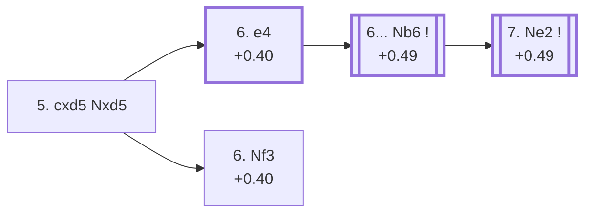

<a name="_TOP_"></a>

# D71 Neo-Grünfeld Defense: Exchange Variation <br> 1. d4 Nf6 2. c4 g6 3. g3 d5 4. Bg2 Bg7 5. cxd5 Nxd5 #

Continues from [D70's own Kemeri fork](https://github.com/onclemarcel/chess_flashcards/blob/main/d4_openings/D70_Neo_Grunfeld_Defense.md#_Bg2_), where White's **5. cxd5** (89.7% masters) is the overwhelming choice at the still-E60-tagged "4... Bg7" position. This is the position where the D71 code genuinely begins — a finding already established before this batch's own sweep and preserved here rather than re-derived: the tension-holding "4... Bg7" node one ply earlier stays E60, and only resolving the capture actually earns the Neo-Grünfeld-specific tag.

**A verified transposition worth restating**: [D70's own "4. cxd5" section](https://github.com/onclemarcel/chess_flashcards/blob/main/d4_openings/D70_Neo_Grunfeld_Defense.md#_cxd5_) shows White capturing immediately instead (4. cxd5 Nxd5 5. Bg2 Bg7) — masters' actual more popular order at the parent fork (82.5% vs 15.7%). Confirmed via `tools/apply_san.py` to reach the exact same position as this page's own root, field for field except the halfmove clock. This page uses `eco.md`'s own listed order (Bg2/Bg7 first, capture on move 5) throughout.

### Overview

*Quick map of every move covered on this card — see the [shape key](https://github.com/onclemarcel/chess_flashcards/blob/main/start.md#content-diagram-optional) in start.md.*

<!-- content-diagram:start -->

<!-- content-diagram:end -->

<a name="_initial_move_"></a>

[](https://lichess.org/analysis/standard/rnbqk2r/ppp1ppbp/6p1/3n4/3P4/6P1/PP2PPBP/RNBQK1NR_w_KQkq_-_0_6)

*... 4. Bg2 Bg7 5. cxd5 Nxd5 — Neo-Grünfeld Defense: Exchange Variation*

```
rnbqk2r/ppp1ppbp/6p1/3n4/3P4/6P1/PP2PPBP/RNBQK1NR w KQkq - 0 6
```

|  | +0.40 |
| --- | --- |

<!-- lichess-stats:start fen="rnbqk2r/ppp1ppbp/6p1/3n4/3P4/6P1/PP2PPBP/RNBQK1NR w KQkq - 0 6" db="lichess,masters" speeds="bullet,blitz" ratings="1800,2000,2200,2500" moves="4" -->
| Move | Online | W/D/B | Masters | W/D/B | |
| :--- | ---: | :--- | ---: | :--- | :-- |
| e4 | 22 k (40.2%) | ⬜⬜⬜⬜⬜🟫⬛⬛⬛⬛ 50/6/44 | 1.2 k (49.9%) | ⬜⬜⬜⬜🟫🟫🟫🟫⬛⬛ 37/46/17 |  |
| Nf3 | 20 k (35.6%) | ⬜⬜⬜⬜⬜🟫⬛⬛⬛⬛ 53/7/40 | 1.2 k (47.5%) | ⬜⬜⬜🟫🟫🟫🟫🟫⬛⬛ 26/56/18 |  |
| Nc3 | 12 k (20.8%) | ⬜⬜⬜⬜⬜🟫⬛⬛⬛⬛ 48/7/45 | 63 (2.5%) | ⬜⬜🟫🟫🟫🟫🟫⬛⬛⬛ 22/44/33 |  |
| e3 | 1.2 k (2.1%) | ⬜⬜⬜⬜🟫⬛⬛⬛⬛⬛ 45/6/48 | 1 (0.0%) | — | ⚠ |

*Online: bullet/blitz, 1800+ — 56 k games. Masters: 2.5 k games. [Open in the explorer](https://lichess.org/analysis/standard/rnbqk2r/ppp1ppbp/6p1/3n4/3P4/6P1/PP2PPBP/RNBQK1NR_w_KQkq_-_0_6#explorer) — updated 2026-09-09*
<!-- lichess-stats:end -->

Masters split almost evenly between **6. e4** (49.9%, claiming the centre immediately, kicking the knight) and **6. Nf3** (47.5%, developing first and keeping the e-pawn flexible) — a genuine near-even fork with no dominant try. Sample sizes stay reasonable here (2.5k masters games), but the fork itself is real, not noise.

* [**6. e4**](#_e4_) (+0.40, 49.9% masters): claims the centre at once — built one ply further below, the trunk feeding D72.
* **6. Nf3** (+0.40, 47.5% masters): the quieter approach — a real, near-equally-popular sibling with no code of its own in this range; not built out further here (backlog — its own extensive body of theory is outside this batch's scope).
* **6. Nc3** (2.5% masters): a real, secondary try with no code of its own in this range.

[*Back to TOP*](#_TOP_)

---

<a name="_e4_"></a>

## 6. e4 Nb6 7. Ne2

[](https://lichess.org/analysis/standard/rnbqk2r/ppp1ppbp/1n4p1/8/3PP3/6P1/PP2NPBP/RNBQK2R_b_KQkq_-_2_7)

*... 6. e4 Nb6 7. Ne2 — Neo-Grünfeld Defense: with g3, Main line*

```
rnbqk2r/ppp1ppbp/1n4p1/8/3PP3/6P1/PP2NPBP/RNBQK2R b KQkq - 2 7
```

|  | +0.49 |
| --- | --- |

<!-- lichess-stats:start fen="rnbqk2r/ppp1ppbp/1n4p1/8/3PP3/6P1/PP2NPBP/RNBQK2R b KQkq - 2 7" db="lichess,masters" speeds="bullet,blitz" ratings="1800,2000,2200,2500" moves="4" -->
| Move | Online | W/D/B | Masters | W/D/B | |
| :--- | ---: | :--- | ---: | :--- | :-- |
| O-O | 13 k (69.9%) | ⬜⬜⬜⬜⬜🟫⬛⬛⬛⬛ 50/7/43 | 318 (30.2%) | ⬜⬜⬜⬜⬜🟫🟫🟫⬛⬛ 50/32/18 |  |
| c5 | 2.3 k (12.3%) | ⬜⬜⬜⬜⬜🟫⬛⬛⬛⬛ 47/7/46 | 600 (56.9%) | ⬜⬜⬜🟫🟫🟫🟫🟫⬛⬛ 33/51/16 |  |
| Nc6 | 1.7 k (9.4%) | ⬜⬜⬜⬜⬜🟫⬛⬛⬛⬛ 49/6/45 | 27 (2.6%) | ⬜⬜⬜⬜🟫🟫🟫🟫🟫⬛ 37/52/11 |  |
| Bg4 | 756 (4.1%) | ⬜⬜⬜⬜⬜🟫⬛⬛⬛⬛ 52/5/43 | 0 | — | ⚠ |
| e5 | 0 | — | 88 (8.3%) | ⬜⬜⬜⬜⬜🟫🟫🟫🟫⬛ 47/41/12 |  |

*Online: bullet/blitz, 1800+ — 19 k games. Masters: 1.1 k games. [Open in the explorer](https://lichess.org/analysis/standard/rnbqk2r/ppp1ppbp/1n4p1/8/3PP3/6P1/PP2NPBP/RNBQK2R_b_KQkq_-_2_7#explorer) — updated 2026-09-09*
<!-- lichess-stats:end -->

Both intermediate plies are close to forced, so this node compresses them into one, mirroring the established convention for near-automatic sequences (D63's own "7...b6 8.cxd5 exd5", D66's "8...dxc4 9.Bxc4"): **6... Nb6** (84.4% masters) retreats the knight to safety rather than the more committal 6... Nb4 (15.5%), and **7. Ne2** (99.4% masters, essentially forced) develops the knight off the awkward g1-square without blocking the f-pawn. Left untagged live (`opening=None`) at both intermediate nodes — the D72 code doesn't attach until 7. Ne2 is actually on the board.

* [**6... Nb6 7. Ne2**](https://github.com/onclemarcel/chess_flashcards/blob/main/d4_openings/D72_Neo_Grunfeld_Exchange_Main_Line.md) (+0.49, 84.4%/99.4% masters): reaches the Main Line — its own code, D72.
* **6... Nb4** (15.5% masters): a real, secondary try with no code of its own in this range; not built out further here (backlog).

[*Back to 5. cxd5 Nxd5*](#_initial_move_)
[*Back to TOP*](#_TOP_)
