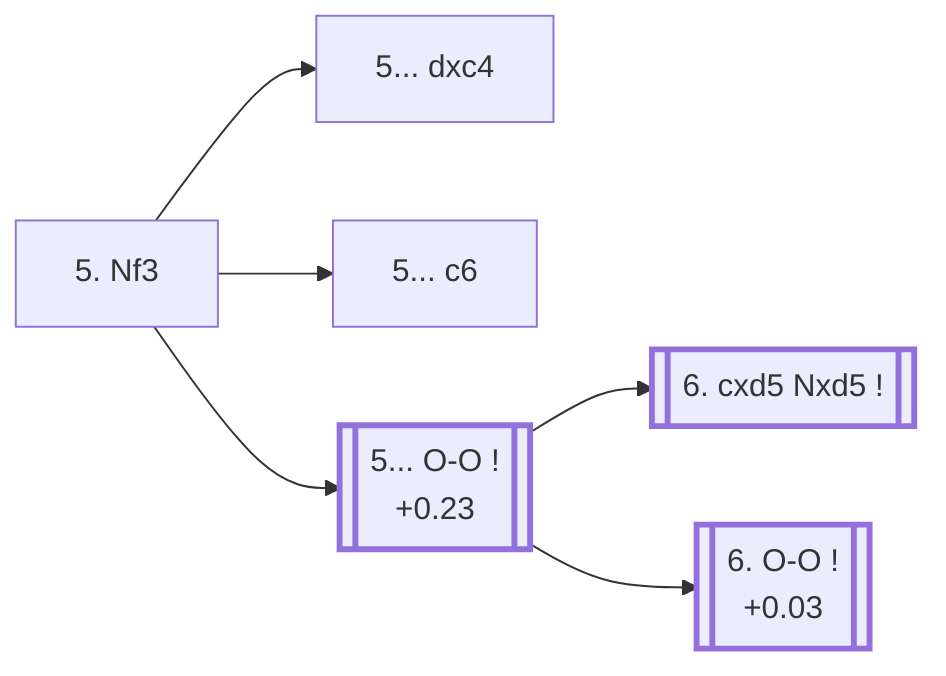

<a name="_TOP_"></a>

# D73 Neo-Grünfeld Defense: with g3, 5. Nf3 <br> 1. d4 Nf6 2. c4 g6 3. g3 d5 4. Bg2 Bg7 5. Nf3 #

Continues from [D70's own "4. Bg2 Bg7" fork](https://github.com/onclemarcel/chess_flashcards/blob/main/d4_openings/D70_Neo_Grunfeld_Defense.md#_Bg2_), where White's **5. Nf3** (8.9% masters) is the clear minority choice next to 5. cxd5's 89.7% share — but it's still the trunk feeding D74 through D79, the deepest and most heavily forked part of this whole batch. Live-tagged **D73**, "Neo-Grünfeld Defense: with g3" — the same generic name reused from D70's own root and D72's own tabiya, a third occurrence of this exact label at three unrelated depths.

### Overview

*Quick map of every move covered on this card — see the [shape key](https://github.com/onclemarcel/chess_flashcards/blob/main/start.md#content-diagram-optional) in start.md.*

<!-- content-diagram:start -->

<!-- content-diagram:end -->

<a name="_initial_move_"></a>

[](https://lichess.org/analysis/standard/rnbqk2r/ppp1ppbp/5np1/3p4/2PP4/5NP1/PP2PPBP/RNBQK2R_b_KQkq_-_3_5)

*... 4. Bg2 Bg7 5. Nf3 — Neo-Grünfeld Defense: with g3*

```
rnbqk2r/ppp1ppbp/5np1/3p4/2PP4/5NP1/PP2PPBP/RNBQK2R b KQkq - 3 5
```

|  | +0.06 |
| --- | --- |

<!-- lichess-stats:start fen="rnbqk2r/ppp1ppbp/5np1/3p4/2PP4/5NP1/PP2PPBP/RNBQK2R b KQkq - 3 5" db="lichess,masters" speeds="bullet,blitz" ratings="1800,2000,2200,2500" moves="6" -->
| Move | Online | W/D/B | Masters | W/D/B | |
| :--- | ---: | :--- | ---: | :--- | :-- |
| O-O | 170 k (61.4%) | ⬜⬜⬜⬜⬜🟫⬛⬛⬛⬛ 50/6/44 | 450 (21.6%) | ⬜⬜⬜🟫🟫🟫🟫🟫⬛⬛ 32/46/21 |  |
| c6 | 48 k (17.1%) | ⬜⬜⬜⬜⬜🟫⬛⬛⬛⬛ 51/7/43 | 754 (36.3%) | ⬜⬜⬜🟫🟫🟫🟫🟫🟫⬛ 30/58/12 |  |
| dxc4 | 42 k (15.1%) | ⬜⬜⬜⬜⬜🟫⬛⬛⬛⬛ 50/6/44 | 839 (40.4%) | ⬜⬜⬜🟫🟫🟫🟫🟫⬛⬛ 26/50/24 |  |
| c5 | 6.0 k (2.2%) | ⬜⬜⬜⬜⬜🟫⬛⬛⬛⬛ 52/5/43 | 19 (0.9%) | — |  |
| e6 | 5.0 k (1.8%) | ⬜⬜⬜⬜⬜🟫⬛⬛⬛⬛ 54/5/40 | 12 (0.6%) | — |  |
| Bg4 | 1.7 k (0.6%) | ⬜⬜⬜⬜⬜⬜⬛⬛⬛⬛ 55/5/40 | 0 | — | ⚠ |
| Nc6 | 0 | — | 5 (0.2%) | — |  |

*Online: bullet/blitz, 1800+ — 278 k games. Masters: 2.1 k games. [Open in the explorer](https://lichess.org/analysis/standard/rnbqk2r/ppp1ppbp/5np1/3p4/2PP4/5NP1/PP2PPBP/RNBQK2R_b_KQkq_-_3_5#explorer) — updated 2026-09-15*
<!-- lichess-stats:end -->

**A genuine, significant finding worth flagging plainly**: the move this whole D74-D79 tree actually needs (5... O-O) is only masters' *third* choice here (21.6%) — behind both **5... dxc4** (40.4%, simply taking the pawn) and **5... c6** (36.3%, a Slav-like bolster) at their own 2,079-masters-game sample. Neither dxc4 nor c6 carries a code of its own in this range — a real "coded line trails an uncoded majority" case, the same meta-pattern already flagged repeatedly across the D60-D69 batch (D60's own root, D64's own root, D68's own root). Online play ranks O-O first instead (61.4%), another real inversion layered on top.

* **5... dxc4** (+0.06, 40.4% masters, 15.1% online): masters' actual most popular reply — a real, secondary try with no code of its own in this range; not built out further here (backlog).
* **5... c6** (36.3% masters, 17.1% online): a real, secondary Slav-like try with no code of its own in this range; not built out further here (backlog).
* [**5... O-O**](#_OO_) (21.6% masters, 61.4% online): see below — the actual trunk of D74-D79.

[*Back to D70's own "4. Bg2 Bg7"*](https://github.com/onclemarcel/chess_flashcards/blob/main/d4_openings/D70_Neo_Grunfeld_Defense.md#_Bg2_)
[*Back to TOP*](#_TOP_)

---

<a name="_OO_"></a>

## 5... O-O

[](https://lichess.org/analysis/standard/rnbq1rk1/ppp1ppbp/5np1/3p4/2PP4/5NP1/PP2PPBP/RNBQK2R_w_KQ_-_4_6)

*... 5... O-O*

```
rnbq1rk1/ppp1ppbp/5np1/3p4/2PP4/5NP1/PP2PPBP/RNBQK2R w KQ - 4 6
```

|  | +0.23 |
| --- | --- |

<!-- lichess-stats:start fen="rnbq1rk1/ppp1ppbp/5np1/3p4/2PP4/5NP1/PP2PPBP/RNBQK2R w KQ - 4 6" db="lichess,masters" speeds="bullet,blitz" ratings="1800,2000,2200,2500" moves="4" -->
| Move | Online | W/D/B | Masters | W/D/B | |
| :--- | ---: | :--- | ---: | :--- | :-- |
| O-O | 233 k (64.3%) | ⬜⬜⬜⬜⬜🟫⬛⬛⬛⬛ 50/6/44 | 777 (29.7%) | ⬜⬜⬜⬜🟫🟫🟫🟫⬛⬛ 34/44/22 |  |
| cxd5 | 80 k (22.0%) | ⬜⬜⬜⬜⬜🟫⬛⬛⬛⬛ 50/7/43 | 1.8 k (69.0%) | ⬜⬜⬜⬜🟫🟫🟫🟫⬛⬛ 36/44/20 |  |
| Nc3 | 30 k (8.4%) | ⬜⬜⬜⬜⬜⬛⬛⬛⬛⬛ 47/6/48 | 10 (0.4%) | — |  |
| Nbd2 | 5.6 k (1.6%) | ⬜⬜⬜⬜⬜🟫⬛⬛⬛⬛ 49/6/45 | 17 (0.6%) | — |  |

*Online: bullet/blitz, 1800+ — 362 k games. Masters: 2.6 k games. [Open in the explorer](https://lichess.org/analysis/standard/rnbq1rk1/ppp1ppbp/5np1/3p4/2PP4/5NP1/PP2PPBP/RNBQK2R_w_KQ_-_4_6#explorer) — updated 2026-09-15*
<!-- lichess-stats:end -->

Left untagged live (`opening=None`) at this exact node. White's own next move is where the D74-D76 tree (via an immediate capture) and the D77-D79 tree (via castling first) actually part ways: **6. cxd5** is masters' clear main try (69.0%), resolving the tension at once; **6. O-O** (29.7%) castles first, keeping the tension a move longer. Both are real, well-populated trunks (2,616 masters games at this node) rather than one dominating to the point of making the other a footnote.

* [**6. cxd5 Nxd5**](https://github.com/onclemarcel/chess_flashcards/blob/main/d4_openings/D74_Neo_Grunfeld_Delayed_Exchange.md) (+0.25, 69.0% masters): the Delayed Exchange Variation — its own code, D74.
* [**6. O-O**](https://github.com/onclemarcel/chess_flashcards/blob/main/d4_openings/D77_Neo_Grunfeld_Classical_Variation.md) (+0.03, 29.7% masters): the Classical Variation — its own code, D77.

[*Back to 5. Nf3*](#_initial_move_)
[*Back to TOP*](#_TOP_)
