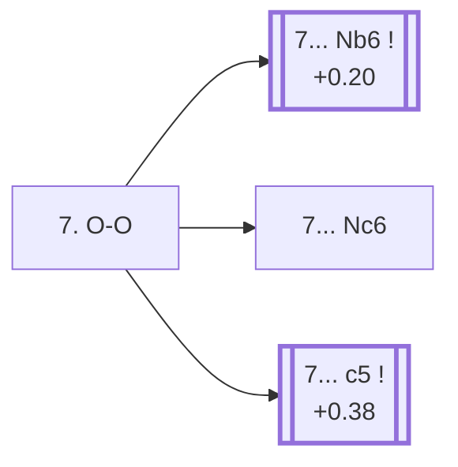

<a name="_TOP_"></a>

# D74 Neo-Grünfeld Defense: Delayed Exchange Variation, 7. O-O <br> 1. d4 Nf6 2. c4 g6 3. g3 d5 4. Bg2 Bg7 5. Nf3 O-O 6. cxd5 Nxd5 7. O-O #

Continues from [D73's own "5... O-O" node](https://github.com/onclemarcel/chess_flashcards/blob/main/d4_openings/D73_Neo_Grunfeld_Nf3.md#_OO_), where White's **6. cxd5** (69.0% masters) is the majority choice over castling first. **6... Nxd5** is close to forced (99.5% masters), and **7. O-O** (97.1% masters) is close to forced in turn — both compressed into this one node, the same convention used throughout this batch for near-automatic sequences. Live-tagged **D74**, "Neo-Grünfeld Defense: Delayed Exchange Variation" — the first of three unrelated D74-D76 nodes sharing this exact live tag.

### Overview

*Quick map of every move covered on this card — see the [shape key](https://github.com/onclemarcel/chess_flashcards/blob/main/start.md#content-diagram-optional) in start.md.*

<!-- content-diagram:start -->

<!-- content-diagram:end -->

<a name="_initial_move_"></a>

[](https://lichess.org/analysis/standard/rnbq1rk1/ppp1ppbp/6p1/3n4/3P4/5NP1/PP2PPBP/RNBQ1RK1_b_-_-_1_7)

*... 6. cxd5 Nxd5 7. O-O — Neo-Grünfeld Defense: Delayed Exchange Variation*

```
rnbq1rk1/ppp1ppbp/6p1/3n4/3P4/5NP1/PP2PPBP/RNBQ1RK1 b - - 1 7
```

|  | +0.14 |
| --- | --- |

<!-- lichess-stats:start fen="rnbq1rk1/ppp1ppbp/6p1/3n4/3P4/5NP1/PP2PPBP/RNBQ1RK1 b - - 1 7" db="lichess,masters" speeds="bullet,blitz" ratings="1800,2000,2200,2500" moves="4" -->
| Move | Online | W/D/B | Masters | W/D/B | |
| :--- | ---: | :--- | ---: | :--- | :-- |
| c5 | 36 k (25.0%) | ⬜⬜⬜⬜⬜🟫⬛⬛⬛⬛ 52/6/42 | 243 (8.4%) | ⬜⬜⬜🟫🟫🟫🟫🟫⬛⬛ 33/49/18 |  |
| Nc6 | 32 k (22.0%) | ⬜⬜⬜⬜⬜🟫⬛⬛⬛⬛ 51/7/42 | 643 (22.1%) | ⬜⬜⬜⬜🟫🟫🟫🟫⬛⬛ 40/40/20 |  |
| c6 | 25 k (17.5%) | ⬜⬜⬜⬜⬜🟫⬛⬛⬛⬛ 56/6/38 | 67 (2.3%) | ⬜⬜⬜⬜🟫🟫🟫🟫⬛⬛ 37/45/18 |  |
| Nb6 | 25 k (17.2%) | ⬜⬜⬜⬜⬜🟫⬛⬛⬛⬛ 48/8/44 | 1.9 k (65.6%) | ⬜⬜⬜🟫🟫🟫🟫🟫⬛⬛ 34/46/20 |  |

*Online: bullet/blitz, 1800+ — 145 k games. Masters: 2.9 k games. [Open in the explorer](https://lichess.org/analysis/standard/rnbq1rk1/ppp1ppbp/6p1/3n4/3P4/5NP1/PP2PPBP/RNBQ1RK1_b_-_-_1_7#explorer) — updated 2026-09-09*
<!-- lichess-stats:end -->

Masters' clear main try is **7... Nb6** (65.6%), retreating the knight off the exposed d5-square before it can be hit — well ahead of **7... Nc6** (22.1%, developing more actively) and **7... c5** (8.4%, striking the centre while the knight is still on d5). Online play flattens this considerably (c5 25.0% / Nc6 22.0% / c6 17.5% / Nb6 17.2%), another real gap between the two databases worth noting, though not a formal inversion since masters' own top try (Nb6) still ranks among online's real options rather than trailing badly.

* [**7... Nb6**](https://github.com/onclemarcel/chess_flashcards/blob/main/d4_openings/D76_Neo_Grunfeld_Delayed_Exchange_Nb6.md) (+0.20, 65.6% masters, 17.2% online): masters' clear main try — its own code, D76.
* [**7... c5**](https://github.com/onclemarcel/chess_flashcards/blob/main/d4_openings/D75_Neo_Grunfeld_Delayed_Exchange_c5.md) (+0.38, 8.4% masters, 25.0% online): its own code, D75 (with two further named sub-lines).
* **7... Nc6** (22.1% masters, 22.0% online): a real, secondary try with no code of its own in this range; not built out further here (backlog).

[*Back to D73's own "5... O-O"*](https://github.com/onclemarcel/chess_flashcards/blob/main/d4_openings/D73_Neo_Grunfeld_Nf3.md#_OO_)
[*Back to TOP*](#_TOP_)
