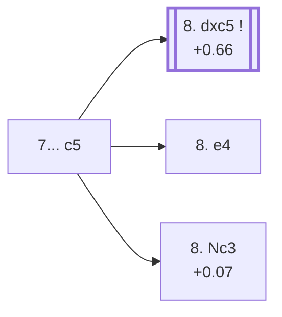

<a name="_TOP_"></a>

# D75 Neo-Grünfeld Defense: Delayed Exchange Variation, 7... c5 <br> 1. d4 Nf6 2. c4 g6 3. g3 d5 4. Bg2 Bg7 5. Nf3 O-O 6. cxd5 Nxd5 7. O-O c5 #

Continues from [D74's own root](https://github.com/onclemarcel/chess_flashcards/blob/main/d4_openings/D74_Neo_Grunfeld_Delayed_Exchange.md#_initial_move_), where **7... c5** (8.4% masters, a real minority behind 7... Nb6's 65.6%) strikes the centre before retreating the knight. `eco.md` lists **two** separate D75 entries at White's own 8th move — **8. Nc3** and **8. dxc5** — both covered below rather than one being folded into a NOTE, matching the same two-entry treatment given to D70's own pair.

### Overview

*Quick map of every move covered on this card — see the [shape key](https://github.com/onclemarcel/chess_flashcards/blob/main/start.md#content-diagram-optional) in start.md.*

<!-- content-diagram:start -->

<!-- content-diagram:end -->

<a name="_initial_move_"></a>

[](https://lichess.org/analysis/standard/rnbq1rk1/pp2ppbp/6p1/2pn4/3P4/5NP1/PP2PPBP/RNBQ1RK1_w_-_c6_0_8)

*... 7... c5*

```
rnbq1rk1/pp2ppbp/6p1/2pn4/3P4/5NP1/PP2PPBP/RNBQ1RK1 w - c6 0 8
```

|  | +0.38 |
| --- | --- |

<!-- lichess-stats:start fen="rnbq1rk1/pp2ppbp/6p1/2pn4/3P4/5NP1/PP2PPBP/RNBQ1RK1 w - c6 0 8" db="lichess,masters" speeds="bullet,blitz" ratings="1800,2000,2200,2500" moves="4" -->
| Move | Online | W/D/B | Masters | W/D/B | |
| :--- | ---: | :--- | ---: | :--- | :-- |
| dxc5 | 30 k (39.2%) | ⬜⬜⬜⬜⬜🟫⬛⬛⬛⬛ 50/6/44 | 128 (47.8%) | ⬜⬜🟫🟫🟫🟫🟫🟫⬛⬛ 23/59/17 |  |
| e4 | 25 k (32.9%) | ⬜⬜⬜⬜⬜🟫⬛⬛⬛⬛ 53/6/41 | 91 (34.0%) | ⬜⬜⬜⬜⬜🟫🟫🟫⬛⬛ 49/30/21 |  |
| Nc3 | 19 k (24.5%) | ⬜⬜⬜⬜⬜🟫⬛⬛⬛⬛ 49/7/43 | 46 (17.2%) | ⬜⬜🟫🟫🟫🟫🟫🟫⬛⬛ 24/54/22 |  |
| e3 | 1.8 k (2.3%) | ⬜⬜⬜⬜🟫⬛⬛⬛⬛⬛ 42/7/50 | 0 | — | ⚠ |
| Na3 | 0 | — | 2 (0.7%) | — |  |

*Online: bullet/blitz, 1800+ — 76 k games. Masters: 268 games. [Open in the explorer](https://lichess.org/analysis/standard/rnbq1rk1/pp2ppbp/6p1/2pn4/3P4/5NP1/PP2PPBP/RNBQ1RK1_w_-_c6_0_8#explorer) — updated 2026-09-09*
<!-- lichess-stats:end -->

Left untagged live (`opening=None`) at this exact node — small sample here (268 masters games), read the percentages as directional. **A genuine finding worth flagging plainly**: masters' actual most popular reply at this fork is **8. dxc5** (47.8%), one of the two named D75 entries — but **8. e4** (34.0%), a real, secondary central push, has no code of its own in this range despite outranking **8. Nc3** (17.2%), the *other* named D75 entry. A "coded line trails an uncoded rival" case for both named tries at once, not just one of them — the same meta-pattern already flagged repeatedly across this repository's D-series sweep.

* [**8. dxc5**](#_dxc5_) (47.8% masters): see below — masters' actual main try, and one of the two D75 entries.
* **8. e4** (34.0% masters): a real, secondary try with no code of its own in this range; not built out further here (backlog).
* [**8. Nc3**](#_Nc3_) (17.2% masters): see below — the other D75 entry, despite trailing both siblings above.

[*Back to D74's own root*](https://github.com/onclemarcel/chess_flashcards/blob/main/d4_openings/D74_Neo_Grunfeld_Delayed_Exchange.md#_initial_move_)
[*Back to TOP*](#_TOP_)

---

<a name="_Nc3_"></a>

## 8. Nc3

[](https://lichess.org/analysis/standard/rnbq1rk1/pp2ppbp/6p1/2pn4/3P4/2N2NP1/PP2PPBP/R1BQ1RK1_b_-_-_1_8)

*... 8. Nc3 — Neo-Grünfeld Defense: Delayed Exchange Variation*

```
rnbq1rk1/pp2ppbp/6p1/2pn4/3P4/2N2NP1/PP2PPBP/R1BQ1RK1 b - - 1 8
```

|  | +0.07 |
| --- | --- |

<!-- lichess-stats:start fen="rnbq1rk1/pp2ppbp/6p1/2pn4/3P4/2N2NP1/PP2PPBP/R1BQ1RK1 b - - 1 8" db="lichess,masters" speeds="bullet,blitz" ratings="1800,2000,2200,2500" moves="3" -->
| Move | Online | W/D/B | Masters | W/D/B | |
| :--- | ---: | :--- | ---: | :--- | :-- |
| cxd4 | 23 k (42.9%) | ⬜⬜⬜⬜⬜🟫⬛⬛⬛⬛ 50/8/42 | 112 (36.7%) | ⬜⬜⬜⬜🟫🟫🟫🟫🟫⬛ 38/50/12 |  |
| Nxc3 | 16 k (30.9%) | ⬜⬜⬜⬜⬜🟫⬛⬛⬛⬛ 49/8/43 | 125 (41.0%) | ⬜⬜🟫🟫🟫🟫🟫🟫⬛⬛ 23/55/22 |  |
| Nc6 | 13 k (24.7%) | ⬜⬜⬜⬜🟫⬛⬛⬛⬛⬛ 40/8/52 | 68 (22.3%) | ⬜⬜⬜⬜🟫🟫🟫🟫🟫⬛ 37/49/15 |  |

*Online: bullet/blitz, 1800+ — 53 k games. Masters: 305 games. [Open in the explorer](https://lichess.org/analysis/standard/rnbq1rk1/pp2ppbp/6p1/2pn4/3P4/2N2NP1/PP2PPBP/R1BQ1RK1_b_-_-_1_8#explorer) — updated 2026-09-09*
<!-- lichess-stats:end -->

Develops the queen's knight and hits the d5-knight, inviting a further trade. Black's own replies split three ways at masters level — **8... Nxc3** (41.0%), **8... cxd4** (36.7%) and **8... Nc6** (22.3%) — no dominant try; small sample (305 masters games). Not built out further here (backlog).

[*Back to 7... c5*](#_initial_move_)
[*Back to TOP*](#_TOP_)

---

<a name="_dxc5_"></a>

## 8. dxc5

[](https://lichess.org/analysis/standard/rnbq1rk1/pp2ppbp/6p1/2Pn4/8/5NP1/PP2PPBP/RNBQ1RK1_b_-_-_0_8)

*... 8. dxc5 — Neo-Grünfeld Defense: Delayed Exchange Variation*

```
rnbq1rk1/pp2ppbp/6p1/2Pn4/8/5NP1/PP2PPBP/RNBQ1RK1 b - - 0 8
```

|  | +0.66 |
| --- | --- |

<!-- lichess-stats:start fen="rnbq1rk1/pp2ppbp/6p1/2Pn4/8/5NP1/PP2PPBP/RNBQ1RK1 b - - 0 8" db="lichess,masters" speeds="bullet,blitz" ratings="1800,2000,2200,2500" moves="3" -->
| Move | Online | W/D/B | Masters | W/D/B | |
| :--- | ---: | :--- | ---: | :--- | :-- |
| Nc6 | 14 k (46.3%) | ⬜⬜⬜⬜⬜🟫⬛⬛⬛⬛ 52/5/42 | 5 (3.7%) | — |  |
| Na6 | 9.2 k (30.3%) | ⬜⬜⬜⬜🟫⬛⬛⬛⬛⬛ 44/7/49 | 130 (95.6%) | ⬜⬜🟫🟫🟫🟫🟫🟫⬛⬛ 25/58/18 |  |
| Nb4 | 2.5 k (8.4%) | ⬜⬜⬜⬜⬜🟫⬛⬛⬛⬛ 48/6/46 | 1 (0.7%) | — | ⚠ |

*Online: bullet/blitz, 1800+ — 30 k games. Masters: 136 games. [Open in the explorer](https://lichess.org/analysis/standard/rnbq1rk1/pp2ppbp/6p1/2Pn4/8/5NP1/PP2PPBP/RNBQ1RK1_b_-_-_0_8#explorer) — updated 2026-09-09*
<!-- lichess-stats:end -->

Trades the tension away rather than maintaining it. Masters overwhelmingly answer with **8... Na6** (95.6%), regaining the c5-pawn next move — a much more forcing, near-automatic reply than the 8. Nc3 branch's own three-way split above; very thin sample (136 masters games), read directionally. Online play instead spreads far wider (Nc6 46.3% / Na6 30.3% / Nb4 8.4%), another real database gap. Not built out further here (backlog).

[*Back to 7... c5*](#_initial_move_)
[*Back to TOP*](#_TOP_)
