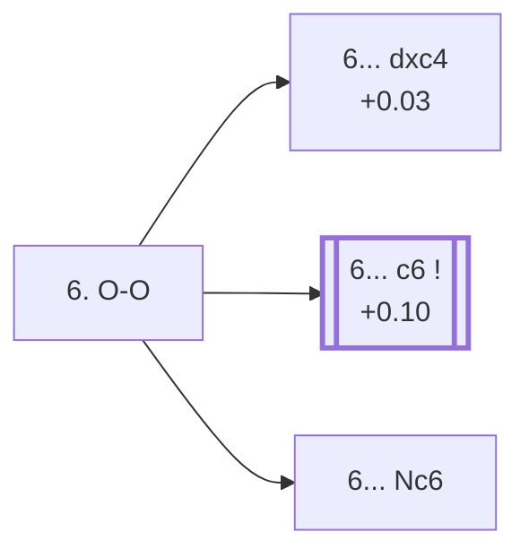

<a name="_TOP_"></a>

# D77 Neo-Grünfeld Defense: Classical Variation <br> 1. d4 Nf6 2. c4 g6 3. g3 d5 4. Bg2 Bg7 5. Nf3 O-O 6. O-O #

Continues from [D73's own "5... O-O" node](https://github.com/onclemarcel/chess_flashcards/blob/main/d4_openings/D73_Neo_Grunfeld_Nf3.md#_OO_), where White's **6. O-O** (29.7% masters) castles first, keeping the central tension a move longer than the majority 6. cxd5 choice (D74's own trunk, 69.0%). Live-tagged **D77**, "Neo-Grünfeld Defense: Classical Variation" — the first genuinely distinct name in this D74-D79 span, not another recurrence of "Delayed Exchange" or "with g3".

### Overview

*Quick map of every move covered on this card — see the [shape key](https://github.com/onclemarcel/chess_flashcards/blob/main/start.md#content-diagram-optional) in start.md.*

<!-- content-diagram:start -->

<!-- content-diagram:end -->

<a name="_initial_move_"></a>

[](https://lichess.org/analysis/standard/rnbq1rk1/ppp1ppbp/5np1/3p4/2PP4/5NP1/PP2PPBP/RNBQ1RK1_b_-_-_5_6)

*... 6. O-O — Neo-Grünfeld Defense: Classical Variation*

```
rnbq1rk1/ppp1ppbp/5np1/3p4/2PP4/5NP1/PP2PPBP/RNBQ1RK1 b - - 5 6
```

|  | +0.03 |
| --- | --- |

<!-- lichess-stats:start fen="rnbq1rk1/ppp1ppbp/5np1/3p4/2PP4/5NP1/PP2PPBP/RNBQ1RK1 b - - 5 6" db="lichess,masters" speeds="bullet,blitz" ratings="1800,2000,2200,2500" moves="4" -->
| Move | Online | W/D/B | Masters | W/D/B | |
| :--- | ---: | :--- | ---: | :--- | :-- |
| c6 | 620 k (46.9%) | ⬜⬜⬜⬜⬜🟫⬛⬛⬛⬛ 51/7/42 | 2.2 k (43.7%) | ⬜⬜⬜🟫🟫🟫🟫🟫⬛⬛ 28/56/17 |  |
| dxc4 | 336 k (25.5%) | ⬜⬜⬜⬜⬜🟫⬛⬛⬛⬛ 49/6/45 | 2.3 k (46.9%) | ⬜⬜⬜🟫🟫🟫🟫🟫⬛⬛ 30/46/24 |  |
| c5 | 189 k (14.3%) | ⬜⬜⬜⬜⬜🟫⬛⬛⬛⬛ 49/6/44 | 59 (1.2%) | ⬜⬜🟫🟫🟫🟫🟫🟫⬛⬛ 22/63/15 |  |
| e6 | 50 k (3.8%) | ⬜⬜⬜⬜⬜🟫⬛⬛⬛⬛ 55/6/38 | 0 | — | ⚠ |
| Nc6 | 0 | — | 376 (7.6%) | ⬜⬜⬜🟫🟫🟫🟫🟫⬛⬛ 31/45/24 |  |

*Online: bullet/blitz, 1800+ — 1.3 M games. Masters: 5.0 k games. [Open in the explorer](https://lichess.org/analysis/standard/rnbq1rk1/ppp1ppbp/5np1/3p4/2PP4/5NP1/PP2PPBP/RNBQ1RK1_b_-_-_5_6#explorer) — updated 2026-09-07*
<!-- lichess-stats:end -->

**A genuine, near-even fork worth flagging plainly**: masters split almost exactly evenly between **6... dxc4** (46.9%, simply taking the pawn) and **6... c6** (43.7%, the Slav-like bolster that heads into D78) — the uncoded dxc4 narrowly outranks the coded c6 here, the same "coded line trails an uncoded rival" meta-pattern already flagged repeatedly across the D60-D69 batch (D60's own root, D64's own root, D68's own root), just by a much smaller margin than any of those. A large sample backs this split (4,955 masters games). Online play flips the ranking (c6 46.9% vs dxc4 25.5%), a genuine database inversion layered on top of the masters-side near-tie.

* **6... dxc4** (+0.03, 46.9% masters, 25.5% online): masters' actual bare plurality — a real, secondary try with no code of its own in this range; not built out further here (backlog).
* [**6... c6**](https://github.com/onclemarcel/chess_flashcards/blob/main/d4_openings/D78_Neo_Grunfeld_Classical_Original_Defense.md) (+0.10, 43.7% masters, 46.9% online): its own code, D78.
* **6... Nc6** (7.6% masters): a real, secondary try with no code of its own in this range.

[*Back to D73's own "5... O-O"*](https://github.com/onclemarcel/chess_flashcards/blob/main/d4_openings/D73_Neo_Grunfeld_Nf3.md#_OO_)
[*Back to TOP*](#_TOP_)
