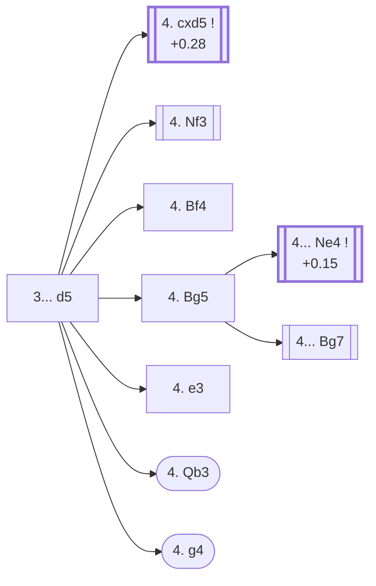

<a name="_TOP_"></a>

# D80 Grünfeld Defence <br> 1. d4 Nf6 2. c4 g6 3. Nc3 d5 #

The Grünfeld Defence is the Réti-and-hypermodern-flavoured answer to the King's Indian move order: instead of fianchettoing and waiting, Black strikes the centre with ... d5 immediately, inviting White to build a big pawn duo that Black then attacks with pieces (... c5, ... Nc6, ... Bg7 pressure on d4) rather than pawns. `eco.md` lists four entries under D80 itself: the bare root, the **Spike Gambit** (4. g4), the **Stockholm Variation** (4. Bg5), and the **Lundin Variation**, a deeper line inside the Stockholm tree (4. Bg5 Ne4 5. Nxe4 dxe4 6. Qd2 c5). This card, alongside its own further code links, absorbs and refreshes the root-level content that a pre-sweep file (`D85_Grunfeld.md`, since renamed to [D85's own Exchange Variation card](https://github.com/onclemarcel/chess_flashcards/blob/main/d4_openings/D85_Grunfeld_Exchange_Variation.md)) had already covered soundly at this exact position — D85's own file now starts at its own root instead (4. cxd5 Nxd5), the same "continues from" cross-linking convention used throughout this whole sweep rather than duplicating the shared ancestor node.

### Overview

*Quick map of every move covered on this card — see the [shape key](https://github.com/onclemarcel/chess_flashcards/blob/main/start.md#content-diagram-optional) in start.md.*

<!-- content-diagram:start -->

<!-- content-diagram:end -->

<a name="_initial_move_"></a>

[](https://lichess.org/analysis/standard/rnbqkb1r/ppp1pp1p/5np1/3p4/2PP4/2N5/PP2PPPP/R1BQKBNR_w_KQkq_d6_0_4)

*... 1. d4 Nf6 2. c4 g6 3. Nc3 d5 — Grünfeld Defence*

```
rnbqkb1r/ppp1pp1p/5np1/3p4/2PP4/2N5/PP2PPPP/R1BQKBNR w KQkq d6 0 4
```

|  | +0.28 |
| --- | --- |

<!-- lichess-stats:start fen="rnbqkb1r/ppp1pp1p/5np1/3p4/2PP4/2N5/PP2PPPP/R1BQKBNR w KQkq d6 0 4" db="lichess,masters" speeds="bullet,blitz" ratings="1800,2000,2200,2500" moves="7" -->
| Move | Online | W/D/B | Masters | W/D/B | |
| :--- | ---: | :--- | ---: | :--- | :-- |
| cxd5 | 2.7 M (41.7%) | ⬜⬜⬜⬜⬜🟫⬛⬛⬛⬛ 47/7/47 | 23 k (53.1%) | ⬜⬜⬜🟫🟫🟫🟫🟫⬛⬛ 29/53/18 |  |
| Nf3 | 1.6 M (24.9%) | ⬜⬜⬜⬜⬜⬛⬛⬛⬛⬛ 48/6/46 | 13 k (29.7%) | ⬜⬜⬜🟫🟫🟫🟫🟫⬛⬛ 30/49/21 |  |
| e3 | 547 k (8.6%) | ⬜⬜⬜⬜🟫⬛⬛⬛⬛⬛ 45/6/49 | 801 (1.9%) | ⬜⬜⬜🟫🟫🟫🟫⬛⬛⬛ 30/44/26 |  |
| Bg5 | 545 k (8.6%) | ⬜⬜⬜⬜⬜⬛⬛⬛⬛⬛ 47/5/48 | 2.5 k (6.0%) | ⬜⬜⬜🟫🟫🟫🟫⬛⬛⬛ 33/43/24 |  |
| Bf4 | 351 k (5.5%) | ⬜⬜⬜⬜⬜⬛⬛⬛⬛⬛ 48/6/46 | 3.1 k (7.2%) | ⬜⬜⬜🟫🟫🟫🟫🟫⬛⬛ 30/49/21 |  |
| e4 | 289 k (4.5%) | ⬜⬜⬜⬜🟫⬛⬛⬛⬛⬛ 43/4/53 | 0 | — | ⚠ |
| f3 | 90 k (1.4%) | ⬜⬜⬜⬜⬜⬛⬛⬛⬛⬛ 49/4/47 | 0 | — | ⚠ |
| Qb3 | 0 | — | 539 (1.3%) | ⬜⬜⬜🟫🟫🟫🟫🟫⬛⬛ 34/51/15 |  |
| h4 | 0 | — | 158 (0.4%) | ⬜⬜⬜⬜🟫🟫🟫🟫⬛⬛ 35/41/24 |  |

*Online: bullet/blitz, 1800+ — 6.4 M games. Masters: 43 k games. [Open in the explorer](https://lichess.org/analysis/standard/rnbqkb1r/ppp1pp1p/5np1/3p4/2PP4/2N5/PP2PPPP/R1BQKBNR_w_KQkq_d6_0_4#explorer) — updated 2026-09-09*
<!-- lichess-stats:end -->

**4. cxd5** is masters' clear main try (53.1%) — the Exchange Variation, resolving the central tension at once and inviting Black to recapture with the knight; it has its own code, [D85](https://github.com/onclemarcel/chess_flashcards/blob/main/d4_openings/D85_Grunfeld_Exchange_Variation.md), and its own huge D85-D89 tree, the bulk of this whole batch. **4. Nf3** (29.7% masters) is a real, significant secondary — a Grünfeld move-order that keeps the knight flexible before deciding on the centre — but carries no code of its own in this D80-D89 range (it belongs further out, backlog). **4. Bf4** (7.2% masters) is live-tagged the **Brinckmann Attack** — a real name `eco.md` itself doesn't attach at D80's own bare "4.Bf4" listing — and has its own code, [D82](https://github.com/onclemarcel/chess_flashcards/blob/main/d4_openings/D82_Grunfeld_Bf4.md). **4. e3** (1.9% masters) is a real, secondary try with no code of its own in this range. **4. Qb3** (1.3% masters) is the Russian Variation, its own code, [D81](https://github.com/onclemarcel/chess_flashcards/blob/main/d4_openings/D81_Grunfeld_Russian_Variation.md).

**4. g4** is a genuine database rarity — 11 masters games (0.0%) and only 3.6 k online (0.1%), well below this repo's usual reliability floor; read anything below as directional, not precise. `eco.md` calls this the ***Spike Gambit***; the live explorer instead tags this exact position the ***Gibbon Gambit*** — a real name divergence, not a rounding artefact.

* [**4. cxd5**](https://github.com/onclemarcel/chess_flashcards/blob/main/d4_openings/D85_Grunfeld_Exchange_Variation.md) (+0.28, 53.1% masters): the Exchange Variation — its own code, D85.
* **4. Nf3** (29.7% masters, 24.9% online): a real, significant secondary try with no code of its own in this range; not built out further here (backlog).
* [**4. Bf4**](https://github.com/onclemarcel/chess_flashcards/blob/main/d4_openings/D82_Grunfeld_Bf4.md) (7.2% masters): live-tagged the Brinckmann Attack — its own code, D82.
* [**4. Bg5**](#_Bg5_) (6.0% masters): the Stockholm Variation — see below.
* **4. e3** (1.9% masters): a real, secondary try with no code of its own in this range.
* [**4. Qb3**](https://github.com/onclemarcel/chess_flashcards/blob/main/d4_openings/D81_Grunfeld_Russian_Variation.md) (1.3% masters): the Russian Variation — its own code, D81.
* [**4. g4**](#_g4_) (0.0% masters, 0.1% online ⚠): live-tagged the Gibbon Gambit — `eco.md`'s own Spike Gambit — see below.

[*Back to TOP*](#_TOP_)

---

<a name="_g4_"></a>

## 4. g4 — Spike Gambit

[](https://lichess.org/analysis/standard/rnbqkb1r/ppp1pp1p/5np1/3p4/2PP2P1/2N5/PP2PP1P/R1BQKBNR_b_KQkq_g3_0_4)

*... 4. g4 — live-tagged the Gibbon Gambit*

```
rnbqkb1r/ppp1pp1p/5np1/3p4/2PP2P1/2N5/PP2PP1P/R1BQKBNR b KQkq g3 0 4
```

|  | −0.56 |
| --- | --- |

<!-- lichess-stats:start fen="rnbqkb1r/ppp1pp1p/5np1/3p4/2PP2P1/2N5/PP2PP1P/R1BQKBNR b KQkq g3 0 4" db="lichess,masters" speeds="bullet,blitz" ratings="1800,2000,2200,2500" moves="4" -->
| Move | Online | W/D/B | Masters | W/D/B | |
| :--- | ---: | :--- | ---: | :--- | :-- |
| Bxg4 | 2.2 k (61.2%) | ⬜⬜⬜⬜⬜⬛⬛⬛⬛⬛ 47/4/49 | 4 (36.4%) | — | ⚠ |
| dxc4 | 611 (16.9%) | ⬜⬜⬜⬜⬛⬛⬛⬛⬛⬛ 43/3/54 | 6 (54.5%) | — |  |
| Nxg4 | 280 (7.8%) | ⬜⬜⬜⬜⬜⬛⬛⬛⬛⬛ 48/1/51 | 0 | — | ⚠ |
| Bg7 | 228 (6.3%) | ⬜⬜⬜⬜⬜⬛⬛⬛⬛⬛ 46/4/50 | 0 | — | ⚠ |
| c5 | 0 | — | 1 (9.1%) | — |  |

*Online: bullet/blitz, 1800+ — 3.6 k games. Masters: 11 games. [Open in the explorer](https://lichess.org/analysis/standard/rnbqkb1r/ppp1pp1p/5np1/3p4/2PP2P1/2N5/PP2PP1P/R1BQKBNR_b_KQkq_g3_0_4#explorer) — updated 2026-09-09*
<!-- lichess-stats:end -->

Stockfish rates the whole line clearly in Black's favour (−0.56) — an unsound-per-engine gambit despite the "Gibbon Gambit"/"Spike Gambit" naming pomp, in the same vein as several other 19th-/20th-century gambit oddities catalogued elsewhere in this repo. With only 11 masters games and 3.6 k online games total, no real statistical pattern can be drawn beyond "it exists and is rarely played" — read the table above as anecdotal, not authoritative.

* **4... dxc4** (54.5% masters, 16.9% online): grabs a second pawn before dealing with the g-pawn's threat.
* **4... Bxg4** (36.4% masters, 61.2% online): the principled reply, simply taking the offered pawn.

[*Back to 3... d5*](#_initial_move_)
[*Back to TOP*](#_TOP_)

---

<a name="_Bg5_"></a>

## 4. Bg5 — Stockholm Variation

[](https://lichess.org/analysis/standard/rnbqkb1r/ppp1pp1p/5np1/3p2B1/2PP4/2N5/PP2PPPP/R2QKBNR_b_KQkq_-_1_4)

*... 4. Bg5 — Stockholm Variation*

```
rnbqkb1r/ppp1pp1p/5np1/3p2B1/2PP4/2N5/PP2PPPP/R2QKBNR b KQkq - 1 4
```

|  | +0.16 |
| --- | --- |

<!-- lichess-stats:start fen="rnbqkb1r/ppp1pp1p/5np1/3p2B1/2PP4/2N5/PP2PPPP/R2QKBNR b KQkq - 1 4" db="lichess,masters" speeds="bullet,blitz" ratings="1800,2000,2200,2500" moves="4" -->
| Move | Online | W/D/B | Masters | W/D/B | |
| :--- | ---: | :--- | ---: | :--- | :-- |
| Ne4 | 250 k (45.5%) | ⬜⬜⬜⬜🟫⬛⬛⬛⬛⬛ 44/5/50 | 2.0 k (76.5%) | ⬜⬜⬜🟫🟫🟫🟫⬛⬛⬛ 34/42/25 |  |
| Bg7 | 175 k (32.0%) | ⬜⬜⬜⬜⬜⬛⬛⬛⬛⬛ 48/5/47 | 549 (21.5%) | ⬜⬜⬜🟫🟫🟫🟫🟫⬛⬛ 30/48/21 |  |
| c6 | 58 k (10.6%) | ⬜⬜⬜⬜⬜🟫⬛⬛⬛⬛ 51/5/44 | 12 (0.5%) | — |  |
| dxc4 | 54 k (9.9%) | ⬜⬜⬜⬜⬜🟫⬛⬛⬛⬛ 51/5/44 | 0 | — | ⚠ |
| c5 | 0 | — | 27 (1.1%) | ⬜🟫🟫🟫🟫🟫🟫⬛⬛⬛ 11/59/30 |  |

*Online: bullet/blitz, 1800+ — 549 k games. Masters: 2.5 k games. [Open in the explorer](https://lichess.org/analysis/standard/rnbqkb1r/ppp1pp1p/5np1/3p2B1/2PP4/2N5/PP2PPPP/R2QKBNR_b_KQkq_-_1_4#explorer) — updated 2026-09-09*
<!-- lichess-stats:end -->

**4... Ne4** is masters' clear main try (76.5%) — kicking the bishop before deciding on the rest of the setup, and the trunk feeding this file's own Lundin Variation below. **4... Bg7** (21.5% masters) simply declines the tempo grab and develops instead — a real, secondary try with no code of its own in this range.

* [**4... Ne4**](#_Ne4_) (76.5% masters): see below — the Lundin Variation's own trunk.
* **4... Bg7** (21.5% masters): a real, secondary try with no code of its own in this range.

[*Back to 3... d5*](#_initial_move_)
[*Back to TOP*](#_TOP_)

---

<a name="_Ne4_"></a>

### 4... Ne4

[](https://lichess.org/analysis/standard/rnbqkb1r/ppp1pp1p/6p1/3p2B1/2PPn3/2N5/PP2PPPP/R2QKBNR_w_KQkq_-_2_5)

*... 4... Ne4*

```
rnbqkb1r/ppp1pp1p/6p1/3p2B1/2PPn3/2N5/PP2PPPP/R2QKBNR w KQkq - 2 5
```

|  | +0.15 |
| --- | --- |

<!-- lichess-stats:start fen="rnbqkb1r/ppp1pp1p/6p1/3p2B1/2PPn3/2N5/PP2PPPP/R2QKBNR w KQkq - 2 5" db="lichess,masters" speeds="bullet,blitz" ratings="1800,2000,2200,2500" moves="5" -->
| Move | Online | W/D/B | Masters | W/D/B | |
| :--- | ---: | :--- | ---: | :--- | :-- |
| Nxe4 | 125 k (50.2%) | ⬜⬜⬜⬜⬛⬛⬛⬛⬛⬛ 40/4/56 | 58 (3.0%) | ⬜⬜⬜⬜🟫🟫⬛⬛⬛⬛ 38/22/40 |  |
| Bh4 | 60 k (24.2%) | ⬜⬜⬜⬜⬜🟫⬛⬛⬛⬛ 53/6/41 | 1.5 k (76.1%) | ⬜⬜⬜⬜🟫🟫🟫🟫⬛⬛ 34/42/24 |  |
| Bf4 | 27 k (10.9%) | ⬜⬜⬜⬜⬜🟫⬛⬛⬛⬛ 49/7/44 | 242 (12.4%) | ⬜⬜⬜🟫🟫🟫🟫🟫⬛⬛ 29/51/20 |  |
| cxd5 | 11 k (4.5%) | ⬜⬜⬜⬜⬜🟫⬛⬛⬛⬛ 48/7/45 | 66 (3.4%) | ⬜⬜⬜🟫🟫🟫⬛⬛⬛⬛ 27/30/42 |  |
| Nf3 | 6.9 k (2.8%) | ⬜⬜⬜⬜🟫⬛⬛⬛⬛⬛ 44/5/51 | 0 | — | ⚠ |
| h4 | 0 | — | 72 (3.7%) | ⬜⬜⬜⬜🟫🟫🟫🟫⬛⬛ 39/40/21 |  |

*Online: bullet/blitz, 1800+ — 249 k games. Masters: 2.0 k games. [Open in the explorer](https://lichess.org/analysis/standard/rnbqkb1r/ppp1pp1p/6p1/3p2B1/2PPn3/2N5/PP2PPPP/R2QKBNR_w_KQkq_-_2_5#explorer) — updated 2026-09-09*
<!-- lichess-stats:end -->

**A genuine, striking finding worth flagging plainly**: the move that actually defines the Lundin Variation, **5. Nxe4**, is only masters' *fifth* choice here — a bare 3.0% — well behind the simple bishop retreat **5. Bh4** (76.1%, real but uncoded further in this range) and **5. Bf4** (12.4%, likewise uncoded). Online play inverts this completely: **5. Nxe4** is the clear online main try (50.2%), a huge online/masters split running in the opposite direction from most such gaps documented elsewhere in this repo (there, the *online*-favoured move is usually the untested one; here it's the *named, coded* one). Masters evidently prefer keeping the bishop and the tension rather than trading down into the Lundin structure at all.

* **5. Bh4** (+0.15, 76.1% masters, 24.2% online): masters' actual main try — a real, secondary try with no code of its own in this range; not built out further here (backlog).
* **5. Bf4** (12.4% masters): a real, secondary try with no code of its own in this range.
* [**5. Nxe4**](#_Lundin_) (3.0% masters, 50.2% online): the Lundin Variation's own defining capture — see below.

[*Back to 4. Bg5*](#_Bg5_)
[*Back to TOP*](#_TOP_)

---

<a name="_Lundin_"></a>

### 5. Nxe4 — Lundin Variation

Black's recapture is forced and total: **5... dxe4** is played in 100% of both recorded databases (58 masters games, 125 k online). The resulting position then sees White choose between **6. Qd2** (60.3% masters, the Lundin's own move, recovering the pawn next move via ... Bg7/Qxd4-type ideas) and two uncoded secondaries, **6. e3** (20.7%) and **6. Qa4+** (12.1%).

[](https://lichess.org/analysis/standard/rnbqkb1r/ppp1pp1p/6p1/6B1/2PPp3/8/PP1QPPPP/R3KBNR_b_KQkq_-_1_6)

*... 5. Nxe4 dxe4 6. Qd2*

```
rnbqkb1r/ppp1pp1p/6p1/6B1/2PPp3/8/PP1QPPPP/R3KBNR b KQkq - 1 6
```

|  | −0.20 |
| --- | --- |

<!-- lichess-stats:start fen="rnbqkb1r/ppp1pp1p/6p1/6B1/2PPp3/8/PP1QPPPP/R3KBNR b KQkq - 1 6" db="lichess,masters" speeds="bullet,blitz" ratings="1800,2000,2200,2500" moves="4" -->
| Move | Online | W/D/B | Masters | W/D/B | |
| :--- | ---: | :--- | ---: | :--- | :-- |
| Bg7 | 16 k (79.3%) | ⬜⬜⬜⬜⬜⬛⬛⬛⬛⬛ 51/4/45 | 31 (88.6%) | ⬜⬜⬜🟫🟫🟫⬛⬛⬛⬛ 35/26/39 |  |
| h6 | 1.8 k (8.9%) | ⬜⬜⬜⬜⬜⬛⬛⬛⬛⬛ 51/4/46 | 1 (2.9%) | — | ⚠ |
| c5 | 1.5 k (7.0%) | ⬜⬜⬜⬜⬜⬜⬛⬛⬛⬛ 54/3/43 | 2 (5.7%) | — | ⚠ |
| c6 | 314 (1.5%) | ⬜⬜⬜⬜⬜⬛⬛⬛⬛⬛ 48/5/47 | 1 (2.9%) | — | ⚠ |

*Online: bullet/blitz, 1800+ — 21 k games. Masters: 35 games. [Open in the explorer](https://lichess.org/analysis/standard/rnbqkb1r/ppp1pp1p/6p1/6B1/2PPp3/8/PP1QPPPP/R3KBNR_b_KQkq_-_1_6#explorer) — updated 2026-09-09*
<!-- lichess-stats:end -->

**A second genuine finding, compounding the first**: `eco.md`'s own Lundin-defining move, **6... c5**, is *also* a masters minority here (5.7%, just 2 of 35 sampled games) — well behind the natural developing **6... Bg7** (88.6%). Both moves that give this line its name (5. Nxe4 and 6... c5) turn out to be real but statistically marginal masters choices; the sample this deep is thin enough (35 masters games, dropping to 2 for the named continuation itself) that these percentages should be read as directional colour, not a firm verdict.

<a name="_Lundin_leaf_"></a>

[](https://lichess.org/analysis/standard/rnbqkb1r/pp2pp1p/6p1/2p3B1/2PPp3/8/PP1QPPPP/R3KBNR_w_KQkq_c6_0_7)

*... 6... c5 — Lundin Variation*

```
rnbqkb1r/pp2pp1p/6p1/2p3B1/2PPp3/8/PP1QPPPP/R3KBNR w KQkq c6 0 7
```

|  | +0.00 |
| --- | --- |

Live-tagged **Grünfeld Defense: Lundin Variation**, confirming the name despite the vanishingly thin sample (2 masters games) reaching this exact tabiya. Stockfish calls the resulting position dead level.

[*Back to 4... Ne4*](#_Ne4_)
[*Back to TOP*](#_TOP_)
