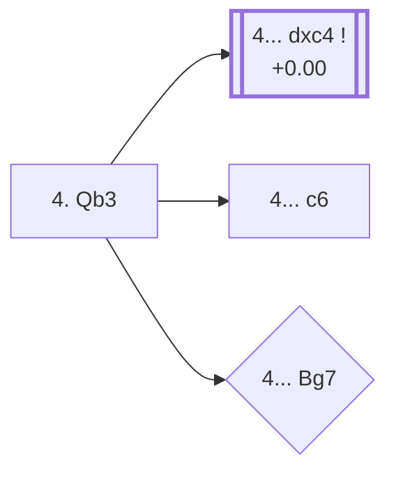

<a name="_TOP_"></a>

# D81 Grünfeld Defense: Russian Variation <br> 1. d4 Nf6 2. c4 g6 3. Nc3 d5 4. Qb3 #

Continues from [D80's own root](https://github.com/onclemarcel/chess_flashcards/blob/main/d4_openings/D80_Grunfeld_Defense.md#_initial_move_), where White's **4. Qb3** is a real but clear minority (1.3% masters) next to 4. cxd5's 53.1% share. `eco.md` names this the "Russian Variation"; the live explorer carries a fuller label, **"Russian Variation, Accelerated Variation"** — a real name extension `eco.md` itself doesn't spell out. The idea is to meet ... dxc4 with a queen already eyeing b7/d5, sidestepping the main Exchange complex entirely.

### Overview

*Quick map of every move covered on this card — see the [shape key](https://github.com/onclemarcel/chess_flashcards/blob/main/start.md#content-diagram-optional) in start.md.*

<!-- content-diagram:start -->

<!-- content-diagram:end -->

<a name="_initial_move_"></a>

[](https://lichess.org/analysis/standard/rnbqkb1r/ppp1pp1p/5np1/3p4/2PP4/1QN5/PP2PPPP/R1B1KBNR_b_KQkq_-_1_4)

*... 4. Qb3 — Grünfeld Defense: Russian Variation, Accelerated Variation*

```
rnbqkb1r/ppp1pp1p/5np1/3p4/2PP4/1QN5/PP2PPPP/R1B1KBNR b KQkq - 1 4
```

|  | +0.00 |
| --- | --- |

<!-- lichess-stats:start fen="rnbqkb1r/ppp1pp1p/5np1/3p4/2PP4/1QN5/PP2PPPP/R1B1KBNR b KQkq - 1 4" db="lichess,masters" speeds="bullet,blitz" ratings="1800,2000,2200,2500" moves="4" -->
| Move | Online | W/D/B | Masters | W/D/B | |
| :--- | ---: | :--- | ---: | :--- | :-- |
| dxc4 | 41 k (78.3%) | ⬜⬜⬜⬜⬜⬛⬛⬛⬛⬛ 47/6/47 | 523 (97.0%) | ⬜⬜⬜🟫🟫🟫🟫🟫⬛⬛ 34/51/15 |  |
| c6 | 7.0 k (13.4%) | ⬜⬜⬜⬜⬜🟫⬛⬛⬛⬛ 52/7/42 | 8 (1.5%) | — |  |
| Bg7 | 2.6 k (4.9%) | ⬜⬜⬜⬜⬜🟫⬛⬛⬛⬛ 52/5/43 | 3 (0.6%) | — | ⚠ |
| e6 | 874 (1.7%) | ⬜⬜⬜⬜⬜🟫⬛⬛⬛⬛ 55/5/40 | 0 | — | ⚠ |
| c5 | 0 | — | 5 (0.9%) | — |  |

*Online: bullet/blitz, 1800+ — 53 k games. Masters: 539 games. [Open in the explorer](https://lichess.org/analysis/standard/rnbqkb1r/ppp1pp1p/5np1/3p4/2PP4/1QN5/PP2PPPP/R1B1KBNR_b_KQkq_-_1_4#explorer) — updated 2026-09-07*
<!-- lichess-stats:end -->

**4... dxc4** is close to automatic (97.0% of masters games) — grabbing the pawn at once, since White's queen sortie hasn't actually defended it yet. **4... c6** (1.5% masters) and **4... Bg7** (0.6% masters) are real, secondary tries with no code of their own in this range, both essentially database rarities at this node.

* **4... dxc4** (+0.00, 97.0% masters, 78.3% online): masters' overwhelming main try — not built out further here (this card's single `eco.md` entry ends at the root move itself; backlog for a deeper continuation).
* **4... c6** (1.5% masters): a real, secondary try with no code of its own in this range.
* **4... Bg7** (0.6% masters, 4.9% online — a large enough gap between the two databases to read as a real, if mild, blitz trap): a real, secondary try with no code of its own in this range.

[*Back to D80's own root*](https://github.com/onclemarcel/chess_flashcards/blob/main/d4_openings/D80_Grunfeld_Defense.md#_initial_move_)
[*Back to TOP*](#_TOP_)
