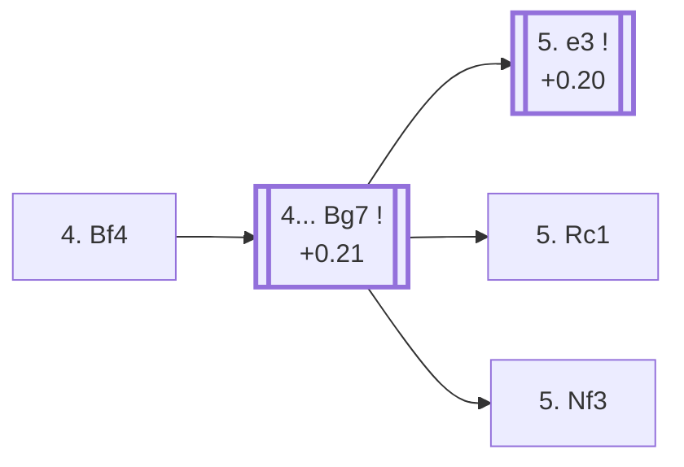

<a name="_TOP_"></a>

# D82 Grünfeld Defense: Brinckmann Attack <br> 1. d4 Nf6 2. c4 g6 3. Nc3 d5 4. Bf4 #

Continues from [D80's own root](https://github.com/onclemarcel/chess_flashcards/blob/main/d4_openings/D80_Grunfeld_Defense.md#_initial_move_), where White's **4. Bf4** is a real secondary (7.2% masters) — developing the bishop actively outside the pawn chain before committing the centre. `eco.md` leaves this bare tabiya named only "4.Bf4"; the live explorer independently calls it the **Brinckmann Attack**, a real name the code index itself doesn't carry. This position is also this file's own trunk for [D83](https://github.com/onclemarcel/chess_flashcards/blob/main/d4_openings/D83_Grunfeld_Gambit.md) and [D84](https://github.com/onclemarcel/chess_flashcards/blob/main/d4_openings/D84_Grunfeld_Gambit_Accepted.md), both reached a little deeper.

### Overview

*Quick map of every move covered on this card — see the [shape key](https://github.com/onclemarcel/chess_flashcards/blob/main/start.md#content-diagram-optional) in start.md.*

<!-- content-diagram:start -->

<!-- content-diagram:end -->

<a name="_initial_move_"></a>

[](https://lichess.org/analysis/standard/rnbqkb1r/ppp1pp1p/5np1/3p4/2PP1B2/2N5/PP2PPPP/R2QKBNR_b_KQkq_-_1_4)

*... 4. Bf4 — live-tagged the Brinckmann Attack*

```
rnbqkb1r/ppp1pp1p/5np1/3p4/2PP1B2/2N5/PP2PPPP/R2QKBNR b KQkq - 1 4
```

|  | +0.18 |
| --- | --- |

<!-- lichess-stats:start fen="rnbqkb1r/ppp1pp1p/5np1/3p4/2PP1B2/2N5/PP2PPPP/R2QKBNR b KQkq - 1 4" db="lichess,masters" speeds="bullet,blitz" ratings="1800,2000,2200,2500" moves="4" -->
| Move | Online | W/D/B | Masters | W/D/B | |
| :--- | ---: | :--- | ---: | :--- | :-- |
| Bg7 | 306 k (85.7%) | ⬜⬜⬜⬜⬜⬛⬛⬛⬛⬛ 48/6/46 | 3.1 k (99.2%) | ⬜⬜⬜🟫🟫🟫🟫🟫⬛⬛ 29/49/21 |  |
| c6 | 28 k (7.9%) | ⬜⬜⬜⬜⬜🟫⬛⬛⬛⬛ 51/7/42 | 17 (0.6%) | — |  |
| dxc4 | 9.0 k (2.5%) | ⬜⬜⬜⬜⬜🟫⬛⬛⬛⬛ 51/5/44 | 2 (0.1%) | — | ⚠ |
| a6 | 5.3 k (1.5%) | ⬜⬜⬜⬜⬜🟫⬛⬛⬛⬛ 52/5/43 | 0 | — | ⚠ |
| c5 | 0 | — | 5 (0.2%) | — |  |

*Online: bullet/blitz, 1800+ — 357 k games. Masters: 3.1 k games. [Open in the explorer](https://lichess.org/analysis/standard/rnbqkb1r/ppp1pp1p/5np1/3p4/2PP1B2/2N5/PP2PPPP/R2QKBNR_b_KQkq_-_1_4#explorer) — updated 2026-09-09*
<!-- lichess-stats:end -->

**4... Bg7** is close to automatic (99.2% of masters games) — the natural fianchetto, pressuring d4 down the long diagonal exactly as the whole opening intends.

* [**4... Bg7**](#_Bg7_) (+0.21, 99.2% masters): see below.

[*Back to TOP*](#_TOP_)

---

<a name="_Bg7_"></a>

## 4... Bg7

[](https://lichess.org/analysis/standard/rnbqk2r/ppp1ppbp/5np1/3p4/2PP1B2/2N5/PP2PPPP/R2QKBNR_w_KQkq_-_2_5)

*... 4... Bg7*

```
rnbqk2r/ppp1ppbp/5np1/3p4/2PP1B2/2N5/PP2PPPP/R2QKBNR w KQkq - 2 5
```

|  | +0.21 |
| --- | --- |

<!-- lichess-stats:start fen="rnbqk2r/ppp1ppbp/5np1/3p4/2PP1B2/2N5/PP2PPPP/R2QKBNR w KQkq - 2 5" db="lichess,masters" speeds="bullet,blitz" ratings="1800,2000,2200,2500" moves="4" -->
| Move | Online | W/D/B | Masters | W/D/B | |
| :--- | ---: | :--- | ---: | :--- | :-- |
| e3 | 222 k (65.9%) | ⬜⬜⬜⬜⬜🟫⬛⬛⬛⬛ 48/6/46 | 2.6 k (83.7%) | ⬜⬜⬜🟫🟫🟫🟫🟫⬛⬛ 29/50/21 |  |
| Nf3 | 40 k (12.0%) | ⬜⬜⬜⬜⬜⬛⬛⬛⬛⬛ 47/6/47 | 194 (6.3%) | ⬜⬜⬜🟫🟫🟫🟫🟫⬛⬛ 30/49/20 |  |
| c5 | 26 k (7.9%) | ⬜⬜⬜⬜⬜⬛⬛⬛⬛⬛ 48/4/48 | 0 | — | ⚠ |
| Qd2 | 11 k (3.2%) | ⬜⬜⬜⬜⬜⬛⬛⬛⬛⬛ 46/5/49 | 0 | — | ⚠ |
| Rc1 | 0 | — | 262 (8.6%) | ⬜⬜⬜🟫🟫🟫🟫⬛⬛⬛ 31/44/25 |  |
| Qa4+ | 0 | — | 34 (1.1%) | ⬜⬜⬜🟫🟫🟫🟫⬛⬛⬛ 26/38/35 |  |

*Online: bullet/blitz, 1800+ — 337 k games. Masters: 3.1 k games. [Open in the explorer](https://lichess.org/analysis/standard/rnbqk2r/ppp1ppbp/5np1/3p4/2PP1B2/2N5/PP2PPPP/R2QKBNR_w_KQkq_-_2_5#explorer) — updated 2026-09-09*
<!-- lichess-stats:end -->

**5. e3** is masters' clear main try (83.7%) — solidifying the centre and preparing to castle before Black can pile up on d4; it heads into the Grünfeld Gambit tabiya, its own code, [D83](https://github.com/onclemarcel/chess_flashcards/blob/main/d4_openings/D83_Grunfeld_Gambit.md). **5. Rc1** (8.6% masters) — an immediate rook lift, skipping e3 entirely — and **5. Nf3** (6.3% masters) are both real, secondary tries with no code of their own at this exact depth in this range.

* [**5. e3**](https://github.com/onclemarcel/chess_flashcards/blob/main/d4_openings/D83_Grunfeld_Gambit.md) (+0.20, 83.7% masters): the Grünfeld Gambit tabiya — its own code, D83.
* **5. Rc1** (8.6% masters, 3.2% online): a real, secondary try with no code of its own in this range.
* **5. Nf3** (6.3% masters, 12.0% online): a real, secondary try with no code of its own in this range.

[*Back to 4. Bf4*](#_initial_move_)
[*Back to TOP*](#_TOP_)
