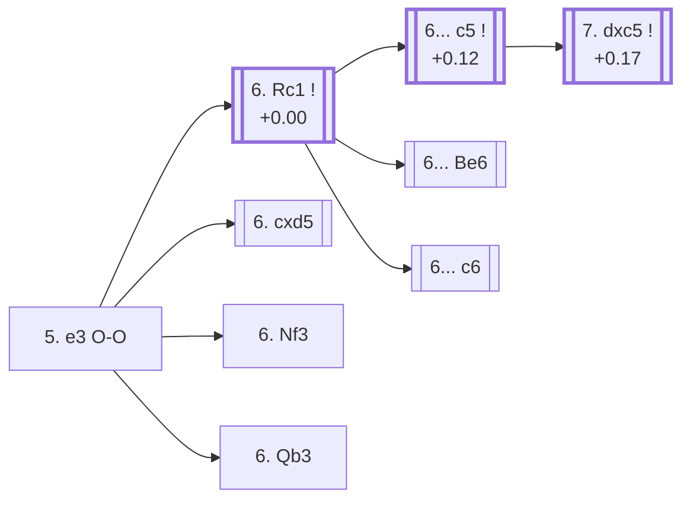

<a name="_TOP_"></a>

# D83 Grünfeld Defense: Brinckmann Attack, Grünfeld Gambit <br> 1. d4 Nf6 2. c4 g6 3. Nc3 d5 4. Bf4 Bg7 5. e3 O-O #

Continues from [D82's own "4... Bg7" node](https://github.com/onclemarcel/chess_flashcards/blob/main/d4_openings/D82_Grunfeld_Bf4.md#_Bg7_), where White's **5. e3** (83.7% masters) is the clear main try. Black castles naturally, reaching a genuine gambit tabiya: White can grab the c-pawn later with the bishop still eyeing c7, and the whole point of `eco.md`'s "Grünfeld Gambit" label is that Black is willing to let that pawn go for quick development and central pressure. This position is this file's own trunk for the *Capablanca* and *Botvinnik* Variations below, and separately for [D84](https://github.com/onclemarcel/chess_flashcards/blob/main/d4_openings/D84_Grunfeld_Gambit_Accepted.md)'s own Gambit Accepted line.

### Overview

*Quick map of every move covered on this card — see the [shape key](https://github.com/onclemarcel/chess_flashcards/blob/main/start.md#content-diagram-optional) in start.md.*

<!-- content-diagram:start -->

<!-- content-diagram:end -->

<a name="_initial_move_"></a>

[](https://lichess.org/analysis/standard/rnbq1rk1/ppp1ppbp/5np1/3p4/2PP1B2/2N1P3/PP3PPP/R2QKBNR_w_KQ_-_1_6)

*... 5. e3 O-O — Grünfeld Defense: Brinckmann Attack, Grünfeld Gambit*

```
rnbq1rk1/ppp1ppbp/5np1/3p4/2PP1B2/2N1P3/PP3PPP/R2QKBNR w KQ - 1 6
```

|  | +0.20 |
| --- | --- |

<!-- lichess-stats:start fen="rnbq1rk1/ppp1ppbp/5np1/3p4/2PP1B2/2N1P3/PP3PPP/R2QKBNR w KQ - 1 6" db="lichess,masters" speeds="bullet,blitz" ratings="1800,2000,2200,2500" moves="4" -->
| Move | Online | W/D/B | Masters | W/D/B | |
| :--- | ---: | :--- | ---: | :--- | :-- |
| Nf3 | 99 k (48.6%) | ⬜⬜⬜⬜⬜⬛⬛⬛⬛⬛ 46/6/48 | 210 (16.3%) | ⬜⬜⬜🟫🟫🟫🟫⬛⬛⬛ 30/45/26 |  |
| Rc1 | 27 k (13.4%) | ⬜⬜⬜⬜⬜🟫⬛⬛⬛⬛ 53/7/40 | 679 (52.6%) | ⬜⬜⬜🟫🟫🟫🟫🟫⬛⬛ 32/45/23 |  |
| cxd5 | 23 k (11.1%) | ⬜⬜⬜⬜⬜🟫⬛⬛⬛⬛ 48/9/43 | 300 (23.2%) | ⬜⬜🟫🟫🟫🟫🟫🟫⬛⬛ 24/59/17 |  |
| h3 | 21 k (10.2%) | ⬜⬜⬜⬜🟫⬛⬛⬛⬛⬛ 45/5/49 | 0 | — | ⚠ |
| Qb3 | 0 | — | 95 (7.4%) | ⬜⬜⬜⬜🟫🟫🟫🟫⬛⬛ 40/42/18 |  |

*Online: bullet/blitz, 1800+ — 203 k games. Masters: 1.3 k games. [Open in the explorer](https://lichess.org/analysis/standard/rnbq1rk1/ppp1ppbp/5np1/3p4/2PP1B2/2N1P3/PP3PPP/R2QKBNR_w_KQ_-_1_6#explorer) — updated 2026-09-14*
<!-- lichess-stats:end -->

**6. Rc1** is masters' clear main try (52.6%) — the *Capablanca Variation*, quietly getting the rook off the c-file's future pin before deciding anything else. **6. cxd5** (23.2% masters) resolves the tension at once and heads straight into the *Gambit Accepted* line, its own code, [D84](https://github.com/onclemarcel/chess_flashcards/blob/main/d4_openings/D84_Grunfeld_Gambit_Accepted.md). Both are real, well-populated trunks (1,289 sampled masters games combined). **6. Nf3** (16.3% masters, but actually online's *own* main try at 48.6% — a genuine database inversion) and **6. Qb3** (7.4% masters) are real, secondary tries with no code of their own in this range.

* [**6. Rc1**](#_Rc1_) (+0.00, 52.6% masters): the Capablanca Variation — see below.
* [**6. cxd5**](https://github.com/onclemarcel/chess_flashcards/blob/main/d4_openings/D84_Grunfeld_Gambit_Accepted.md) (23.2% masters): the Gambit Accepted — its own code, D84.
* **6. Nf3** (16.3% masters, 48.6% online — online's own main try): a real, secondary try with no code of its own in this range.
* **6. Qb3** (7.4% masters): a real, secondary try with no code of its own in this range.

[*Back to TOP*](#_TOP_)

---

<a name="_Rc1_"></a>

## 6. Rc1 — Capablanca Variation

[](https://lichess.org/analysis/standard/rnbq1rk1/ppp1ppbp/5np1/3p4/2PP1B2/2N1P3/PP3PPP/2RQKBNR_b_K_-_2_6)

*... 6. Rc1 — Capablanca Variation*

```
rnbq1rk1/ppp1ppbp/5np1/3p4/2PP1B2/2N1P3/PP3PPP/2RQKBNR b K - 2 6
```

|  | +0.00 |
| --- | --- |

<!-- lichess-stats:start fen="rnbq1rk1/ppp1ppbp/5np1/3p4/2PP1B2/2N1P3/PP3PPP/2RQKBNR b K - 2 6" db="lichess,masters" speeds="bullet,blitz" ratings="1800,2000,2200,2500" moves="4" -->
| Move | Online | W/D/B | Masters | W/D/B | |
| :--- | ---: | :--- | ---: | :--- | :-- |
| c5 | 17 k (52.0%) | ⬜⬜⬜⬜⬜🟫⬛⬛⬛⬛ 53/6/40 | 276 (33.9%) | ⬜⬜⬜⬜🟫🟫🟫🟫⬛⬛ 36/42/23 |  |
| c6 | 8.2 k (25.6%) | ⬜⬜⬜⬜⬜🟫⬛⬛⬛⬛ 54/7/38 | 190 (23.3%) | ⬜⬜⬜⬜🟫🟫🟫🟫⬛⬛ 41/41/19 |  |
| Be6 | 2.4 k (7.5%) | ⬜⬜⬜⬜🟫⬛⬛⬛⬛⬛ 44/10/46 | 271 (33.3%) | ⬜⬜🟫🟫🟫🟫🟫⬛⬛⬛ 23/50/27 |  |
| dxc4 | 2.1 k (6.7%) | ⬜⬜⬜⬜⬜🟫⬛⬛⬛⬛ 52/8/40 | 73 (9.0%) | ⬜⬜⬜🟫🟫🟫🟫🟫⬛⬛ 27/55/18 |  |

*Online: bullet/blitz, 1800+ — 32 k games. Masters: 815 games. [Open in the explorer](https://lichess.org/analysis/standard/rnbq1rk1/ppp1ppbp/5np1/3p4/2PP1B2/2N1P3/PP3PPP/2RQKBNR_b_K_-_2_6#explorer) — updated 2026-09-14*
<!-- lichess-stats:end -->

**A genuine, near-even three-way fork worth flagging plainly**: masters' top three replies sit within a few points of each other — **6... c5** (33.9%, heading into the Botvinnik Variation below), **6... Be6** (33.3%, real but uncoded further in this range), and **6... c6** (23.3%, likewise uncoded) — with **6... dxc4** (9.0%) a clear fourth. This is one of the flattest distributions found anywhere in this batch; no single reply dominates.

* [**6... c5**](#_c5_) (+0.12, 33.9% masters): the Botvinnik Variation's own trunk — see below.
* **6... Be6** (33.3% masters): a real, secondary try with no code of its own in this range.
* **6... c6** (23.3% masters): a real, secondary try with no code of its own in this range.
* **6... dxc4** (9.0% masters): a real, secondary try with no code of its own in this range.

[*Back to 5. e3 O-O*](#_initial_move_)
[*Back to TOP*](#_TOP_)

---

<a name="_c5_"></a>

### 6... c5

[](https://lichess.org/analysis/standard/rnbq1rk1/pp2ppbp/5np1/2pp4/2PP1B2/2N1P3/PP3PPP/2RQKBNR_w_K_c6_0_7)

*... 6... c5*

```
rnbq1rk1/pp2ppbp/5np1/2pp4/2PP1B2/2N1P3/PP3PPP/2RQKBNR w K c6 0 7
```

|  | +0.12 |
| --- | --- |

<!-- lichess-stats:start fen="rnbq1rk1/pp2ppbp/5np1/2pp4/2PP1B2/2N1P3/PP3PPP/2RQKBNR w K c6 0 7" db="lichess,masters" speeds="bullet,blitz" ratings="1800,2000,2200,2500" moves="3" -->
| Move | Online | W/D/B | Masters | W/D/B | |
| :--- | ---: | :--- | ---: | :--- | :-- |
| dxc5 | 16 k (93.0%) | ⬜⬜⬜⬜⬜🟫⬛⬛⬛⬛ 54/6/40 | 272 (98.6%) | ⬜⬜⬜⬜🟫🟫🟫🟫⬛⬛ 36/42/22 |  |
| Nf3 | 542 (3.2%) | ⬜⬜⬜⬜⬜⬛⬛⬛⬛⬛ 49/5/45 | 2 (0.7%) | — | ⚠ |
| cxd5 | 507 (3.0%) | ⬜⬜⬜⬜🟫⬛⬛⬛⬛⬛ 38/7/55 | 0 | — | ⚠ |
| Bd3 | 0 | — | 1 (0.4%) | — |  |

*Online: bullet/blitz, 1800+ — 17 k games. Masters: 276 games. [Open in the explorer](https://lichess.org/analysis/standard/rnbq1rk1/pp2ppbp/5np1/2pp4/2PP1B2/2N1P3/PP3PPP/2RQKBNR_w_K_c6_0_7#explorer) — updated 2026-09-14*
<!-- lichess-stats:end -->

**7. dxc5** is close to automatic (98.6% of masters games) — taking the pawn, since declining hands Black an easy game against the isolated d-pawn instead.

<a name="_Botvinnik_"></a>

[](https://lichess.org/analysis/standard/rn1q1rk1/pp2ppbp/4bnp1/2Pp4/2P2B2/2N1P3/PP3PPP/2RQKBNR_w_K_-_1_8)

*... 7. dxc5 Be6 — Botvinnik Variation*

```
rn1q1rk1/pp2ppbp/4bnp1/2Pp4/2P2B2/2N1P3/PP3PPP/2RQKBNR w K - 1 8
```

|  | +0.17 |
| --- | --- |

Live-tagged **Grünfeld Defense: Brinckmann Attack, Grünfeld Gambit, Botvinnik Variation**, confirming the name. Black regains the pawn shortly with the bishop eyeing c5, the point of accepting the earlier tension.

[*Back to 6. Rc1*](#_Rc1_)
[*Back to TOP*](#_TOP_)
