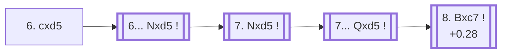

<a name="_TOP_"></a>

# D84 Grünfeld Defense: Brinckmann Attack, Grünfeld Gambit, Accepted <br> 1. d4 Nf6 2. c4 g6 3. Nc3 d5 4. Bf4 Bg7 5. e3 O-O 6. cxd5 Nxd5 7. Nxd5 Qxd5 8. Bxc7 #

Continues from [D83's own root](https://github.com/onclemarcel/chess_flashcards/blob/main/d4_openings/D83_Grunfeld_Gambit.md#_initial_move_), where White's **6. cxd5** (23.2% masters) resolves the central tension immediately rather than inserting 6. Rc1 first. This is the literal Gambit *Accepted*: White eventually snaps up the c7 pawn with the dark-squared bishop, a small but real material grab for a couple of tempi.

### Overview

*Quick map of every move covered on this card — see the [shape key](https://github.com/onclemarcel/chess_flashcards/blob/main/start.md#content-diagram-optional) in start.md.*

<!-- content-diagram:start -->

<!-- content-diagram:end -->

<a name="_initial_move_"></a>

[](https://lichess.org/analysis/standard/rnbq1rk1/ppp1ppbp/5np1/3P4/3P1B2/2N1P3/PP3PPP/R2QKBNR_b_KQ_-_0_6)

*... 6. cxd5*

```
rnbq1rk1/ppp1ppbp/5np1/3P4/3P1B2/2N1P3/PP3PPP/R2QKBNR b KQ - 0 6
```

|  | +0.26 |
| --- | --- |

Black's recapture, **6... Nxd5** (100% of masters games — completely forced, the only recapture available), is followed by White's own **7. Nxd5** (also 100% masters), trading the knight that just recaptured; Black recaptures again with **7... Qxd5** (100% masters), and now the point of the whole line arrives:

[](https://lichess.org/analysis/standard/rnb2rk1/ppp1ppbp/6p1/3q4/3P1B2/4P3/PP3PPP/R2QKBNR_w_KQ_-_0_8)

*... 7... Qxd5*

```
rnb2rk1/ppp1ppbp/6p1/3q4/3P1B2/4P3/PP3PPP/R2QKBNR w KQ - 0 8
```

|  | +0.28 |
| --- | --- |

<!-- lichess-stats:start fen="rnb2rk1/ppp1ppbp/6p1/3q4/3P1B2/4P3/PP3PPP/R2QKBNR w KQ - 0 8" db="lichess,masters" speeds="bullet,blitz" ratings="1800,2000,2200,2500" moves="3" -->
| Move | Online | W/D/B | Masters | W/D/B | |
| :--- | ---: | :--- | ---: | :--- | :-- |
| Bxc7 | 15 k (72.4%) | ⬜⬜⬜⬜⬜🟫⬛⬛⬛⬛ 54/10/36 | 302 (99.7%) | ⬜⬜🟫🟫🟫🟫🟫🟫⬛⬛ 24/60/16 |  |
| Nf3 | 3.6 k (18.0%) | ⬜⬜⬜⬜🟫⬛⬛⬛⬛⬛ 38/7/55 | 0 | — | ⚠ |
| Ne2 | 389 (1.9%) | ⬜⬜⬜⬜⬜⬛⬛⬛⬛⬛ 46/6/48 | 1 (0.3%) | — | ⚠ |

*Online: bullet/blitz, 1800+ — 20 k games. Masters: 303 games. [Open in the explorer](https://lichess.org/analysis/standard/rnb2rk1/ppp1ppbp/6p1/3q4/3P1B2/4P3/PP3PPP/R2QKBNR_w_KQ_-_0_8#explorer) — updated 2026-09-14*
<!-- lichess-stats:end -->

<a name="_Bxc7_"></a>

**8. Bxc7** is close to automatic (99.7% of masters games) — grabbing the pawn, since the bishop has no more useful post and the pawn is simply hanging.

[](https://lichess.org/analysis/standard/rnb2rk1/ppB1ppbp/6p1/3q4/3P4/4P3/PP3PPP/R2QKB1R_b_KQ_-_0_8)

*... 8. Bxc7 — Grünfeld Gambit, Accepted*

```
rnb2rk1/ppB1ppbp/6p1/3q4/3P4/4P3/PP3PPP/R2QKB1R b KQ - 0 8
```

`eco.md`'s own named line ends here. This exact position carries 0 recorded games in either database and no cached Stockfish cloud-eval — a genuine, confirmed-live dead end past the pawn grab itself, rather than an assumed one; the position one ply earlier (above) evaluates at +0.28, a small but real material-plus-tempo edge for White that Black's development lead only partly offsets.

[*Back to D83's own root*](https://github.com/onclemarcel/chess_flashcards/blob/main/d4_openings/D83_Grunfeld_Gambit.md#_initial_move_)
[*Back to TOP*](#_TOP_)
