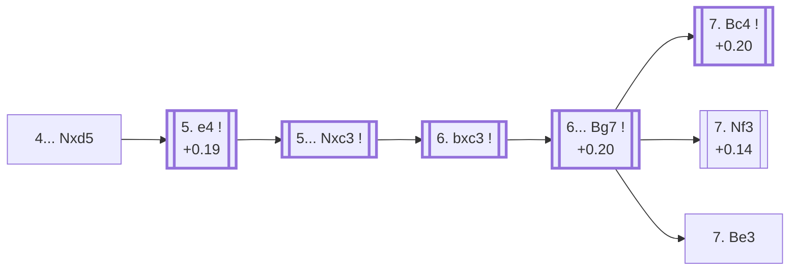

<a name="_TOP_"></a>

# D85 Grünfeld Defense: Exchange Variation <br> 1. d4 Nf6 2. c4 g6 3. Nc3 d5 4. cxd5 Nxd5 #

Continues from [D80's own root](https://github.com/onclemarcel/chess_flashcards/blob/main/d4_openings/D80_Grunfeld_Defense.md#_initial_move_), where White's **4. cxd5** (53.1% masters) is the clear main try — the Exchange Variation, resolving the central tension immediately and inviting Black to recapture with the knight. This card, along with [D86](https://github.com/onclemarcel/chess_flashcards/blob/main/d4_openings/D86_Grunfeld_Exchange_Classical_Variation.md), [D87](https://github.com/onclemarcel/chess_flashcards/blob/main/d4_openings/D87_Grunfeld_Exchange_Spassky_Variation.md), [D88](https://github.com/onclemarcel/chess_flashcards/blob/main/d4_openings/D88_Grunfeld_Exchange_Spassky_Main_Line.md), and [D89](https://github.com/onclemarcel/chess_flashcards/blob/main/d4_openings/D89_Grunfeld_Exchange_Spassky_13Bd3.md), is a retrofit and expansion of a pre-sweep file (`D85_Grunfeld.md`) that already covered this whole trunk soundly, in the older no-Overview-diagram style, before the current systematic D-series sweep reached this code range. That file's own D80-level root content (3... d5 itself) has moved to [D80's own new card](https://github.com/onclemarcel/chess_flashcards/blob/main/d4_openings/D80_Grunfeld_Defense.md) instead — this card now starts at its own actual root, the same "continues from" cross-linking convention used everywhere else in this sweep rather than duplicating a shared ancestor node. The old file's own genuinely good analysis through **4... Nxd5 5. e4 Nxc3 6. bxc3 Bg7** is kept intact below (refreshed against a live requery), and its own 7th-move fork — explicitly left "not covered further" before this batch — is now actually built out into real, followed nodes: **7. Nf3** (this card's own second `eco.md` entry, the *Modern Exchange Variation*) and **7. Bc4** (its own code, D86, the deepest single sub-tree in this whole batch, running D86→D87→D88→D89).

### Overview

*Quick map of every move covered on this card — see the [shape key](https://github.com/onclemarcel/chess_flashcards/blob/main/start.md#content-diagram-optional) in start.md.*

<!-- content-diagram:start -->

<!-- content-diagram:end -->

<a name="_initial_move_"></a>

[](https://lichess.org/analysis/standard/rnbqkb1r/ppp1pp1p/6p1/3n4/3P4/2N5/PP2PPPP/R1BQKBNR_w_KQkq_-_0_5)

*... 4. cxd5 Nxd5 — Grünfeld Defense: Exchange Variation*

```
rnbqkb1r/ppp1pp1p/6p1/3n4/3P4/2N5/PP2PPPP/R1BQKBNR w KQkq - 0 5
```

|  | +0.19 |
| --- | --- |

<!-- lichess-stats:start fen="rnbqkb1r/ppp1pp1p/6p1/3n4/3P4/2N5/PP2PPPP/R1BQKBNR w KQkq - 0 5" db="lichess,masters" speeds="bullet,blitz" ratings="1800,2000,2200,2500" moves="4" -->
| Move | Online | W/D/B | Masters | W/D/B | |
| :--- | ---: | :--- | ---: | :--- | :-- |
| e4 | 2.2 M (79.2%) | ⬜⬜⬜⬜🟫⬛⬛⬛⬛⬛ 46/7/47 | 19 k (83.5%) | ⬜⬜⬜🟫🟫🟫🟫🟫⬛⬛ 28/54/18 |  |
| Bd2 | 186 k (6.7%) | ⬜⬜⬜⬜⬜🟫⬛⬛⬛⬛ 50/8/43 | 2.7 k (11.7%) | ⬜⬜⬜🟫🟫🟫🟫🟫⬛⬛ 32/48/21 |  |
| Nf3 | 157 k (5.7%) | ⬜⬜⬜⬜🟫⬛⬛⬛⬛⬛ 46/7/48 | 0 | — | ⚠ |
| e3 | 56 k (2.0%) | ⬜⬜⬜⬜🟫⬛⬛⬛⬛⬛ 46/6/48 | 0 | — | ⚠ |
| g3 | 0 | — | 407 (1.8%) | ⬜⬜⬜🟫🟫🟫🟫⬛⬛⬛ 30/43/27 |  |
| Na4 | 0 | — | 316 (1.4%) | ⬜⬜⬜🟫🟫🟫🟫⬛⬛⬛ 34/41/25 |  |

*Online: bullet/blitz, 1800+ — 2.8 M games. Masters: 23 k games. [Open in the explorer](https://lichess.org/analysis/standard/rnbqkb1r/ppp1pp1p/6p1/3n4/3P4/2N5/PP2PPPP/R1BQKBNR_w_KQkq_-_0_5#explorer) — updated 2026-09-07*
<!-- lichess-stats:end -->

**5. e4** is masters' overwhelming main try (83.5%) — driving the knight away and completing the big centre the Grünfeld is built to attack.

* [**5. e4**](#_e4_) (+0.19, 83.5% masters): see below.

[*Back to TOP*](#_TOP_)

---

<a name="_e4_"></a>

## 5. e4

[](https://lichess.org/analysis/standard/rnbqkb1r/ppp1pp1p/6p1/3n4/3PP3/2N5/PP3PPP/R1BQKBNR_b_KQkq_e3_0_5)

*... 5. e4*

```
rnbqkb1r/ppp1pp1p/6p1/3n4/3PP3/2N5/PP3PPP/R1BQKBNR b KQkq e3 0 5
```

|  | +0.1 |
| --- | --- |

<!-- lichess-stats:start fen="rnbqkb1r/ppp1pp1p/6p1/3n4/3PP3/2N5/PP3PPP/R1BQKBNR b KQkq e3 0 5" db="lichess,masters" speeds="bullet,blitz" ratings="1800,2000,2200,2500" moves="3" -->
| Move | Online | W/D/B | Masters | W/D/B | |
| :--- | ---: | :--- | ---: | :--- | :-- |
| Nxc3 | 2.2 M (98.3%) | ⬜⬜⬜⬜🟫⬛⬛⬛⬛⬛ 46/7/47 | 19 k (99.7%) | ⬜⬜⬜🟫🟫🟫🟫🟫⬛⬛ 28/54/18 |  |
| Nb6 | 24 k (1.1%) | ⬜⬜⬜⬜⬜⬛⬛⬛⬛⬛ 48/6/46 | 60 (0.3%) | ⬜⬜⬜⬜⬜🟫🟫⬛⬛⬛ 48/25/27 |  |
| Nf6 | 10 k (0.5%) | ⬜⬜⬜⬜⬜⬜⬛⬛⬛⬛ 56/4/40 | 1 (0.0%) | — | ⚠ |

*Online: bullet/blitz, 1800+ — 2.2 M games. Masters: 19 k games. [Open in the explorer](https://lichess.org/analysis/standard/rnbqkb1r/ppp1pp1p/6p1/3n4/3PP3/2N5/PP3PPP/R1BQKBNR_b_KQkq_e3_0_5#explorer) — updated 2026-09-07*
<!-- lichess-stats:end -->

**5... Nxc3** is essentially forced — the knight has no better square, and it's played in 99.7% of masters games.

* [**5... Nxc3**](#_Nxc3_) (+0.1, 99.7% masters): see below.

[*Back to 4... Nxd5*](#_initial_move_)
[*Back to TOP*](#_TOP_)

---

<a name="_Nxc3_"></a>

## 5... Nxc3

[](https://lichess.org/analysis/standard/rnbqkb1r/ppp1pp1p/6p1/8/3PP3/2n5/PP3PPP/R1BQKBNR_w_KQkq_-_0_6)

*... 5... Nxc3*

```
rnbqkb1r/ppp1pp1p/6p1/8/3PP3/2n5/PP3PPP/R1BQKBNR w KQkq - 0 6
```

|  | +0.1 |
| --- | --- |

**6. bxc3** is completely forced — recapturing is the only way to avoid simply losing the piece, reaching the main Exchange Grünfeld tabiya with a full pawn centre against Black's fianchettoed bishop pressure on d4.

[](https://lichess.org/analysis/standard/rnbqkb1r/ppp1pp1p/6p1/8/3PP3/2P5/P4PPP/R1BQKBNR_b_KQkq_-_0_6)

*... 6. bxc3 — Exchange Grünfeld tabiya*

```
rnbqkb1r/ppp1pp1p/6p1/8/3PP3/2P5/P4PPP/R1BQKBNR b KQkq - 0 6
```

|  | +0.2 |
| --- | --- |

<!-- lichess-stats:start fen="rnbqkb1r/ppp1pp1p/6p1/8/3PP3/2P5/P4PPP/R1BQKBNR b KQkq - 0 6" db="lichess,masters" speeds="bullet,blitz" ratings="1800,2000,2200,2500" moves="4" -->
| Move | Online | W/D/B | Masters | W/D/B | |
| :--- | ---: | :--- | ---: | :--- | :-- |
| Bg7 | 2.0 M (88.2%) | ⬜⬜⬜⬜🟫⬛⬛⬛⬛⬛ 46/7/47 | 18 k (97.3%) | ⬜⬜⬜🟫🟫🟫🟫🟫⬛⬛ 28/55/18 |  |
| c5 | 256 k (11.5%) | ⬜⬜⬜⬜🟫⬛⬛⬛⬛⬛ 46/7/47 | 496 (2.6%) | ⬜⬜⬜⬜🟫🟫🟫🟫⬛⬛ 37/45/18 |  |
| e5 | 1.7 k (0.1%) | ⬜⬜⬜⬜⬜🟫⬛⬛⬛⬛ 55/5/40 | 4 (0.0%) | — | ⚠ |
| c6 | 1.3 k (0.1%) | ⬜⬜⬜⬜⬜🟫⬛⬛⬛⬛ 54/5/41 | 0 | — | ⚠ |
| b6 | 0 | — | 3 (0.0%) | — |  |

*Online: bullet/blitz, 1800+ — 2.2 M games. Masters: 19 k games. [Open in the explorer](https://lichess.org/analysis/standard/rnbqkb1r/ppp1pp1p/6p1/8/3PP3/2P5/P4PPP/R1BQKBNR_b_KQkq_-_0_6#explorer) — updated 2026-09-07*
<!-- lichess-stats:end -->

**6... Bg7** is close to automatic (97.3% of masters games) — completing the fianchetto that gives the whole opening its point, pressuring d4 down the long diagonal before deciding on ... c5 or ... c6.

* [**6... Bg7**](#_Bg7_) (+0.20, 97.3% masters): see below.

[*Back to 5... Nxc3*](#_Nxc3_)
[*Back to TOP*](#_TOP_)

---

<a name="_Bg7_"></a>

## 6... Bg7

[](https://lichess.org/analysis/standard/rnbqk2r/ppp1ppbp/6p1/8/3PP3/2P5/P4PPP/R1BQKBNR_w_KQkq_-_1_7)

*... 6... Bg7*

```
rnbqk2r/ppp1ppbp/6p1/8/3PP3/2P5/P4PPP/R1BQKBNR w KQkq - 1 7
```

|  | +0.20 |
| --- | --- |

<!-- lichess-stats:start fen="rnbqk2r/ppp1ppbp/6p1/8/3PP3/2P5/P4PPP/R1BQKBNR w KQkq - 1 7" db="lichess,masters" speeds="bullet,blitz" ratings="1800,2000,2200,2500" moves="3" -->
| Move | Online | W/D/B | Masters | W/D/B | |
| :--- | ---: | :--- | ---: | :--- | :-- |
| Bc4 | 703 k (35.9%) | ⬜⬜⬜⬜⬜⬛⬛⬛⬛⬛ 47/7/47 | 7.1 k (38.5%) | ⬜⬜⬜🟫🟫🟫🟫🟫⬛⬛ 26/56/17 |  |
| Nf3 | 550 k (28.1%) | ⬜⬜⬜⬜⬜🟫⬛⬛⬛⬛ 47/8/46 | 6.6 k (35.6%) | ⬜⬜⬜🟫🟫🟫🟫🟫🟫⬛ 26/58/16 |  |
| Be3 | 273 k (13.9%) | ⬜⬜⬜⬜⬜🟫⬛⬛⬛⬛ 47/8/45 | 2.3 k (12.4%) | ⬜⬜⬜🟫🟫🟫🟫🟫⬛⬛ 29/52/18 |  |

*Online: bullet/blitz, 1800+ — 2.0 M games. Masters: 18 k games. [Open in the explorer](https://lichess.org/analysis/standard/rnbqk2r/ppp1ppbp/6p1/8/3PP3/2P5/P4PPP/R1BQKBNR_w_KQkq_-_1_7#explorer) — updated 2026-09-07*
<!-- lichess-stats:end -->

White's 7th move is a genuine three-way split: **7. Bc4** (38.5% masters) — the actual masters plurality — develops actively toward f7 and is this whole batch's deepest single sub-tree, its own code, [D86](https://github.com/onclemarcel/chess_flashcards/blob/main/d4_openings/D86_Grunfeld_Exchange_Classical_Variation.md); **7. Nf3** (35.6%) simply completes development first, this card's own second `eco.md` entry, the *Modern Exchange Variation* (see below); and **7. Be3** (12.4%) prepares Qd2 while supporting d4 directly — real and secondary, but with no code of its own in this range (not to be confused with D86's own further sub-line naming; no transposition claim is made here without verification).

* [**7. Bc4**](https://github.com/onclemarcel/chess_flashcards/blob/main/d4_openings/D86_Grunfeld_Exchange_Classical_Variation.md) (+0.20, 38.5% masters): the Classical Variation, masters' actual plurality — its own code, D86.
* [**7. Nf3**](#_Nf3_) (+0.14, 35.6% masters): the Modern Exchange Variation — see below.
* **7. Be3** (12.4% masters): a real, secondary try with no code of its own in this range.

[*Back to 6... Bg7*](#_Bg7_)
[*Back to TOP*](#_TOP_)

---

<a name="_Nf3_"></a>

## 7. Nf3 — Modern Exchange Variation

[](https://lichess.org/analysis/standard/rnbqk2r/ppp1ppbp/6p1/8/3PP3/2P2N2/P4PPP/R1BQKB1R_b_KQkq_-_2_7)

*... 7. Nf3 — Modern Exchange Variation*

```
rnbqk2r/ppp1ppbp/6p1/8/3PP3/2P2N2/P4PPP/R1BQKB1R b KQkq - 2 7
```

|  | +0.14 |
| --- | --- |

<!-- lichess-stats:start fen="rnbqk2r/ppp1ppbp/6p1/8/3PP3/2P2N2/P4PPP/R1BQKB1R b KQkq - 2 7" db="lichess,masters" speeds="bullet,blitz" ratings="1800,2000,2200,2500" moves="3" -->
| Move | Online | W/D/B | Masters | W/D/B | |
| :--- | ---: | :--- | ---: | :--- | :-- |
| c5 | 755 k (62.6%) | ⬜⬜⬜⬜⬜🟫⬛⬛⬛⬛ 46/8/46 | 9.5 k (90.9%) | ⬜⬜🟫🟫🟫🟫🟫🟫⬛⬛ 26/58/16 |  |
| O-O | 424 k (35.1%) | ⬜⬜⬜⬜⬜🟫⬛⬛⬛⬛ 47/7/46 | 938 (9.0%) | ⬜⬜⬜⬜🟫🟫🟫🟫⬛⬛ 40/40/20 |  |
| Bg4 | 14 k (1.1%) | ⬜⬜⬜⬜⬜🟫⬛⬛⬛⬛ 51/7/42 | 0 | — | ⚠ |
| b6 | 0 | — | 11 (0.1%) | — |  |

*Online: bullet/blitz, 1800+ — 1.2 M games. Masters: 10 k games. [Open in the explorer](https://lichess.org/analysis/standard/rnbqk2r/ppp1ppbp/6p1/8/3PP3/2P2N2/P4PPP/R1BQKB1R_b_KQkq_-_2_7#explorer) — updated 2026-09-07*
<!-- lichess-stats:end -->

Live-tagged **Grünfeld Defense: Exchange Variation, Modern Exchange Variation**, confirming the name. **7... c5** is masters' overwhelming main try (90.9%) — striking at the centre at once, well ahead of the more patient **7... O-O** (9.0%). This card's own `eco.md` entry ends at the bare 7. Nf3 tabiya; the deep follow-up theory here largely mirrors the classical structures explored on the D86-D89 spine, but sits outside this batch's own coded range (backlog).

* **7... c5** (90.9% masters, 62.6% online): masters' overwhelming main try — not built out further here (backlog).
* **7... O-O** (9.0% masters): a real, secondary try, not built out further here.

[*Back to 6... Bg7*](#_Bg7_)
[*Back to TOP*](#_TOP_)
