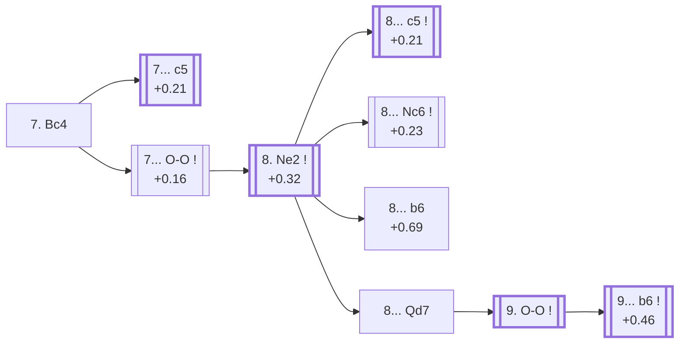

<a name="_TOP_"></a>

# D86 Grünfeld Defense: Exchange Variation, Classical Variation <br> 1. d4 Nf6 2. c4 g6 3. Nc3 d5 4. cxd5 Nxd5 5. e4 Nxc3 6. bxc3 Bg7 7. Bc4 #

Continues from [D85's own "6... Bg7" node](https://github.com/onclemarcel/chess_flashcards/blob/main/d4_openings/D85_Grunfeld_Exchange_Variation.md#_Bg7_), where White's **7. Bc4** is masters' actual plurality (38.5%) at a genuine three-way split, developing toward f7 rather than completing development quietly with Nf3. This is the deepest single sub-tree in this whole batch: this card, [D87](https://github.com/onclemarcel/chess_flashcards/blob/main/d4_openings/D87_Grunfeld_Exchange_Spassky_Variation.md), [D88](https://github.com/onclemarcel/chess_flashcards/blob/main/d4_openings/D88_Grunfeld_Exchange_Spassky_Main_Line.md), and [D89](https://github.com/onclemarcel/chess_flashcards/blob/main/d4_openings/D89_Grunfeld_Exchange_Spassky_13Bd3.md) form one long spine, not four independent siblings.

### Overview

*Quick map of every move covered on this card — see the [shape key](https://github.com/onclemarcel/chess_flashcards/blob/main/start.md#content-diagram-optional) in start.md.*

<!-- content-diagram:start -->

<!-- content-diagram:end -->

<a name="_initial_move_"></a>

[](https://lichess.org/analysis/standard/rnbqk2r/ppp1ppbp/6p1/8/2BPP3/2P5/P4PPP/R1BQK1NR_b_KQkq_-_2_7)

*... 7. Bc4 — Grünfeld Defense: Exchange Variation, Classical Variation*

```
rnbqk2r/ppp1ppbp/6p1/8/2BPP3/2P5/P4PPP/R1BQK1NR b KQkq - 2 7
```

|  | +0.20 |
| --- | --- |

<!-- lichess-stats:start fen="rnbqk2r/ppp1ppbp/6p1/8/2BPP3/2P5/P4PPP/R1BQK1NR b KQkq - 2 7" db="lichess,masters" speeds="bullet,blitz" ratings="1800,2000,2200,2500" moves="3" -->
| Move | Online | W/D/B | Masters | W/D/B | |
| :--- | ---: | :--- | ---: | :--- | :-- |
| c5 | 445 k (63.2%) | ⬜⬜⬜⬜🟫⬛⬛⬛⬛⬛ 47/7/47 | 5.5 k (77.7%) | ⬜⬜🟫🟫🟫🟫🟫🟫⬛⬛ 25/59/16 |  |
| O-O | 253 k (36.0%) | ⬜⬜⬜⬜⬜⬛⬛⬛⬛⬛ 47/6/47 | 1.5 k (21.2%) | ⬜⬜⬜🟫🟫🟫🟫🟫⬛⬛ 33/46/21 |  |
| Nc6 | 1.2 k (0.2%) | ⬜⬜⬜⬜⬜⬛⬛⬛⬛⬛ 52/4/44 | 30 (0.4%) | ⬜⬜⬜🟫🟫🟫⬛⬛⬛⬛ 27/30/43 |  |

*Online: bullet/blitz, 1800+ — 704 k games. Masters: 7.1 k games. [Open in the explorer](https://lichess.org/analysis/standard/rnbqk2r/ppp1ppbp/6p1/8/2BPP3/2P5/P4PPP/R1BQK1NR_b_KQkq_-_2_7#explorer) — updated 2026-09-15*
<!-- lichess-stats:end -->

**A genuine, well-verified finding worth flagging plainly**: masters' actual most popular reply here, **7... c5** (77.7%!), delays castling entirely — a different move order from every one of `eco.md`'s own D86-D89 lines below, all of which castle first (7... O-O). Verified via `apply_san.py`: playing 8. Ne2 O-O 9. O-O from this immediate-c5 order reaches the exact same FEN (piece placement, side to move, and castling rights all identical — differing only in the en-passant flag and halfmove clock, the same harmless kind of drift already documented at D70's own transposition note) as [D87's own root position](https://github.com/onclemarcel/chess_flashcards/blob/main/d4_openings/D87_Grunfeld_Exchange_Spassky_Variation.md#_initial_move_) reached via `eco.md`'s coded order. So masters' real preference isn't a rival, uncoded system at all — it's simply reaching D87's own tabiya by a different, and actually more popular, move order. **7... O-O** (21.2% masters) is `eco.md`'s own listed order and this card's own followed line, since it's the one that keeps the Larsen/Simagin sub-lines (all D86's own further entries) reachable before Black commits to ... c5.

* **7... c5** (+0.21, 77.7% masters, 63.2% online): masters' actual plurality — verified to transpose into D87's own tabiya via a different move order.
* [**7... O-O**](#_OO_) (+0.16, 21.2% masters): `eco.md`'s own listed order — see below.

[*Back to D85's own "6... Bg7"*](https://github.com/onclemarcel/chess_flashcards/blob/main/d4_openings/D85_Grunfeld_Exchange_Variation.md#_Bg7_)
[*Back to TOP*](#_TOP_)

---

<a name="_OO_"></a>

## 7... O-O

[](https://lichess.org/analysis/standard/rnbq1rk1/ppp1ppbp/6p1/8/2BPP3/2P5/P4PPP/R1BQK1NR_w_KQ_-_3_8)

*... 7... O-O*

```
rnbq1rk1/ppp1ppbp/6p1/8/2BPP3/2P5/P4PPP/R1BQK1NR w KQ - 3 8
```

|  | +0.16 |
| --- | --- |

<!-- lichess-stats:start fen="rnbq1rk1/ppp1ppbp/6p1/8/2BPP3/2P5/P4PPP/R1BQK1NR w KQ - 3 8" db="lichess,masters" speeds="bullet,blitz" ratings="1800,2000,2200,2500" moves="3" -->
| Move | Online | W/D/B | Masters | W/D/B | |
| :--- | ---: | :--- | ---: | :--- | :-- |
| Ne2 | 202 k (79.6%) | ⬜⬜⬜⬜⬜🟫⬛⬛⬛⬛ 48/6/46 | 1.4 k (92.4%) | ⬜⬜⬜🟫🟫🟫🟫🟫⬛⬛ 32/47/21 |  |
| Be3 | 28 k (11.0%) | ⬜⬜⬜⬜🟫⬛⬛⬛⬛⬛ 46/6/48 | 105 (7.0%) | ⬜⬜⬜⬜🟫🟫🟫🟫⬛⬛ 43/37/20 |  |
| Nf3 | 15 k (5.9%) | ⬜⬜⬜⬜🟫⬛⬛⬛⬛⬛ 42/6/51 | 0 | — | ⚠ |
| Ba3 | 0 | — | 3 (0.2%) | — |  |

*Online: bullet/blitz, 1800+ — 253 k games. Masters: 1.5 k games. [Open in the explorer](https://lichess.org/analysis/standard/rnbq1rk1/ppp1ppbp/6p1/8/2BPP3/2P5/P4PPP/R1BQK1NR_w_KQ_-_3_8#explorer) — updated 2026-09-15*
<!-- lichess-stats:end -->

**8. Ne2** is masters' overwhelming main try (92.4%) — developing the knight off d-file crossfire and keeping f2-f4 ideas open, well ahead of the uncoded secondary **8. Be3** (7.0%).

* [**8. Ne2**](#_Ne2_) (+0.32, 92.4% masters): see below.

[*Back to 7. Bc4*](#_initial_move_)
[*Back to TOP*](#_TOP_)

---

<a name="_Ne2_"></a>

## 8. Ne2

[](https://lichess.org/analysis/standard/rnbq1rk1/ppp1ppbp/6p1/8/2BPP3/2P5/P3NPPP/R1BQK2R_b_KQ_-_4_8)

*... 8. Ne2*

```
rnbq1rk1/ppp1ppbp/6p1/8/2BPP3/2P5/P3NPPP/R1BQK2R b KQ - 4 8
```

|  | +0.32 |
| --- | --- |

<!-- lichess-stats:start fen="rnbq1rk1/ppp1ppbp/6p1/8/2BPP3/2P5/P3NPPP/R1BQK2R b KQ - 4 8" db="lichess,masters" speeds="bullet,blitz" ratings="1800,2000,2200,2500" moves="4" -->
| Move | Online | W/D/B | Masters | W/D/B | |
| :--- | ---: | :--- | ---: | :--- | :-- |
| c5 | 178 k (87.9%) | ⬜⬜⬜⬜⬜🟫⬛⬛⬛⬛ 48/6/46 | 803 (57.9%) | ⬜⬜⬜🟫🟫🟫🟫🟫⬛⬛ 29/51/20 |  |
| Nc6 | 8.7 k (4.3%) | ⬜⬜⬜⬜🟫⬛⬛⬛⬛⬛ 45/6/49 | 368 (26.6%) | ⬜⬜⬜🟫🟫🟫🟫⬛⬛⬛ 33/43/24 |  |
| b6 | 5.3 k (2.6%) | ⬜⬜⬜⬜🟫⬛⬛⬛⬛⬛ 44/7/49 | 124 (8.9%) | ⬜⬜⬜⬜🟫🟫🟫🟫⬛⬛ 38/41/21 |  |
| c6 | 2.6 k (1.3%) | ⬜⬜⬜⬜⬜🟫⬛⬛⬛⬛ 53/5/42 | 0 | — | ⚠ |
| Qd7 | 0 | — | 85 (6.1%) | ⬜⬜⬜⬜⬜🟫🟫🟫⬛⬛ 46/32/22 |  |

*Online: bullet/blitz, 1800+ — 202 k games. Masters: 1.4 k games. [Open in the explorer](https://lichess.org/analysis/standard/rnbq1rk1/ppp1ppbp/6p1/8/2BPP3/2P5/P3NPPP/R1BQK2R_b_KQ_-_4_8#explorer) — updated 2026-09-15*
<!-- lichess-stats:end -->

This is the real D86/D87 fork: **8... c5** is masters' clear main try (57.9%) and heads into the Spassky Variation, its own code, [D87](https://github.com/onclemarcel/chess_flashcards/blob/main/d4_openings/D87_Grunfeld_Exchange_Spassky_Variation.md). The three remaining tries all stay coded D86 itself: **8... Nc6** (26.6%, the *Simagin's Improved Variation*), **8... b6** (8.9%, the *Simagin's Lesser Variation*), and **8... Qd7** (6.1%, heading into the *Larsen Variation*).

* [**8... c5**](https://github.com/onclemarcel/chess_flashcards/blob/main/d4_openings/D87_Grunfeld_Exchange_Spassky_Variation.md) (+0.21, 57.9% masters): the Spassky Variation — its own code, D87.
* [**8... Nc6**](#_Nc6_) (+0.23, 26.6% masters): the Simagin's Improved Variation — see below.
* [**8... b6**](#_b6_) (8.9% masters): the Simagin's Lesser Variation — see below.
* [**8... Qd7**](#_Qd7_) (6.1% masters): the Larsen Variation — see below.

[*Back to 7... O-O*](#_OO_)
[*Back to TOP*](#_TOP_)

---

<a name="_Nc6_"></a>

### 8... Nc6 — Simagin's Improved Variation

[](https://lichess.org/analysis/standard/r1bq1rk1/ppp1ppbp/2n3p1/8/2BPP3/2P5/P3NPPP/R1BQK2R_w_KQ_-_5_9)

*... 8... Nc6 — Simagin's Improved Variation*

```
r1bq1rk1/ppp1ppbp/2n3p1/8/2BPP3/2P5/P3NPPP/R1BQK2R w KQ - 5 9
```

|  | +0.23 |
| --- | --- |

Live-tagged **Grünfeld Defense: Exchange Variation, Simagin's Improved Variation**, confirming the name. Masters follow up with **9. O-O** (66.5%) most often, well ahead of **9. Be3** (13.1%).

[*Back to 8. Ne2*](#_Ne2_)
[*Back to TOP*](#_TOP_)

---

<a name="_b6_"></a>

### 8... b6 — Simagin's Lesser Variation

[](https://lichess.org/analysis/standard/rnbq1rk1/p1p1ppbp/1p4p1/8/2BPP3/2P5/P3NPPP/R1BQK2R_w_KQ_-_0_9)

*... 8... b6 — Simagin's Lesser Variation*

```
rnbq1rk1/p1p1ppbp/1p4p1/8/2BPP3/2P5/P3NPPP/R1BQK2R w KQ - 0 9
```

|  | +0.69 |
| --- | --- |

Live-tagged **Grünfeld Defense: Exchange Variation, Simagin's Lesser Variation**, confirming the name — and, at +0.69, the least comfortable of this fork's four branches for Black per Stockfish. Masters' own follow-up is split almost evenly between **9. h4** (46.0%) and **9. O-O** (39.5%).

[*Back to 8. Ne2*](#_Ne2_)
[*Back to TOP*](#_TOP_)

---

<a name="_Qd7_"></a>

### 8... Qd7

[](https://lichess.org/analysis/standard/rnb2rk1/pppqppbp/6p1/8/2BPP3/2P5/P3NPPP/R1BQK2R_w_KQ_-_5_9)

*... 8... Qd7*

```
rnb2rk1/pppqppbp/6p1/8/2BPP3/2P5/P3NPPP/R1BQK2R w KQ - 5 9
```

|  | +0.71 |
| --- | --- |

<!-- lichess-stats:start fen="rnb2rk1/pppqppbp/6p1/8/2BPP3/2P5/P3NPPP/R1BQK2R w KQ - 5 9" db="lichess,masters" speeds="bullet,blitz" ratings="1800,2000,2200,2500" moves="3" -->
| Move | Online | W/D/B | Masters | W/D/B | |
| :--- | ---: | :--- | ---: | :--- | :-- |
| O-O | 625 (75.4%) | ⬜⬜⬜⬜🟫⬛⬛⬛⬛⬛ 45/7/48 | 72 (84.7%) | ⬜⬜⬜⬜⬜🟫🟫🟫⬛⬛ 44/32/24 |  |
| Be3 | 147 (17.7%) | ⬜⬜⬜⬜⬜⬛⬛⬛⬛⬛ 47/6/47 | 4 (4.7%) | — | ⚠ |
| h4 | 35 (4.2%) | ⬜⬜⬜⬜⬜🟫⬛⬛⬛⬛ 54/9/37 | 6 (7.1%) | — |  |

*Online: bullet/blitz, 1800+ — 829 games. Masters: 85 games. [Open in the explorer](https://lichess.org/analysis/standard/rnb2rk1/pppqppbp/6p1/8/2BPP3/2P5/P3NPPP/R1BQK2R_w_KQ_-_5_9#explorer) — updated 2026-09-15*
<!-- lichess-stats:end -->

Live-tagged **Grünfeld Defense: Exchange Variation, Larsen Variation** already at this exact node, confirming the name. **9. O-O** is masters' clear main try (84.7%).

<a name="_Larsen_"></a>

[](https://lichess.org/analysis/standard/rnb2rk1/p1pqppbp/1p4p1/8/2BPP3/2P5/P3NPPP/R1BQ1RK1_w_-_-_0_10)

*... 9. O-O b6 — Larsen Variation*

```
rnb2rk1/p1pqppbp/1p4p1/8/2BPP3/2P5/P3NPPP/R1BQ1RK1 w - - 0 10
```

|  | +0.46 |
| --- | --- |

Reached after **9... b6** (93.1% masters, +0.46), completing the named tabiya, live-tagged **Grünfeld Defense: Exchange Variation, Larsen Variation** here too. Masters' own follow-up is **10. Be3** (61.2%).

[*Back to 8. Ne2*](#_Ne2_)
[*Back to TOP*](#_TOP_)
