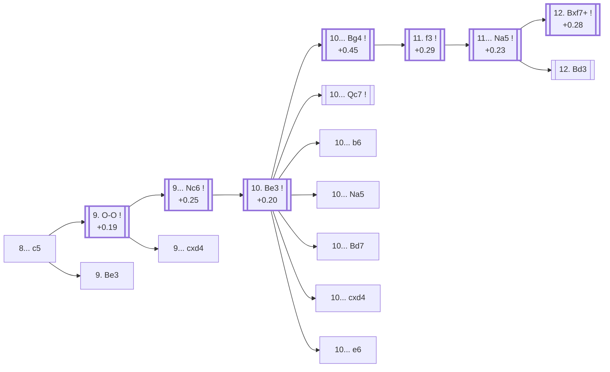

<a name="_TOP_"></a>

# D87 Grünfeld Defense: Exchange Variation, Spassky Variation <br> 1. d4 Nf6 2. c4 g6 3. Nc3 d5 4. cxd5 Nxd5 5. e4 Nxc3 6. bxc3 Bg7 7. Bc4 O-O 8. Ne2 c5 #

Continues from [D86's own "8. Ne2" node](https://github.com/onclemarcel/chess_flashcards/blob/main/d4_openings/D86_Grunfeld_Exchange_Classical_Variation.md#_Ne2_), where Black's **8... c5** is masters' clear main try (57.9%). Also directly reachable — and verified via `apply_san.py` — by delaying castling: **7... c5** immediately (masters' own actual plurality at that earlier fork, 77.7%) followed by 8. Ne2 O-O 9. O-O lands on this exact same tabiya.

### Overview

*Quick map of every move covered on this card — see the [shape key](https://github.com/onclemarcel/chess_flashcards/blob/main/start.md#content-diagram-optional) in start.md.*

<!-- content-diagram:start -->

<!-- content-diagram:end -->

<a name="_initial_move_"></a>

[](https://lichess.org/analysis/standard/rnbq1rk1/pp2ppbp/6p1/2p5/2BPP3/2P5/P3NPPP/R1BQK2R_w_KQ_c6_0_9)

*... 8... c5 — Grünfeld Defense: Exchange Variation, Spassky Variation*

```
rnbq1rk1/pp2ppbp/6p1/2p5/2BPP3/2P5/P3NPPP/R1BQK2R w KQ c6 0 9
```

|  | +0.21 |
| --- | --- |

<!-- lichess-stats:start fen="rnbq1rk1/pp2ppbp/6p1/2p5/2BPP3/2P5/P3NPPP/R1BQK2R w KQ c6 0 9" db="lichess,masters" speeds="bullet,blitz" ratings="1800,2000,2200,2500" moves="3" -->
| Move | Online | W/D/B | Masters | W/D/B | |
| :--- | ---: | :--- | ---: | :--- | :-- |
| O-O | 227 k (60.3%) | ⬜⬜⬜⬜⬜🟫⬛⬛⬛⬛ 48/7/46 | 2.0 k (83.2%) | ⬜⬜⬜🟫🟫🟫🟫🟫⬛⬛ 31/50/19 |  |
| Be3 | 137 k (36.5%) | ⬜⬜⬜⬜⬜🟫⬛⬛⬛⬛ 48/6/46 | 394 (16.2%) | ⬜⬜⬜🟫🟫🟫🟫🟫⬛⬛ 27/50/23 |  |
| h4 | 3.8 k (1.0%) | ⬜⬜⬜⬜⬜🟫⬛⬛⬛⬛ 52/6/42 | 0 | — | ⚠ |
| d5 | 0 | — | 8 (0.3%) | — |  |

*Online: bullet/blitz, 1800+ — 376 k games. Masters: 2.4 k games. [Open in the explorer](https://lichess.org/analysis/standard/rnbq1rk1/pp2ppbp/6p1/2p5/2BPP3/2P5/P3NPPP/R1BQK2R_w_KQ_c6_0_9#explorer) — updated 2026-09-09*
<!-- lichess-stats:end -->

**9. O-O** is masters' clear main try (83.2%) — completing development before deciding on the centre. **9. Be3** (16.2% masters) is a real, secondary try with no code of its own in this range.

* [**9. O-O**](#_OO_) (+0.19, 83.2% masters): see below.
* **9. Be3** (16.2% masters): a real, secondary try with no code of its own in this range.

[*Back to D86's own "8. Ne2"*](https://github.com/onclemarcel/chess_flashcards/blob/main/d4_openings/D86_Grunfeld_Exchange_Classical_Variation.md#_Ne2_)
[*Back to TOP*](#_TOP_)

---

<a name="_OO_"></a>

## 9. O-O

[](https://lichess.org/analysis/standard/rnbq1rk1/pp2ppbp/6p1/2p5/2BPP3/2P5/P3NPPP/R1BQ1RK1_b_-_-_1_9)

*... 9. O-O*

```
rnbq1rk1/pp2ppbp/6p1/2p5/2BPP3/2P5/P3NPPP/R1BQ1RK1 b - - 1 9
```

|  | +0.19 |
| --- | --- |

<!-- lichess-stats:start fen="rnbq1rk1/pp2ppbp/6p1/2p5/2BPP3/2P5/P3NPPP/R1BQ1RK1 b - - 1 9" db="lichess,masters" speeds="bullet,blitz" ratings="1800,2000,2200,2500" moves="3" -->
| Move | Online | W/D/B | Masters | W/D/B | |
| :--- | ---: | :--- | ---: | :--- | :-- |
| Nc6 | 153 k (67.4%) | ⬜⬜⬜⬜⬜🟫⬛⬛⬛⬛ 47/7/46 | 1.9 k (94.7%) | ⬜⬜⬜🟫🟫🟫🟫🟫⬛⬛ 30/50/20 |  |
| cxd4 | 37 k (16.4%) | ⬜⬜⬜⬜⬜🟫⬛⬛⬛⬛ 47/8/45 | 55 (2.7%) | ⬜⬜⬜⬜🟫🟫🟫🟫🟫⬛ 44/47/9 |  |
| Qc7 | 16 k (6.9%) | ⬜⬜⬜⬜⬜⬛⬛⬛⬛⬛ 47/5/47 | 21 (1.0%) | ⬜⬜⬜⬜⬜⬜🟫🟫⬛⬛ 57/19/24 |  |

*Online: bullet/blitz, 1800+ — 228 k games. Masters: 2.0 k games. [Open in the explorer](https://lichess.org/analysis/standard/rnbq1rk1/pp2ppbp/6p1/2p5/2BPP3/2P5/P3NPPP/R1BQ1RK1_b_-_-_1_9#explorer) — updated 2026-09-09*
<!-- lichess-stats:end -->

**9... Nc6** is close to automatic (94.7% of masters games) — developing before resolving the central tension. **9... cxd4** (2.7% masters) — trading immediately, a full move before `eco.md`'s own D88 line does — is a real, secondary try with no code of its own at this exact depth (not asserted to transpose into D88 without verification).

* [**9... Nc6**](#_Nc6_) (+0.25, 94.7% masters): see below.
* **9... cxd4** (2.7% masters): a real, secondary try with no code of its own in this range.

[*Back to 8... c5*](#_initial_move_)
[*Back to TOP*](#_TOP_)

---

<a name="_Nc6_"></a>

### 9... Nc6

[](https://lichess.org/analysis/standard/r1bq1rk1/pp2ppbp/2n3p1/2p5/2BPP3/2P5/P3NPPP/R1BQ1RK1_w_-_-_2_10)

*... 9... Nc6*

```
r1bq1rk1/pp2ppbp/2n3p1/2p5/2BPP3/2P5/P3NPPP/R1BQ1RK1 w - - 2 10
```

|  | +0.25 |
| --- | --- |

<!-- lichess-stats:start fen="r1bq1rk1/pp2ppbp/2n3p1/2p5/2BPP3/2P5/P3NPPP/R1BQ1RK1 w - - 2 10" db="lichess,masters" speeds="bullet,blitz" ratings="1800,2000,2200,2500" moves="3" -->
| Move | Online | W/D/B | Masters | W/D/B | |
| :--- | ---: | :--- | ---: | :--- | :-- |
| Be3 | 147 k (92.3%) | ⬜⬜⬜⬜⬜🟫⬛⬛⬛⬛ 48/7/46 | 1.9 k (99.8%) | ⬜⬜⬜🟫🟫🟫🟫🟫⬛⬛ 30/50/20 |  |
| d5 | 5.0 k (3.1%) | ⬜⬜⬜⬜⬜⬛⬛⬛⬛⬛ 48/4/48 | 2 (0.1%) | — | ⚠ |
| Bb2 | 2.3 k (1.4%) | ⬜⬜⬜⬜⬛⬛⬛⬛⬛⬛ 41/4/55 | 0 | — | ⚠ |
| dxc5 | 0 | — | 1 (0.1%) | — |  |

*Online: bullet/blitz, 1800+ — 159 k games. Masters: 1.9 k games. [Open in the explorer](https://lichess.org/analysis/standard/r1bq1rk1/pp2ppbp/2n3p1/2p5/2BPP3/2P5/P3NPPP/R1BQ1RK1_w_-_-_2_10#explorer) — updated 2026-09-09*
<!-- lichess-stats:end -->

**10. Be3** is close to automatic (99.8% of masters games) — defending d4 directly and preparing Qd2/Rc1 ideas.

* [**10. Be3**](#_Be3_) (+0.20, 99.8% masters): see below.

[*Back to 9. O-O*](#_OO_)
[*Back to TOP*](#_TOP_)

---

<a name="_Be3_"></a>

### 10. Be3

[](https://lichess.org/analysis/standard/r1bq1rk1/pp2ppbp/2n3p1/2p5/2BPP3/2P1B3/P3NPPP/R2Q1RK1_b_-_-_3_10)

*... 10. Be3*

```
r1bq1rk1/pp2ppbp/2n3p1/2p5/2BPP3/2P1B3/P3NPPP/R2Q1RK1 b - - 3 10
```

|  | +0.20 |
| --- | --- |

<!-- lichess-stats:start fen="r1bq1rk1/pp2ppbp/2n3p1/2p5/2BPP3/2P1B3/P3NPPP/R2Q1RK1 b - - 3 10" db="lichess,masters" speeds="bullet,blitz" ratings="1800,2000,2200,2500" moves="7" -->
| Move | Online | W/D/B | Masters | W/D/B | |
| :--- | ---: | :--- | ---: | :--- | :-- |
| Bg4 | 113 k (31.2%) | ⬜⬜⬜⬜🟫⬛⬛⬛⬛⬛ 46/7/47 | 1.6 k (28.6%) | ⬜⬜🟫🟫🟫🟫🟫🟫⬛⬛ 24/57/20 |  |
| cxd4 | 62 k (17.0%) | ⬜⬜⬜⬜⬜🟫⬛⬛⬛⬛ 48/8/45 | 248 (4.5%) | ⬜⬜⬜🟫🟫🟫🟫🟫⬛⬛ 29/50/21 |  |
| Qc7 | 59 k (16.2%) | ⬜⬜⬜⬜🟫⬛⬛⬛⬛⬛ 46/6/48 | 1.3 k (23.8%) | ⬜⬜⬜🟫🟫🟫🟫🟫⬛⬛ 31/53/16 |  |
| Na5 | 37 k (10.2%) | ⬜⬜⬜⬜⬜🟫⬛⬛⬛⬛ 47/6/46 | 624 (11.2%) | ⬜⬜⬜🟫🟫🟫🟫🟫⬛⬛ 29/55/16 |  |
| b6 | 37 k (10.2%) | ⬜⬜⬜⬜🟫⬛⬛⬛⬛⬛ 44/8/48 | 1.1 k (19.1%) | ⬜🟫🟫🟫🟫🟫🟫🟫🟫⬛ 10/83/7 |  |
| Qa5 | 23 k (6.4%) | ⬜⬜⬜⬜⬜⬛⬛⬛⬛⬛ 48/5/47 | 0 | — | ⚠ |
| a6 | 11 k (3.0%) | ⬜⬜⬜⬜⬜🟫⬛⬛⬛⬛ 50/6/44 | 0 | — | ⚠ |
| Bd7 | 0 | — | 492 (8.9%) | ⬜⬜⬜🟫🟫🟫🟫⬛⬛⬛ 34/42/24 |  |
| e6 | 0 | — | 208 (3.7%) | ⬜⬜🟫🟫🟫🟫🟫🟫🟫⬛ 16/75/9 |  |

*Online: bullet/blitz, 1800+ — 364 k games. Masters: 5.6 k games. [Open in the explorer](https://lichess.org/analysis/standard/r1bq1rk1/pp2ppbp/2n3p1/2p5/2BPP3/2P1B3/P3NPPP/R2Q1RK1_b_-_-_3_10#explorer) — updated 2026-09-09*
<!-- lichess-stats:end -->

**A genuine finding worth flagging plainly**: `eco.md`'s own **D88** — titled the "Main line" — sits on **10... cxd4** (4.5% masters), well behind not just **10... Bg4** (28.6%, masters' actual plurality, heading toward this card's own Seville Variation below) but also **10... Qc7** (23.8%) and **10... b6** (19.1%). The historical "Main Line" label doesn't reflect current masters preference at this fork — the same "eco.md-coded line trails uncoded/other-coded rivals" meta-pattern flagged repeatedly across earlier D-series batches, this time with the coded move sitting fifth of seven.

* [**10... Bg4**](#_Bg4_) (+0.45, 28.6% masters): masters' actual plurality — the Seville Variation's own trunk, see below.
* **10... Qc7** (23.8% masters): a real, secondary try with no code of its own in this range.
* **10... b6** (19.1% masters): a real, secondary try with no code of its own in this range.
* **10... Na5** (11.2% masters): a real, secondary try with no code of its own in this range.
* **10... Bd7** (8.9% masters): a real, secondary try with no code of its own in this range.
* [**10... cxd4**](https://github.com/onclemarcel/chess_flashcards/blob/main/d4_openings/D88_Grunfeld_Exchange_Spassky_Main_Line.md) (4.5% masters): `eco.md`'s own "Main line" — its own code, D88.
* **10... e6** (3.7% masters): a real, secondary try with no code of its own in this range.

[*Back to 9... Nc6*](#_Nc6_)
[*Back to TOP*](#_TOP_)

---

<a name="_Bg4_"></a>

### 10... Bg4 — Seville Variation

[](https://lichess.org/analysis/standard/r2q1rk1/pp2ppbp/2n3p1/2p5/2BPP1b1/4B3/P3NPPP/R2Q1RK1_w_-_-_4_11)

*... 10... Bg4 — Seville Variation's own trunk*

```
r2q1rk1/pp2ppbp/2n3p1/2p5/2BPP1b1/4B3/P3NPPP/R2Q1RK1 w - - 4 11
```

|  | +0.45 |
| --- | --- |

<!-- lichess-stats:start fen="r2q1rk1/pp2ppbp/2n3p1/2p5/2BPP1b1/4B3/P3NPPP/R2Q1RK1 w - - 4 11" db="lichess,masters" speeds="bullet,blitz" ratings="1800,2000,2200,2500" moves="3" -->
| Move | Online | W/D/B | Masters | W/D/B | |
| :--- | ---: | :--- | ---: | :--- | :-- |
| *no game found* | — | — | — | — | |

*Online: bullet/blitz, 1800+ — 0 games. Masters: 0 games. [Open in the explorer](https://lichess.org/analysis/standard/r2q1rk1/pp2ppbp/2n3p1/2p5/2BPP1b1/4B3/P3NPPP/R2Q1RK1_w_-_-_4_11#explorer) — updated 2026-09-09*
<!-- lichess-stats:end -->

**11. f3** is close to automatic (99.0% of masters games) — kicking the pinning bishop away before it can double up on the e2-knight.

* [**11. f3**](#_Na5_) (99.0% masters): see below.

[*Back to 10. Be3*](#_Be3_)
[*Back to TOP*](#_TOP_)

---

<a name="_Na5_"></a>

### 11. f3

[](https://lichess.org/analysis/standard/r2q1rk1/pp2ppbp/2n3p1/2p5/2BPP1b1/2P1BP2/P3N1PP/R2Q1RK1_b_-_-_0_11)

*... 11. f3*

```
r2q1rk1/pp2ppbp/2n3p1/2p5/2BPP1b1/2P1BP2/P3N1PP/R2Q1RK1 b - - 0 11
```

|  | +0.29 |
| --- | --- |

<!-- lichess-stats:start fen="r2q1rk1/pp2ppbp/2n3p1/2p5/2BPP1b1/2P1BP2/P3N1PP/R2Q1RK1 b - - 0 11" db="lichess,masters" speeds="bullet,blitz" ratings="1800,2000,2200,2500" moves="3" -->
| Move | Online | W/D/B | Masters | W/D/B | |
| :--- | ---: | :--- | ---: | :--- | :-- |
| Na5 | 61 k (53.9%) | ⬜⬜⬜⬜🟫⬛⬛⬛⬛⬛ 46/7/47 | 894 (56.9%) | ⬜⬜🟫🟫🟫🟫🟫🟫⬛⬛ 25/56/18 |  |
| Bd7 | 28 k (24.5%) | ⬜⬜⬜⬜🟫⬛⬛⬛⬛⬛ 44/7/49 | 598 (38.0%) | ⬜⬜🟫🟫🟫🟫🟫🟫⬛⬛ 20/59/20 |  |
| cxd4 | 22 k (19.1%) | ⬜⬜⬜⬜🟫⬛⬛⬛⬛⬛ 45/7/47 | 79 (5.0%) | ⬜⬜⬜🟫🟫🟫🟫🟫⬛⬛ 29/47/24 |  |

*Online: bullet/blitz, 1800+ — 113 k games. Masters: 1.6 k games. [Open in the explorer](https://lichess.org/analysis/standard/r2q1rk1/pp2ppbp/2n3p1/2p5/2BPP1b1/2P1BP2/P3N1PP/R2Q1RK1_b_-_-_0_11#explorer) — updated 2026-09-09*
<!-- lichess-stats:end -->

**11... Na5** is masters' clear main try (56.9%) — attacking the bishop before it can retreat to a safe square, and the Seville's own defining knight move. **11... Bd7** (38.0% masters) is a real, significant secondary — closer to being a genuine rival than a footnote — with no code of its own in this range.

* [**11... Na5**](#_Seville_) (+0.29, 56.9% masters): see below.
* **11... Bd7** (38.0% masters): a real, significant secondary try with no code of its own in this range.
* **11... cxd4** (5.0% masters): a real, secondary try with no code of its own in this range.

[*Back to 10... Bg4*](#_Bg4_)
[*Back to TOP*](#_TOP_)

---

<a name="_Seville_"></a>

### 11... Na5 — Seville Variation

[](https://lichess.org/analysis/standard/r2q1rk1/pp2ppbp/6p1/n1p5/2BPP1b1/2P1BP2/P3N1PP/R2Q1RK1_w_-_-_1_12)

*... 11... Na5*

```
r2q1rk1/pp2ppbp/6p1/n1p5/2BPP1b1/2P1BP2/P3N1PP/R2Q1RK1 w - - 1 12
```

|  | +0.23 |
| --- | --- |

<!-- lichess-stats:start fen="r2q1rk1/pp2ppbp/6p1/n1p5/2BPP1b1/2P1BP2/P3N1PP/R2Q1RK1 w - - 1 12" db="lichess,masters" speeds="bullet,blitz" ratings="1800,2000,2200,2500" moves="3" -->
| Move | Online | W/D/B | Masters | W/D/B | |
| :--- | ---: | :--- | ---: | :--- | :-- |
| Bd3 | 33 k (53.5%) | ⬜⬜⬜⬜🟫⬛⬛⬛⬛⬛ 46/7/47 | 435 (48.7%) | ⬜⬜⬜🟫🟫🟫🟫🟫⬛⬛ 28/50/22 |  |
| Bxf7+ | 18 k (29.6%) | ⬜⬜⬜⬜🟫⬛⬛⬛⬛⬛ 45/8/47 | 400 (44.7%) | ⬜⬜🟫🟫🟫🟫🟫🟫🟫⬛ 24/64/12 |  |
| Bd5 | 4.7 k (7.8%) | ⬜⬜⬜⬜⬜🟫⬛⬛⬛⬛ 54/7/39 | 50 (5.6%) | ⬜⬜🟫🟫🟫🟫🟫⬛⬛⬛ 16/52/32 |  |

*Online: bullet/blitz, 1800+ — 61 k games. Masters: 894 games. [Open in the explorer](https://lichess.org/analysis/standard/r2q1rk1/pp2ppbp/6p1/n1p5/2BPP1b1/2P1BP2/P3N1PP/R2Q1RK1_w_-_-_1_12#explorer) — updated 2026-09-09*
<!-- lichess-stats:end -->

**A genuine, near-even fork worth flagging plainly**: the Seville Variation's own defining sacrifice, **12. Bxf7+**, is essentially co-plurality with the quiet retreat **12. Bd3** (44.7% vs 48.7% masters — barely a coin flip, on a solid 894-game sample). **12. Bd3** simply retreats and keeps material level; it carries no code of its own here and, despite superficially resembling [D89's own "13. Bd3" node](https://github.com/onclemarcel/chess_flashcards/blob/main/d4_openings/D89_Grunfeld_Exchange_Spassky_13Bd3.md) two plies later, is **not** asserted to transpose there — that position is reached with the c- and d-pawns already traded off (via 10... cxd4 11. cxd4), while this one still has both pawns on the board; no transposition check was run, so none is claimed. **12. Bd5** (5.6%) is a real, secondary try.

* [**12. Bxf7+**](#_SevilleSac_) (+0.28, 44.7% masters): the Seville Variation's own sacrifice — see below.
* **12. Bd3** (48.7% masters, 53.5% online): masters' bare plurality — a real, secondary try with no code of its own in this range; not built out further here (backlog).
* **12. Bd5** (5.6% masters): a real, secondary try with no code of its own in this range.

[*Back to 11. f3*](#_Na5_)
[*Back to TOP*](#_TOP_)

---

<a name="_SevilleSac_"></a>

### 12. Bxf7+ — Seville Variation

[](https://lichess.org/analysis/standard/r2q1rk1/pp2pBbp/6p1/n1p5/3PP1b1/2P1BP2/P3N1PP/R2Q1RK1_b_-_-_0_12)

*... 12. Bxf7+ — Seville Variation*

```
r2q1rk1/pp2pBbp/6p1/n1p5/3PP1b1/2P1BP2/P3N1PP/R2Q1RK1 b - - 0 12
```

|  | +0.28 |
| --- | --- |

<!-- lichess-stats:start fen="r2q1rk1/pp2pBbp/6p1/n1p5/3PP1b1/2P1BP2/P3N1PP/R2Q1RK1 b - - 0 12" db="lichess,masters" speeds="bullet,blitz" ratings="1800,2000,2200,2500" moves="2" -->
| Move | Online | W/D/B | Masters | W/D/B | |
| :--- | ---: | :--- | ---: | :--- | :-- |
| Rxf7 | 18 k (99.9%) | ⬜⬜⬜⬜🟫⬛⬛⬛⬛⬛ 45/8/47 | 400 (100.0%) | ⬜⬜🟫🟫🟫🟫🟫🟫🟫⬛ 24/64/12 |  |
| Kxf7 | 13 (0.1%) | — | 0 | — |  |

*Online: bullet/blitz, 1800+ — 18 k games. Masters: 400 games. [Open in the explorer](https://lichess.org/analysis/standard/r2q1rk1/pp2pBbp/6p1/n1p5/3PP1b1/2P1BP2/P3N1PP/R2Q1RK1_b_-_-_0_12#explorer) — updated 2026-09-09*
<!-- lichess-stats:end -->

Live-tagged **Grünfeld Defense: Exchange Variation, Seville Variation**, confirming the name. **12... Rxf7** is total (100.0% of masters games) — recapturing with the rook, the only sensible reply to the exchange sacrifice that gives the line its name; Stockfish still rates the resulting position a modest +0.28 for White, so the sac is a genuine practical try rather than a clean refutation-in-waiting.

[*Back to 11... Na5*](#_Seville_)
[*Back to TOP*](#_TOP_)
