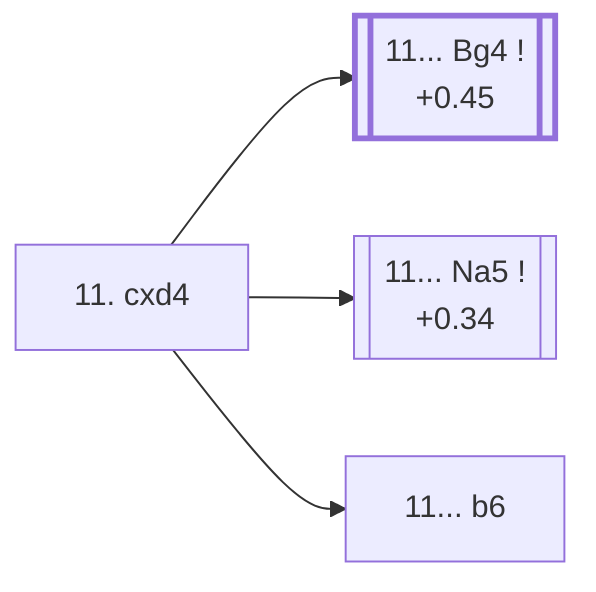

<a name="_TOP_"></a>

# D88 Grünfeld Defense: Spassky Variation, Main line <br> 1. d4 Nf6 2. c4 g6 3. Nc3 d5 4. cxd5 Nxd5 5. e4 Nxc3 6. bxc3 Bg7 7. Bc4 O-O 8. Ne2 c5 9. O-O Nc6 10. Be3 cxd4 11. cxd4 #

Continues from [D87's own "10. Be3" node](https://github.com/onclemarcel/chess_flashcards/blob/main/d4_openings/D87_Grunfeld_Exchange_Spassky_Variation.md#_Be3_), where Black's **10... cxd4** is a real, secondary try — only masters' fifth choice at that fork (4.5%), well behind the plurality 10... Bg4 that heads into D87's own Seville Variation instead (see the genuine finding flagged there). `eco.md` calls this exact tabiya the "Main line" — but the live explorer tags this position plain **"Spassky Variation"**, the same generic label as the parent code, not a distinct name of its own; a real divergence worth stating plainly rather than assuming the "Main line" title reflects either statistical popularity or a separately live-tagged name.

White's own recapture is total: **11. cxd4** is played in 100% of masters games (248 of 248 sampled) — the only way to avoid simply dropping the pawn.

[](https://lichess.org/analysis/standard/r1bq1rk1/pp2ppbp/2n3p1/8/2BpP3/2P1B3/P3NPPP/R2Q1RK1_w_-_-_0_11)

*... 10... cxd4*

```
r1bq1rk1/pp2ppbp/2n3p1/8/2BpP3/2P1B3/P3NPPP/R2Q1RK1 w - - 0 11
```

|  | +0.36 |
| --- | --- |

### Overview

*Quick map of every move covered on this card — see the [shape key](https://github.com/onclemarcel/chess_flashcards/blob/main/start.md#content-diagram-optional) in start.md.*

<!-- content-diagram:start -->

<!-- content-diagram:end -->

<a name="_initial_move_"></a>

[](https://lichess.org/analysis/standard/r1bq1rk1/pp2ppbp/2n3p1/8/2BPP3/4B3/P3NPPP/R2Q1RK1_b_-_-_0_11)

*... 11. cxd4 — Grünfeld Defense: Spassky Variation, Main line*

```
r1bq1rk1/pp2ppbp/2n3p1/8/2BPP3/4B3/P3NPPP/R2Q1RK1 b - - 0 11
```

|  | +0.34 |
| --- | --- |

<!-- lichess-stats:start fen="r1bq1rk1/pp2ppbp/2n3p1/8/2BPP3/4B3/P3NPPP/R2Q1RK1 b - - 0 11" db="lichess,masters" speeds="bullet,blitz" ratings="1800,2000,2200,2500" moves="3" -->
| Move | Online | W/D/B | Masters | W/D/B | |
| :--- | ---: | :--- | ---: | :--- | :-- |
| Bg4 | 50 k (36.6%) | ⬜⬜⬜⬜⬜🟫⬛⬛⬛⬛ 47/7/46 | 216 (52.8%) | ⬜⬜⬜🟫🟫🟫🟫🟫⬛⬛ 31/48/21 |  |
| Na5 | 26 k (19.2%) | ⬜⬜⬜⬜🟫⬛⬛⬛⬛⬛ 44/9/46 | 146 (35.7%) | ⬜⬜⬜🟫🟫🟫🟫🟫⬛⬛ 35/49/16 |  |
| a6 | 16 k (12.1%) | ⬜⬜⬜⬜⬜🟫⬛⬛⬛⬛ 51/7/42 | 0 | — | ⚠ |
| b6 | 0 | — | 29 (7.1%) | ⬜⬜⬜⬜🟫🟫🟫🟫🟫⬛ 38/48/14 |  |

*Online: bullet/blitz, 1800+ — 135 k games. Masters: 409 games. [Open in the explorer](https://lichess.org/analysis/standard/r1bq1rk1/pp2ppbp/2n3p1/8/2BPP3/4B3/P3NPPP/R2Q1RK1_b_-_-_0_11#explorer) — updated 2026-09-14*
<!-- lichess-stats:end -->

**11... Bg4** is masters' clear main try (52.8%) — pinning the knight before deciding on ... Na5, and this card's own trunk into [D89](https://github.com/onclemarcel/chess_flashcards/blob/main/d4_openings/D89_Grunfeld_Exchange_Spassky_13Bd3.md). **11... Na5** (35.7% masters) is a real, significant secondary — jumping the knight to attack the bishop immediately, skipping the ... Bg4 pin entirely — with no code of its own in this range. **11... b6** (7.1% masters) is a real, secondary try, likewise uncoded.

* [**11... Bg4**](https://github.com/onclemarcel/chess_flashcards/blob/main/d4_openings/D89_Grunfeld_Exchange_Spassky_13Bd3.md) (+0.45, 52.8% masters): masters' actual main try — its own code, D89.
* **11... Na5** (+0.34, 35.7% masters): a real, significant secondary try with no code of its own in this range.
* **11... b6** (7.1% masters): a real, secondary try with no code of its own in this range.

[*Back to D87's own "10. Be3"*](https://github.com/onclemarcel/chess_flashcards/blob/main/d4_openings/D87_Grunfeld_Exchange_Spassky_Variation.md#_Be3_)
[*Back to TOP*](#_TOP_)
