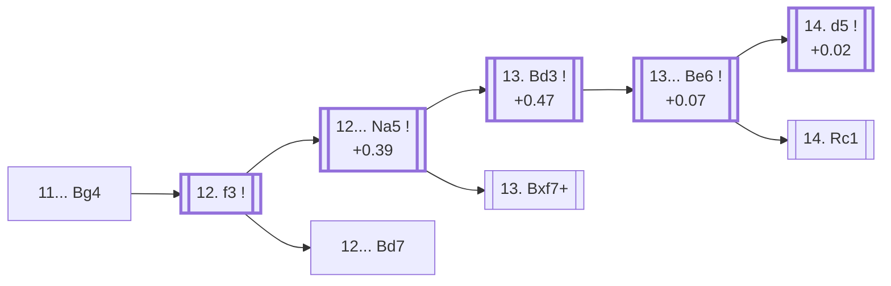

<a name="_TOP_"></a>

# D89 Grünfeld Defense: Spassky Variation, Main line, 13. Bd3 <br> 1. d4 Nf6 2. c4 g6 3. Nc3 d5 4. cxd5 Nxd5 5. e4 Nxc3 6. bxc3 Bg7 7. Bc4 O-O 8. Ne2 c5 9. O-O Nc6 10. Be3 cxd4 11. cxd4 Bg4 12. f3 Na5 13. Bd3 Be6 #

Continues from [D88's own root](https://github.com/onclemarcel/chess_flashcards/blob/main/d4_openings/D88_Grunfeld_Exchange_Spassky_Main_Line.md#_initial_move_), where Black's **11... Bg4** is masters' clear main try (52.8%). This is the deepest and final card in the whole D70-D99 Grünfeld sweep's D86-D89 spine, carrying `eco.md`'s own two remaining entries in this range: the **13. Bd3** tabiya itself, and the **Sokolsky Variation** one move deeper (14. d5).

### Overview

*Quick map of every move covered on this card — see the [shape key](https://github.com/onclemarcel/chess_flashcards/blob/main/start.md#content-diagram-optional) in start.md.*

<!-- content-diagram:start -->

<!-- content-diagram:end -->

<a name="_initial_move_"></a>

[](https://lichess.org/analysis/standard/r2q1rk1/pp2ppbp/2n3p1/8/2BPP1b1/4B3/P3NPPP/R2Q1RK1_w_-_-_1_12)

*... 11... Bg4*

```
r2q1rk1/pp2ppbp/2n3p1/8/2BPP1b1/4B3/P3NPPP/R2Q1RK1 w - - 1 12
```

|  | +0.45 |
| --- | --- |

<!-- lichess-stats:start fen="r2q1rk1/pp2ppbp/2n3p1/8/2BPP1b1/4B3/P3NPPP/R2Q1RK1 w - - 1 12" db="lichess,masters" speeds="bullet,blitz" ratings="1800,2000,2200,2500" moves="2" -->
| Move | Online | W/D/B | Masters | W/D/B | |
| :--- | ---: | :--- | ---: | :--- | :-- |
| f3 | 49 k (99.4%) | ⬜⬜⬜⬜⬜🟫⬛⬛⬛⬛ 47/7/46 | 216 (100.0%) | ⬜⬜⬜🟫🟫🟫🟫🟫⬛⬛ 31/48/21 |  |
| d5 | 72 (0.1%) | ⬜⬜⬜⬜⬜🟫⬛⬛⬛⬛ 53/6/42 | 0 | — |  |

*Online: bullet/blitz, 1800+ — 50 k games. Masters: 216 games. [Open in the explorer](https://lichess.org/analysis/standard/r2q1rk1/pp2ppbp/2n3p1/8/2BPP1b1/4B3/P3NPPP/R2Q1RK1_w_-_-_1_12#explorer) — updated 2026-09-15*
<!-- lichess-stats:end -->

**12. f3** is total (100.0% of masters games) — kicking the pinning bishop away, mirroring the identical idea in D87's own Seville tree one move order earlier.

* [**12. f3**](#_initial_move_) (100.0% masters): see below.

[*Back to D88's own root*](https://github.com/onclemarcel/chess_flashcards/blob/main/d4_openings/D88_Grunfeld_Exchange_Spassky_Main_Line.md#_initial_move_)
[*Back to TOP*](#_TOP_)

---

## 12. f3

[](https://lichess.org/analysis/standard/r2q1rk1/pp2ppbp/2n3p1/8/2BPP1b1/4BP2/P3N1PP/R2Q1RK1_b_-_-_0_12)

*... 12. f3*

```
r2q1rk1/pp2ppbp/2n3p1/8/2BPP1b1/4BP2/P3N1PP/R2Q1RK1 b - - 0 12
```

|  | +0.39 |
| --- | --- |

<!-- lichess-stats:start fen="r2q1rk1/pp2ppbp/2n3p1/8/2BPP1b1/4BP2/P3N1PP/R2Q1RK1 b - - 0 12" db="lichess,masters" speeds="bullet,blitz" ratings="1800,2000,2200,2500" moves="3" -->
| Move | Online | W/D/B | Masters | W/D/B | |
| :--- | ---: | :--- | ---: | :--- | :-- |
| Na5 | 50 k (71.4%) | ⬜⬜⬜⬜🟫⬛⬛⬛⬛⬛ 45/7/47 | 263 (89.2%) | ⬜⬜⬜🟫🟫🟫🟫🟫⬛⬛ 32/44/24 |  |
| Bd7 | 16 k (22.9%) | ⬜⬜⬜⬜⬜🟫⬛⬛⬛⬛ 48/7/45 | 31 (10.5%) | ⬜🟫🟫🟫🟫🟫🟫🟫🟫⬛ 16/77/6 |  |
| Bc8 | 2.5 k (3.5%) | ⬜⬜⬜⬜⬜🟫⬛⬛⬛⬛ 55/6/39 | 1 (0.3%) | — | ⚠ |

*Online: bullet/blitz, 1800+ — 71 k games. Masters: 295 games. [Open in the explorer](https://lichess.org/analysis/standard/r2q1rk1/pp2ppbp/2n3p1/8/2BPP1b1/4BP2/P3N1PP/R2Q1RK1_b_-_-_0_12#explorer) — updated 2026-09-15*
<!-- lichess-stats:end -->

**12... Na5** is masters' clear main try (89.2%) — attacking the bishop before it can settle. **12... Bd7** (10.5% masters) is a real, secondary try with no code of its own in this range.

* [**12... Na5**](#_Na5_) (+0.39, 89.2% masters): see below.
* **12... Bd7** (10.5% masters): a real, secondary try with no code of its own in this range.

[*Back to 11... Bg4*](#_initial_move_)
[*Back to TOP*](#_TOP_)

---

<a name="_Na5_"></a>

## 12... Na5

[](https://lichess.org/analysis/standard/r2q1rk1/pp2ppbp/6p1/n7/2BPP1b1/4BP2/P3N1PP/R2Q1RK1_w_-_-_1_13)

*... 12... Na5*

```
r2q1rk1/pp2ppbp/6p1/n7/2BPP1b1/4BP2/P3N1PP/R2Q1RK1 w - - 1 13
```

|  | +0.47 |
| --- | --- |

<!-- lichess-stats:start fen="r2q1rk1/pp2ppbp/6p1/n7/2BPP1b1/4BP2/P3N1PP/R2Q1RK1 w - - 1 13" db="lichess,masters" speeds="bullet,blitz" ratings="1800,2000,2200,2500" moves="3" -->
| Move | Online | W/D/B | Masters | W/D/B | |
| :--- | ---: | :--- | ---: | :--- | :-- |
| Bd3 | 27 k (54.0%) | ⬜⬜⬜⬜🟫⬛⬛⬛⬛⬛ 46/7/47 | 136 (51.7%) | ⬜⬜⬜⬜🟫🟫🟫⬛⬛⬛ 36/34/30 |  |
| Bxf7+ | 14 k (28.4%) | ⬜⬜⬜⬜🟫⬛⬛⬛⬛⬛ 44/8/48 | 64 (24.3%) | ⬜⬜⬜🟫🟫🟫🟫🟫🟫⬛ 31/58/11 |  |
| Bd5 | 3.7 k (7.4%) | ⬜⬜⬜⬜⬜🟫⬛⬛⬛⬛ 52/8/40 | 39 (14.8%) | ⬜⬜⬜🟫🟫🟫🟫🟫⬛⬛ 26/51/23 |  |

*Online: bullet/blitz, 1800+ — 50 k games. Masters: 263 games. [Open in the explorer](https://lichess.org/analysis/standard/r2q1rk1/pp2ppbp/6p1/n7/2BPP1b1/4BP2/P3N1PP/R2Q1RK1_w_-_-_1_13#explorer) — updated 2026-09-15*
<!-- lichess-stats:end -->

Unlike the structurally similar (but unrelated — never verified as transposing, and never claimed to) fork on D87's own Seville tree, White's exchange sacrifice is noticeably less popular once the c-and-d pawns have already traded off: **13. Bd3** is masters' clear main try here (51.7%), with **13. Bxf7+** (24.3%) and **13. Bd5** (14.8%) both real, secondary tries carrying no code of their own in this range.

* [**13. Bd3**](#_Bd3_) (+0.47, 51.7% masters): masters' actual main try — see below.
* **13. Bxf7+** (24.3% masters): a real, secondary try with no code of its own in this range.
* **13. Bd5** (14.8% masters): a real, secondary try with no code of its own in this range.

[*Back to 12. f3*](#_initial_move_)
[*Back to TOP*](#_TOP_)

---

<a name="_Bd3_"></a>

## 13. Bd3

[](https://lichess.org/analysis/standard/r2q1rk1/pp2ppbp/6p1/n7/3PP1b1/3BBP2/P3N1PP/R2Q1RK1_b_-_-_2_13)

*... 13. Bd3 — Grünfeld Defense: Spassky Variation, Main line, 13. Bd3*

```
r2q1rk1/pp2ppbp/6p1/n7/3PP1b1/3BBP2/P3N1PP/R2Q1RK1 b - - 2 13
```

|  | +0.07 |
| --- | --- |

<!-- lichess-stats:start fen="r2q1rk1/pp2ppbp/6p1/n7/3PP1b1/3BBP2/P3N1PP/R2Q1RK1 b - - 2 13" db="lichess,masters" speeds="bullet,blitz" ratings="1800,2000,2200,2500" moves="2" -->
| Move | Online | W/D/B | Masters | W/D/B | |
| :--- | ---: | :--- | ---: | :--- | :-- |
| Be6 | 48 k (86.4%) | ⬜⬜⬜⬜🟫⬛⬛⬛⬛⬛ 44/7/49 | 570 (98.1%) | ⬜⬜⬜🟫🟫🟫🟫🟫⬛⬛ 29/46/24 |  |
| Bd7 | 7.2 k (12.9%) | ⬜⬜⬜⬜⬜🟫⬛⬛⬛⬛ 50/8/42 | 11 (1.9%) | — |  |

*Online: bullet/blitz, 1800+ — 56 k games. Masters: 581 games. [Open in the explorer](https://lichess.org/analysis/standard/r2q1rk1/pp2ppbp/6p1/n7/3PP1b1/3BBP2/P3N1PP/R2Q1RK1_b_-_-_2_13#explorer) — updated 2026-09-15*
<!-- lichess-stats:end -->

**13... Be6** is close to automatic (98.1% of masters games) — the natural developing square, defending against d4-d5 ideas and eyeing a5-e1.

* [**13... Be6**](#_Be6_) (+0.07, 98.1% masters): see below.

[*Back to 12... Na5*](#_Na5_)
[*Back to TOP*](#_TOP_)

---

<a name="_Be6_"></a>

## 13... Be6

[](https://lichess.org/analysis/standard/r2q1rk1/pp2ppbp/4b1p1/n7/3PP3/3BBP2/P3N1PP/R2Q1RK1_w_-_-_3_14)

*... 13... Be6*

```
r2q1rk1/pp2ppbp/4b1p1/n7/3PP3/3BBP2/P3N1PP/R2Q1RK1 w - - 3 14
```

|  | +0.00 |
| --- | --- |

<!-- lichess-stats:start fen="r2q1rk1/pp2ppbp/4b1p1/n7/3PP3/3BBP2/P3N1PP/R2Q1RK1 w - - 3 14" db="lichess,masters" speeds="bullet,blitz" ratings="1800,2000,2200,2500" moves="3" -->
| Move | Online | W/D/B | Masters | W/D/B | |
| :--- | ---: | :--- | ---: | :--- | :-- |
| d5 | 24 k (49.8%) | ⬜⬜⬜⬜🟫⬛⬛⬛⬛⬛ 45/6/49 | 305 (53.5%) | ⬜⬜⬜🟫🟫🟫🟫🟫⬛⬛ 30/47/23 |  |
| Qa4 | 10 k (20.7%) | ⬜⬜⬜⬜🟫⬛⬛⬛⬛⬛ 43/7/50 | 45 (7.9%) | ⬜⬜🟫🟫🟫⬛⬛⬛⬛⬛ 22/31/47 |  |
| Rc1 | 7.0 k (14.5%) | ⬜⬜⬜⬜⬜🟫⬛⬛⬛⬛ 50/7/43 | 211 (37.0%) | ⬜⬜⬜🟫🟫🟫🟫🟫⬛⬛ 30/49/21 |  |

*Online: bullet/blitz, 1800+ — 48 k games. Masters: 570 games. [Open in the explorer](https://lichess.org/analysis/standard/r2q1rk1/pp2ppbp/4b1p1/n7/3PP3/3BBP2/P3N1PP/R2Q1RK1_w_-_-_3_14#explorer) — updated 2026-09-15*
<!-- lichess-stats:end -->

**A genuine finding worth flagging**: masters' main try, **14. d5** (53.5%, the Sokolsky Variation, see below), leads a real, significant secondary in **14. Rc1** (37.0% masters) by a much smaller margin than online play suggests (49.8% vs 14.5% — online barely plays Rc1 at all, a real database gap running opposite the usual direction). **14. Qa4** (7.9% masters) is a further real, secondary try.

* [**14. d5**](#_Sokolsky_) (+0.00, 53.5% masters): the Sokolsky Variation — see below.
* **14. Rc1** (37.0% masters, 14.5% online): a real, significant secondary try with no code of its own in this range.
* **14. Qa4** (7.9% masters): a real, secondary try with no code of its own in this range.

[*Back to 13. Bd3*](#_Bd3_)
[*Back to TOP*](#_TOP_)

---

<a name="_Sokolsky_"></a>

## 14. d5 — Sokolsky Variation

[](https://lichess.org/analysis/standard/r2q1rk1/pp2ppbp/4b1p1/n2P4/4P3/3BBP2/P3N1PP/R2Q1RK1_b_-_-_0_14)

*... 14. d5 — Grünfeld Defense: Exchange Variation, Sokolsky Variation*

```
r2q1rk1/pp2ppbp/4b1p1/n2P4/4P3/3BBP2/P3N1PP/R2Q1RK1 b - - 0 14
```

|  | +0.02 |
| --- | --- |

<!-- lichess-stats:start fen="r2q1rk1/pp2ppbp/4b1p1/n2P4/4P3/3BBP2/P3N1PP/R2Q1RK1 b - - 0 14" db="lichess,masters" speeds="bullet,blitz" ratings="1800,2000,2200,2500" moves="2" -->
| Move | Online | W/D/B | Masters | W/D/B | |
| :--- | ---: | :--- | ---: | :--- | :-- |
| Bxa1 | 22 k (93.1%) | ⬜⬜⬜⬜🟫⬛⬛⬛⬛⬛ 45/6/49 | 302 (99.0%) | ⬜⬜⬜🟫🟫🟫🟫🟫⬛⬛ 29/47/24 |  |
| Bd7 | 1.6 k (6.5%) | ⬜⬜⬜⬜⬜🟫⬛⬛⬛⬛ 52/7/40 | 3 (1.0%) | — | ⚠ |

*Online: bullet/blitz, 1800+ — 24 k games. Masters: 305 games. [Open in the explorer](https://lichess.org/analysis/standard/r2q1rk1/pp2ppbp/4b1p1/n2P4/4P3/3BBP2/P3N1PP/R2Q1RK1_b_-_-_0_14#explorer) — updated 2026-09-15*
<!-- lichess-stats:end -->

Live-tagged **Grünfeld Defense: Exchange Variation, Sokolsky Variation**, confirming the name. **14... Bxa1** is close to total (99.0% of masters games) — grabbing the exchange, since the bishop attacks the a1-rook and d5 has simultaneously shut the a5-knight out of the game; White gets a pawn and a strong centre for the exchange, and Stockfish rates the whole trade essentially level (+0.02), closing out this entire batch's D80-D89 tree exactly where the theory itself goes quiet.

[*Back to 13... Be6*](#_Be6_)
[*Back to TOP*](#_TOP_)
