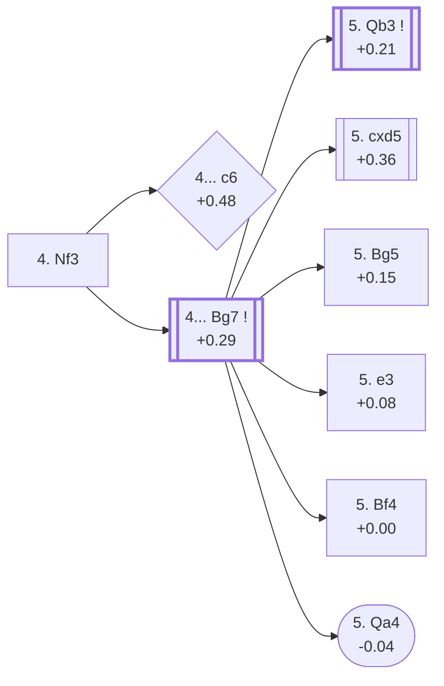

<a name="_TOP_"></a>

# D90 Grünfeld Defense: Three Knights Variation <br> 1. d4 Nf6 2. c4 g6 3. Nc3 d5 4. Nf3 #

Continues from [D80's own root](https://github.com/onclemarcel/chess_flashcards/blob/main/d4_openings/D80_Grunfeld_Defense.md#_initial_move_), where White's **4. Nf3** is a real, significant secondary (29.7% masters per D80's own table) alongside the dominant 4. cxd5 Exchange Variation tree — developing the knight before committing the centre, keeping both e2-e4 and a quieter e2-e3 setup available. `eco.md` carries a genuine self-collision worth flagging plainly: it lists **two separate entries both named "Three Knights Variation"** at two different depths — the bare `4.Nf3` root itself, and again one ply later at `4...Bg7`. Neither is a distinct name error; the live explorer confirms both positions really do carry that same name, so this card treats them as one continuous line rather than two rival names. This card, together with its own further code links ([D91](https://github.com/onclemarcel/chess_flashcards/blob/main/d4_openings/D91_Grunfeld_5Bg5.md)-[D99](https://github.com/onclemarcel/chess_flashcards/blob/main/d4_openings/D99_Grunfeld_Russian_Smyslov_Main_Line.md)), is the trunk for the whole D90-D99 range: the Three Knights complex culminating in the Russian System.

### Overview

*Quick map of every move covered on this card — see the [shape key](https://github.com/onclemarcel/chess_flashcards/blob/main/start.md#content-diagram-optional) in start.md.*

<!-- content-diagram:start -->

<!-- content-diagram:end -->

<a name="_initial_move_"></a>

[](https://lichess.org/analysis/standard/rnbqkb1r/ppp1pp1p/5np1/3p4/2PP4/2N2N2/PP2PPPP/R1BQKB1R_b_KQkq_-_1_4)

*... 4. Nf3 — Grünfeld Defense: Three Knights Variation*

```
rnbqkb1r/ppp1pp1p/5np1/3p4/2PP4/2N2N2/PP2PPPP/R1BQKB1R b KQkq - 1 4
```

|  | +0.21 |
| --- | --- |

<!-- lichess-stats:start fen="rnbqkb1r/ppp1pp1p/5np1/3p4/2PP4/2N2N2/PP2PPPP/R1BQKB1R b KQkq - 1 4" db="lichess,masters" speeds="bullet,blitz" ratings="1800,2000,2200,2500" moves="4" -->
| Move | Online | W/D/B | Masters | W/D/B | |
| :--- | ---: | :--- | ---: | :--- | :-- |
| Bg7 | 2.0 M (91.6%) | ⬜⬜⬜⬜⬜⬛⬛⬛⬛⬛ 48/6/46 | 13 k (99.8%) | ⬜⬜⬜🟫🟫🟫🟫🟫⬛⬛ 30/49/21 |  |
| dxc4 | 83 k (3.8%) | ⬜⬜⬜⬜⬜🟫⬛⬛⬛⬛ 53/5/42 | 2 (0.0%) | — | ⚠ |
| c6 | 70 k (3.2%) | ⬜⬜⬜⬜⬜🟫⬛⬛⬛⬛ 52/5/43 | 22 (0.2%) | ⬜⬜⬜🟫🟫🟫🟫🟫⬛⬛ 27/55/18 |  |
| e6 | 10 k (0.5%) | ⬜⬜⬜⬜⬜⬜⬛⬛⬛⬛ 55/5/40 | 1 (0.0%) | — | ⚠ |

*Online: bullet/blitz, 1800+ — 2.2 M games. Masters: 13 k games. [Open in the explorer](https://lichess.org/analysis/standard/rnbqkb1r/ppp1pp1p/5np1/3p4/2PP4/2N2N2/PP2PPPP/R1BQKB1R_b_KQkq_-_1_4#explorer) — updated 2026-09-15*
<!-- lichess-stats:end -->

**4... Bg7** is close to automatic (99.8% masters) — the natural fianchetto, keeping every one of this card's own further code lines reachable. **4... c6** is a genuine database rarity here (0.2% masters, 22 games) but a real, verified transposition worth flagging plainly: `apply_san.py` confirms this exact position — same piece placement, side to move, castling rights, halfmove and fullmove clocks — is character-for-character identical to the Slav Defense's own tabiya at [D15's "Schlechter Variation"](https://github.com/onclemarcel/chess_flashcards/blob/main/d4_openings/D15_Slav_Defense_Three_Knights.md#_Schlechter_) (reached there via `1.d4 d5 2.c4 c6 3.Nf3 Nf6 4.Nc3 g6`). `eco.md` borrows the very same "Schlechter Variation" name for this Grünfeld move order — not a coincidence or a naming error, but the same tabiya reached by transposition, and this card defers to D15's own existing build-out rather than duplicating it.

* [**4... Bg7**](#_Bg7_) (+0.29, 99.8% masters): see below — this card's own further trunk.
* [**4... c6**](#_c6_) (0.2% masters): the Schlechter Variation — verified to transpose into D15's own tabiya.

[*Back to D80's own root*](https://github.com/onclemarcel/chess_flashcards/blob/main/d4_openings/D80_Grunfeld_Defense.md#_initial_move_)
[*Back to TOP*](#_TOP_)

---

<a name="_c6_"></a>

## 4... c6 — Schlechter Variation

[](https://lichess.org/analysis/standard/rnbqkb1r/pp2pp1p/2p2np1/3p4/2PP4/2N2N2/PP2PPPP/R1BQKB1R_w_KQkq_-_0_5)

*... 4... c6 — Schlechter Variation, transposing into D15's own tabiya*

```
rnbqkb1r/pp2pp1p/2p2np1/3p4/2PP4/2N2N2/PP2PPPP/R1BQKB1R w KQkq - 0 5
```

|  | +0.48 |
| --- | --- |

For White's replies and Black's own follow-up at this tabiya, see [D15's own "Schlechter Variation" section](https://github.com/onclemarcel/chess_flashcards/blob/main/d4_openings/D15_Slav_Defense_Three_Knights.md#_Schlechter_) directly — this card does not duplicate that build-out.

[*Back to 4. Nf3*](#_initial_move_)
[*Back to TOP*](#_TOP_)

---

<a name="_Bg7_"></a>

## 4... Bg7

[](https://lichess.org/analysis/standard/rnbqk2r/ppp1ppbp/5np1/3p4/2PP4/2N2N2/PP2PPPP/R1BQKB1R_w_KQkq_-_2_5)

*... 4... Bg7 — Grünfeld Defense: Three Knights Variation*

```
rnbqk2r/ppp1ppbp/5np1/3p4/2PP4/2N2N2/PP2PPPP/R1BQKB1R w KQkq - 2 5
```

|  | +0.29 |
| --- | --- |

<!-- lichess-stats:start fen="rnbqk2r/ppp1ppbp/5np1/3p4/2PP4/2N2N2/PP2PPPP/R1BQKB1R w KQkq - 2 5" db="lichess,masters" speeds="bullet,blitz" ratings="1800,2000,2200,2500" moves="7" -->
| Move | Online | W/D/B | Masters | W/D/B | |
| :--- | ---: | :--- | ---: | :--- | :-- |
| Bg5 | 812 k (25.6%) | ⬜⬜⬜⬜⬜🟫⬛⬛⬛⬛ 49/6/46 | 3.8 k (19.8%) | ⬜⬜⬜🟫🟫🟫🟫⬛⬛⬛ 28/44/28 |  |
| cxd5 | 766 k (24.1%) | ⬜⬜⬜⬜⬜🟫⬛⬛⬛⬛ 47/7/46 | 4.9 k (25.6%) | ⬜⬜⬜🟫🟫🟫🟫🟫⬛⬛ 29/52/19 |  |
| e3 | 479 k (15.1%) | ⬜⬜⬜⬜🟫⬛⬛⬛⬛⬛ 46/6/48 | 2.1 k (10.7%) | ⬜⬜⬜🟫🟫🟫🟫⬛⬛⬛ 29/46/26 |  |
| Bf4 | 435 k (13.7%) | ⬜⬜⬜⬜⬜🟫⬛⬛⬛⬛ 48/6/46 | 1.8 k (9.1%) | ⬜⬜⬜🟫🟫🟫🟫⬛⬛⬛ 31/44/24 |  |
| Qb3 | 225 k (7.1%) | ⬜⬜⬜⬜⬜🟫⬛⬛⬛⬛ 50/6/44 | 5.3 k (27.8%) | ⬜⬜⬜🟫🟫🟫🟫🟫⬛⬛ 29/54/17 |  |
| g3 | 215 k (6.8%) | ⬜⬜⬜⬜⬜⬛⬛⬛⬛⬛ 49/6/46 | 0 | — | ⚠ |
| e4 | 76 k (2.4%) | ⬜⬜⬜⬜⬛⬛⬛⬛⬛⬛ 39/5/56 | 0 | — | ⚠ |
| h4 | 0 | — | 739 (3.8%) | ⬜⬜⬜🟫🟫🟫🟫🟫⬛⬛ 33/46/21 |  |
| Qa4+ | 0 | — | 380 (2.0%) | ⬜⬜⬜⬜🟫🟫🟫🟫⬛⬛ 36/39/26 |  |

*Online: bullet/blitz, 1800+ — 3.2 M games. Masters: 19 k games. [Open in the explorer](https://lichess.org/analysis/standard/rnbqk2r/ppp1ppbp/5np1/3p4/2PP4/2N2N2/PP2PPPP/R1BQKB1R_w_KQkq_-_2_5#explorer) — updated 2026-09-15*
<!-- lichess-stats:end -->

This is the real, wide fork this whole batch hangs off: five genuine tries, four of which carry their own code. **5. Qb3** is masters' narrow plurality (27.8%) — the Russian Variation, its own code, [D96](https://github.com/onclemarcel/chess_flashcards/blob/main/d4_openings/D96_Grunfeld_Russian_Variation.md), and the deepest, most important sub-tree in this whole batch. **5. cxd5** (25.6% masters) is a real, significant secondary — a different-flavoured Exchange trade with the knight already committed to f3 rather than e4 — but is never asserted to transpose into D85's own Exchange tree (unverified, and structurally a different pawn/piece configuration); it carries no code of its own in this range. **5. Bg5** (19.8% masters, just under this repo's own 20% subroutine threshold) is [D91](https://github.com/onclemarcel/chess_flashcards/blob/main/d4_openings/D91_Grunfeld_5Bg5.md)'s own code, live-tagged the **Petrosian System** — a real name `eco.md` itself leaves bare as "5.Bg5". **5. e3** (+0.08, 10.7% masters) is [D94](https://github.com/onclemarcel/chess_flashcards/blob/main/d4_openings/D94_Grunfeld_5e3.md)'s own code, live-tagged the **Burille Variation** — again a real name `eco.md` doesn't carry. **5. Bf4** (9.1% masters) is [D92](https://github.com/onclemarcel/chess_flashcards/blob/main/d4_openings/D92_Grunfeld_5Bf4.md)'s own code, live-tagged the **Hungarian Attack**. **5. Qa4+** (2.0% masters) is the Flohr Variation, staying on this card — see below.

* [**5. Qb3**](https://github.com/onclemarcel/chess_flashcards/blob/main/d4_openings/D96_Grunfeld_Russian_Variation.md) (+0.21, 27.8% masters): the Russian Variation — its own code, D96.
* **5. cxd5** (+0.36, 25.6% masters, 24.1% online): a real, significant secondary try with no code of its own in this range; not asserted to transpose toward D85.
* [**5. Bg5**](https://github.com/onclemarcel/chess_flashcards/blob/main/d4_openings/D91_Grunfeld_5Bg5.md) (+0.15, 19.8% masters): live-tagged the Petrosian System — its own code, D91.
* [**5. e3**](https://github.com/onclemarcel/chess_flashcards/blob/main/d4_openings/D94_Grunfeld_5e3.md) (10.7% masters): live-tagged the Burille Variation — its own code, D94.
* [**5. Bf4**](https://github.com/onclemarcel/chess_flashcards/blob/main/d4_openings/D92_Grunfeld_5Bf4.md) (+0.00, 9.1% masters): live-tagged the Hungarian Attack — its own code, D92.
* [**5. Qa4+**](#_Qa4_) (-0.04, 2.0% masters): the Flohr Variation — see below.

[*Back to 4. Nf3*](#_initial_move_)
[*Back to TOP*](#_TOP_)

---

<a name="_Qa4_"></a>

## 5. Qa4+ — Flohr Variation

[](https://lichess.org/analysis/standard/rnbqk2r/ppp1ppbp/5np1/3p4/Q1PP4/2N2N2/PP2PPPP/R1B1KB1R_b_KQkq_-_3_5)

*... 5. Qa4+ — Flohr Variation*

```
rnbqk2r/ppp1ppbp/5np1/3p4/Q1PP4/2N2N2/PP2PPPP/R1B1KB1R b KQkq - 3 5
```

|  | -0.04 |
| --- | --- |

<!-- lichess-stats:start fen="rnbqk2r/ppp1ppbp/5np1/3p4/Q1PP4/2N2N2/PP2PPPP/R1B1KB1R b KQkq - 3 5" db="lichess,masters" speeds="bullet,blitz" ratings="1800,2000,2200,2500" moves="3" -->
| Move | Online | W/D/B | Masters | W/D/B | |
| :--- | ---: | :--- | ---: | :--- | :-- |
| c6 | 5.0 k (46.9%) | ⬜⬜⬜⬜⬜🟫⬛⬛⬛⬛ 51/7/42 | 77 (20.3%) | ⬜⬜⬜⬜🟫🟫🟫🟫⬛⬛ 44/38/18 |  |
| Bd7 | 4.2 k (40.2%) | ⬜⬜⬜⬜⬜🟫⬛⬛⬛⬛ 50/5/45 | 286 (75.3%) | ⬜⬜⬜🟫🟫🟫🟫⬛⬛⬛ 33/40/27 |  |
| Nc6 | 624 (5.9%) | ⬜⬜⬜⬜⬜🟫⬛⬛⬛⬛ 50/5/45 | 17 (4.5%) | — |  |

*Online: bullet/blitz, 1800+ — 11 k games. Masters: 380 games. [Open in the explorer](https://lichess.org/analysis/standard/rnbqk2r/ppp1ppbp/5np1/3p4/Q1PP4/2N2N2/PP2PPPP/R1B1KB1R_b_KQkq_-_3_5#explorer) — updated 2026-09-15*
<!-- lichess-stats:end -->

Live-tagged **Grünfeld Defense: Flohr Variation**, confirming the name — the second of two unrelated "Flohr" names in this D90-D99 batch (D94's own Flohr Defence, deeper in the e3 tree below, is the other; both are themselves the third and fourth independent "Flohr"-named reuses across this D-series sweep, after D25's Flohr Variation and D28's own Classical, Flohr Variation, per `eco.md`'s own note there). Masters' clear main try is **5... Bd7** (75.3%), simply blocking the check and preparing ...dxc4 or ...c6; **5... c6** (20.3%) declines the tempo instead.

* **5... Bd7** (75.3% masters, 40.2% online): masters' clear main try — a real, uncoded try with no code of its own in this range.
* **5... c6** (20.3% masters, 46.9% online — a real online/masters split running the opposite direction from the usual pattern in this repo, where online favours the untested move): a real, uncoded secondary.

[*Back to 4... Bg7*](#_Bg7_)
[*Back to TOP*](#_TOP_)
