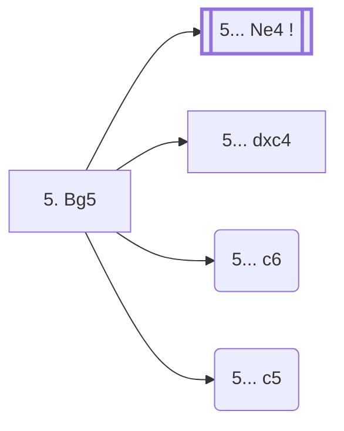

<a name="_TOP_"></a>

# D91 Grünfeld Defense: Three Knights Variation, Petrosian System <br> 1. d4 Nf6 2. c4 g6 3. Nc3 d5 4. Nf3 Bg7 5. Bg5 #

Continues from [D90's own "4... Bg7" node](https://github.com/onclemarcel/chess_flashcards/blob/main/d4_openings/D90_Grunfeld_Three_Knights_Variation.md#_Bg7_), where White's **5. Bg5** is a real, significant secondary (19.8% masters, just below this repo's own 20% subroutine threshold) — pinning the knight outside the main c4/d4 pawn duo rather than committing to cxd5/e3/Bf4/Qb3. `eco.md` leaves this bare tabiya named only "5.Bg5"; the live explorer independently calls it the **Petrosian System**, a real name the code index itself doesn't carry — the same pattern already seen at D82's Brinckmann Attack and D94/D92 elsewhere in this batch.

### Overview

*Quick map of every move covered on this card — see the [shape key](https://github.com/onclemarcel/chess_flashcards/blob/main/start.md#content-diagram-optional) in start.md.*

<!-- content-diagram:start -->

<!-- content-diagram:end -->

<a name="_initial_move_"></a>

[](https://lichess.org/analysis/standard/rnbqk2r/ppp1ppbp/5np1/3p2B1/2PP4/2N2N2/PP2PPPP/R2QKB1R_b_KQkq_-_3_5)

*... 5. Bg5 — live-tagged the Petrosian System*

```
rnbqk2r/ppp1ppbp/5np1/3p2B1/2PP4/2N2N2/PP2PPPP/R2QKB1R b KQkq - 3 5
```

|  | +0.15 |
| --- | --- |

<!-- lichess-stats:start fen="rnbqk2r/ppp1ppbp/5np1/3p2B1/2PP4/2N2N2/PP2PPPP/R2QKB1R b KQkq - 3 5" db="lichess,masters" speeds="bullet,blitz" ratings="1800,2000,2200,2500" moves="5" -->
| Move | Online | W/D/B | Masters | W/D/B | |
| :--- | ---: | :--- | ---: | :--- | :-- |
| Ne4 | 424 k (49.3%) | ⬜⬜⬜⬜🟫⬛⬛⬛⬛⬛ 46/6/48 | 3.2 k (83.6%) | ⬜⬜⬜🟫🟫🟫🟫⬛⬛⬛ 28/46/27 |  |
| O-O | 167 k (19.5%) | ⬜⬜⬜⬜⬜🟫⬛⬛⬛⬛ 50/5/45 | 23 (0.6%) | ⬜⬜⬜⬜🟫🟫🟫🟫⬛⬛ 43/35/22 |  |
| c6 | 118 k (13.7%) | ⬜⬜⬜⬜⬜🟫⬛⬛⬛⬛ 52/6/42 | 76 (2.0%) | ⬜⬜⬜⬜🟫🟫🟫🟫⬛⬛ 41/39/20 |  |
| dxc4 | 109 k (12.7%) | ⬜⬜⬜⬜⬜🟫⬛⬛⬛⬛ 52/5/43 | 472 (12.2%) | ⬜⬜⬜🟫🟫🟫🟫⬛⬛⬛ 29/36/35 |  |
| c5 | 11 k (1.3%) | ⬜⬜⬜⬜⬜⬛⬛⬛⬛⬛ 47/6/47 | 65 (1.7%) | ⬜⬜⬜⬜🟫🟫🟫⬛⬛⬛ 35/35/29 |  |

*Online: bullet/blitz, 1800+ — 859 k games. Masters: 3.9 k games. [Open in the explorer](https://lichess.org/analysis/standard/rnbqk2r/ppp1ppbp/5np1/3p2B1/2PP4/2N2N2/PP2PPPP/R2QKB1R_b_KQkq_-_3_5#explorer) — updated 2026-09-09*
<!-- lichess-stats:end -->

**5... Ne4** is masters' overwhelming main try (83.6%) — kicking the bishop immediately, the same idea that drives D80's own Stockholm Variation one code-family over. **5... dxc4** (12.2% masters) grabs the pawn instead, banking on ...Ne4/...c5 ideas to justify the tempo loss later. **5... c6** (2.0% masters) and **5... c5** (1.7% masters) are both real database rarities with no code of their own in this range.

* **5... Ne4** (+0.15, 83.6% masters, 49.3% online): masters' overwhelming main try; not built out further here (backlog).
* **5... dxc4** (12.2% masters, 12.7% online): a real, secondary try with no code of its own in this range.
* **5... c6** (2.0% masters, 13.7% online): a real database rarity.
* **5... c5** (1.7% masters, 1.3% online): a real database rarity.

[*Back to D90's own "4... Bg7"*](https://github.com/onclemarcel/chess_flashcards/blob/main/d4_openings/D90_Grunfeld_Three_Knights_Variation.md#_Bg7_)
[*Back to TOP*](#_TOP_)
