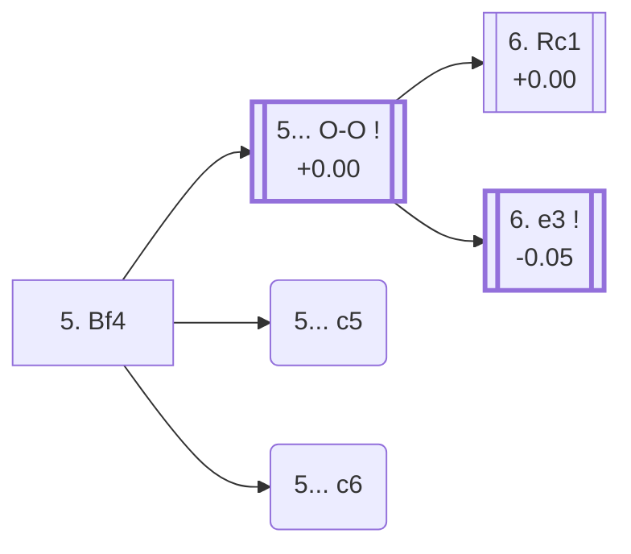

<a name="_TOP_"></a>

# D92 Grünfeld Defense: Three Knights Variation, Hungarian Attack <br> 1. d4 Nf6 2. c4 g6 3. Nc3 d5 4. Nf3 Bg7 5. Bf4 #

Continues from [D90's own "4... Bg7" node](https://github.com/onclemarcel/chess_flashcards/blob/main/d4_openings/D90_Grunfeld_Three_Knights_Variation.md#_Bg7_), where White's **5. Bf4** is a real secondary (9.1% masters) — developing the bishop actively before either knight-supported centre plan. `eco.md` leaves this bare tabiya named only "5.Bf4"; the live explorer independently calls it the **Hungarian Attack**, the first of a small "Hungarian" cluster inside this very batch (D93's own further tabiya, one ply deeper still, is live-tagged the related **Hungarian Variation**). This position is also this file's own trunk for [D93](https://github.com/onclemarcel/chess_flashcards/blob/main/d4_openings/D93_Grunfeld_Bf4_e3.md), reached one ply deeper.

### Overview

*Quick map of every move covered on this card — see the [shape key](https://github.com/onclemarcel/chess_flashcards/blob/main/start.md#content-diagram-optional) in start.md.*

<!-- content-diagram:start -->

<!-- content-diagram:end -->

<a name="_initial_move_"></a>

[](https://lichess.org/analysis/standard/rnbqk2r/ppp1ppbp/5np1/3p4/2PP1B2/2N2N2/PP2PPPP/R2QKB1R_b_KQkq_-_3_5)

*... 5. Bf4 — live-tagged the Hungarian Attack*

```
rnbqk2r/ppp1ppbp/5np1/3p4/2PP1B2/2N2N2/PP2PPPP/R2QKB1R b KQkq - 3 5
```

|  | +0.00 |
| --- | --- |

<!-- lichess-stats:start fen="rnbqk2r/ppp1ppbp/5np1/3p4/2PP1B2/2N2N2/PP2PPPP/R2QKB1R b KQkq - 3 5" db="lichess,masters" speeds="bullet,blitz" ratings="1800,2000,2200,2500" moves="4" -->
| Move | Online | W/D/B | Masters | W/D/B | |
| :--- | ---: | :--- | ---: | :--- | :-- |
| O-O | 356 k (73.3%) | ⬜⬜⬜⬜⬜⬛⬛⬛⬛⬛ 47/6/47 | 1.7 k (85.5%) | ⬜⬜⬜🟫🟫🟫🟫🟫⬛⬛ 30/45/24 |  |
| c6 | 55 k (11.4%) | ⬜⬜⬜⬜⬜🟫⬛⬛⬛⬛ 52/6/42 | 86 (4.4%) | ⬜⬜⬜🟫🟫🟫🟫🟫⬛⬛ 28/48/24 |  |
| c5 | 31 k (6.3%) | ⬜⬜⬜⬜🟫⬛⬛⬛⬛⬛ 46/6/48 | 157 (8.0%) | ⬜⬜⬜⬜🟫🟫🟫🟫⬛⬛ 39/40/21 |  |
| dxc4 | 18 k (3.8%) | ⬜⬜⬜⬜⬜🟫⬛⬛⬛⬛ 52/5/43 | 40 (2.0%) | ⬜⬜⬜⬜🟫🟫🟫🟫⬛⬛ 40/38/22 |  |

*Online: bullet/blitz, 1800+ — 486 k games. Masters: 2.0 k games. [Open in the explorer](https://lichess.org/analysis/standard/rnbqk2r/ppp1ppbp/5np1/3p4/2PP1B2/2N2N2/PP2PPPP/R2QKB1R_b_KQkq_-_3_5#explorer) — updated 2026-09-14*
<!-- lichess-stats:end -->

**5... O-O** is masters' overwhelming main try (85.5%) — simple development, ahead of any immediate central strike. **5... c5** (8.0% masters) and **5... c6** (4.4% masters) are both real, uncoded secondaries.

* [**5... O-O**](#_OO_) (85.5% masters): see below.
* **5... c5** (8.0% masters, 6.3% online): a real, secondary try with no code of its own in this range.
* **5... c6** (4.4% masters, 11.4% online): a real, secondary try with no code of its own in this range.

[*Back to D90's own "4... Bg7"*](https://github.com/onclemarcel/chess_flashcards/blob/main/d4_openings/D90_Grunfeld_Three_Knights_Variation.md#_Bg7_)
[*Back to TOP*](#_TOP_)

---

<a name="_OO_"></a>

## 5... O-O

[](https://lichess.org/analysis/standard/rnbq1rk1/ppp1ppbp/5np1/3p4/2PP1B2/2N2N2/PP2PPPP/R2QKB1R_w_KQ_-_4_6)

*... 5... O-O*

```
rnbq1rk1/ppp1ppbp/5np1/3p4/2PP1B2/2N2N2/PP2PPPP/R2QKB1R w KQ - 4 6
```

|  | +0.00 |
| --- | --- |

<!-- lichess-stats:start fen="rnbq1rk1/ppp1ppbp/5np1/3p4/2PP1B2/2N2N2/PP2PPPP/R2QKB1R w KQ - 4 6" db="lichess,masters" speeds="bullet,blitz" ratings="1800,2000,2200,2500" moves="3" -->
| Move | Online | W/D/B | Masters | W/D/B | |
| :--- | ---: | :--- | ---: | :--- | :-- |
| e3 | 298 k (74.0%) | ⬜⬜⬜⬜⬜⬛⬛⬛⬛⬛ 47/6/47 | 807 (47.0%) | ⬜⬜⬜🟫🟫🟫🟫⬛⬛⬛ 29/44/27 |  |
| Rc1 | 29 k (7.1%) | ⬜⬜⬜⬜⬜🟫⬛⬛⬛⬛ 53/7/40 | 882 (51.4%) | ⬜⬜⬜🟫🟫🟫🟫🟫⬛⬛ 32/47/21 |  |
| h3 | 24 k (5.9%) | ⬜⬜⬜⬜⬜⬛⬛⬛⬛⬛ 46/5/49 | 0 | — | ⚠ |
| cxd5 | 0 | — | 12 (0.7%) | — |  |

*Online: bullet/blitz, 1800+ — 404 k games. Masters: 1.7 k games. [Open in the explorer](https://lichess.org/analysis/standard/rnbq1rk1/ppp1ppbp/5np1/3p4/2PP1B2/2N2N2/PP2PPPP/R2QKB1R_w_KQ_-_4_6#explorer) — updated 2026-09-14*
<!-- lichess-stats:end -->

**A genuine, well-verified finding worth flagging plainly**: masters' actual plurality here is **6. Rc1** (51.4%), an immediate rook lift with no code of its own in this range — narrowly ahead of **6. e3** (47.0%), the move that actually heads into this card's own further code, [D93](https://github.com/onclemarcel/chess_flashcards/blob/main/d4_openings/D93_Grunfeld_Bf4_e3.md). Unlike several similar splits documented elsewhere in this repo, this one is close to a coin flip rather than a lopsided majority for the uncoded try.

* [**6. Rc1**](#_Rc1_) (51.4% masters): masters' actual plurality — see below.
* [**6. e3**](https://github.com/onclemarcel/chess_flashcards/blob/main/d4_openings/D93_Grunfeld_Bf4_e3.md) (-0.05, 47.0% masters): its own code, D93.

[*Back to 5. Bf4*](#_initial_move_)
[*Back to TOP*](#_TOP_)

---

<a name="_Rc1_"></a>

## 6. Rc1

[](https://lichess.org/analysis/standard/rnbq1rk1/ppp1ppbp/5np1/3p4/2PP1B2/2N2N2/PP2PPPP/2RQKB1R_b_K_-_5_6)

*... 6. Rc1*

```
rnbq1rk1/ppp1ppbp/5np1/3p4/2PP1B2/2N2N2/PP2PPPP/2RQKB1R b K - 5 6
```

|  | +0.00 |
| --- | --- |

An immediate rook lift to the semi-open c-file, skipping e2-e3 entirely and keeping the bishop on f4 rather than retreating it after a future ...c5/...cxd4. No code of its own in this range; not built out further here (backlog).

[*Back to 5... O-O*](#_OO_)
[*Back to TOP*](#_TOP_)
