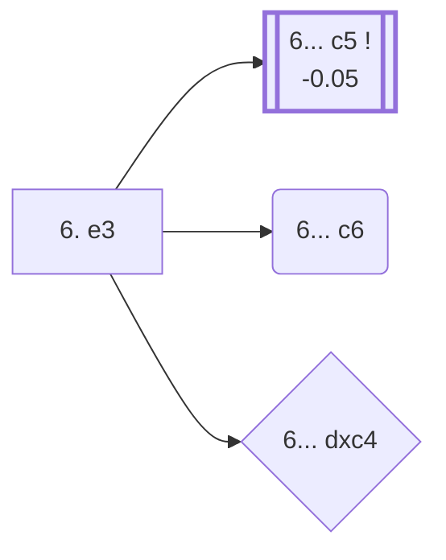

<a name="_TOP_"></a>

# D93 Grünfeld Defense: Three Knights Variation, Hungarian Variation <br> 1. d4 Nf6 2. c4 g6 3. Nc3 d5 4. Nf3 Bg7 5. Bf4 O-O 6. e3 #

Continues from [D92's own "5... O-O" node](https://github.com/onclemarcel/chess_flashcards/blob/main/d4_openings/D92_Grunfeld_5Bf4.md#_OO_), where White's **6. e3** is a real, significant secondary (47.0% masters, close behind the uncoded 6. Rc1) — solidifying the centre before deciding on the rook's placement. Live-tagged the **Hungarian Variation**, the second half of the small "Hungarian" cluster inside this batch alongside D92's own Hungarian Attack one ply back.

### Overview

*Quick map of every move covered on this card — see the [shape key](https://github.com/onclemarcel/chess_flashcards/blob/main/start.md#content-diagram-optional) in start.md.*

<!-- content-diagram:start -->

<!-- content-diagram:end -->

<a name="_initial_move_"></a>

[](https://lichess.org/analysis/standard/rnbq1rk1/ppp1ppbp/5np1/3p4/2PP1B2/2N1PN2/PP3PPP/R2QKB1R_b_KQ_-_0_6)

*... 6. e3 — live-tagged the Hungarian Variation*

```
rnbq1rk1/ppp1ppbp/5np1/3p4/2PP1B2/2N1PN2/PP3PPP/R2QKB1R b KQ - 0 6
```

|  | -0.05 |
| --- | --- |

<!-- lichess-stats:start fen="rnbq1rk1/ppp1ppbp/5np1/3p4/2PP1B2/2N1PN2/PP3PPP/R2QKB1R b KQ - 0 6" db="lichess,masters" speeds="bullet,blitz" ratings="1800,2000,2200,2500" moves="4" -->
| Move | Online | W/D/B | Masters | W/D/B | |
| :--- | ---: | :--- | ---: | :--- | :-- |
| c5 | 259 k (54.5%) | ⬜⬜⬜⬜🟫⬛⬛⬛⬛⬛ 43/6/51 | 948 (89.6%) | ⬜⬜⬜🟫🟫🟫🟫⬛⬛⬛ 29/44/27 |  |
| c6 | 99 k (20.8%) | ⬜⬜⬜⬜⬜🟫⬛⬛⬛⬛ 52/6/42 | 83 (7.8%) | ⬜⬜⬜🟫🟫🟫🟫🟫⬛⬛ 34/46/20 |  |
| dxc4 | 30 k (6.3%) | ⬜⬜⬜⬜⬜🟫⬛⬛⬛⬛ 50/6/44 | 6 (0.6%) | — |  |
| Bg4 | 24 k (5.0%) | ⬜⬜⬜⬜⬜🟫⬛⬛⬛⬛ 53/6/41 | 0 | — | ⚠ |
| Be6 | 0 | — | 18 (1.7%) | — |  |

*Online: bullet/blitz, 1800+ — 476 k games. Masters: 1.1 k games. [Open in the explorer](https://lichess.org/analysis/standard/rnbq1rk1/ppp1ppbp/5np1/3p4/2PP1B2/2N1PN2/PP3PPP/R2QKB1R_b_KQ_-_0_6#explorer) — updated 2026-09-07*
<!-- lichess-stats:end -->

**6... c5** is masters' overwhelming main try (89.6%) — the thematic central strike this whole opening is built around. **6... c6** (7.8% masters) is a real, uncoded secondary. **6... dxc4** is a genuine blitz-trap-shaped gap: a bare 0.6% of masters games (6 of 1,058) against a real 6.3% online share — over 10× the masters rate, clearing this repo's own ratio bar for the rhombus shape even on a thin masters sample.

* **6... c5** (-0.05, 89.6% masters, 54.5% online): masters' overwhelming main try; not built out further here (backlog).
* **6... c6** (7.8% masters, 20.8% online): a real, secondary try with no code of its own in this range.
* **6... dxc4** (0.6% masters, 6.3% online — a real online/masters gap over 10×): a real database rarity in masters play, comparatively popular online.

[*Back to D92's own "5... O-O"*](https://github.com/onclemarcel/chess_flashcards/blob/main/d4_openings/D92_Grunfeld_5Bf4.md#_OO_)
[*Back to TOP*](#_TOP_)
