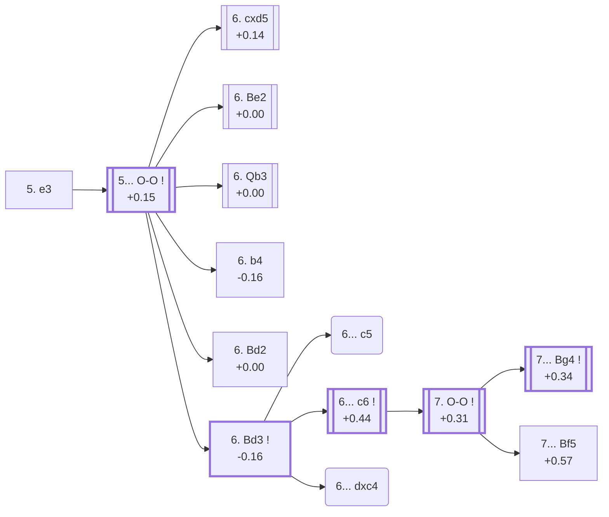

<a name="_TOP_"></a>

# D94 Grünfeld Defense: Three Knights Variation, Burille Variation <br> 1. d4 Nf6 2. c4 g6 3. Nc3 d5 4. Nf3 Bg7 5. e3 #

Continues from [D90's own "4... Bg7" node](https://github.com/onclemarcel/chess_flashcards/blob/main/d4_openings/D90_Grunfeld_Three_Knights_Variation.md#_Bg7_), where White's **5. e3** is a real secondary (10.7% masters) — a quiet, solidifying setup skipping the more committal Bg5/Bf4/Qb3 tries. `eco.md` leaves this bare tabiya named only "5.e3"; the live explorer independently calls it the **Burille Variation**. This card, together with [D95](https://github.com/onclemarcel/chess_flashcards/blob/main/d4_openings/D95_Grunfeld_e3_Qb3.md), forms the whole "5. e3" sub-tree — the deepest single card in this D90-D99 batch, running from the Makogonov and Opocensky Variations through a genuinely uncoded Paris Variation trunk down to the Smyslov and Flohr Defences.

### Overview

*Quick map of every move covered on this card — see the [shape key](https://github.com/onclemarcel/chess_flashcards/blob/main/start.md#content-diagram-optional) in start.md.*

<!-- content-diagram:start -->

<!-- content-diagram:end -->

<a name="_initial_move_"></a>

[](https://lichess.org/analysis/standard/rnbqk2r/ppp1ppbp/5np1/3p4/2PP4/2N1PN2/PP3PPP/R1BQKB1R_b_KQkq_-_0_5)

*... 5. e3 — live-tagged the Burille Variation*

```
rnbqk2r/ppp1ppbp/5np1/3p4/2PP4/2N1PN2/PP3PPP/R1BQKB1R b KQkq - 0 5
```

|  | +0.08 |
| --- | --- |

<!-- lichess-stats:start fen="rnbqk2r/ppp1ppbp/5np1/3p4/2PP4/2N1PN2/PP3PPP/R1BQKB1R b KQkq - 0 5" db="lichess,masters" speeds="bullet,blitz" ratings="1800,2000,2200,2500" moves="4" -->
| Move | Online | W/D/B | Masters | W/D/B | |
| :--- | ---: | :--- | ---: | :--- | :-- |
| O-O | 880 k (77.8%) | ⬜⬜⬜⬜🟫⬛⬛⬛⬛⬛ 45/6/49 | 2.3 k (97.8%) | ⬜⬜⬜🟫🟫🟫🟫⬛⬛⬛ 27/46/27 |  |
| c6 | 82 k (7.3%) | ⬜⬜⬜⬜⬜🟫⬛⬛⬛⬛ 49/6/45 | 21 (0.9%) | ⬜⬜⬜🟫🟫🟫🟫🟫⬛⬛ 33/48/19 |  |
| dxc4 | 56 k (4.9%) | ⬜⬜⬜⬜⬜⬛⬛⬛⬛⬛ 49/5/45 | 0 | — | ⚠ |
| c5 | 52 k (4.6%) | ⬜⬜⬜⬜⬜⬛⬛⬛⬛⬛ 46/6/48 | 19 (0.8%) | — |  |
| e6 | 0 | — | 5 (0.2%) | — |  |

*Online: bullet/blitz, 1800+ — 1.1 M games. Masters: 2.4 k games. [Open in the explorer](https://lichess.org/analysis/standard/rnbqk2r/ppp1ppbp/5np1/3p4/2PP4/2N1PN2/PP3PPP/R1BQKB1R_b_KQkq_-_0_5#explorer) — updated 2026-09-09*
<!-- lichess-stats:end -->

**5... O-O** is close to automatic (97.8% masters).

* [**5... O-O**](#_OO_) (+0.15, 97.8% masters): see below.

[*Back to D90's own "4... Bg7"*](https://github.com/onclemarcel/chess_flashcards/blob/main/d4_openings/D90_Grunfeld_Three_Knights_Variation.md#_Bg7_)
[*Back to TOP*](#_TOP_)

---

<a name="_OO_"></a>

## 5... O-O

[](https://lichess.org/analysis/standard/rnbq1rk1/ppp1ppbp/5np1/3p4/2PP4/2N1PN2/PP3PPP/R1BQKB1R_w_KQ_-_1_6)

*... 5... O-O*

```
rnbq1rk1/ppp1ppbp/5np1/3p4/2PP4/2N1PN2/PP3PPP/R1BQKB1R w KQ - 1 6
```

|  | +0.15 |
| --- | --- |

<!-- lichess-stats:start fen="rnbq1rk1/ppp1ppbp/5np1/3p4/2PP4/2N1PN2/PP3PPP/R1BQKB1R w KQ - 1 6" db="lichess,masters" speeds="bullet,blitz" ratings="1800,2000,2200,2500" moves="6" -->
| Move | Online | W/D/B | Masters | W/D/B | |
| :--- | ---: | :--- | ---: | :--- | :-- |
| Be2 | 323 k (28.9%) | ⬜⬜⬜⬜🟫⬛⬛⬛⬛⬛ 45/6/49 | 513 (21.6%) | ⬜⬜🟫🟫🟫🟫⬛⬛⬛⬛ 21/44/35 |  |
| cxd5 | 283 k (25.3%) | ⬜⬜⬜⬜🟫⬛⬛⬛⬛⬛ 46/6/48 | 559 (23.5%) | ⬜⬜⬜🟫🟫🟫🟫🟫⬛⬛ 28/49/23 |  |
| Bd3 | 214 k (19.2%) | ⬜⬜⬜⬜🟫⬛⬛⬛⬛⬛ 42/6/52 | 41 (1.7%) | ⬜🟫🟫🟫⬛⬛⬛⬛⬛⬛ 15/29/56 |  |
| Qb3 | 57 k (5.1%) | ⬜⬜⬜⬜⬜🟫⬛⬛⬛⬛ 51/6/43 | 449 (18.9%) | ⬜⬜⬜🟫🟫🟫🟫⬛⬛⬛ 34/42/24 |  |
| b3 | 49 k (4.4%) | ⬜⬜⬜⬜🟫⬛⬛⬛⬛⬛ 41/7/52 | 0 | — | ⚠ |
| Bd2 | 44 k (4.0%) | ⬜⬜⬜⬜🟫⬛⬛⬛⬛⬛ 44/6/50 | 375 (15.8%) | ⬜⬜⬜🟫🟫🟫🟫🟫⬛⬛ 25/53/23 |  |
| b4 | 0 | — | 402 (16.9%) | ⬜⬜⬜🟫🟫🟫🟫🟫⬛⬛ 31/45/25 |  |

*Online: bullet/blitz, 1800+ — 1.1 M games. Masters: 2.4 k games. [Open in the explorer](https://lichess.org/analysis/standard/rnbq1rk1/ppp1ppbp/5np1/3p4/2PP4/2N1PN2/PP3PPP/R1BQKB1R_w_KQ_-_1_6#explorer) — updated 2026-09-09*
<!-- lichess-stats:end -->

**A genuine, striking finding worth flagging plainly**: this is a genuine six-way near-even split, and the two moves masters actually prefer most — **6. cxd5** (23.5%) and **6. Be2** (21.6%) — carry no code of their own anywhere in this range. The *named* tries all sit behind them: **6. Qb3** (+0.00, 18.9%) is the Vienna Variation, its own code, [D95](https://github.com/onclemarcel/chess_flashcards/blob/main/d4_openings/D95_Grunfeld_e3_Qb3.md); **6. b4** (16.9%) is the Makogonov Variation; **6. Bd2** (15.8%) is the Opocensky Variation (note the spelling: `eco.md` writes "Opovcensky", the live explorer "Opocensky" — a genuine spelling divergence, not a typo introduced here); and **6. Bd3** — this card's own further trunk, live-tagged the **Paris Variation**, a real name `eco.md`'s own bare "With e3 & Bd3" label doesn't carry — is the rarest of all six, a mere 1.7% of masters games.

* **6. cxd5** (+0.14, 23.5% masters, 25.3% online): masters' actual top pick; no code of its own in this range.
* **6. Be2** (+0.00, 21.6% masters, 28.9% online): masters' actual second pick; no code of its own in this range.
* [**6. Qb3**](https://github.com/onclemarcel/chess_flashcards/blob/main/d4_openings/D95_Grunfeld_e3_Qb3.md) (18.9% masters): the Vienna Variation — its own code, D95.
* [**6. b4**](#_Makogonov_) (-0.16, 16.9% masters): the Makogonov Variation — see below.
* [**6. Bd2**](#_Opocensky_) (+0.00, 15.8% masters): the Opocensky Variation — see below.
* [**6. Bd3**](#_Bd3_) (-0.16, 1.7% masters): live-tagged the Paris Variation, this card's own further trunk — see below.

[*Back to 5. e3*](#_initial_move_)
[*Back to TOP*](#_TOP_)

---

<a name="_Makogonov_"></a>

## 6. b4 — Makogonov Variation

[](https://lichess.org/analysis/standard/rnbq1rk1/ppp1ppbp/5np1/3p4/1PPP4/2N1PN2/P4PPP/R1BQKB1R_b_KQ_b3_0_6)

*... 6. b4 — Makogonov Variation*

```
rnbq1rk1/ppp1ppbp/5np1/3p4/1PPP4/2N1PN2/P4PPP/R1BQKB1R b KQ b3 0 6
```

|  | -0.16 |
| --- | --- |

<!-- lichess-stats:start fen="rnbq1rk1/ppp1ppbp/5np1/3p4/1PPP4/2N1PN2/P4PPP/R1BQKB1R b KQ b3 0 6" db="lichess,masters" speeds="bullet,blitz" ratings="1800,2000,2200,2500" moves="5" -->
| Move | Online | W/D/B | Masters | W/D/B | |
| :--- | ---: | :--- | ---: | :--- | :-- |
| a5 | 5.7 k (39.0%) | ⬜⬜⬜⬜⬜🟫⬛⬛⬛⬛ 51/7/41 | 30 (7.3%) | ⬜⬜⬜🟫🟫🟫🟫🟫⬛⬛ 33/47/20 |  |
| c6 | 2.8 k (19.2%) | ⬜⬜⬜⬜⬜🟫⬛⬛⬛⬛ 51/8/41 | 119 (29.1%) | ⬜⬜⬜🟫🟫🟫🟫⬛⬛⬛ 29/40/30 |  |
| b6 | 2.2 k (14.7%) | ⬜⬜⬜⬜⬜🟫⬛⬛⬛⬛ 50/8/43 | 180 (44.0%) | ⬜⬜⬜🟫🟫🟫🟫🟫⬛⬛ 32/46/23 |  |
| dxc4 | 1.7 k (11.4%) | ⬜⬜⬜⬜⬜🟫⬛⬛⬛⬛ 52/7/42 | 0 | — | ⚠ |
| Bg4 | 724 (4.9%) | ⬜⬜⬜⬜⬜🟫⬛⬛⬛⬛ 48/10/43 | 19 (4.6%) | — |  |
| Be6 | 0 | — | 31 (7.6%) | ⬜⬜⬜🟫🟫🟫🟫🟫⬛⬛ 26/55/19 |  |

*Online: bullet/blitz, 1800+ — 15 k games. Masters: 409 games. [Open in the explorer](https://lichess.org/analysis/standard/rnbq1rk1/ppp1ppbp/5np1/3p4/1PPP4/2N1PN2/P4PPP/R1BQKB1R_b_KQ_b3_0_6#explorer) — updated 2026-09-09*
<!-- lichess-stats:end -->

Live-tagged **Grünfeld Defense: Makogonov Variation**, confirming the name — the queenside space grab, gaining room before Black can strike with ...c5. Masters' own top reply is **6... b6** (44.0%), just ahead of **6... c6** (29.1%).

[*Back to 5... O-O*](#_OO_)
[*Back to TOP*](#_TOP_)

---

<a name="_Opocensky_"></a>

## 6. Bd2 — Opocensky Variation

[](https://lichess.org/analysis/standard/rnbq1rk1/ppp1ppbp/5np1/3p4/2PP4/2N1PN2/PP1B1PPP/R2QKB1R_b_KQ_-_2_6)

*... 6. Bd2 — live-tagged the Opocensky Variation*

```
rnbq1rk1/ppp1ppbp/5np1/3p4/2PP4/2N1PN2/PP1B1PPP/R2QKB1R b KQ - 2 6
```

|  | +0.00 |
| --- | --- |

<!-- lichess-stats:start fen="rnbq1rk1/ppp1ppbp/5np1/3p4/2PP4/2N1PN2/PP1B1PPP/R2QKB1R b KQ - 2 6" db="lichess,masters" speeds="bullet,blitz" ratings="1800,2000,2200,2500" moves="5" -->
| Move | Online | W/D/B | Masters | W/D/B | |
| :--- | ---: | :--- | ---: | :--- | :-- |
| c5 | 26 k (49.4%) | ⬜⬜⬜⬜🟫⬛⬛⬛⬛⬛ 42/6/52 | 170 (45.0%) | ⬜⬜🟫🟫🟫🟫🟫⬛⬛⬛ 21/51/28 |  |
| c6 | 9.5 k (18.3%) | ⬜⬜⬜⬜🟫⬛⬛⬛⬛⬛ 45/6/48 | 83 (22.0%) | ⬜⬜⬜⬜🟫🟫🟫🟫🟫⬛ 35/53/12 |  |
| Bg4 | 3.9 k (7.5%) | ⬜⬜⬜⬜⬜🟫⬛⬛⬛⬛ 48/7/45 | 0 | — | ⚠ |
| dxc4 | 3.8 k (7.2%) | ⬜⬜⬜⬜🟫⬛⬛⬛⬛⬛ 43/6/51 | 10 (2.6%) | — |  |
| b6 | 3.4 k (6.4%) | ⬜⬜⬜⬜🟫⬛⬛⬛⬛⬛ 43/7/50 | 30 (7.9%) | ⬜⬜⬜🟫🟫🟫🟫🟫🟫⬛ 30/57/13 |  |
| e6 | 0 | — | 70 (18.5%) | ⬜⬜🟫🟫🟫🟫🟫🟫⬛⬛ 20/56/24 |  |

*Online: bullet/blitz, 1800+ — 52 k games. Masters: 378 games. [Open in the explorer](https://lichess.org/analysis/standard/rnbq1rk1/ppp1ppbp/5np1/3p4/2PP4/2N1PN2/PP1B1PPP/R2QKB1R_b_KQ_-_2_6#explorer) — updated 2026-09-09*
<!-- lichess-stats:end -->

`eco.md` calls this the **Opovcensky Variation**; the live explorer spells it **Opocensky Variation** — a genuine, verified spelling divergence, likely tracing back to two different historical transliterations of the same Czech surname (Karel Opočenský). Masters' own top reply is **6... c5** (45.0%), just ahead of **6... c6** (22.0%) and **6... e6** (18.5%).

[*Back to 5... O-O*](#_OO_)
[*Back to TOP*](#_TOP_)

---

<a name="_Bd3_"></a>

## 6. Bd3 — Paris Variation

[](https://lichess.org/analysis/standard/rnbq1rk1/ppp1ppbp/5np1/3p4/2PP4/2NBPN2/PP3PPP/R1BQK2R_b_KQ_-_2_6)

*... 6. Bd3 — live-tagged the Paris Variation*

```
rnbq1rk1/ppp1ppbp/5np1/3p4/2PP4/2NBPN2/PP3PPP/R1BQK2R b KQ - 2 6
```

|  | -0.16 |
| --- | --- |

<!-- lichess-stats:start fen="rnbq1rk1/ppp1ppbp/5np1/3p4/2PP4/2NBPN2/PP3PPP/R1BQK2R b KQ - 2 6" db="lichess,masters" speeds="bullet,blitz" ratings="1800,2000,2200,2500" moves="3" -->
| Move | Online | W/D/B | Masters | W/D/B | |
| :--- | ---: | :--- | ---: | :--- | :-- |
| c5 | 101 k (42.0%) | ⬜⬜⬜⬜🟫⬛⬛⬛⬛⬛ 39/6/55 | 36 (83.7%) | ⬜🟫🟫🟫⬛⬛⬛⬛⬛⬛ 14/28/58 |  |
| dxc4 | 67 k (27.8%) | ⬜⬜⬜⬜🟫⬛⬛⬛⬛⬛ 44/5/51 | 5 (11.6%) | — |  |
| c6 | 33 k (13.6%) | ⬜⬜⬜⬜⬜⬛⬛⬛⬛⬛ 46/5/49 | 2 (4.7%) | — | ⚠ |

*Online: bullet/blitz, 1800+ — 239 k games. Masters: 43 games. [Open in the explorer](https://lichess.org/analysis/standard/rnbq1rk1/ppp1ppbp/5np1/3p4/2PP4/2NBPN2/PP3PPP/R1BQK2R_b_KQ_-_2_6#explorer) — updated 2026-09-09*
<!-- lichess-stats:end -->

`eco.md`'s own bare label for this tabiya is just "With e3 & Bd3" — no name at all; the live explorer independently supplies a real one, the **Paris Variation**. **A second genuine, striking finding, compounding the one at the parent fork**: `eco.md`'s own two named children from here — the Smyslov and Flohr Defences, both reached via 6...c6 — sit behind masters' actual main try at this exact fork: **6... c5** is masters' overwhelming preference (83.7%), while **6... c6**, the move that actually leads to both of this card's own named continuations, is a mere 4.7%.

* **6... c5** (83.7% masters, 42.0% online): masters' overwhelming main try; no code of its own in this range, not built out further here (backlog).
* [**6... c6**](#_Bd3_c6_) (+0.44, 4.7% masters): heads into the Smyslov/Flohr Defences — see below.
* **6... dxc4** (11.6% masters, 27.8% online): a real, secondary try with no code of its own in this range.

[*Back to 5... O-O*](#_OO_)
[*Back to TOP*](#_TOP_)

---

<a name="_Bd3_c6_"></a>

### 6... c6

[](https://lichess.org/analysis/standard/rnbq1rk1/pp2ppbp/2p2np1/3p4/2PP4/2NBPN2/PP3PPP/R1BQK2R_w_KQ_-_0_7)

*... 6... c6*

```
rnbq1rk1/pp2ppbp/2p2np1/3p4/2PP4/2NBPN2/PP3PPP/R1BQK2R w KQ - 0 7
```

|  | +0.44 |
| --- | --- |

<!-- lichess-stats:start fen="rnbq1rk1/pp2ppbp/2p2np1/3p4/2PP4/2NBPN2/PP3PPP/R1BQK2R w KQ - 0 7" db="lichess,masters" speeds="bullet,blitz" ratings="1800,2000,2200,2500" moves="3" -->
| Move | Online | W/D/B | Masters | W/D/B | |
| :--- | ---: | :--- | ---: | :--- | :-- |
| O-O | 177 k (72.2%) | ⬜⬜⬜⬜⬜⬛⬛⬛⬛⬛ 47/6/47 | 1.2 k (88.9%) | ⬜⬜⬜⬜🟫🟫🟫🟫🟫⬛ 40/47/13 |  |
| cxd5 | 20 k (8.3%) | ⬜⬜⬜⬜🟫⬛⬛⬛⬛⬛ 44/5/50 | 8 (0.6%) | — |  |
| h3 | 14 k (5.7%) | ⬜⬜⬜⬜⬜🟫⬛⬛⬛⬛ 49/6/45 | 117 (8.8%) | ⬜⬜⬜⬜🟫🟫🟫🟫⬛⬛ 37/44/20 |  |

*Online: bullet/blitz, 1800+ — 245 k games. Masters: 1.3 k games. [Open in the explorer](https://lichess.org/analysis/standard/rnbq1rk1/pp2ppbp/2p2np1/3p4/2PP4/2NBPN2/PP3PPP/R1BQK2R_w_KQ_-_0_7#explorer) — updated 2026-09-09*
<!-- lichess-stats:end -->

**7. O-O** is masters' overwhelming main try (88.9%).

<a name="_Bd3_c6_OO_"></a>

[](https://lichess.org/analysis/standard/rnbq1rk1/pp2ppbp/2p2np1/3p4/2PP4/2NBPN2/PP3PPP/R1BQ1RK1_b_-_-_1_7)

*... 7. O-O*

```
rnbq1rk1/pp2ppbp/2p2np1/3p4/2PP4/2NBPN2/PP3PPP/R1BQ1RK1 b - - 1 7
```

|  | +0.31 |
| --- | --- |

<!-- lichess-stats:start fen="rnbq1rk1/pp2ppbp/2p2np1/3p4/2PP4/2NBPN2/PP3PPP/R1BQ1RK1 b - - 1 7" db="lichess,masters" speeds="bullet,blitz" ratings="1800,2000,2200,2500" moves="5" -->
| Move | Online | W/D/B | Masters | W/D/B | |
| :--- | ---: | :--- | ---: | :--- | :-- |
| Bg4 | 67 k (34.1%) | ⬜⬜⬜⬜⬜🟫⬛⬛⬛⬛ 47/7/46 | 643 (50.8%) | ⬜⬜⬜⬜🟫🟫🟫🟫🟫⬛ 35/52/13 |  |
| dxc4 | 36 k (18.3%) | ⬜⬜⬜⬜⬜⬛⬛⬛⬛⬛ 48/6/47 | 142 (11.2%) | ⬜⬜⬜⬜🟫🟫🟫🟫🟫⬛ 39/48/13 |  |
| Nbd7 | 35 k (17.7%) | ⬜⬜⬜⬜⬜⬛⬛⬛⬛⬛ 47/6/47 | 124 (9.8%) | ⬜⬜⬜⬜🟫🟫🟫🟫⬛⬛ 41/44/15 |  |
| Re8 | 19 k (9.5%) | ⬜⬜⬜⬜⬜⬛⬛⬛⬛⬛ 48/6/46 | 0 | — | ⚠ |
| a6 | 10 k (5.2%) | ⬜⬜⬜⬜⬜⬛⬛⬛⬛⬛ 46/6/47 | 113 (8.9%) | ⬜⬜⬜⬜🟫🟫🟫🟫⬛⬛ 42/43/14 |  |
| Bf5 | 0 | — | 81 (6.4%) | ⬜⬜⬜⬜🟫🟫🟫🟫⬛⬛ 42/43/15 |  |

*Online: bullet/blitz, 1800+ — 197 k games. Masters: 1.3 k games. [Open in the explorer](https://lichess.org/analysis/standard/rnbq1rk1/pp2ppbp/2p2np1/3p4/2PP4/2NBPN2/PP3PPP/R1BQ1RK1_b_-_-_1_7#explorer) — updated 2026-09-09*
<!-- lichess-stats:end -->

This is the real Smyslov/Flohr Defence fork: **7... Bg4** is masters' clear main try (50.8%), heading into the Smyslov Defence. **7... Bf5** (6.4%) heads into the Flohr Defence instead — the second of two unrelated "Flohr" names in this D90-D99 batch (D90's own Flohr Variation, at 5. Qa4+, is the other).

* [**7... Bg4**](#_Smyslov_) (+0.34, 50.8% masters): the Smyslov Defense — see below.
* [**7... Bf5**](#_Flohr_) (6.4% masters): the Flohr Defense — see below.

[*Back to 6... c6*](#_Bd3_c6_)
[*Back to TOP*](#_TOP_)

---

<a name="_Smyslov_"></a>

### 7... Bg4 — Smyslov Defense

[](https://lichess.org/analysis/standard/rn1q1rk1/pp2ppbp/2p2np1/3p4/2PP2b1/2NBPN2/PP3PPP/R1BQ1RK1_w_-_-_2_8)

*... 7... Bg4 — Smyslov Defense*

```
rn1q1rk1/pp2ppbp/2p2np1/3p4/2PP2b1/2NBPN2/PP3PPP/R1BQ1RK1 w - - 2 8
```

|  | +0.34 |
| --- | --- |

<!-- lichess-stats:start fen="rn1q1rk1/pp2ppbp/2p2np1/3p4/2PP2b1/2NBPN2/PP3PPP/R1BQ1RK1 w - - 2 8" db="lichess,masters" speeds="bullet,blitz" ratings="1800,2000,2200,2500" moves="3" -->
| Move | Online | W/D/B | Masters | W/D/B | |
| :--- | ---: | :--- | ---: | :--- | :-- |
| h3 | 52 k (69.6%) | ⬜⬜⬜⬜⬜🟫⬛⬛⬛⬛ 48/7/45 | 624 (95.4%) | ⬜⬜⬜⬜🟫🟫🟫🟫🟫⬛ 36/51/13 |  |
| Re1 | 5.1 k (6.9%) | ⬜⬜⬜⬜🟫⬛⬛⬛⬛⬛ 44/5/50 | 0 | — | ⚠ |
| cxd5 | 4.8 k (6.5%) | ⬜⬜⬜⬜🟫⬛⬛⬛⬛⬛ 46/7/47 | 19 (2.9%) | — |  |
| Qb3 | 0 | — | 7 (1.1%) | — |  |

*Online: bullet/blitz, 1800+ — 74 k games. Masters: 654 games. [Open in the explorer](https://lichess.org/analysis/standard/rn1q1rk1/pp2ppbp/2p2np1/3p4/2PP2b1/2NBPN2/PP3PPP/R1BQ1RK1_w_-_-_2_8#explorer) — updated 2026-09-09*
<!-- lichess-stats:end -->

Live-tagged **Grünfeld Defense: Smyslov Defense**, confirming the name — the first of a small "Smyslov" cluster this batch keeps hitting (D98's own Smyslov Variation and D99's own Smyslov Main Line/Yugoslav Variation, all four unrelated to this one, are the other three). Masters' own follow-up is close to universal: **8. h3** (95.4%).

[*Back to 7. O-O*](#_Bd3_c6_OO_)
[*Back to TOP*](#_TOP_)

---

<a name="_Flohr_"></a>

### 7... Bf5 — Flohr Defense

[](https://lichess.org/analysis/standard/rn1q1rk1/pp2ppbp/2p2np1/3p1b2/2PP4/2NBPN2/PP3PPP/R1BQ1RK1_w_-_-_2_8)

*... 7... Bf5 — Flohr Defense*

```
rn1q1rk1/pp2ppbp/2p2np1/3p1b2/2PP4/2NBPN2/PP3PPP/R1BQ1RK1 w - - 2 8
```

|  | +0.57 |
| --- | --- |

<!-- lichess-stats:start fen="rn1q1rk1/pp2ppbp/2p2np1/3p1b2/2PP4/2NBPN2/PP3PPP/R1BQ1RK1 w - - 2 8" db="lichess,masters" speeds="bullet,blitz" ratings="1800,2000,2200,2500" moves="4" -->
| Move | Online | W/D/B | Masters | W/D/B | |
| :--- | ---: | :--- | ---: | :--- | :-- |
| Bxf5 | 4.4 k (59.1%) | ⬜⬜⬜⬜🟫⬛⬛⬛⬛⬛ 47/7/47 | 68 (82.9%) | ⬜⬜⬜⬜🟫🟫🟫🟫⬛⬛ 43/41/16 |  |
| b3 | 682 (9.1%) | ⬜⬜⬜⬜🟫⬛⬛⬛⬛⬛ 44/8/48 | 4 (4.9%) | — | ⚠ |
| Re1 | 627 (8.4%) | ⬜⬜⬜⬜🟫⬛⬛⬛⬛⬛ 43/6/52 | 3 (3.7%) | — | ⚠ |
| cxd5 | 478 (6.4%) | ⬜⬜⬜⬜🟫⬛⬛⬛⬛⬛ 43/6/51 | 3 (3.7%) | — | ⚠ |

*Online: bullet/blitz, 1800+ — 7.5 k games. Masters: 82 games. [Open in the explorer](https://lichess.org/analysis/standard/rn1q1rk1/pp2ppbp/2p2np1/3p1b2/2PP4/2NBPN2/PP3PPP/R1BQ1RK1_w_-_-_2_8#explorer) — updated 2026-09-09*
<!-- lichess-stats:end -->

Live-tagged **Grünfeld Defense: Flohr Defense**, confirming the name and, at +0.57, the least comfortable of this fork's two branches for Black per Stockfish. Masters' own follow-up is **8. Bxf5** (82.9%), simply removing the bishop.

[*Back to 7. O-O*](#_Bd3_c6_OO_)
[*Back to TOP*](#_TOP_)
