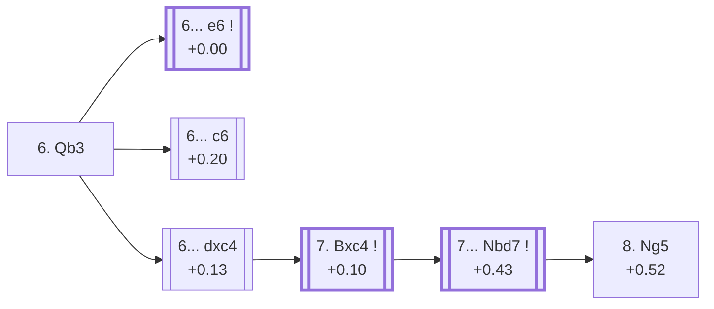

<a name="_TOP_"></a>

# D95 Grünfeld Defense: Three Knights Variation, Vienna Variation <br> 1. d4 Nf6 2. c4 g6 3. Nc3 d5 4. Nf3 Bg7 5. e3 O-O 6. Qb3 #

Continues from [D94's own "5... O-O" node](https://github.com/onclemarcel/chess_flashcards/blob/main/d4_openings/D94_Grunfeld_5e3.md#_OO_), where White's **6. Qb3** is a real, significant secondary (18.9% masters) — pressuring d5 a second time before deciding on the bishop's diagonal. `eco.md` leaves this bare tabiya named only "With e3 & Qb3"; the live explorer independently calls it the **Vienna Variation**.

### Overview

*Quick map of every move covered on this card — see the [shape key](https://github.com/onclemarcel/chess_flashcards/blob/main/start.md#content-diagram-optional) in start.md.*

<!-- content-diagram:start -->

<!-- content-diagram:end -->

<a name="_initial_move_"></a>

[](https://lichess.org/analysis/standard/rnbq1rk1/ppp1ppbp/5np1/3p4/2PP4/1QN1PN2/PP3PPP/R1B1KB1R_b_KQ_-_2_6)

*... 6. Qb3 — live-tagged the Vienna Variation*

```
rnbq1rk1/ppp1ppbp/5np1/3p4/2PP4/1QN1PN2/PP3PPP/R1B1KB1R b KQ - 2 6
```

|  | +0.00 |
| --- | --- |

<!-- lichess-stats:start fen="rnbq1rk1/ppp1ppbp/5np1/3p4/2PP4/1QN1PN2/PP3PPP/R1B1KB1R b KQ - 2 6" db="lichess,masters" speeds="bullet,blitz" ratings="1800,2000,2200,2500" moves="3" -->
| Move | Online | W/D/B | Masters | W/D/B | |
| :--- | ---: | :--- | ---: | :--- | :-- |
| dxc4 | 30 k (52.0%) | ⬜⬜⬜⬜⬜🟫⬛⬛⬛⬛ 51/6/43 | 87 (19.3%) | ⬜⬜⬜⬜⬜🟫🟫🟫🟫⬛ 46/39/15 |  |
| c6 | 16 k (26.8%) | ⬜⬜⬜⬜⬜🟫⬛⬛⬛⬛ 51/6/43 | 104 (23.1%) | ⬜⬜⬜⬜🟫🟫🟫🟫⬛⬛ 44/38/18 |  |
| e6 | 5.2 k (8.9%) | ⬜⬜⬜⬜⬜🟫⬛⬛⬛⬛ 47/8/46 | 254 (56.4%) | ⬜⬜🟫🟫🟫🟫🟫⬛⬛⬛ 24/46/30 |  |

*Online: bullet/blitz, 1800+ — 58 k games. Masters: 450 games. [Open in the explorer](https://lichess.org/analysis/standard/rnbq1rk1/ppp1ppbp/5np1/3p4/2PP4/1QN1PN2/PP3PPP/R1B1KB1R_b_KQ_-_2_6#explorer) — updated 2026-09-07*
<!-- lichess-stats:end -->

**6... e6** is masters' clear main try (56.4%) — the Botvinnik Variation, see below. **6... c6** (23.1% masters) is a real, uncoded secondary. **6... dxc4** (19.3% masters) trails both in masters play despite being the clear online favourite (52.0%) — a real online/masters split running the opposite direction from the usual pattern in this repo; it heads into the Pachman Variation tree, see below.

* [**6... e6**](#_Botvinnik_) (+0.00, 56.4% masters): the Botvinnik Variation — see below.
* **6... c6** (+0.20, 23.1% masters, 26.8% online): a real, secondary try with no code of its own in this range.
* [**6... dxc4**](#_dxc4_) (+0.13, 19.3% masters, 52.0% online): heads into the Pachman Variation — see below.

[*Back to D94's own "5... O-O"*](https://github.com/onclemarcel/chess_flashcards/blob/main/d4_openings/D94_Grunfeld_5e3.md#_OO_)
[*Back to TOP*](#_TOP_)

---

<a name="_Botvinnik_"></a>

## 6... e6 — Botvinnik Variation

[](https://lichess.org/analysis/standard/rnbq1rk1/ppp2pbp/4pnp1/3p4/2PP4/1QN1PN2/PP3PPP/R1B1KB1R_w_KQ_-_0_7)

*... 6... e6 — Botvinnik Variation*

```
rnbq1rk1/ppp2pbp/4pnp1/3p4/2PP4/1QN1PN2/PP3PPP/R1B1KB1R w KQ - 0 7
```

|  | +0.00 |
| --- | --- |

<!-- lichess-stats:start fen="rnbq1rk1/ppp2pbp/4pnp1/3p4/2PP4/1QN1PN2/PP3PPP/R1B1KB1R w KQ - 0 7" db="lichess,masters" speeds="bullet,blitz" ratings="1800,2000,2200,2500" moves="4" -->
| Move | Online | W/D/B | Masters | W/D/B | |
| :--- | ---: | :--- | ---: | :--- | :-- |
| Bd2 | 2.7 k (34.5%) | ⬜⬜⬜⬜⬜🟫⬛⬛⬛⬛ 49/7/44 | 165 (55.0%) | ⬜⬜⬜🟫🟫🟫🟫⬛⬛⬛ 28/41/30 |  |
| Be2 | 2.1 k (27.5%) | ⬜⬜⬜⬜⬜🟫⬛⬛⬛⬛ 49/8/44 | 124 (41.3%) | ⬜⬜🟫🟫🟫🟫🟫⬛⬛⬛ 19/55/27 |  |
| cxd5 | 1.4 k (18.3%) | ⬜⬜⬜⬜🟫⬛⬛⬛⬛⬛ 46/6/48 | 5 (1.7%) | — |  |
| Bd3 | 626 (8.0%) | ⬜⬜⬜⬜🟫⬛⬛⬛⬛⬛ 44/5/51 | 5 (1.7%) | — |  |

*Online: bullet/blitz, 1800+ — 7.8 k games. Masters: 300 games. [Open in the explorer](https://lichess.org/analysis/standard/rnbq1rk1/ppp2pbp/4pnp1/3p4/2PP4/1QN1PN2/PP3PPP/R1B1KB1R_w_KQ_-_0_7#explorer) — updated 2026-09-07*
<!-- lichess-stats:end -->

Live-tagged **Grünfeld Defense: Botvinnik Variation**, confirming the name — not to be confused with [D83's own Botvinnik Variation](https://github.com/onclemarcel/chess_flashcards/blob/main/d4_openings/D83_Grunfeld_Gambit.md#_Botvinnik_), a completely unrelated line inside the very same Grünfeld complex (reached via 4. Bf4 rather than 4. Nf3), one of several "Botvinnik"-named reuses already logged elsewhere in this D-series. Masters' own follow-up is split between **7. Bd2** (55.0%) and **7. Be2** (41.3%).

[*Back to 6. Qb3*](#_initial_move_)
[*Back to TOP*](#_TOP_)

---

<a name="_dxc4_"></a>

## 6... dxc4

[](https://lichess.org/analysis/standard/rnbq1rk1/ppp1ppbp/5np1/8/2pP4/1QN1PN2/PP3PPP/R1B1KB1R_w_KQ_-_0_7)

*... 6... dxc4*

```
rnbq1rk1/ppp1ppbp/5np1/8/2pP4/1QN1PN2/PP3PPP/R1B1KB1R w KQ - 0 7
```

|  | +0.13 |
| --- | --- |

<!-- lichess-stats:start fen="rnbq1rk1/ppp1ppbp/5np1/8/2pP4/1QN1PN2/PP3PPP/R1B1KB1R w KQ - 0 7" db="lichess,masters" speeds="bullet,blitz" ratings="1800,2000,2200,2500" moves="2" -->
| Move | Online | W/D/B | Masters | W/D/B | |
| :--- | ---: | :--- | ---: | :--- | :-- |
| Bxc4 | 30 k (97.8%) | ⬜⬜⬜⬜⬜🟫⬛⬛⬛⬛ 51/6/43 | 86 (98.9%) | ⬜⬜⬜⬜⬜🟫🟫🟫🟫⬛ 47/38/15 |  |
| Qxc4 | 645 (2.1%) | ⬜⬜⬜⬜🟫⬛⬛⬛⬛⬛ 41/6/53 | 1 (1.1%) | — | ⚠ |

*Online: bullet/blitz, 1800+ — 30 k games. Masters: 87 games. [Open in the explorer](https://lichess.org/analysis/standard/rnbq1rk1/ppp1ppbp/5np1/8/2pP4/1QN1PN2/PP3PPP/R1B1KB1R_w_KQ_-_0_7#explorer) — updated 2026-09-07*
<!-- lichess-stats:end -->

**7. Bxc4** is close to automatic (98.9% masters), simply recapturing.

[](https://lichess.org/analysis/standard/rnbq1rk1/ppp1ppbp/5np1/8/2BP4/1QN1PN2/PP3PPP/R1B1K2R_b_KQ_-_0_7)

*... 7. Bxc4*

```
rnbq1rk1/ppp1ppbp/5np1/8/2BP4/1QN1PN2/PP3PPP/R1B1K2R b KQ - 0 7
```

|  | +0.10 |
| --- | --- |

<!-- lichess-stats:start fen="rnbq1rk1/ppp1ppbp/5np1/8/2BP4/1QN1PN2/PP3PPP/R1B1K2R b KQ - 0 7" db="lichess,masters" speeds="bullet,blitz" ratings="1800,2000,2200,2500" moves="4" -->
| Move | Online | W/D/B | Masters | W/D/B | |
| :--- | ---: | :--- | ---: | :--- | :-- |
| Nc6 | 25 k (41.0%) | ⬜⬜⬜⬜⬜🟫⬛⬛⬛⬛ 51/5/44 | 84 (46.9%) | ⬜⬜⬜⬜⬜🟫🟫🟫🟫⬛ 46/39/14 |  |
| c5 | 11 k (18.9%) | ⬜⬜⬜⬜⬜🟫⬛⬛⬛⬛ 49/6/45 | 58 (32.4%) | ⬜⬜⬜⬜⬜🟫🟫🟫⬛⬛ 47/36/17 |  |
| a6 | 7.0 k (11.7%) | ⬜⬜⬜⬜⬜🟫⬛⬛⬛⬛ 51/6/43 | 15 (8.4%) | — |  |
| c6 | 5.7 k (9.5%) | ⬜⬜⬜⬜⬜⬜⬛⬛⬛⬛ 55/5/40 | 0 | — | ⚠ |
| Nfd7 | 0 | — | 12 (6.7%) | — |  |

*Online: bullet/blitz, 1800+ — 60 k games. Masters: 179 games. [Open in the explorer](https://lichess.org/analysis/standard/rnbq1rk1/ppp1ppbp/5np1/8/2BP4/1QN1PN2/PP3PPP/R1B1K2R_b_KQ_-_0_7#explorer) — updated 2026-09-07*
<!-- lichess-stats:end -->

**A genuine, striking finding worth flagging plainly, and a thin one**: `eco.md`'s own defining move for the Pachman Variation, **7... Nbd7**, is a real masters minority here (6.7% of the 179 games at this exact fork) — well behind **7... Nc6** (46.9%) and **7... c5** (32.4%), both real, uncoded main tries. The sample thins sharply from here: only 4 masters games total continue past 7... Nbd7, so every percentage below this point is directional colour, not a firm verdict.

* **7... Nc6** (46.9% masters, 41.0% online): masters' actual main try; no code of its own in this range.
* **7... c5** (32.4% masters, 18.9% online): a real, significant secondary; no code of its own in this range.
* [**7... Nbd7**](#_Pachman_) (+0.43, 6.7% masters — 4 games total from here on): heads into the Pachman Variation — see below.

[*Back to 6. Qb3*](#_initial_move_)
[*Back to TOP*](#_TOP_)

---

<a name="_Pachman_"></a>

### 8. Ng5 — Pachman Variation

Reached after **7... Nbd7** and **8. Ng5** — an extremely thin masters sample from here (2 games total), so read this section as anecdotal, not authoritative; online play (829 games) is the more usable of the two.

[](https://lichess.org/analysis/standard/r1bq1rk1/pppnppbp/5np1/6N1/2BP4/1QN1P3/PP3PPP/R1B1K2R_b_KQ_-_2_8)

*... 8. Ng5 — Pachman Variation*

```
r1bq1rk1/pppnppbp/5np1/6N1/2BP4/1QN1P3/PP3PPP/R1B1K2R b KQ - 2 8
```

|  | +0.52 |
| --- | --- |

Live-tagged **Grünfeld Defense: Pachman Variation**, confirming the name despite the vanishingly thin sample. Online play's own main reply is **8... e6** (71.9%).

[*Back to 6... dxc4*](#_dxc4_)
[*Back to TOP*](#_TOP_)
