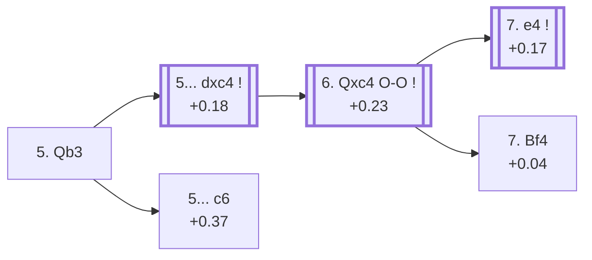

<a name="_TOP_"></a>

# D96 Grünfeld Defense: Russian Variation <br> 1. d4 Nf6 2. c4 g6 3. Nc3 d5 4. Nf3 Bg7 5. Qb3 #

Continues from [D90's own "4... Bg7" node](https://github.com/onclemarcel/chess_flashcards/blob/main/d4_openings/D90_Grunfeld_Three_Knights_Variation.md#_Bg7_), where White's **5. Qb3** is masters' narrow plurality (27.8% per D90's own table) — the **Russian Variation**, pressuring d5 a second time before Black can consolidate. This is the deepest, most important sub-tree in the whole D90-D99 batch: this card runs straight into [D97](https://github.com/onclemarcel/chess_flashcards/blob/main/d4_openings/D97_Grunfeld_Russian_Variation_e4.md), which itself forks six ways and runs on through [D98](https://github.com/onclemarcel/chess_flashcards/blob/main/d4_openings/D98_Grunfeld_Russian_Smyslov_Variation.md) to [D99](https://github.com/onclemarcel/chess_flashcards/blob/main/d4_openings/D99_Grunfeld_Russian_Smyslov_Main_Line.md) — one long spine, not four independent siblings.

### Overview

*Quick map of every move covered on this card — see the [shape key](https://github.com/onclemarcel/chess_flashcards/blob/main/start.md#content-diagram-optional) in start.md.*

<!-- content-diagram:start -->

<!-- content-diagram:end -->

<a name="_initial_move_"></a>

[](https://lichess.org/analysis/standard/rnbqk2r/ppp1ppbp/5np1/3p4/2PP4/1QN2N2/PP2PPPP/R1B1KB1R_b_KQkq_-_3_5)

*... 5. Qb3 — Grünfeld Defense: Russian Variation*

```
rnbqk2r/ppp1ppbp/5np1/3p4/2PP4/1QN2N2/PP2PPPP/R1B1KB1R b KQkq - 3 5
```

|  | +0.21 |
| --- | --- |

<!-- lichess-stats:start fen="rnbqk2r/ppp1ppbp/5np1/3p4/2PP4/1QN2N2/PP2PPPP/R1B1KB1R b KQkq - 3 5" db="lichess,masters" speeds="bullet,blitz" ratings="1800,2000,2200,2500" moves="3" -->
| Move | Online | W/D/B | Masters | W/D/B | |
| :--- | ---: | :--- | ---: | :--- | :-- |
| dxc4 | 181 k (80.0%) | ⬜⬜⬜⬜⬜🟫⬛⬛⬛⬛ 49/6/45 | 5.2 k (97.8%) | ⬜⬜⬜🟫🟫🟫🟫🟫⬛⬛ 28/55/17 |  |
| c6 | 30 k (13.3%) | ⬜⬜⬜⬜⬜🟫⬛⬛⬛⬛ 53/6/41 | 102 (1.9%) | ⬜⬜⬜⬜🟫🟫🟫⬛⬛⬛ 42/33/25 |  |
| O-O | 9.6 k (4.3%) | ⬜⬜⬜⬜⬜⬜⬛⬛⬛⬛ 55/5/40 | 0 | — | ⚠ |
| c5 | 0 | — | 8 (0.1%) | — |  |

*Online: bullet/blitz, 1800+ — 226 k games. Masters: 5.3 k games. [Open in the explorer](https://lichess.org/analysis/standard/rnbqk2r/ppp1ppbp/5np1/3p4/2PP4/1QN2N2/PP2PPPP/R1B1KB1R_b_KQkq_-_3_5#explorer) — updated 2026-09-14*
<!-- lichess-stats:end -->

**5... dxc4** is close to automatic (97.8% masters) — simply grabbing the pawn while it's on offer, banking on White needing an extra tempo (Qxc4) to regain it. **5... c6** (1.9% masters, 102 games) is a real, uncoded database rarity.

* [**5... dxc4**](#_OO_) (+0.18, 97.8% masters, 80.0% online): see below.
* **5... c6** (+0.37, 1.9% masters, 13.3% online): a real, secondary try with no code of its own in this range.

[*Back to D90's own "4... Bg7"*](https://github.com/onclemarcel/chess_flashcards/blob/main/d4_openings/D90_Grunfeld_Three_Knights_Variation.md#_Bg7_)
[*Back to TOP*](#_TOP_)

---

<a name="_OO_"></a>

## 5... dxc4 6. Qxc4 O-O

Black's recapture-tempo sequence is close to forced at every step: **6. Qxc4** is masters' only move (100%) after 5...dxc4, and **6... O-O** follows in 95.4% of masters games from there.

[](https://lichess.org/analysis/standard/rnbq1rk1/ppp1ppbp/5np1/8/2QP4/2N2N2/PP2PPPP/R1B1KB1R_w_KQ_-_1_7)

*... 5... dxc4 6. Qxc4 O-O*

```
rnbq1rk1/ppp1ppbp/5np1/8/2QP4/2N2N2/PP2PPPP/R1B1KB1R w KQ - 1 7
```

|  | +0.23 |
| --- | --- |

<!-- lichess-stats:start fen="rnbq1rk1/ppp1ppbp/5np1/8/2QP4/2N2N2/PP2PPPP/R1B1KB1R w KQ - 1 7" db="lichess,masters" speeds="bullet,blitz" ratings="1800,2000,2200,2500" moves="3" -->
| Move | Online | W/D/B | Masters | W/D/B | |
| :--- | ---: | :--- | ---: | :--- | :-- |
| e4 | 124 k (82.0%) | ⬜⬜⬜⬜⬜🟫⬛⬛⬛⬛ 49/6/45 | 4.8 k (94.9%) | ⬜⬜⬜🟫🟫🟫🟫🟫⬛⬛ 27/56/16 |  |
| Bf4 | 21 k (13.5%) | ⬜⬜⬜⬜⬜🟫⬛⬛⬛⬛ 50/6/44 | 239 (4.8%) | ⬜⬜⬜⬜🟫🟫🟫🟫⬛⬛ 38/39/23 |  |
| Bg5 | 2.7 k (1.8%) | ⬜⬜⬜⬜⬜🟫⬛⬛⬛⬛ 50/7/43 | 0 | — | ⚠ |
| g3 | 0 | — | 10 (0.2%) | — |  |

*Online: bullet/blitz, 1800+ — 152 k games. Masters: 5.0 k games. [Open in the explorer](https://lichess.org/analysis/standard/rnbq1rk1/ppp1ppbp/5np1/8/2QP4/2N2N2/PP2PPPP/R1B1KB1R_w_KQ_-_1_7#explorer) — updated 2026-09-14*
<!-- lichess-stats:end -->

**7. e4** is masters' overwhelming main try (94.9%) — grabbing the full centre now that Black has spent time on ...dxc4/...O-O; it heads straight into this whole batch's own deepest and most important sub-tree, its own code, [D97](https://github.com/onclemarcel/chess_flashcards/blob/main/d4_openings/D97_Grunfeld_Russian_Variation_e4.md). **7. Bf4** (4.8% masters) is a real, uncoded secondary.

* [**7. e4**](https://github.com/onclemarcel/chess_flashcards/blob/main/d4_openings/D97_Grunfeld_Russian_Variation_e4.md) (+0.17, 94.9% masters): its own code, D97.
* **7. Bf4** (+0.04, 4.8% masters, 13.5% online): a real, secondary try with no code of its own in this range.

[*Back to 5. Qb3*](#_initial_move_)
[*Back to TOP*](#_TOP_)
