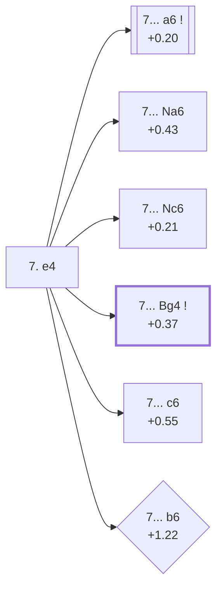

<a name="_TOP_"></a>

# D97 Grünfeld Defense: Russian Variation <br> 1. d4 Nf6 2. c4 g6 3. Nc3 d5 4. Nf3 Bg7 5. Qb3 dxc4 6. Qxc4 O-O 7. e4 #

Continues from [D96's own "5... dxc4 6. Qxc4 O-O" node](https://github.com/onclemarcel/chess_flashcards/blob/main/d4_openings/D96_Grunfeld_Russian_Variation.md#_OO_), where White's **7. e4** is masters' overwhelming main try (94.9%). `eco.md` labels this tabiya "Russian Variation With e4"; the live explorer keeps it simply "Russian Variation" — the "With e4" descriptor doesn't appear as its own live-tagged name, a minor divergence worth noting. This is the real six-way fork of the whole batch: Black's 7th move splits into six genuinely distinct, named tries, five of which stay on this card and the sixth — the Smyslov Variation — running the spine on through [D98](https://github.com/onclemarcel/chess_flashcards/blob/main/d4_openings/D98_Grunfeld_Russian_Smyslov_Variation.md) and [D99](https://github.com/onclemarcel/chess_flashcards/blob/main/d4_openings/D99_Grunfeld_Russian_Smyslov_Main_Line.md).

### Overview

*Quick map of every move covered on this card — see the [shape key](https://github.com/onclemarcel/chess_flashcards/blob/main/start.md#content-diagram-optional) in start.md.*

<!-- content-diagram:start -->

<!-- content-diagram:end -->

<a name="_initial_move_"></a>

[](https://lichess.org/analysis/standard/rnbq1rk1/ppp1ppbp/5np1/8/2QPP3/2N2N2/PP3PPP/R1B1KB1R_b_KQ_e3_0_7)

*... 7. e4 — Grünfeld Defense: Russian Variation*

```
rnbq1rk1/ppp1ppbp/5np1/8/2QPP3/2N2N2/PP3PPP/R1B1KB1R b KQ e3 0 7
```

|  | +0.17 |
| --- | --- |

<!-- lichess-stats:start fen="rnbq1rk1/ppp1ppbp/5np1/8/2QPP3/2N2N2/PP3PPP/R1B1KB1R b KQ e3 0 7" db="lichess,masters" speeds="bullet,blitz" ratings="1800,2000,2200,2500" moves="7" -->
| Move | Online | W/D/B | Masters | W/D/B | |
| :--- | ---: | :--- | ---: | :--- | :-- |
| a6 | 34 k (25.6%) | ⬜⬜⬜⬜⬜⬛⬛⬛⬛⬛ 47/6/46 | 2.4 k (49.0%) | ⬜⬜🟫🟫🟫🟫🟫🟫🟫⬛ 21/66/13 |  |
| Nc6 | 24 k (18.5%) | ⬜⬜⬜⬜🟫⬛⬛⬛⬛⬛ 45/7/48 | 772 (16.0%) | ⬜⬜⬜🟫🟫🟫🟫🟫⬛⬛ 29/55/17 |  |
| c6 | 21 k (15.6%) | ⬜⬜⬜⬜⬜🟫⬛⬛⬛⬛ 52/6/43 | 144 (3.0%) | ⬜⬜⬜⬜🟫🟫🟫🟫⬛⬛ 40/38/22 |  |
| Na6 | 15 k (11.2%) | ⬜⬜⬜⬜⬜🟫⬛⬛⬛⬛ 48/6/46 | 804 (16.7%) | ⬜⬜⬜⬜🟫🟫🟫🟫⬛⬛ 36/43/20 |  |
| Bg4 | 11 k (8.2%) | ⬜⬜⬜⬜⬜🟫⬛⬛⬛⬛ 50/6/45 | 496 (10.3%) | ⬜⬜⬜🟫🟫🟫🟫🟫⬛⬛ 35/45/20 |  |
| Nbd7 | 6.9 k (5.3%) | ⬜⬜⬜⬜⬜🟫⬛⬛⬛⬛ 54/5/41 | 0 | — | ⚠ |
| Nfd7 | 6.2 k (4.7%) | ⬜⬜⬜⬜⬜🟫⬛⬛⬛⬛ 49/6/45 | 99 (2.1%) | ⬜⬜⬜⬜🟫🟫🟫⬛⬛⬛ 37/34/28 |  |
| Be6 | 0 | — | 114 (2.4%) | ⬜⬜⬜🟫🟫🟫🟫🟫⬛⬛ 29/46/25 |  |

*Online: bullet/blitz, 1800+ — 132 k games. Masters: 4.8 k games. [Open in the explorer](https://lichess.org/analysis/standard/rnbq1rk1/ppp1ppbp/5np1/8/2QPP3/2N2N2/PP3PPP/R1B1KB1R_b_KQ_e3_0_7#explorer) — updated 2026-09-09*
<!-- lichess-stats:end -->

Masters' actual ranking runs **a6** (49.0%, the Alekhine Variation) far out in front, then **Na6** (16.7%, the Prins Variation) narrowly ahead of **Nc6** (16.0%, the Byrne Variation), then **Bg4** (10.3%, the Smyslov Variation — this card's own further trunk), then **c6** (3.0%, the Szabo Variation), and finally **b6** (0.4%, a mere 20 games — the Levenfish Variation), the rarest of all six named tries by a wide margin. Two more real but uncoded minor tries round out the table: **7... Be6** (2.4% masters) and **7... Nfd7** (2.1% masters), neither carrying a name or a code in this range.

* [**7... a6**](#_Alekhine_) (+0.20, 49.0% masters): the Alekhine Variation — live-tagged differently, see below.
* [**7... Na6**](#_Prins_) (+0.43, 16.7% masters): the Prins Variation — see below.
* [**7... Nc6**](#_Byrne_) (+0.21, 16.0% masters): the Byrne Variation — see below.
* [**7... Bg4**](https://github.com/onclemarcel/chess_flashcards/blob/main/d4_openings/D98_Grunfeld_Russian_Smyslov_Variation.md) (+0.37, 10.3% masters): the Smyslov Variation — its own code, D98.
* [**7... c6**](#_Szabo_) (+0.55, 3.0% masters): the Szabo Variation — see below.
* [**7... b6**](#_Levenfish_) (+1.22, 0.4% masters — 20 games): the Levenfish Variation — see below.
* **7... Be6** (2.4% masters): a real, uncoded minor try.
* **7... Nfd7** (2.1% masters): a real, uncoded minor try.

[*Back to D96's own "5... dxc4 6. Qxc4 O-O"*](https://github.com/onclemarcel/chess_flashcards/blob/main/d4_openings/D96_Grunfeld_Russian_Variation.md#_OO_)
[*Back to TOP*](#_TOP_)

---

<a name="_Alekhine_"></a>

## 7... a6 — Alekhine Variation

[](https://lichess.org/analysis/standard/rnbq1rk1/1pp1ppbp/p4np1/8/2QPP3/2N2N2/PP3PPP/R1B1KB1R_w_KQ_-_0_8)

*... 7... a6 — `eco.md`'s own Alekhine Variation*

```
rnbq1rk1/1pp1ppbp/p4np1/8/2QPP3/2N2N2/PP3PPP/R1B1KB1R w KQ - 0 8
```

|  | +0.20 |
| --- | --- |

<!-- lichess-stats:start fen="rnbq1rk1/1pp1ppbp/p4np1/8/2QPP3/2N2N2/PP3PPP/R1B1KB1R w KQ - 0 8" db="lichess,masters" speeds="bullet,blitz" ratings="1800,2000,2200,2500" moves="5" -->
| Move | Online | W/D/B | Masters | W/D/B | |
| :--- | ---: | :--- | ---: | :--- | :-- |
| Be2 | 15 k (43.8%) | ⬜⬜⬜⬜⬜🟫⬛⬛⬛⬛ 48/7/45 | 1.1 k (46.2%) | ⬜⬜🟫🟫🟫🟫🟫🟫🟫⬛ 17/74/9 |  |
| e5 | 9.4 k (26.7%) | ⬜⬜⬜⬜⬜🟫⬛⬛⬛⬛ 52/6/43 | 705 (29.8%) | ⬜⬜⬜🟫🟫🟫🟫🟫⬛⬛ 26/56/18 |  |
| a4 | 2.4 k (6.8%) | ⬜⬜⬜⬜🟫⬛⬛⬛⬛⬛ 41/6/53 | 0 | — | ⚠ |
| Qb3 | 2.4 k (6.8%) | ⬜⬜⬜⬜⬜⬛⬛⬛⬛⬛ 48/6/46 | 449 (19.0%) | ⬜⬜🟫🟫🟫🟫🟫🟫🟫⬛ 18/70/11 |  |
| Bf4 | 1.9 k (5.4%) | ⬜⬜⬜⬜🟫⬛⬛⬛⬛⬛ 45/7/48 | 61 (2.6%) | ⬜⬜⬜🟫🟫🟫🟫⬛⬛⬛ 25/43/33 |  |
| Qa4 | 0 | — | 46 (1.9%) | ⬜⬜⬜⬜🟫🟫🟫🟫🟫⬛ 39/46/15 |  |

*Online: bullet/blitz, 1800+ — 35 k games. Masters: 2.4 k games. [Open in the explorer](https://lichess.org/analysis/standard/rnbq1rk1/1pp1ppbp/p4np1/8/2QPP3/2N2N2/PP3PPP/R1B1KB1R_w_KQ_-_0_8#explorer) — updated 2026-09-09*
<!-- lichess-stats:end -->

**A genuine, verified name divergence worth flagging plainly**: `eco.md` calls this the *Alekhine Variation* — at least the fourth independent "Alekhine Variation" reuse across this D-series sweep, after D22's, D51's, and D67's own — but the live explorer tags this exact position **Russian Variation, Hungarian Variation** instead, an entirely different name. "Hungarian" is already doing double duty elsewhere in this very batch (D92's Hungarian Attack, D93's Hungarian Variation), so this is a third, unrelated "Hungarian"-flavoured live tag inside the same D90-D99 range. Masters' own top reply is **8. Be2** (46.2%), just ahead of **8. e5** (29.8%).

[*Back to 7. e4*](#_initial_move_)
[*Back to TOP*](#_TOP_)

---

<a name="_Szabo_"></a>

## 7... c6 — Szabo Variation

[](https://lichess.org/analysis/standard/rnbq1rk1/pp2ppbp/2p2np1/8/2QPP3/2N2N2/PP3PPP/R1B1KB1R_w_KQ_-_0_8)

*... 7... c6 — Szabo Variation*

```
rnbq1rk1/pp2ppbp/2p2np1/8/2QPP3/2N2N2/PP3PPP/R1B1KB1R w KQ - 0 8
```

|  | +0.55 |
| --- | --- |

<!-- lichess-stats:start fen="rnbq1rk1/pp2ppbp/2p2np1/8/2QPP3/2N2N2/PP3PPP/R1B1KB1R w KQ - 0 8" db="lichess,masters" speeds="bullet,blitz" ratings="1800,2000,2200,2500" moves="5" -->
| Move | Online | W/D/B | Masters | W/D/B | |
| :--- | ---: | :--- | ---: | :--- | :-- |
| Be2 | 17 k (56.6%) | ⬜⬜⬜⬜⬜🟫⬛⬛⬛⬛ 53/6/41 | 124 (63.9%) | ⬜⬜⬜⬜🟫🟫🟫🟫⬛⬛ 43/39/19 |  |
| e5 | 3.9 k (13.2%) | ⬜⬜⬜⬜⬜🟫⬛⬛⬛⬛ 48/6/46 | 5 (2.6%) | — |  |
| Be3 | 2.4 k (8.1%) | ⬜⬜⬜⬜⬜🟫⬛⬛⬛⬛ 50/6/45 | 0 | — | ⚠ |
| h3 | 2.1 k (7.0%) | ⬜⬜⬜⬜⬜🟫⬛⬛⬛⬛ 53/4/42 | 7 (3.6%) | — |  |
| Qb3 | 1.2 k (4.0%) | ⬜⬜⬜⬜⬜🟫⬛⬛⬛⬛ 52/7/41 | 51 (26.3%) | ⬜⬜⬜⬜🟫🟫🟫🟫⬛⬛ 41/35/24 |  |
| Qa4 | 0 | — | 2 (1.0%) | — |  |

*Online: bullet/blitz, 1800+ — 30 k games. Masters: 194 games. [Open in the explorer](https://lichess.org/analysis/standard/rnbq1rk1/pp2ppbp/2p2np1/8/2QPP3/2N2N2/PP3PPP/R1B1KB1R_w_KQ_-_0_8#explorer) — updated 2026-09-09*
<!-- lichess-stats:end -->

Live-tagged **Grünfeld Defense: Russian Variation, Szabo Variation**, confirming the name. Masters' own top reply is **8. Be2** (63.9%), well ahead of **8. Qb3** (26.3%).

[*Back to 7. e4*](#_initial_move_)
[*Back to TOP*](#_TOP_)

---

<a name="_Levenfish_"></a>

## 7... b6 — Levenfish Variation

[](https://lichess.org/analysis/standard/rnbq1rk1/p1p1ppbp/1p3np1/8/2QPP3/2N2N2/PP3PPP/R1B1KB1R_w_KQ_-_0_8)

*... 7... b6 — Levenfish Variation*

```
rnbq1rk1/p1p1ppbp/1p3np1/8/2QPP3/2N2N2/PP3PPP/R1B1KB1R w KQ - 0 8
```

|  | +1.22 |
| --- | --- |

<!-- lichess-stats:start fen="rnbq1rk1/p1p1ppbp/1p3np1/8/2QPP3/2N2N2/PP3PPP/R1B1KB1R w KQ - 0 8" db="lichess,masters" speeds="bullet,blitz" ratings="1800,2000,2200,2500" moves="4" -->
| Move | Online | W/D/B | Masters | W/D/B | |
| :--- | ---: | :--- | ---: | :--- | :-- |
| e5 | 2.3 k (41.4%) | ⬜⬜⬜⬜⬜⬜⬛⬛⬛⬛ 57/4/38 | 13 (65.0%) | — |  |
| Be2 | 1.1 k (20.3%) | ⬜⬜⬜⬜⬜🟫⬛⬛⬛⬛ 51/5/44 | 2 (10.0%) | — | ⚠ |
| Bf4 | 717 (12.8%) | ⬜⬜⬜⬜⬜🟫⬛⬛⬛⬛ 49/6/45 | 4 (20.0%) | — | ⚠ |
| Qb3 | 498 (8.9%) | ⬜⬜⬜⬜🟫⬛⬛⬛⬛⬛ 45/6/49 | 0 | — | ⚠ |
| Be3 | 0 | — | 1 (5.0%) | — |  |

*Online: bullet/blitz, 1800+ — 5.6 k games. Masters: 20 games. [Open in the explorer](https://lichess.org/analysis/standard/rnbq1rk1/p1p1ppbp/1p3np1/8/2QPP3/2N2N2/PP3PPP/R1B1KB1R_w_KQ_-_0_8#explorer) — updated 2026-09-09*
<!-- lichess-stats:end -->

Live-tagged **Grünfeld Defense: Russian Variation, Levenfish Variation**, confirming the name — but a genuinely thin and genuinely uncomfortable one: only 20 masters games reach this exact tabiya (the rarest of this whole fork's six named tries), and Stockfish's own eval, +1.22, is more than a full pawn worse for Black than every one of its five siblings at this fork. Read every number here as directional colour on a very small sample, not a firm verdict. Masters' own top reply is **8. e5** (65.0%).

[*Back to 7. e4*](#_initial_move_)
[*Back to TOP*](#_TOP_)

---

<a name="_Byrne_"></a>

## 7... Nc6 — Byrne Variation

[](https://lichess.org/analysis/standard/r1bq1rk1/ppp1ppbp/2n2np1/8/2QPP3/2N2N2/PP3PPP/R1B1KB1R_w_KQ_-_1_8)

*... 7... Nc6 — Byrne Variation*

```
r1bq1rk1/ppp1ppbp/2n2np1/8/2QPP3/2N2N2/PP3PPP/R1B1KB1R w KQ - 1 8
```

|  | +0.21 |
| --- | --- |

<!-- lichess-stats:start fen="r1bq1rk1/ppp1ppbp/2n2np1/8/2QPP3/2N2N2/PP3PPP/R1B1KB1R w KQ - 1 8" db="lichess,masters" speeds="bullet,blitz" ratings="1800,2000,2200,2500" moves="5" -->
| Move | Online | W/D/B | Masters | W/D/B | |
| :--- | ---: | :--- | ---: | :--- | :-- |
| Be2 | 13 k (48.9%) | ⬜⬜⬜⬜⬜🟫⬛⬛⬛⬛ 47/8/45 | 638 (81.9%) | ⬜⬜⬜🟫🟫🟫🟫🟫🟫⬛ 28/56/16 |  |
| Be3 | 4.1 k (15.7%) | ⬜⬜⬜⬜⬜⬛⬛⬛⬛⬛ 47/6/47 | 31 (4.0%) | ⬜⬜⬜⬜🟫🟫🟫⬛⬛⬛ 45/29/26 |  |
| e5 | 3.4 k (12.9%) | ⬜⬜⬜⬜🟫⬛⬛⬛⬛⬛ 41/5/54 | 0 | — | ⚠ |
| d5 | 3.0 k (11.4%) | ⬜⬜⬜⬜🟫⬛⬛⬛⬛⬛ 40/5/54 | 0 | — | ⚠ |
| h3 | 1.7 k (6.4%) | ⬜⬜⬜⬜🟫⬛⬛⬛⬛⬛ 45/6/49 | 39 (5.0%) | ⬜⬜🟫🟫🟫🟫🟫⬛⬛⬛ 23/49/28 |  |
| Bf4 | 0 | — | 38 (4.9%) | ⬜⬜🟫🟫🟫🟫🟫🟫🟫⬛ 24/68/8 |  |
| Bg5 | 0 | — | 13 (1.7%) | — |  |

*Online: bullet/blitz, 1800+ — 26 k games. Masters: 779 games. [Open in the explorer](https://lichess.org/analysis/standard/r1bq1rk1/ppp1ppbp/2n2np1/8/2QPP3/2N2N2/PP3PPP/R1B1KB1R_w_KQ_-_1_8#explorer) — updated 2026-09-09*
<!-- lichess-stats:end -->

Live-tagged **Grünfeld Defense: Russian Variation, Byrne Variation**, confirming the name. Masters' own reply is close to automatic: **8. Be2** (81.9%).

[*Back to 7. e4*](#_initial_move_)
[*Back to TOP*](#_TOP_)

---

<a name="_Prins_"></a>

## 7... Na6 — Prins Variation

[](https://lichess.org/analysis/standard/r1bq1rk1/ppp1ppbp/n4np1/8/2QPP3/2N2N2/PP3PPP/R1B1KB1R_w_KQ_-_1_8)

*... 7... Na6 — Prins Variation*

```
r1bq1rk1/ppp1ppbp/n4np1/8/2QPP3/2N2N2/PP3PPP/R1B1KB1R w KQ - 1 8
```

|  | +0.43 |
| --- | --- |

<!-- lichess-stats:start fen="r1bq1rk1/ppp1ppbp/n4np1/8/2QPP3/2N2N2/PP3PPP/R1B1KB1R w KQ - 1 8" db="lichess,masters" speeds="bullet,blitz" ratings="1800,2000,2200,2500" moves="5" -->
| Move | Online | W/D/B | Masters | W/D/B | |
| :--- | ---: | :--- | ---: | :--- | :-- |
| Be2 | 9.6 k (62.4%) | ⬜⬜⬜⬜⬜🟫⬛⬛⬛⬛ 49/7/44 | 643 (79.3%) | ⬜⬜⬜⬜🟫🟫🟫🟫⬛⬛ 38/44/19 |  |
| e5 | 2.4 k (15.5%) | ⬜⬜⬜⬜🟫⬛⬛⬛⬛⬛ 45/6/49 | 45 (5.5%) | ⬜⬜⬜🟫🟫🟫🟫⬛⬛⬛ 33/42/24 |  |
| Be3 | 1.4 k (8.9%) | ⬜⬜⬜⬜🟫⬛⬛⬛⬛⬛ 45/6/49 | 0 | — | ⚠ |
| Bf4 | 717 (4.6%) | ⬜⬜⬜⬜🟫⬛⬛⬛⬛⬛ 44/6/50 | 37 (4.6%) | ⬜⬜⬜🟫🟫🟫🟫🟫⬛⬛ 32/46/22 |  |
| h3 | 500 (3.2%) | ⬜⬜⬜⬜🟫⬛⬛⬛⬛⬛ 40/8/52 | 0 | — | ⚠ |
| Qb3 | 0 | — | 29 (3.6%) | ⬜⬜🟫🟫🟫🟫⬛⬛⬛⬛ 17/41/41 |  |
| Qa4 | 0 | — | 23 (2.8%) | ⬜⬜⬜⬜⬜🟫🟫🟫🟫⬛ 43/43/13 |  |

*Online: bullet/blitz, 1800+ — 15 k games. Masters: 811 games. [Open in the explorer](https://lichess.org/analysis/standard/r1bq1rk1/ppp1ppbp/n4np1/8/2QPP3/2N2N2/PP3PPP/R1B1KB1R_w_KQ_-_1_8#explorer) — updated 2026-09-09*
<!-- lichess-stats:end -->

Live-tagged **Grünfeld Defense: Russian Variation, Prins Variation**, confirming the name — and, at 16.7% masters, narrowly the more popular of the two knight retreats over the Byrne Variation's 16.0%. Masters' own reply is close to automatic: **8. Be2** (79.3%).

[*Back to 7. e4*](#_initial_move_)
[*Back to TOP*](#_TOP_)
