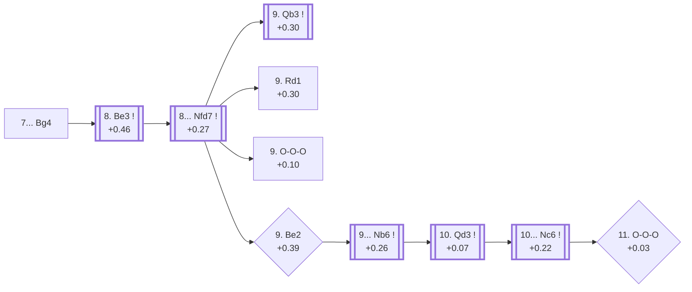

<a name="_TOP_"></a>

# D98 Grünfeld Defense: Russian Variation, Smyslov Variation <br> 1. d4 Nf6 2. c4 g6 3. Nc3 d5 4. Nf3 Bg7 5. Qb3 dxc4 6. Qxc4 O-O 7. e4 Bg4 #

Continues from [D97's own root](https://github.com/onclemarcel/chess_flashcards/blob/main/d4_openings/D97_Grunfeld_Russian_Variation_e4.md#_initial_move_), where Black's **7... Bg4** is a real, significant secondary (10.3% masters) at D97's own six-way fork — pinning the f3-knight instead of grabbing queenside space. Live-tagged the **Smyslov Variation**, confirming `eco.md`'s own name. This is the first of a small "Smyslov" cluster inside D98-D99 alone (this card's own root, plus [D99](https://github.com/onclemarcel/chess_flashcards/blob/main/d4_openings/D99_Grunfeld_Russian_Smyslov_Main_Line.md)'s own Main Line and Yugoslav Variation — three separate `eco.md` entries all built on the same surname here, on top of the unrelated Smyslov Defense already logged back at D94) and runs the spine on to D99, one code deeper still.

### Overview

*Quick map of every move covered on this card — see the [shape key](https://github.com/onclemarcel/chess_flashcards/blob/main/start.md#content-diagram-optional) in start.md.*

<!-- content-diagram:start -->

<!-- content-diagram:end -->

<a name="_initial_move_"></a>

[](https://lichess.org/analysis/standard/rn1q1rk1/ppp1ppbp/5np1/8/2QPP1b1/2N2N2/PP3PPP/R1B1KB1R_w_KQ_-_1_8)

*... 7... Bg4 — Grünfeld Defense: Russian Variation, Smyslov Variation*

```
rn1q1rk1/ppp1ppbp/5np1/8/2QPP1b1/2N2N2/PP3PPP/R1B1KB1R w KQ - 1 8
```

|  | +0.37 |
| --- | --- |

<!-- lichess-stats:start fen="rn1q1rk1/ppp1ppbp/5np1/8/2QPP1b1/2N2N2/PP3PPP/R1B1KB1R w KQ - 1 8" db="lichess,masters" speeds="bullet,blitz" ratings="1800,2000,2200,2500" moves="4" -->
| Move | Online | W/D/B | Masters | W/D/B | |
| :--- | ---: | :--- | ---: | :--- | :-- |
| Be2 | 5.1 k (46.5%) | ⬜⬜⬜⬜⬜🟫⬛⬛⬛⬛ 50/6/44 | 51 (9.5%) | ⬜⬜⬜🟫🟫🟫⬛⬛⬛⬛ 27/27/45 |  |
| Be3 | 3.4 k (31.1%) | ⬜⬜⬜⬜⬜🟫⬛⬛⬛⬛ 51/6/43 | 464 (86.2%) | ⬜⬜⬜🟫🟫🟫🟫🟫⬛⬛ 36/48/16 |  |
| Ne5 | 1.3 k (12.1%) | ⬜⬜⬜⬜⬜⬛⬛⬛⬛⬛ 48/5/47 | 18 (3.3%) | — |  |
| e5 | 804 (7.3%) | ⬜⬜⬜⬜⬜⬛⬛⬛⬛⬛ 46/6/49 | 0 | — | ⚠ |
| Bg5 | 0 | — | 2 (0.4%) | — |  |

*Online: bullet/blitz, 1800+ — 11 k games. Masters: 538 games. [Open in the explorer](https://lichess.org/analysis/standard/rn1q1rk1/ppp1ppbp/5np1/8/2QPP1b1/2N2N2/PP3PPP/R1B1KB1R_w_KQ_-_1_8#explorer) — updated 2026-09-14*
<!-- lichess-stats:end -->

**8. Be3** is masters' overwhelming main try (86.2%) — defending d4 a second time while developing.

* [**8. Be3**](#_Be3_) (+0.46, 86.2% masters): see below.

[*Back to D97's own root*](https://github.com/onclemarcel/chess_flashcards/blob/main/d4_openings/D97_Grunfeld_Russian_Variation_e4.md#_initial_move_)
[*Back to TOP*](#_TOP_)

---

<a name="_Be3_"></a>

## 8. Be3

[](https://lichess.org/analysis/standard/rn1q1rk1/ppp1ppbp/5np1/8/2QPP1b1/2N1BN2/PP3PPP/R3KB1R_b_KQ_-_2_8)

*... 8. Be3*

```
rn1q1rk1/ppp1ppbp/5np1/8/2QPP1b1/2N1BN2/PP3PPP/R3KB1R b KQ - 2 8
```

|  | +0.46 |
| --- | --- |

<!-- lichess-stats:start fen="rn1q1rk1/ppp1ppbp/5np1/8/2QPP1b1/2N1BN2/PP3PPP/R3KB1R b KQ - 2 8" db="lichess,masters" speeds="bullet,blitz" ratings="1800,2000,2200,2500" moves="3" -->
| Move | Online | W/D/B | Masters | W/D/B | |
| :--- | ---: | :--- | ---: | :--- | :-- |
| Nfd7 | 1.3 k (38.3%) | ⬜⬜⬜⬜🟫⬛⬛⬛⬛⬛ 46/8/47 | 439 (94.6%) | ⬜⬜⬜🟫🟫🟫🟫🟫⬛⬛ 35/49/16 |  |
| Bxf3 | 836 (24.4%) | ⬜⬜⬜⬜⬜🟫⬛⬛⬛⬛ 53/4/43 | 6 (1.3%) | — |  |
| Nc6 | 669 (19.6%) | ⬜⬜⬜⬜⬜🟫⬛⬛⬛⬛ 50/7/43 | 10 (2.2%) | — |  |

*Online: bullet/blitz, 1800+ — 3.4 k games. Masters: 464 games. [Open in the explorer](https://lichess.org/analysis/standard/rn1q1rk1/ppp1ppbp/5np1/8/2QPP1b1/2N1BN2/PP3PPP/R3KB1R_b_KQ_-_2_8#explorer) — updated 2026-09-14*
<!-- lichess-stats:end -->

**8... Nfd7** is masters' overwhelming main try (94.6%) — rerouting the knight toward b6/c5 while eyeing ...Bxf3.

* [**8... Nfd7**](#_Nfd7_) (+0.27, 94.6% masters): see below.

[*Back to 7... Bg4*](#_initial_move_)
[*Back to TOP*](#_TOP_)

---

<a name="_Nfd7_"></a>

## 8... Nfd7

[](https://lichess.org/analysis/standard/rn1q1rk1/pppnppbp/6p1/8/2QPP1b1/2N1BN2/PP3PPP/R3KB1R_w_KQ_-_3_9)

*... 8... Nfd7*

```
rn1q1rk1/pppnppbp/6p1/8/2QPP1b1/2N1BN2/PP3PPP/R3KB1R w KQ - 3 9
```

|  | +0.27 |
| --- | --- |

<!-- lichess-stats:start fen="rn1q1rk1/pppnppbp/6p1/8/2QPP1b1/2N1BN2/PP3PPP/R3KB1R w KQ - 3 9" db="lichess,masters" speeds="bullet,blitz" ratings="1800,2000,2200,2500" moves="5" -->
| Move | Online | W/D/B | Masters | W/D/B | |
| :--- | ---: | :--- | ---: | :--- | :-- |
| Rd1 | 499 (38.1%) | ⬜⬜⬜⬜⬜🟫⬛⬛⬛⬛ 49/9/42 | 139 (31.7%) | ⬜⬜⬜🟫🟫🟫🟫🟫⬛⬛ 29/52/19 |  |
| Be2 | 396 (30.3%) | ⬜⬜⬜⬜🟫⬛⬛⬛⬛⬛ 39/9/53 | 9 (2.1%) | — |  |
| Qb3 | 176 (13.4%) | ⬜⬜⬜⬜⬜🟫⬛⬛⬛⬛ 51/6/44 | 214 (48.7%) | ⬜⬜⬜⬜🟫🟫🟫🟫🟫⬛ 40/46/14 |  |
| O-O-O | 166 (12.7%) | ⬜⬜⬜⬜⬜🟫⬛⬛⬛⬛ 47/8/45 | 68 (15.5%) | ⬜⬜⬜🟫🟫🟫🟫🟫⬛⬛ 35/49/16 |  |
| h3 | 24 (1.8%) | ⬜⬜⬜🟫⬛⬛⬛⬛⬛⬛ 33/4/62 | 0 | — |  |
| Nd2 | 0 | — | 7 (1.6%) | — |  |

*Online: bullet/blitz, 1800+ — 1.3 k games. Masters: 439 games. [Open in the explorer](https://lichess.org/analysis/standard/rn1q1rk1/pppnppbp/6p1/8/2QPP1b1/2N1BN2/PP3PPP/R3KB1R_w_KQ_-_3_9#explorer) — updated 2026-09-14*
<!-- lichess-stats:end -->

**A genuine, striking finding worth flagging plainly**: `eco.md`'s own defining move for the Keres Variation, **9. Be2**, is masters' rarest choice at this fork — a bare 2.1% (9 of 439 games). Masters actually prefer **9. Qb3** (48.7%), heading straight into this card's own further code, [D99](https://github.com/onclemarcel/chess_flashcards/blob/main/d4_openings/D99_Grunfeld_Russian_Smyslov_Main_Line.md), or **9. Rd1** (31.7%, a real, uncoded secondary), or even an immediate **9. O-O-O** (15.5%, uncoded, and not the same route as the Keres Variation's own delayed castling below).

* [**9. Qb3**](https://github.com/onclemarcel/chess_flashcards/blob/main/d4_openings/D99_Grunfeld_Russian_Smyslov_Main_Line.md) (+0.30, 48.7% masters): masters' actual main try — the Smyslov Variation, Main line, its own code, D99.
* **9. Rd1** (+0.30, 31.7% masters): a real, significant secondary with no code of its own in this range.
* **9. O-O-O** (+0.10, 15.5% masters): a real, uncoded secondary — immediate castling, distinct from the Keres Variation's own delayed 11. O-O-O below.
* [**9. Be2**](#_Keres_) (+0.39, 2.1% masters): masters' rarest choice — heads into the Keres Variation, see below.

[*Back to 8. Be3*](#_Be3_)
[*Back to TOP*](#_TOP_)

---

<a name="_Keres_"></a>

## 9. Be2 — Keres Variation

[](https://lichess.org/analysis/standard/rn1q1rk1/pppnppbp/6p1/8/2QPP1b1/2N1BN2/PP2BPPP/R3K2R_b_KQ_-_4_9)

*... 9. Be2*

```
rn1q1rk1/pppnppbp/6p1/8/2QPP1b1/2N1BN2/PP2BPPP/R3K2R b KQ - 4 9
```

|  | +0.39 |
| --- | --- |

<!-- lichess-stats:start fen="rn1q1rk1/pppnppbp/6p1/8/2QPP1b1/2N1BN2/PP2BPPP/R3K2R b KQ - 4 9" db="lichess,masters" speeds="bullet,blitz" ratings="1800,2000,2200,2500" moves="2" -->
| Move | Online | W/D/B | Masters | W/D/B | |
| :--- | ---: | :--- | ---: | :--- | :-- |
| Nb6 | 1.1 k (70.0%) | ⬜⬜⬜⬜🟫⬛⬛⬛⬛⬛ 44/9/48 | 37 (84.1%) | ⬜⬜⬜🟫🟫🟫🟫⬛⬛⬛ 27/41/32 |  |
| Nc6 | 386 (23.6%) | ⬜⬜⬜⬜🟫⬛⬛⬛⬛⬛ 43/6/51 | 7 (15.9%) | — |  |

*Online: bullet/blitz, 1800+ — 1.6 k games. Masters: 44 games. [Open in the explorer](https://lichess.org/analysis/standard/rn1q1rk1/pppnppbp/6p1/8/2QPP1b1/2N1BN2/PP2BPPP/R3K2R_b_KQ_-_4_9#explorer) — updated 2026-09-14*
<!-- lichess-stats:end -->

Only 44 masters games reach this exact tabiya to begin with — every number in this whole Keres sub-tree should be read as directional, not a firm verdict. **9... Nb6** is masters' clear main try (84.1%).

[](https://lichess.org/analysis/standard/rn1q1rk1/ppp1ppbp/1n4p1/8/2QPP1b1/2N1BN2/PP2BPPP/R3K2R_w_KQ_-_5_10)

*... 9... Nb6*

```
rn1q1rk1/ppp1ppbp/1n4p1/8/2QPP1b1/2N1BN2/PP2BPPP/R3K2R w KQ - 5 10
```

|  | +0.26 |
| --- | --- |

<!-- lichess-stats:start fen="rn1q1rk1/ppp1ppbp/1n4p1/8/2QPP1b1/2N1BN2/PP2BPPP/R3K2R w KQ - 5 10" db="lichess,masters" speeds="bullet,blitz" ratings="1800,2000,2200,2500" moves="2" -->
| Move | Online | W/D/B | Masters | W/D/B | |
| :--- | ---: | :--- | ---: | :--- | :-- |
| Qd3 | 635 (55.5%) | ⬜⬜⬜⬜⬜🟫⬛⬛⬛⬛ 45/10/45 | 19 (51.4%) | — |  |
| Qb3 | 347 (30.3%) | ⬜⬜⬜⬜🟫⬛⬛⬛⬛⬛ 39/6/54 | 0 | — | ⚠ |
| Qc5 | 0 | — | 18 (48.6%) | — |  |

*Online: bullet/blitz, 1800+ — 1.1 k games. Masters: 37 games. [Open in the explorer](https://lichess.org/analysis/standard/rn1q1rk1/ppp1ppbp/1n4p1/8/2QPP1b1/2N1BN2/PP2BPPP/R3K2R_w_KQ_-_5_10#explorer) — updated 2026-09-14*
<!-- lichess-stats:end -->

A near coin flip between **10. Qd3** (+0.07, 51.4%), `eco.md`'s own choice on the way to the Keres Variation proper, and **10. Qc5** (48.6%), a real, uncoded alternative. From **10. Qd3**, masters follow with **10... Nc6** (+0.22) in 96.2% of games — and from there, `eco.md`'s own defining **11. O-O-O** is again a real minority: masters' actual main try at that final fork is **11. Rd1** (85.3%), with 11. O-O-O tied for second on just 5.9% (2 of 34 games).

<a name="_Keres_leaf_"></a>

[](https://lichess.org/analysis/standard/r2q1rk1/ppp1ppbp/1nn3p1/8/3PP1b1/2NQBN2/PP2BPPP/2KR3R_b_-_-_8_11)

*... 10. Qd3 Nc6 11. O-O-O — Keres Variation*

```
r2q1rk1/ppp1ppbp/1nn3p1/8/3PP1b1/2NQBN2/PP2BPPP/2KR3R b - - 8 11
```

|  | +0.03 |
| --- | --- |

Live-tagged **Grünfeld Defense: Russian Variation, Keres Variation**, confirming the name despite the vanishingly thin sample reaching it (2 masters games). Stockfish calls the resulting position dead level.

[*Back to 8... Nfd7*](#_Nfd7_)
[*Back to TOP*](#_TOP_)
