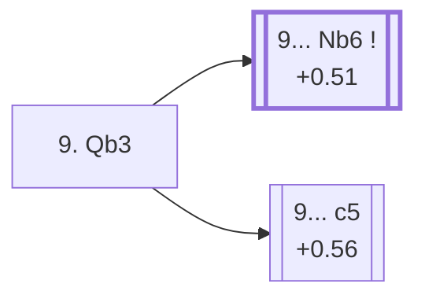

<a name="_TOP_"></a>

# D99 Grünfeld Defense: Russian Variation, Smyslov Variation, Main Line <br> 1. d4 Nf6 2. c4 g6 3. Nc3 d5 4. Nf3 Bg7 5. Qb3 dxc4 6. Qxc4 O-O 7. e4 Bg4 8. Be3 Nfd7 9. Qb3 #

Continues from [D98's own "8... Nfd7" node](https://github.com/onclemarcel/chess_flashcards/blob/main/d4_openings/D98_Grunfeld_Russian_Smyslov_Variation.md#_Nfd7_), where White's **9. Qb3** is masters' actual main try (48.7%) — repeating the queen's earlier attack on b7/d5 rather than committing the king with 9. Be2/9. O-O-O. `eco.md` calls this the **Smyslov, Main line**; the live explorer tags this exact position simply "Russian Variation, Smyslov Variation" — no distinguishing "Main line" suffix of its own, the same pattern already logged for D88's own "Main line" label elsewhere in this D-series. This is the fourth and last "Smyslov"-built name in this D98-D99 pair, and the closing card of the whole D90-D99 batch.

### Overview

*Quick map of every move covered on this card — see the [shape key](https://github.com/onclemarcel/chess_flashcards/blob/main/start.md#content-diagram-optional) in start.md.*

<!-- content-diagram:start -->

<!-- content-diagram:end -->

<a name="_initial_move_"></a>

[](https://lichess.org/analysis/standard/rn1q1rk1/pppnppbp/6p1/8/3PP1b1/1QN1BN2/PP3PPP/R3KB1R_b_KQ_-_4_9)

*... 9. Qb3 — Grünfeld Defense: Russian Variation, Smyslov Variation, Main line*

```
rn1q1rk1/pppnppbp/6p1/8/3PP1b1/1QN1BN2/PP3PPP/R3KB1R b KQ - 4 9
```

|  | +0.30 |
| --- | --- |

<!-- lichess-stats:start fen="rn1q1rk1/pppnppbp/6p1/8/3PP1b1/1QN1BN2/PP3PPP/R3KB1R b KQ - 4 9" db="lichess,masters" speeds="bullet,blitz" ratings="1800,2000,2200,2500" moves="4" -->
| Move | Online | W/D/B | Masters | W/D/B | |
| :--- | ---: | :--- | ---: | :--- | :-- |
| Nb6 | 148 (83.6%) | ⬜⬜⬜⬜⬜🟫⬛⬛⬛⬛ 52/7/41 | 171 (79.9%) | ⬜⬜⬜⬜🟫🟫🟫🟫🟫⬛ 40/47/13 |  |
| Bxf3 | 16 (9.0%) | — | 5 (2.3%) | — |  |
| Nc6 | 7 (4.0%) | — | 1 (0.5%) | — |  |
| c5 | 3 (1.7%) | — | 37 (17.3%) | ⬜⬜⬜⬜🟫🟫🟫🟫⬛⬛ 38/43/19 |  |

*Online: bullet/blitz, 1800+ — 177 games. Masters: 214 games. [Open in the explorer](https://lichess.org/analysis/standard/rn1q1rk1/pppnppbp/6p1/8/3PP1b1/1QN1BN2/PP3PPP/R3KB1R_b_KQ_-_4_9#explorer) — updated 2026-09-15*
<!-- lichess-stats:end -->

**9... Nb6** is masters' clear main try (79.9%) — the "Main line" proper, retreating the knight to safety and eyeing ...c5/...Nc6 ideas next; it carries no further name or code of its own beyond this card. **9... c5** (17.3% masters) strikes the centre immediately instead — the Yugoslav Variation, see below.

* **9... Nb6** (+0.51, 79.9% masters, 83.6% online): the Main line proper; not built out further here (backlog).
* [**9... c5**](#_Yugoslav_) (+0.56, 17.3% masters): the Yugoslav Variation — see below.

[*Back to D98's own "8... Nfd7"*](https://github.com/onclemarcel/chess_flashcards/blob/main/d4_openings/D98_Grunfeld_Russian_Smyslov_Variation.md#_Nfd7_)
[*Back to TOP*](#_TOP_)

---

<a name="_Yugoslav_"></a>

## 9... c5 — Yugoslav Variation

[](https://lichess.org/analysis/standard/rn1q1rk1/pp1nppbp/6p1/2p5/3PP1b1/1QN1BN2/PP3PPP/R3KB1R_w_KQ_c6_0_10)

*... 9... c5 — Yugoslav Variation*

```
rn1q1rk1/pp1nppbp/6p1/2p5/3PP1b1/1QN1BN2/PP3PPP/R3KB1R w KQ c6 0 10
```

|  | +0.56 |
| --- | --- |

<!-- lichess-stats:start fen="rn1q1rk1/pp1nppbp/6p1/2p5/3PP1b1/1QN1BN2/PP3PPP/R3KB1R w KQ c6 0 10" db="lichess,masters" speeds="bullet,blitz" ratings="1800,2000,2200,2500" moves="2" -->
| Move | Online | W/D/B | Masters | W/D/B | |
| :--- | ---: | :--- | ---: | :--- | :-- |
| d5 | 2 (66.7%) | — | 36 (97.3%) | ⬜⬜⬜⬜🟫🟫🟫🟫⬛⬛ 39/44/17 |  |
| Qxb7 | 1 (33.3%) | — | 0 | — |  |
| dxc5 | 0 | — | 1 (2.7%) | — |  |

*Online: bullet/blitz, 1800+ — 3 games. Masters: 37 games. [Open in the explorer](https://lichess.org/analysis/standard/rn1q1rk1/pp1nppbp/6p1/2p5/3PP1b1/1QN1BN2/PP3PPP/R3KB1R_w_KQ_c6_0_10#explorer) — updated 2026-09-15*
<!-- lichess-stats:end -->

Live-tagged **Grünfeld Defense: Russian Variation, Yugoslav Variation**, confirming the name — the last leaf of the whole D90-D99 batch, and a thin one on both sides of the database (37 masters games, a mere 3 online). Masters' own reply is close to automatic: **10. d5** (97.3%), grabbing space immediately.

This closes out the deepest single spine in this batch: D96's Russian Variation → D97's own six-way fork → the Smyslov Variation running through D98's own Be3/Nfd7 tabiya and its Keres Variation branch → this card's own Main line and Yugoslav Variation.

[*Back to 9. Qb3*](#_initial_move_)
[*Back to TOP*](#_TOP_)
