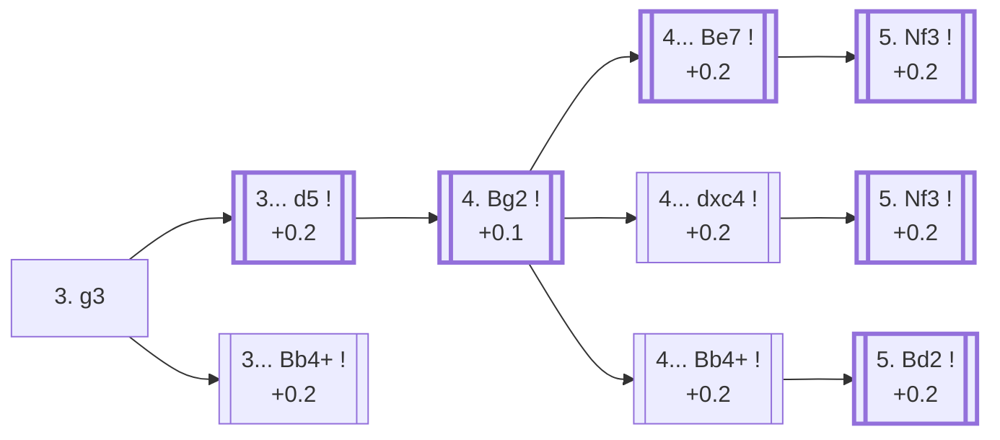

<a name="_TOP_"></a>

# E00 Catalan Opening <br> 1. d4 Nf6 2. c4 e6 3. g3 #

Spun off from [E20's 2... e6](https://github.com/onclemarcel/chess_flashcards/blob/main/d4_openings/E20_Nimzo_QI_Fork.md): rather than commit the knight with 3. Nc3 or 3. Nf3, White fianchettoes the king's bishop first, aiming it at the long a1-h8 diagonal and, eventually, at a b7/c6/d5 target zone. A real independent system played by every World Champion since Botvinnik — sound rather than sharp, and often escapes an opponent's Nimzo-Indian/Queen's Indian preparation entirely, since neither pin nor fianchetto ideas work the same way against g3.

### Overview

*Quick map of every move covered on this card — see the [shape key](https://github.com/onclemarcel/chess_flashcards/blob/main/start.md#content-diagram-optional) in start.md. 3... c5 is discussed below but has no anchor of its own, so it's left off this map rather than pointing nowhere.*

<!-- content-diagram:start -->

<!-- content-diagram:end -->

<a name="_initial_move_"></a>

[](https://lichess.org/analysis/standard/rnbqkb1r/pppp1ppp/4pn2/8/2PP4/6P1/PP2PP1P/RNBQKBNR_b_KQkq_-_0_3)

*... 3. g3 — Catalan Opening*

```
rnbqkb1r/pppp1ppp/4pn2/8/2PP4/6P1/PP2PP1P/RNBQKBNR b KQkq - 0 3
```

|  | +0.1 |
| --- | --- |

<!-- lichess-stats:start fen="rnbqkb1r/pppp1ppp/4pn2/8/2PP4/6P1/PP2PP1P/RNBQKBNR b KQkq - 0 3" db="lichess,masters" speeds="bullet,blitz" ratings="1800,2000,2200,2500" moves="6" -->
| Move | Online | W/D/B | Masters | W/D/B | |
| :--- | ---: | :--- | ---: | :--- | :-- |
| d5 | 765 k (50.7%) | ⬜⬜⬜⬜⬜🟫⬛⬛⬛⬛ 51/7/42 | 18 k (59.4%) | ⬜⬜🟫🟫🟫🟫🟫🟫⬛⬛ 25/57/18 |  |
| Bb4+ | 357 k (23.6%) | ⬜⬜⬜⬜⬜🟫⬛⬛⬛⬛ 51/7/42 | 6.2 k (20.2%) | ⬜⬜⬜🟫🟫🟫🟫🟫⬛⬛ 30/51/19 |  |
| c5 | 219 k (14.5%) | ⬜⬜⬜⬜⬜🟫⬛⬛⬛⬛ 50/6/44 | 6.0 k (19.3%) | ⬜⬜⬜🟫🟫🟫🟫⬛⬛⬛ 30/41/29 |  |
| b6 | 63 k (4.1%) | ⬜⬜⬜⬜⬜🟫⬛⬛⬛⬛ 55/5/40 | 52 (0.2%) | ⬜⬜⬜⬜⬜🟫🟫🟫🟫⬛ 52/38/10 |  |
| Be7 | 51 k (3.4%) | ⬜⬜⬜⬜⬜🟫⬛⬛⬛⬛ 54/5/41 | 149 (0.5%) | ⬜⬜⬜🟫🟫🟫🟫🟫🟫⬛ 31/59/10 |  |
| c6 | 23 k (1.6%) | ⬜⬜⬜⬜⬜⬜⬛⬛⬛⬛ 56/6/38 | 43 (0.1%) | ⬜⬜⬜⬜🟫🟫🟫🟫⬛⬛ 42/40/19 |  |

*Online: bullet/blitz, 1800+ — 1.5 M games. Masters: 31 k games. [Open in the explorer](https://lichess.org/analysis/standard/rnbqkb1r/pppp1ppp/4pn2/8/2PP4/6P1/PP2PP1P/RNBQKBNR_b_KQkq_-_0_3#explorer) — updated 2026-08-25*
<!-- lichess-stats:end -->

### Candidate moves

* [**3... d5**](#_d5_) (+0.2): completes the classical centre — masters' clear main try (59.4%).
* [**3... Bb4+**](#_Bb4_) (+0.2): checks immediately, forcing White to block before finishing the fianchetto — a real second choice (20.2% masters).
* **3... c5** (+0.3): strikes back in the centre instead (19.3% masters) — playable but not covered further here.

[*Back to TOP*](#_TOP_)

---

<a name="_d5_"></a>

## 3... d5

[](https://lichess.org/analysis/standard/rnbqkb1r/ppp2ppp/4pn2/3p4/2PP4/6P1/PP2PP1P/RNBQKBNR_w_KQkq_d6_0_4)

*... 3... d5*

```
rnbqkb1r/ppp2ppp/4pn2/3p4/2PP4/6P1/PP2PP1P/RNBQKBNR w KQkq d6 0 4
```

|  | +0.2 |
| --- | --- |

<!-- lichess-stats:start fen="rnbqkb1r/ppp2ppp/4pn2/3p4/2PP4/6P1/PP2PP1P/RNBQKBNR w KQkq d6 0 4" db="lichess,masters" speeds="bullet,blitz" ratings="1800,2000,2200,2500" moves="4" -->
| Move | Online | W/D/B | Masters | W/D/B | |
| :--- | ---: | :--- | ---: | :--- | :-- |
| Bg2 | 897 k (73.7%) | ⬜⬜⬜⬜⬜🟫⬛⬛⬛⬛ 52/6/42 | 10 k (55.1%) | ⬜⬜⬜🟫🟫🟫🟫🟫⬛⬛ 26/56/17 |  |
| Nf3 | 281 k (23.1%) | ⬜⬜⬜⬜⬜🟫⬛⬛⬛⬛ 52/7/41 | 8.5 k (44.8%) | ⬜⬜🟫🟫🟫🟫🟫🟫⬛⬛ 24/57/19 |  |
| cxd5 | 20 k (1.7%) | ⬜⬜⬜⬜⬜⬛⬛⬛⬛⬛ 47/6/47 | 13 (0.1%) | — |  |
| Nc3 | 11 k (0.9%) | ⬜⬜⬜⬜⬜⬛⬛⬛⬛⬛ 48/6/46 | 6 (0.0%) | — |  |

*Online: bullet/blitz, 1800+ — 1.2 M games. Masters: 19 k games. [Open in the explorer](https://lichess.org/analysis/standard/rnbqkb1r/ppp2ppp/4pn2/3p4/2PP4/6P1/PP2PP1P/RNBQKBNR_w_KQkq_d6_0_4#explorer) — updated 2026-08-25*
<!-- lichess-stats:end -->

**4. Bg2** (55.1% masters) is the natural completion of the fianchetto; **4. Nf3** (44.8%) simply delays it by a move and usually transposes back.

[*Back to 3. g3*](#_initial_move_)
[*Back to TOP*](#_TOP_)

---

<a name="_Bg2_"></a>

## 4. Bg2 — the Catalan tabiya

[](https://lichess.org/analysis/standard/rnbqkb1r/ppp2ppp/4pn2/3p4/2PP4/6P1/PP2PPBP/RNBQK1NR_b_KQkq_-_1_4)

*... 4. Bg2 — reaching the main Catalan tabiya*

```
rnbqkb1r/ppp2ppp/4pn2/3p4/2PP4/6P1/PP2PPBP/RNBQK1NR b KQkq - 1 4
```

|  | +0.1 |
| --- | --- |

<!-- lichess-stats:start fen="rnbqkb1r/ppp2ppp/4pn2/3p4/2PP4/6P1/PP2PPBP/RNBQK1NR b KQkq - 1 4" db="lichess,masters" speeds="bullet,blitz" ratings="1800,2000,2200,2500" moves="4" -->
| Move | Online | W/D/B | Masters | W/D/B | |
| :--- | ---: | :--- | ---: | :--- | :-- |
| Be7 | 352 k (31.8%) | ⬜⬜⬜⬜⬜🟫⬛⬛⬛⬛ 50/7/43 | 4.0 k (36.6%) | ⬜⬜⬜🟫🟫🟫🟫🟫🟫⬛ 28/57/14 |  |
| c6 | 254 k (22.9%) | ⬜⬜⬜⬜⬜🟫⬛⬛⬛⬛ 53/6/41 | 283 (2.6%) | ⬜⬜⬜⬜⬜🟫🟫🟫⬛⬛ 46/35/19 |  |
| dxc4 | 148 k (13.3%) | ⬜⬜⬜⬜⬜🟫⬛⬛⬛⬛ 50/6/43 | 3.1 k (28.5%) | ⬜⬜⬜🟫🟫🟫🟫🟫⬛⬛ 27/53/20 |  |
| Bb4+ | 132 k (12.0%) | ⬜⬜⬜⬜⬜🟫⬛⬛⬛⬛ 52/7/42 | 3.2 k (29.0%) | ⬜⬜🟫🟫🟫🟫🟫🟫⬛⬛ 21/62/17 |  |

*Online: bullet/blitz, 1800+ — 1.1 M games. Masters: 11 k games. [Open in the explorer](https://lichess.org/analysis/standard/rnbqkb1r/ppp2ppp/4pn2/3p4/2PP4/6P1/PP2PPBP/RNBQK1NR_b_KQkq_-_1_4#explorer) — updated 2026-08-25*
<!-- lichess-stats:end -->

This is the point where the Catalan's three real branches split — the explorer itself tags this exact position "***E01 Catalan Opening: Open Defense***", covering the whole fork:

* [**4... Be7**](#_Be7_) (+0.2, 36.6% masters): the *Closed Catalan* — solid, declining the pawn and just finishing development.
* [**4... dxc4**](#_dxc4_) (+0.2, 28.5% masters): the *Open Catalan* — grabs the pawn, betting the extra material is worth more than letting the Bg2 bishop's diagonal go completely unopposed. Not a blunder: White's compensation is famous but not close to forced, and this remains a fully respected, heavily analysed choice at the top level.
* [**4... Bb4+**](#_Bb4c_) (+0.2, 29.0% masters): checks with the bishop rather than developing it to e7, often transposing back toward Open or Closed structures a move or two later depending on Black's follow-up.

Each branch is its own extensive body of theory, on a par with the Nimzo-Indian or Queen's Indian covered elsewhere in this repository.

[*Back to 3... d5*](#_d5_)
[*Back to TOP*](#_TOP_)

---

> [!NOTE]
> **4... Be7**, the *Closed Catalan*, simply finishes development and declines the pawn — Black bets that a solid structure is worth more than material.
>
> <a name="_Be7_"></a>
>
> ### 4... Be7 — Closed Catalan
>
> [](https://lichess.org/analysis/standard/rnbqk2r/ppp1bppp/4pn2/3p4/2PP4/6P1/PP2PPBP/RNBQK1NR_w_KQkq_-_2_5)
>
> *... 4... Be7 — Closed Catalan*
>
> ```
> rnbqk2r/ppp1bppp/4pn2/3p4/2PP4/6P1/PP2PPBP/RNBQK1NR w KQkq - 2 5
> ```
>
> |  | +0.2 |
> | --- | --- |
>
> <!-- lichess-stats:start fen="rnbqk2r/ppp1bppp/4pn2/3p4/2PP4/6P1/PP2PPBP/RNBQK1NR w KQkq - 2 5" db="lichess,masters" speeds="bullet,blitz" ratings="1800,2000,2200,2500" moves="3" -->
> | Move | Online | W/D/B | Masters | W/D/B | |
> | :--- | ---: | :--- | ---: | :--- | :-- |
> | Nf3 | 298 k (79.8%) | ⬜⬜⬜⬜⬜🟫⬛⬛⬛⬛ 51/7/42 | 4.1 k (98.8%) | ⬜⬜⬜🟫🟫🟫🟫🟫🟫⬛ 29/58/14 |  |
> | Nc3 | 42 k (11.2%) | ⬜⬜⬜⬜⬜🟫⬛⬛⬛⬛ 49/6/46 | 33 (0.8%) | ⬜⬜⬜🟫🟫🟫🟫⬛⬛⬛ 33/36/30 |  |
> | cxd5 | 20 k (5.4%) | ⬜⬜⬜⬜⬜🟫⬛⬛⬛⬛ 49/6/45 | 0 | — | ⚠ |
> | Qc2 | 0 | — | 4 (0.1%) | — |  |
> 
> *Online: bullet/blitz, 1800+ — 374 k games. Masters: 4.1 k games. [Open in the explorer](https://lichess.org/analysis/standard/rnbqk2r/ppp1bppp/4pn2/3p4/2PP4/6P1/PP2PPBP/RNBQK1NR_w_KQkq_-_2_5#explorer) — updated 2026-08-25*
> <!-- lichess-stats:end -->
>
> **5. Nf3** (+0.2) is close to automatic (98.8% of masters games) — completing development before deciding between the main plan (Qc2/Rd1, aiming to recapture on c4 profitably) and other tries. Deeper Closed Catalan theory past this point is its own extensive body of work, not covered further here.
>
> [*Back to 4. Bg2*](#_Bg2_)
> [*Back to TOP*](#_TOP_)

---

> [!NOTE]
> **4... dxc4**, the *Open Catalan*, grabs the c4 pawn immediately, betting that holding onto it (or trading it back on White's terms) is worth more than leaving the long diagonal totally uncontested.
>
> <a name="_dxc4_"></a>
>
> ### 4... dxc4 — Open Catalan
>
> [](https://lichess.org/analysis/standard/rnbqkb1r/ppp2ppp/4pn2/8/2pP4/6P1/PP2PPBP/RNBQK1NR_w_KQkq_-_0_5)
>
> *... 4... dxc4 — Open Catalan*
>
> ```
> rnbqkb1r/ppp2ppp/4pn2/8/2pP4/6P1/PP2PPBP/RNBQK1NR w KQkq - 0 5
> ```
>
> |  | +0.2 |
> | --- | --- |
>
> <!-- lichess-stats:start fen="rnbqkb1r/ppp2ppp/4pn2/8/2pP4/6P1/PP2PPBP/RNBQK1NR w KQkq - 0 5" db="lichess,masters" speeds="bullet,blitz" ratings="1800,2000,2200,2500" moves="3" -->
> | Move | Online | W/D/B | Masters | W/D/B | |
> | :--- | ---: | :--- | ---: | :--- | :-- |
> | Nf3 | 127 k (72.6%) | ⬜⬜⬜⬜⬜🟫⬛⬛⬛⬛ 52/6/42 | 2.6 k (83.3%) | ⬜⬜⬜🟫🟫🟫🟫🟫⬛⬛ 28/52/20 |  |
> | Qa4+ | 23 k (12.9%) | ⬜⬜⬜⬜⬜🟫⬛⬛⬛⬛ 50/7/44 | 513 (16.4%) | ⬜⬜⬜🟫🟫🟫🟫🟫⬛⬛ 25/55/20 |  |
> | Nc3 | 15 k (8.8%) | ⬜⬜⬜⬜⬜🟫⬛⬛⬛⬛ 52/4/44 | 4 (0.1%) | — | ⚠ |
> 
> *Online: bullet/blitz, 1800+ — 175 k games. Masters: 3.1 k games. [Open in the explorer](https://lichess.org/analysis/standard/rnbqkb1r/ppp2ppp/4pn2/8/2pP4/6P1/PP2PPBP/RNBQK1NR_w_KQkq_-_0_5#explorer) — updated 2026-08-25*
> <!-- lichess-stats:end -->
>
> **5. Nf3** (+0.2) is masters' clear main try (83.3%) — developing before regaining the pawn, since c4 can't be defended for long. **5. Qa4+** is a real second choice (16.4%), winning the pawn back immediately with check rather than trusting long-term compensation. Deeper Open Catalan theory past this point is its own extensive body of work, not covered further here.
>
> [*Back to 4. Bg2*](#_Bg2_)
> [*Back to TOP*](#_TOP_)

---

> [!NOTE]
> **4... Bb4+** checks immediately rather than committing the bishop to e7, forcing White to make an early decision about how to meet it.
>
> <a name="_Bb4c_"></a>
>
> ### 4... Bb4+
>
> [](https://lichess.org/analysis/standard/rnbqk2r/ppp2ppp/4pn2/3p4/1bPP4/6P1/PP2PPBP/RNBQK1NR_w_KQkq_-_2_5)
>
> *... 4... Bb4+*
>
> ```
> rnbqk2r/ppp2ppp/4pn2/3p4/1bPP4/6P1/PP2PPBP/RNBQK1NR w KQkq - 2 5
> ```
>
> |  | +0.2 |
> | --- | --- |
>
> <!-- lichess-stats:start fen="rnbqk2r/ppp2ppp/4pn2/3p4/1bPP4/6P1/PP2PPBP/RNBQK1NR w KQkq - 2 5" db="lichess,masters" speeds="bullet,blitz" ratings="1800,2000,2200,2500" moves="3" -->
> | Move | Online | W/D/B | Masters | W/D/B | |
> | :--- | ---: | :--- | ---: | :--- | :-- |
> | Bd2 | 80 k (60.4%) | ⬜⬜⬜⬜⬜🟫⬛⬛⬛⬛ 51/7/42 | 2.0 k (62.6%) | ⬜⬜🟫🟫🟫🟫🟫🟫⬛⬛ 19/65/16 |  |
> | Nd2 | 35 k (26.5%) | ⬜⬜⬜⬜⬜🟫⬛⬛⬛⬛ 54/7/39 | 1.1 k (35.2%) | ⬜⬜🟫🟫🟫🟫🟫🟫⬛⬛ 26/56/18 |  |
> | Nc3 | 17 k (12.7%) | ⬜⬜⬜⬜⬜🟫⬛⬛⬛⬛ 52/5/43 | 69 (2.2%) | ⬜⬜⬜⬜🟫🟫🟫🟫⬛⬛ 35/42/23 |  |
> 
> *Online: bullet/blitz, 1800+ — 132 k games. Masters: 3.2 k games. [Open in the explorer](https://lichess.org/analysis/standard/rnbqk2r/ppp2ppp/4pn2/3p4/1bPP4/6P1/PP2PPBP/RNBQK1NR_w_KQkq_-_2_5#explorer) — updated 2026-08-25*
> <!-- lichess-stats:end -->
>
> **5. Bd2** (+0.2) is masters' clear main try (62.6%) — trading off the dark-squared bishops, since the Catalan's whole plan runs through the *light*-squared one on g2. **5. Nd2** is a real second choice (35.2%), keeping the bishops on and recapturing with the knight instead so the queenside pawn structure stays intact. (This position gets a genuinely different reply than the earlier 3... Bb4+ check, played before ... d5/Bg2 — there 4. Bd2 is close to automatic at 81.6% masters; move-order matters here.)
>
> [*Back to 4. Bg2*](#_Bg2_)
> [*Back to TOP*](#_TOP_)

---

> [!NOTE]
> **3... Bb4+** checks before White has even started the fianchetto, forcing an immediate decision rather than waiting for the more typical move order above.
>
> <a name="_Bb4_"></a>
>
> ### 3... Bb4+
>
> [](https://lichess.org/analysis/standard/rnbqk2r/pppp1ppp/4pn2/8/1bPP4/6P1/PP2PP1P/RNBQKBNR_w_KQkq_-_1_4)
>
> *... 3... Bb4+*
>
> ```
> rnbqk2r/pppp1ppp/4pn2/8/1bPP4/6P1/PP2PP1P/RNBQKBNR w KQkq - 1 4
> ```
>
> |  | +0.2 |
> | --- | --- |
>
> **4. Bd2** (81.6% masters) is close to automatic — trading off the dark-squared bishops is fine for White here, since the Catalan's whole plan runs through the *light*-squared one on g2.
>
> [*Back to 3. g3*](#_initial_move_)
> [*Back to TOP*](#_TOP_)
