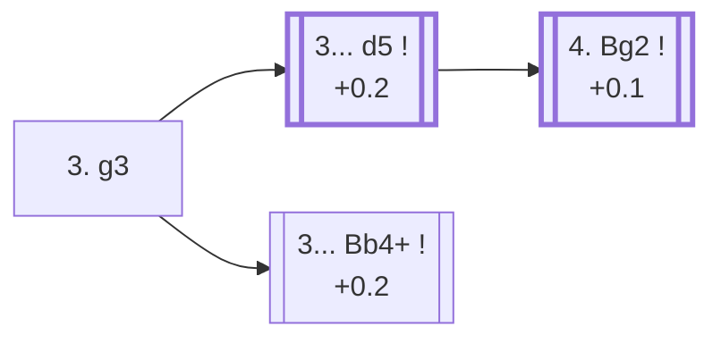

<a name="_TOP_"></a>

# E00 Catalan Opening <br> 1. d4 Nf6 2. c4 e6 3. g3 #

Spun off from [E20's 2... e6](https://github.com/onclemarcel/chess_flashcards/blob/main/d4_openings/E20_Nimzo_QI_Fork.md): rather than commit the knight with 3. Nc3 or 3. Nf3, White fianchettoes the king's bishop first, aiming it at the long a1-h8 diagonal and, eventually, at a b7/c6/d5 target zone. A real independent system played by every World Champion since Botvinnik — sound rather than sharp, and often escapes an opponent's Nimzo-Indian/Queen's Indian preparation entirely, since neither pin nor fianchetto ideas work the same way against g3.

**Corrected 2026-08-26**: this card used to build the whole "4. Bg2" tabiya (and everything past it) in place. Live-confirmed via the Lichess explorer's own `opening` field: that tabiya is already **E01**, not E00 — moved to [`E01_Catalan_Open_Defense.md`](https://github.com/onclemarcel/chess_flashcards/blob/main/d4_openings/E01_Catalan_Open_Defense.md). This card now stays at its own root, "3. g3", plus the genuinely E00-coded siblings.

### Overview

*Quick map of every move covered on this card — see the [shape key](https://github.com/onclemarcel/chess_flashcards/blob/main/start.md#content-diagram-optional) in start.md. 3... c5 is discussed below but has no anchor of its own, so it's left off this map rather than pointing nowhere.*

<!-- content-diagram:start -->

<!-- content-diagram:end -->

<a name="_initial_move_"></a>

[](https://lichess.org/analysis/standard/rnbqkb1r/pppp1ppp/4pn2/8/2PP4/6P1/PP2PP1P/RNBQKBNR_b_KQkq_-_0_3)

*... 3. g3 — Catalan Opening*

```
rnbqkb1r/pppp1ppp/4pn2/8/2PP4/6P1/PP2PP1P/RNBQKBNR b KQkq - 0 3
```

|  | +0.1 |
| --- | --- |

<!-- lichess-stats:start fen="rnbqkb1r/pppp1ppp/4pn2/8/2PP4/6P1/PP2PP1P/RNBQKBNR b KQkq - 0 3" db="lichess,masters" speeds="bullet,blitz" ratings="1800,2000,2200,2500" moves="6" -->
| Move | Online | W/D/B | Masters | W/D/B | |
| :--- | ---: | :--- | ---: | :--- | :-- |
| d5 | 765 k (50.7%) | ⬜⬜⬜⬜⬜🟫⬛⬛⬛⬛ 51/7/42 | 18 k (59.4%) | ⬜⬜🟫🟫🟫🟫🟫🟫⬛⬛ 25/57/18 |  |
| Bb4+ | 357 k (23.6%) | ⬜⬜⬜⬜⬜🟫⬛⬛⬛⬛ 51/7/42 | 6.2 k (20.2%) | ⬜⬜⬜🟫🟫🟫🟫🟫⬛⬛ 30/51/19 |  |
| c5 | 219 k (14.5%) | ⬜⬜⬜⬜⬜🟫⬛⬛⬛⬛ 50/6/44 | 6.0 k (19.3%) | ⬜⬜⬜🟫🟫🟫🟫⬛⬛⬛ 30/41/29 |  |
| b6 | 63 k (4.1%) | ⬜⬜⬜⬜⬜🟫⬛⬛⬛⬛ 55/5/40 | 52 (0.2%) | ⬜⬜⬜⬜⬜🟫🟫🟫🟫⬛ 52/38/10 |  |
| Be7 | 51 k (3.4%) | ⬜⬜⬜⬜⬜🟫⬛⬛⬛⬛ 54/5/41 | 149 (0.5%) | ⬜⬜⬜🟫🟫🟫🟫🟫🟫⬛ 31/59/10 |  |
| c6 | 23 k (1.6%) | ⬜⬜⬜⬜⬜⬜⬛⬛⬛⬛ 56/6/38 | 43 (0.1%) | ⬜⬜⬜⬜🟫🟫🟫🟫⬛⬛ 42/40/19 |  |

*Online: bullet/blitz, 1800+ — 1.5 M games. Masters: 31 k games. [Open in the explorer](https://lichess.org/analysis/standard/rnbqkb1r/pppp1ppp/4pn2/8/2PP4/6P1/PP2PP1P/RNBQKBNR_b_KQkq_-_0_3#explorer) — updated 2026-08-31*
<!-- lichess-stats:end -->

### Candidate moves

* [**3... d5**](#_d5_) (+0.2): completes the classical centre — masters' clear main try (59.4%).
* [**3... Bb4+**](#_Bb4_) (+0.2): checks immediately, forcing White to block before finishing the fianchetto — a real second choice (20.2% masters).
* **3... c5** (+0.3): strikes back in the centre instead (19.3% masters) — playable but not covered further here.
* **3. Bg5** (mention-only): the *Seirawan Attack* — a completely different 3rd move for White, see the note below.

[*Back to TOP*](#_TOP_)

---

> [!NOTE]
> **3. Bg5!?**, live-tagged the *Seirawan Attack* (0.0, mention-only — `eco.md` calls the same move the *Neo-Indian Attack*, a real name divergence, and Lichess groups the whole line under "Indian Defense" rather than the Queen's Pawn Game/Catalan family, despite still carrying the E00 code), pins the f6 knight immediately instead of fianchettoing. Masters split between **3... h6** (45.3%) and **3... Bb4+** (26.8%). Not built out further here (backlog) — a genuinely different try from the Catalan proper, not a Catalan sub-line.
>
> [*Back to TOP*](#_TOP_)

---

<a name="_d5_"></a>

## 3... d5

[](https://lichess.org/analysis/standard/rnbqkb1r/ppp2ppp/4pn2/3p4/2PP4/6P1/PP2PP1P/RNBQKBNR_w_KQkq_d6_0_4)

*... 3... d5*

```
rnbqkb1r/ppp2ppp/4pn2/3p4/2PP4/6P1/PP2PP1P/RNBQKBNR w KQkq d6 0 4
```

|  | +0.2 |
| --- | --- |

<!-- lichess-stats:start fen="rnbqkb1r/ppp2ppp/4pn2/3p4/2PP4/6P1/PP2PP1P/RNBQKBNR w KQkq d6 0 4" db="lichess,masters" speeds="bullet,blitz" ratings="1800,2000,2200,2500" moves="4" -->
| Move | Online | W/D/B | Masters | W/D/B | |
| :--- | ---: | :--- | ---: | :--- | :-- |
| Bg2 | 897 k (73.7%) | ⬜⬜⬜⬜⬜🟫⬛⬛⬛⬛ 52/6/42 | 10 k (55.1%) | ⬜⬜⬜🟫🟫🟫🟫🟫⬛⬛ 26/56/17 |  |
| Nf3 | 281 k (23.1%) | ⬜⬜⬜⬜⬜🟫⬛⬛⬛⬛ 52/7/41 | 8.5 k (44.8%) | ⬜⬜🟫🟫🟫🟫🟫🟫⬛⬛ 24/57/19 |  |
| cxd5 | 20 k (1.7%) | ⬜⬜⬜⬜⬜⬛⬛⬛⬛⬛ 47/6/47 | 13 (0.1%) | — |  |
| Nc3 | 11 k (0.9%) | ⬜⬜⬜⬜⬜⬛⬛⬛⬛⬛ 48/6/46 | 6 (0.0%) | — |  |

*Online: bullet/blitz, 1800+ — 1.2 M games. Masters: 19 k games. [Open in the explorer](https://lichess.org/analysis/standard/rnbqkb1r/ppp2ppp/4pn2/3p4/2PP4/6P1/PP2PP1P/RNBQKBNR_w_KQkq_d6_0_4#explorer) — updated 2026-08-31*
<!-- lichess-stats:end -->

**4. Bg2** (+0.1, 55.1% masters) is the natural completion of the fianchetto; **4. Nf3** (44.8%) simply delays it by a move and usually transposes back. Live-confirmed **4. Bg2** already reaches its own code, **E01** — [covered on its own card](https://github.com/onclemarcel/chess_flashcards/blob/main/d4_openings/E01_Catalan_Open_Defense.md).

[*Back to 3. g3*](#_initial_move_)
[*Back to TOP*](#_TOP_)

---

> [!NOTE]
> **3... Bb4+** checks before White has even started the fianchetto, forcing an immediate decision rather than waiting for the more typical move order above.
>
> <a name="_Bb4_"></a>
>
> ### 3... Bb4+
>
> [](https://lichess.org/analysis/standard/rnbqk2r/pppp1ppp/4pn2/8/1bPP4/6P1/PP2PP1P/RNBQKBNR_w_KQkq_-_1_4)
>
> *... 3... Bb4+*
>
> ```
> rnbqk2r/pppp1ppp/4pn2/8/1bPP4/6P1/PP2PP1P/RNBQKBNR w KQkq - 1 4
> ```
>
> |  | +0.2 |
> | --- | --- |
>
> **4. Bd2** (81.6% masters) is close to automatic — trading off the dark-squared bishops is fine for White here, since the Catalan's whole plan runs through the *light*-squared one on g2.
>
> [*Back to 3. g3*](#_initial_move_)
> [*Back to TOP*](#_TOP_)
