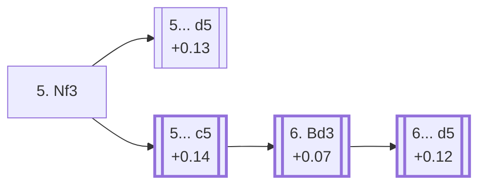

<a name="_TOP_"></a>

# E50 Nimzo-Indian Defense: Normal Variation, 5.Nf3 <br> 1. d4 Nf6 2. c4 e6 3. Nc3 Bb4 4. e3 O-O 5. Nf3 #

Spun off from [E46's own root fork](https://github.com/onclemarcel/chess_flashcards/blob/main/d4_openings/E46_Nimzo_Indian_Rubinstein_Normal.md): masters' third try at White's 5th move (3.8%, well behind 5.Bd3's 63.9% and 5.Ne2's 22.4%), developing the king's knight before committing the bishop. This completes a link E46's own candidate list never actually carried — that page listed only 5.Bd3 (E47) and 5.Ne2 (Reshevsky) and never mentioned 5.Nf3 as a bullet at all, even though it already sat in E46's own stats table at 3.8% masters; a real gap left over from before this code existed, closed now that E50 is built.

`eco.md`'s own name for this code is unusual: **"5.Nf3, Without ...d5."** Verified via `apply_san.py`: **5...d5** is its own sibling code, **E51** — so E50's own scope is every OTHER 5th-move reply Black might choose here, not a deeper continuation of some shared line. That naming quirk shapes the whole card below: the main try covered here (5...c5) is a genuinely different structure from E51's tree, since Black delays or skips ...d5 entirely rather than playing it first.

### Overview

<!-- content-diagram:start -->

<!-- content-diagram:end -->

<a name="_initial_move_"></a>

[](https://lichess.org/analysis/standard/rnbq1rk1/pppp1ppp/4pn2/8/1bPP4/2N1PN2/PP3PPP/R1BQKB1R_b_KQ_-_2_5)

*... 5. Nf3 — Normal Variation*

```
rnbq1rk1/pppp1ppp/4pn2/8/1bPP4/2N1PN2/PP3PPP/R1BQKB1R b KQ - 2 5
```

|  | +0.04 |
| --- | --- |

<!-- lichess-stats:start fen="rnbq1rk1/pppp1ppp/4pn2/8/1bPP4/2N1PN2/PP3PPP/R1BQKB1R b KQ - 2 5" db="lichess,masters" speeds="bullet,blitz" ratings="1800,2000,2200,2500" moves="8" -->
| Move | Online | W/D/B | Masters | W/D/B | |
| :--- | ---: | :--- | ---: | :--- | :-- |
| d5 | 78 k (35.4%) | ⬜⬜⬜⬜⬜⬛⬛⬛⬛⬛ 47/5/48 | 583 (54.1%) | ⬜⬜⬜🟫🟫🟫🟫🟫⬛⬛ 25/53/22 |  |
| c5 | 55 k (25.0%) | ⬜⬜⬜⬜⬜⬛⬛⬛⬛⬛ 47/5/48 | 266 (24.7%) | ⬜⬜🟫🟫🟫🟫🟫⬛⬛⬛ 24/51/25 |  |
| b6 | 49 k (22.0%) | ⬜⬜⬜⬜⬜⬛⬛⬛⬛⬛ 46/5/49 | 149 (13.8%) | ⬜⬜⬜🟫🟫🟫🟫⬛⬛⬛ 29/41/30 |  |
| d6 | 12 k (5.5%) | ⬜⬜⬜⬜🟫⬛⬛⬛⬛⬛ 43/4/53 | 27 (2.5%) | ⬜⬜⬜⬜🟫🟫🟫🟫⬛⬛ 37/37/26 |  |
| Bxc3+ | 8.3 k (3.8%) | ⬜⬜⬜⬜🟫⬛⬛⬛⬛⬛ 44/5/51 | 44 (4.1%) | ⬜⬜🟫🟫🟫🟫🟫⬛⬛⬛ 23/48/30 |  |
| Ne4 | 7.0 k (3.1%) | ⬜⬜⬜⬜⬜🟫⬛⬛⬛⬛ 54/5/42 | 0 | — | ⚠ |
| Re8 | 3.7 k (1.7%) | ⬜⬜⬜⬜⬜⬛⬛⬛⬛⬛ 47/5/48 | 7 (0.6%) | — |  |
| c6 | 2.1 k (0.9%) | ⬜⬜⬜⬜⬜🟫⬛⬛⬛⬛ 54/4/42 | 0 | — | ⚠ |
| Nc6 | 0 | — | 1 (0.1%) | — |  |
| a5 | 0 | — | 1 (0.1%) | — |  |

*Online: bullet/blitz, 1800+ — 221 k games. Masters: 1.1 k games. [Open in the explorer](https://lichess.org/analysis/standard/rnbq1rk1/pppp1ppp/4pn2/8/1bPP4/2N1PN2/PP3PPP/R1BQKB1R_b_KQ_-_2_5#explorer) — updated 2026-09-14*
<!-- lichess-stats:end -->

**5... d5** is masters' clear main try overall (54.1%); among the non-d5 replies that actually stay inside this code, **5... c5** is the top pick (24.7%).

* [**5... d5**](https://github.com/onclemarcel/chess_flashcards/blob/main/d4_openings/E51_Nimzo_Indian_Rubinstein_Nf3_d5.md) (54.1% masters, +0.13): live-confirmed its own code, **E51** — covered on its own card.
* [**5... c5**](#_c5_) (24.7% masters, +0.14): masters' main try among this code's own coverage — built out below.
* **5... b6** (13.8% masters, +0.12): a real, secondary try with no code of its own in this range. Not built out further here (backlog).
* **5... Bxc3+** (4.1% masters, +0.18): trades the bishop immediately rather than deciding a central plan; a real, secondary try with no code of its own in this range. Not built out further here (backlog).
* **5... d6** (2.5% masters, +0.21): a real, secondary try with no code of its own in this range. Not built out further here (backlog).

[*Back to TOP*](#_TOP_)

---

<a name="_c5_"></a>

## 5... c5

[](https://lichess.org/analysis/standard/rnbq1rk1/pp1p1ppp/4pn2/2p5/1bPP4/2N1PN2/PP3PPP/R1BQKB1R_w_KQ_c6_0_6)

*... 5. Nf3 c5*

```
rnbq1rk1/pp1p1ppp/4pn2/2p5/1bPP4/2N1PN2/PP3PPP/R1BQKB1R w KQ c6 0 6
```

|  | +0.14 |
| --- | --- |

<!-- lichess-stats:start fen="rnbq1rk1/pp1p1ppp/4pn2/2p5/1bPP4/2N1PN2/PP3PPP/R1BQKB1R w KQ c6 0 6" db="lichess,masters" speeds="bullet,blitz" ratings="1800,2000,2200,2500" moves="6" -->
| Move | Online | W/D/B | Masters | W/D/B | |
| :--- | ---: | :--- | ---: | :--- | :-- |
| Bd3 | 65 k (50.7%) | ⬜⬜⬜⬜⬜⬛⬛⬛⬛⬛ 47/5/48 | 620 (83.9%) | ⬜⬜⬜🟫🟫🟫🟫🟫⬛⬛ 25/51/23 |  |
| Be2 | 24 k (18.2%) | ⬜⬜⬜⬜⬜⬛⬛⬛⬛⬛ 45/5/50 | 70 (9.5%) | ⬜⬜⬜🟫🟫🟫🟫🟫⬛⬛ 27/51/21 |  |
| a3 | 15 k (11.6%) | ⬜⬜⬜⬜⬜⬛⬛⬛⬛⬛ 45/5/50 | 7 (0.9%) | — |  |
| Bd2 | 11 k (8.5%) | ⬜⬜⬜⬜🟫⬛⬛⬛⬛⬛ 46/7/47 | 32 (4.3%) | ⬜⬜🟫🟫🟫🟫⬛⬛⬛⬛ 19/38/44 |  |
| Qc2 | 5.3 k (4.1%) | ⬜⬜⬜⬜⬜⬛⬛⬛⬛⬛ 47/5/48 | 5 (0.7%) | — |  |
| d5 | 3.3 k (2.6%) | ⬜⬜⬜⬜⬜⬛⬛⬛⬛⬛ 47/5/49 | 2 (0.3%) | — | ⚠ |

*Online: bullet/blitz, 1800+ — 129 k games. Masters: 739 games. [Open in the explorer](https://lichess.org/analysis/standard/rnbq1rk1/pp1p1ppp/4pn2/2p5/1bPP4/2N1PN2/PP3PPP/R1BQKB1R_w_KQ_c6_0_6#explorer) — updated 2026-09-14*
<!-- lichess-stats:end -->

**6. Bd3** is masters' clear main try (83.9%), developing before deciding how to meet Black's own delayed central choice.

* [**6. Bd3**](#_c5_Bd3_) (83.9% masters, +0.07): covered below.
* **6. Be2** (9.5% masters): a quieter developing try. Not built out further here (backlog).
* **6. Bd2** (4.3% masters): ditto.

[*Back to previous move*](#_initial_move_)
[*Back to TOP*](#_TOP_)

---

<a name="_c5_Bd3_"></a>

### 6. Bd3

[](https://lichess.org/analysis/standard/rnbq1rk1/pp1p1ppp/4pn2/2p5/1bPP4/2NBPN2/PP3PPP/R1BQK2R_b_KQ_-_1_6)

*... 5. Nf3 c5 6. Bd3*

```
rnbq1rk1/pp1p1ppp/4pn2/2p5/1bPP4/2NBPN2/PP3PPP/R1BQK2R b KQ - 1 6
```

|  | +0.07 |
| --- | --- |

<!-- lichess-stats:start fen="rnbq1rk1/pp1p1ppp/4pn2/2p5/1bPP4/2NBPN2/PP3PPP/R1BQK2R b KQ - 1 6" db="lichess,masters" speeds="bullet,blitz" ratings="1800,2000,2200,2500" moves="6" -->
| Move | Online | W/D/B | Masters | W/D/B | |
| :--- | ---: | :--- | ---: | :--- | :-- |
| d5 | 38 k (37.4%) | ⬜⬜⬜⬜⬜⬛⬛⬛⬛⬛ 47/6/47 | 2.2 k (71.6%) | ⬜⬜⬜🟫🟫🟫🟫🟫⬛⬛ 27/53/20 |  |
| Nc6 | 20 k (19.6%) | ⬜⬜⬜⬜⬜⬛⬛⬛⬛⬛ 49/5/46 | 279 (9.2%) | ⬜⬜⬜🟫🟫🟫🟫⬛⬛⬛ 31/42/28 |  |
| cxd4 | 16 k (15.9%) | ⬜⬜⬜⬜⬜⬛⬛⬛⬛⬛ 47/5/47 | 121 (4.0%) | ⬜⬜⬜🟫🟫🟫🟫🟫⬛⬛ 32/45/23 |  |
| b6 | 12 k (11.4%) | ⬜⬜⬜⬜⬜⬛⬛⬛⬛⬛ 49/5/46 | 371 (12.2%) | ⬜⬜⬜🟫🟫🟫🟫⬛⬛⬛ 28/45/27 |  |
| d6 | 7.9 k (7.7%) | ⬜⬜⬜⬜🟫⬛⬛⬛⬛⬛ 45/5/50 | 50 (1.6%) | ⬜⬜⬜🟫🟫🟫🟫🟫⬛⬛ 30/48/22 |  |
| Bxc3+ | 5.5 k (5.4%) | ⬜⬜⬜⬜⬜⬛⬛⬛⬛⬛ 46/5/49 | 44 (1.4%) | ⬜⬜🟫🟫🟫🟫🟫⬛⬛⬛ 25/45/30 |  |

*Online: bullet/blitz, 1800+ — 102 k games. Masters: 3.0 k games. [Open in the explorer](https://lichess.org/analysis/standard/rnbq1rk1/pp1p1ppp/4pn2/2p5/1bPP4/2NBPN2/PP3PPP/R1BQK2R_b_KQ_-_1_6#explorer) — updated 2026-09-14*
<!-- lichess-stats:end -->

**6... d5** is masters' overwhelming main try here (71.6%) — and, verified directly via `apply_san.py`, it transposes exactly into **E53**'s own root position (identical piece placement, castling rights and side to move; the only difference is the en-passant flag, which disappears again after Black's very next move either way). So despite `eco.md`'s own "Without ...d5" framing, masters' single most common continuation from this code's own main try (5...c5) is simply to play ...d5 one tempo later and land in the Gligoric System tree anyway.

* [**6... d5**](https://github.com/onclemarcel/chess_flashcards/blob/main/d4_openings/E53_Nimzo_Indian_Rubinstein_Main_Line_c5.md) (71.6% masters, +0.12): live-verified transposition into **E53**'s own root — covered there.
* **6... b6** (12.2% masters): a real, secondary try with no code of its own in this range. Not built out further here (backlog).
* **6... Nc6** (9.2% masters): ditto.
* **6... cxd4** (4.0% masters): ditto.
* **6... d6** (1.6% masters) and **6... Bxc3+** (1.4% masters): rare tries, no code of their own here.

[*Back to TOP*](#_TOP_)
