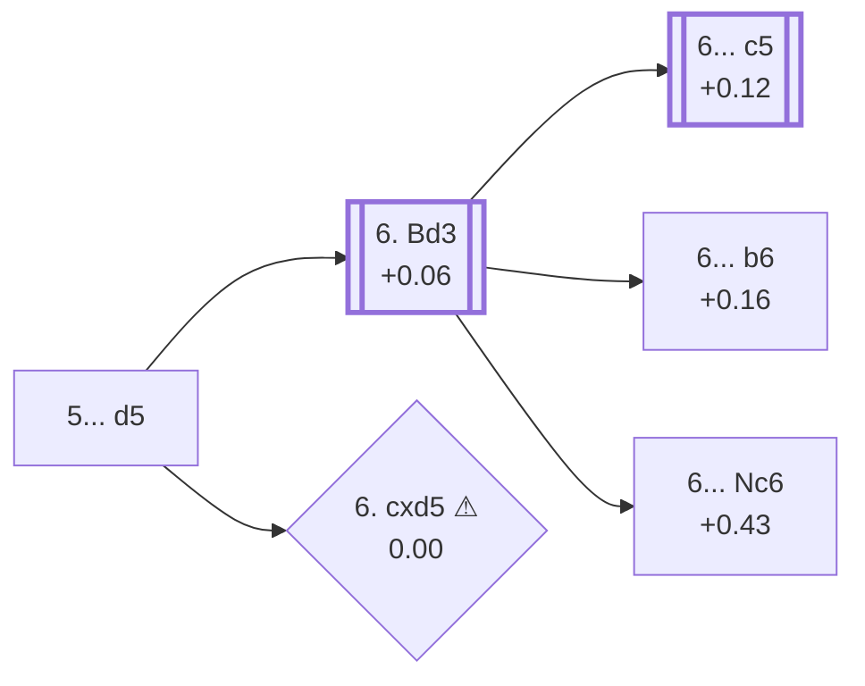

<a name="_TOP_"></a>

# E51 Nimzo-Indian Defense: Normal Variation, 5.Nf3 d5 <br> 1. d4 Nf6 2. c4 e6 3. Nc3 Bb4 4. e3 O-O 5. Nf3 d5 #

Spun off from [E50's own root fork](https://github.com/onclemarcel/chess_flashcards/blob/main/d4_openings/E50_Nimzo_Indian_Rubinstein_Nf3.md): masters' clear main try at Black's own 5th move (54.1%), fighting for the centre immediately rather than delaying as in E50's own "Without ...d5" coverage. The live Lichess explorer tags this exact node **"Ragozin Variation"** already, at the bare 5...d5 position — a broader use of the name than `eco.md`'s own, which restricts "Ragozin Variation" specifically to the deeper 6.Bd3 Nc6 7.O-O dxc4 line covered in a note below. Both are unrelated to the *Ragozin Defence* proper, an entirely different D-series opening (`1.d4 d5 2.c4 e6 3.Nc3 Nf6 4.Nf3 Bb4`, this repo's own D38) reached via a completely different move order — a real name collision worth stating plainly, not assuming away.

### Overview

<!-- content-diagram:start -->

<!-- content-diagram:end -->

<a name="_initial_move_"></a>

[](https://lichess.org/analysis/standard/rnbq1rk1/ppp2ppp/4pn2/3p4/1bPP4/2N1PN2/PP3PPP/R1BQKB1R_w_KQ_d6_0_6)

*... 5. Nf3 d5 — Ragozin Variation*

```
rnbq1rk1/ppp2ppp/4pn2/3p4/1bPP4/2N1PN2/PP3PPP/R1BQKB1R w KQ d6 0 6
```

|  | +0.13 |
| --- | --- |

<!-- lichess-stats:start fen="rnbq1rk1/ppp2ppp/4pn2/3p4/1bPP4/2N1PN2/PP3PPP/R1BQKB1R w KQ d6 0 6" db="lichess,masters" speeds="bullet,blitz" ratings="1800,2000,2200,2500" moves="7" -->
| Move | Online | W/D/B | Masters | W/D/B | |
| :--- | ---: | :--- | ---: | :--- | :-- |
| Bd3 | 225 k (44.4%) | ⬜⬜⬜⬜⬜🟫⬛⬛⬛⬛ 50/5/45 | 1.4 k (56.8%) | ⬜⬜⬜🟫🟫🟫🟫🟫⬛⬛ 24/54/22 |  |
| Bd2 | 65 k (12.9%) | ⬜⬜⬜⬜⬜🟫⬛⬛⬛⬛ 50/6/44 | 651 (26.7%) | ⬜⬜⬜🟫🟫🟫🟫🟫⬛⬛ 32/48/20 |  |
| a3 | 56 k (11.1%) | ⬜⬜⬜⬜⬜⬛⬛⬛⬛⬛ 50/5/45 | 204 (8.4%) | ⬜⬜⬜🟫🟫🟫🟫⬛⬛⬛ 27/42/30 |  |
| Be2 | 51 k (10.1%) | ⬜⬜⬜⬜⬜⬛⬛⬛⬛⬛ 49/5/46 | 128 (5.2%) | ⬜⬜🟫🟫🟫🟫🟫🟫⬛⬛ 24/57/19 |  |
| cxd5 | 47 k (9.3%) | ⬜⬜⬜⬜⬜⬛⬛⬛⬛⬛ 49/5/46 | 15 (0.6%) | — |  |
| Qc2 | 38 k (7.5%) | ⬜⬜⬜⬜⬜🟫⬛⬛⬛⬛ 52/5/44 | 52 (2.1%) | ⬜⬜🟫🟫🟫🟫🟫⬛⬛⬛ 23/50/27 |  |
| Qb3 | 14 k (2.8%) | ⬜⬜⬜⬜⬜⬛⬛⬛⬛⬛ 51/4/45 | 6 (0.2%) | — |  |

*Online: bullet/blitz, 1800+ — 507 k games. Masters: 2.4 k games. [Open in the explorer](https://lichess.org/analysis/standard/rnbq1rk1/ppp2ppp/4pn2/3p4/1bPP4/2N1PN2/PP3PPP/R1BQKB1R_w_KQ_d6_0_6#explorer) — updated 2026-09-09*
<!-- lichess-stats:end -->

**6. Bd3** is masters' clear main try (56.8%), developing before deciding how to meet Black's own centre.

* [**6. Bd3**](#_Bd3_) (56.8% masters, +0.06): covered below.
* **6. Bd2** (26.7% masters): a quieter developing alternative. Not built out further here (backlog).
* **6. a3** (8.4% masters): forces the bishop's hand immediately instead. Not built out further here (backlog).
* **6. Be2** (5.2% masters): ditto.
* **6. Qc2** (2.1% masters): ditto.
* [**6. cxd5 ⚠**](#_cxd5_) (0.6% masters, 9.3% online, 0.00): a real online/masters gap — see the note below.

[*Back to TOP*](#_TOP_)

---

> [!NOTE]
> **6. cxd5**, resolving the central tension at once, is a genuine blitz trap by this repo's own numeric bar: 0.6% masters but 9.3% online is a ratio just over 15×, comfortably past the 8× threshold, with masters cleanly under 2% and online cleanly over 3%. Simplifying the centre this early gives up the tension a Nimzo-Indian player usually wants to keep — natural-looking online, essentially never played by masters.
>
> <a name="_cxd5_"></a>
>
> ### 6. cxd5 ⚠
>
> [](https://lichess.org/analysis/standard/rnbq1rk1/ppp2ppp/4pn2/3P4/1b1P4/2N1PN2/PP3PPP/R1BQKB1R_b_KQ_-_0_6)
>
> *... 5. Nf3 d5 6. cxd5*
>
> ```
> rnbq1rk1/ppp2ppp/4pn2/3P4/1b1P4/2N1PN2/PP3PPP/R1BQKB1R b KQ - 0 6
> ```
>
> |  | 0.00 |
> | --- | --- |
>
> Not built out further here — a real, secondary try with no code of its own in this range.
>
> [*Back to previous move*](#_initial_move_)
> [*Back to TOP*](#_TOP_)

---

<a name="_Bd3_"></a>

## 6. Bd3

[](https://lichess.org/analysis/standard/rnbq1rk1/ppp2ppp/4pn2/3p4/1bPP4/2NBPN2/PP3PPP/R1BQK2R_b_KQ_-_1_6)

*... 5. Nf3 d5 6. Bd3*

```
rnbq1rk1/ppp2ppp/4pn2/3p4/1bPP4/2NBPN2/PP3PPP/R1BQK2R b KQ - 1 6
```

|  | +0.06 |
| --- | --- |

<!-- lichess-stats:start fen="rnbq1rk1/ppp2ppp/4pn2/3p4/1bPP4/2NBPN2/PP3PPP/R1BQK2R b KQ - 1 6" db="lichess,masters" speeds="bullet,blitz" ratings="1800,2000,2200,2500" moves="6" -->
| Move | Online | W/D/B | Masters | W/D/B | |
| :--- | ---: | :--- | ---: | :--- | :-- |
| c5 | 104 k (35.4%) | ⬜⬜⬜⬜⬜⬛⬛⬛⬛⬛ 48/6/46 | 5.1 k (65.4%) | ⬜⬜🟫🟫🟫🟫🟫🟫⬛⬛ 23/58/19 |  |
| dxc4 | 74 k (25.2%) | ⬜⬜⬜⬜⬜⬛⬛⬛⬛⬛ 49/6/46 | 1.2 k (15.9%) | ⬜🟫🟫🟫🟫🟫🟫🟫⬛⬛ 14/69/17 |  |
| b6 | 33 k (11.2%) | ⬜⬜⬜⬜⬜⬛⬛⬛⬛⬛ 48/5/46 | 1.2 k (15.7%) | ⬜⬜⬜🟫🟫🟫🟫🟫⬛⬛ 24/53/24 |  |
| c6 | 21 k (7.0%) | ⬜⬜⬜⬜⬜🟫⬛⬛⬛⬛ 54/4/41 | 0 | — | ⚠ |
| Nbd7 | 15 k (5.0%) | ⬜⬜⬜⬜⬜🟫⬛⬛⬛⬛ 52/5/43 | 33 (0.4%) | ⬜⬜⬜⬜🟫🟫🟫🟫🟫⬛ 39/45/15 |  |
| a6 | 10.0 k (3.4%) | ⬜⬜⬜⬜⬜⬛⬛⬛⬛⬛ 50/5/45 | 12 (0.2%) | — |  |
| Nc6 | 0 | — | 159 (2.1%) | ⬜⬜⬜🟫🟫🟫🟫⬛⬛⬛ 35/40/26 |  |

*Online: bullet/blitz, 1800+ — 293 k games. Masters: 7.7 k games. [Open in the explorer](https://lichess.org/analysis/standard/rnbq1rk1/ppp2ppp/4pn2/3p4/1bPP4/2NBPN2/PP3PPP/R1BQK2R_b_KQ_-_1_6#explorer) — updated 2026-09-09*
<!-- lichess-stats:end -->

**6... c5** is masters' clear main try (65.4%), striking at the centre before White finishes developing.

* [**6... c5**](https://github.com/onclemarcel/chess_flashcards/blob/main/d4_openings/E53_Nimzo_Indian_Rubinstein_Main_Line_c5.md) (65.4% masters, +0.12): live-confirmed its own code, **E53** — covered on its own card.
* **6... dxc4** (15.9% masters): resolves the tension instead; a real, secondary try with no code of its own in this range. Not built out further here (backlog).
* [**6... b6**](https://github.com/onclemarcel/chess_flashcards/blob/main/d4_openings/E52_Nimzo_Indian_Rubinstein_Main_Line_b6.md) (15.7% masters, +0.16): live-confirmed its own code, **E52** — covered on its own card.
* [**6... Nc6**](#_Nc6_) (2.1% masters, +0.43): the *Ragozin Variation* proper (`eco.md`'s own specific use of the name, one ply narrower than the live explorer's) — covered below.

[*Back to TOP*](#_TOP_)

---

<a name="_Nc6_"></a>

## 6... Nc6 — Ragozin Variation

[](https://lichess.org/analysis/standard/r1bq1rk1/ppp2ppp/2n1pn2/3p4/1bPP4/2NBPN2/PP3PPP/R1BQK2R_w_KQ_-_2_7)

*... 5. Nf3 d5 6. Bd3 Nc6 — Ragozin Variation*

```
r1bq1rk1/ppp2ppp/2n1pn2/3p4/1bPP4/2NBPN2/PP3PPP/R1BQK2R w KQ - 2 7
```

|  | +0.43 |
| --- | --- |

**7. O-O** is White's near-automatic reply, castling into safety.

```
r1bq1rk1/ppp2ppp/2n1pn2/3p4/1bPP4/2NBPN2/PP3PPP/R1BQ1RK1 b - - 3 7
```

|  | +0.23 |
| --- | --- |

**7... dxc4** completes the Ragozin Variation proper, giving up the centre to hit the bishop and gain a tempo.

[](https://lichess.org/analysis/standard/r1bq1rk1/ppp2ppp/2n1pn2/8/1bpP4/2NBPN2/PP3PPP/R1BQ1RK1_w_-_-_0_8)

```
r1bq1rk1/ppp2ppp/2n1pn2/8/1bpP4/2NBPN2/PP3PPP/R1BQ1RK1 w - - 0 8
```

|  | +0.46 |
| --- | --- |

<!-- lichess-stats:start fen="r1bq1rk1/ppp2ppp/2n1pn2/8/1bpP4/2NBPN2/PP3PPP/R1BQ1RK1 w - - 0 8" db="lichess,masters" speeds="bullet,blitz" ratings="1800,2000,2200,2500" moves="4" -->
| Move | Online | W/D/B | Masters | W/D/B | |
| :--- | ---: | :--- | ---: | :--- | :-- |
| Bxc4 | 4.8 k (99.8%) | ⬜⬜⬜⬜⬜⬜⬛⬛⬛⬛ 55/4/41 | 51 (100.0%) | ⬜⬜⬜⬜🟫🟫🟫🟫⬛⬛ 35/41/24 |  |
| a3 | 5 (0.1%) | — | 0 | — |  |
| Re1 | 1 (0.0%) | — | 0 | — |  |
| Qd2 | 1 (0.0%) | — | 0 | — |  |

*Online: bullet/blitz, 1800+ — 4.8 k games. Masters: 51 games. [Open in the explorer](https://lichess.org/analysis/standard/r1bq1rk1/ppp2ppp/2n1pn2/8/1bpP4/2NBPN2/PP3PPP/R1BQ1RK1_w_-_-_0_8#explorer) — updated 2026-09-09*
<!-- lichess-stats:end -->

**8. Bxc4** is masters' near-universal recapture (100%), simply regaining the pawn. Not built out further here (backlog) — deeper Ragozin theory from this exact node is its own extensive body of work.

[*Back to TOP*](#_TOP_)
