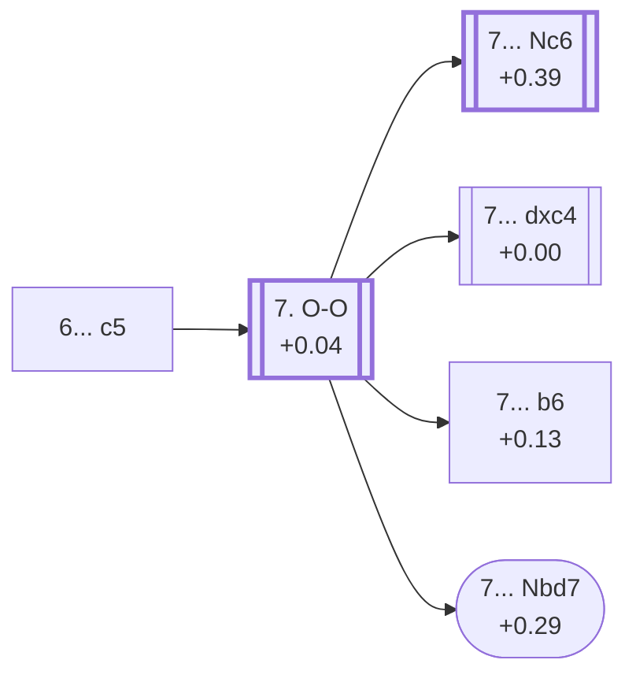

<a name="_TOP_"></a>

# E53 Nimzo-Indian Defense: Normal Variation, Gligoric System <br> 1. d4 Nf6 2. c4 e6 3. Nc3 Bb4 4. e3 O-O 5. Nf3 d5 6. Bd3 c5 #

Spun off from [E51's own "6.Bd3" node](https://github.com/onclemarcel/chess_flashcards/blob/main/d4_openings/E51_Nimzo_Indian_Rubinstein_Nf3_d5.md#_Bd3_): masters' clear main try at Black's own 6th move (65.4%), striking at the centre before White finishes developing. Also reached, verified via `apply_san.py`, by transposition from [E50's own "5...c5 6.Bd3" node](https://github.com/onclemarcel/chess_flashcards/blob/main/d4_openings/E50_Nimzo_Indian_Rubinstein_Nf3.md#_c5_Bd3_) (71.6% masters there). Live-tagged the *Gligoric System*.

### Overview

<!-- content-diagram:start -->

<!-- content-diagram:end -->

<a name="_initial_move_"></a>

[](https://lichess.org/analysis/standard/rnbq1rk1/pp3ppp/4pn2/2pp4/1bPP4/2NBPN2/PP3PPP/R1BQK2R_w_KQ_c6_0_7)

*... 6... c5 — Gligoric System*

```
rnbq1rk1/pp3ppp/4pn2/2pp4/1bPP4/2NBPN2/PP3PPP/R1BQK2R w KQ c6 0 7
```

|  | +0.12 |
| --- | --- |

<!-- lichess-stats:start fen="rnbq1rk1/pp3ppp/4pn2/2pp4/1bPP4/2NBPN2/PP3PPP/R1BQK2R w KQ c6 0 7" db="lichess,masters" speeds="bullet,blitz" ratings="1800,2000,2200,2500" moves="4" -->
| Move | Online | W/D/B | Masters | W/D/B | |
| :--- | ---: | :--- | ---: | :--- | :-- |
| O-O | 106 k (71.3%) | ⬜⬜⬜⬜⬜⬛⬛⬛⬛⬛ 48/6/46 | 7.0 k (94.2%) | ⬜⬜🟫🟫🟫🟫🟫🟫⬛⬛ 24/57/19 |  |
| cxd5 | 22 k (15.1%) | ⬜⬜⬜⬜⬜⬛⬛⬛⬛⬛ 48/6/47 | 341 (4.6%) | ⬜⬜⬜🟫🟫🟫🟫🟫⬛⬛ 28/52/20 |  |
| a3 | 12 k (8.0%) | ⬜⬜⬜⬜⬜⬛⬛⬛⬛⬛ 47/5/48 | 84 (1.1%) | ⬜⬜⬜🟫🟫🟫🟫⬛⬛⬛ 25/43/32 |  |
| dxc5 | 5.2 k (3.5%) | ⬜⬜⬜⬜⬜⬛⬛⬛⬛⬛ 47/6/47 | 4 (0.1%) | — | ⚠ |

*Online: bullet/blitz, 1800+ — 149 k games. Masters: 7.5 k games. [Open in the explorer](https://lichess.org/analysis/standard/rnbq1rk1/pp3ppp/4pn2/2pp4/1bPP4/2NBPN2/PP3PPP/R1BQK2R_w_KQ_c6_0_7#explorer) — updated 2026-09-14*
<!-- lichess-stats:end -->

**7. O-O** is masters' overwhelming main try (94.2%), simply castling.

* [**7. O-O**](#_OO_) (94.2% masters, +0.04): covered below.
* **7. cxd5** (4.6% masters): resolves the tension immediately instead. Not built out further here (backlog).

[*Back to TOP*](#_TOP_)

---

<a name="_OO_"></a>

## 7. O-O

[](https://lichess.org/analysis/standard/rnbq1rk1/pp3ppp/4pn2/2pp4/1bPP4/2NBPN2/PP3PPP/R1BQ1RK1_b_-_-_1_7)

*... 6... c5 7. O-O*

```
rnbq1rk1/pp3ppp/4pn2/2pp4/1bPP4/2NBPN2/PP3PPP/R1BQ1RK1 b - - 1 7
```

|  | +0.04 |
| --- | --- |

<!-- lichess-stats:start fen="rnbq1rk1/pp3ppp/4pn2/2pp4/1bPP4/2NBPN2/PP3PPP/R1BQ1RK1 b - - 1 7" db="lichess,masters" speeds="bullet,blitz" ratings="1800,2000,2200,2500" moves="6" -->
| Move | Online | W/D/B | Masters | W/D/B | |
| :--- | ---: | :--- | ---: | :--- | :-- |
| Nc6 | 37 k (35.2%) | ⬜⬜⬜⬜⬜⬛⬛⬛⬛⬛ 48/6/46 | 3.0 k (42.7%) | ⬜⬜⬜🟫🟫🟫🟫🟫⬛⬛ 27/53/20 |  |
| cxd4 | 32 k (30.1%) | ⬜⬜⬜⬜⬜⬛⬛⬛⬛⬛ 48/6/46 | 1.5 k (22.0%) | ⬜⬜🟫🟫🟫🟫🟫🟫⬛⬛ 22/58/19 |  |
| dxc4 | 24 k (22.4%) | ⬜⬜⬜⬜⬜⬛⬛⬛⬛⬛ 46/6/48 | 2.2 k (31.9%) | ⬜⬜🟫🟫🟫🟫🟫🟫⬛⬛ 22/60/18 |  |
| Bxc3 | 5.7 k (5.4%) | ⬜⬜⬜⬜⬜🟫⬛⬛⬛⬛ 54/5/41 | 12 (0.2%) | — |  |
| b6 | 2.6 k (2.5%) | ⬜⬜⬜⬜⬜⬛⬛⬛⬛⬛ 47/6/47 | 173 (2.5%) | ⬜⬜⬜🟫🟫🟫🟫🟫🟫⬛ 28/60/13 |  |
| a6 | 1.9 k (1.8%) | ⬜⬜⬜⬜⬜⬛⬛⬛⬛⬛ 51/4/45 | 0 | — | ⚠ |
| Nbd7 | 0 | — | 51 (0.7%) | ⬜⬜⬜⬜🟫🟫🟫🟫⬛⬛ 39/41/20 |  |

*Online: bullet/blitz, 1800+ — 106 k games. Masters: 7.0 k games. [Open in the explorer](https://lichess.org/analysis/standard/rnbq1rk1/pp3ppp/4pn2/2pp4/1bPP4/2NBPN2/PP3PPP/R1BQ1RK1_b_-_-_1_7#explorer) — updated 2026-09-14*
<!-- lichess-stats:end -->

**7... Nc6** is masters' clear main try (42.7%), developing the last minor piece before committing the centre pawn.

* [**7... Nc6**](https://github.com/onclemarcel/chess_flashcards/blob/main/d4_openings/E56_Nimzo_Indian_Main_Line_Nc6.md) (42.7% masters, +0.39): live-confirmed its own code, **E56** — covered on its own card.
* [**7... dxc4**](https://github.com/onclemarcel/chess_flashcards/blob/main/d4_openings/E54_Nimzo_Indian_Gligoric_dc.md) (31.9% masters, +0.00): live-confirmed its own code, **E54**, once White recaptures with 8.Bxc4 — covered on its own card.
* **7... cxd4** (22.0% masters): a real, secondary try — nearly as common as 7...dxc4 — with no code of its own in this range; stays under this same E53 general umbrella. Not built out further here (backlog).
* [**7... b6**](#_Keres_) (2.5% masters, +0.13): the *Keres Variation* — covered below.
* [**7... Nbd7**](#_Nbd7_) (0.7% masters, +0.29): the *Gligoric System With 7...Nbd7* — covered below.

[*Back to TOP*](#_TOP_)

---

> [!NOTE]
> **7... b6 — Keres Variation.** This is at least the fourth or fifth reuse of the name "Keres Variation" across this whole ECO sweep by now (the pattern already flagged repeatedly in earlier D-series batches) — this one is unrelated to any of the others, just Paul Keres's name attached independently to another fianchetto idea. Live-confirmed the same name at this exact node.
>
> <a name="_Keres_"></a>
>
> ### 7... b6 — Keres Variation
>
> [](https://lichess.org/analysis/standard/rnbq1rk1/p4ppp/1p2pn2/2pp4/1bPP4/2NBPN2/PP3PPP/R1BQ1RK1_w_-_-_0_8)
>
> ```
> rnbq1rk1/p4ppp/1p2pn2/2pp4/1bPP4/2NBPN2/PP3PPP/R1BQ1RK1 w - - 0 8
> ```
>
> |  | +0.13 |
> | --- | --- |
>
> Masters clearly prefer **8. cxd5** (76.0%) here, but online play strongly favours **8. a3** instead (46.8% online vs 10.7% masters) — a genuine online/masters inversion, not a trap by the numeric bar (a3's masters share is well above the 2% ceiling that rule requires), just a case where club-level and top-level players reach for different resolutions of the same tension. Not built out further here (backlog).
>
> [*Back to previous move*](#_OO_)
> [*Back to TOP*](#_TOP_)

---

> [!NOTE]
> **7... Nbd7 — Gligoric System With 7...Nbd7.** A genuine masters minority (0.7%) compared to the plain Gligoric System's own 7...Nc6/7...dxc4/7...cxd4 tries, yet still carries its own `eco.md` code.
>
> <a name="_Nbd7_"></a>
>
> ### 7... Nbd7 — Gligoric System With 7...Nbd7
>
> [](https://lichess.org/analysis/standard/r1bq1rk1/pp1n1ppp/4pn2/2pp4/1bPP4/2NBPN2/PP3PPP/R1BQ1RK1_w_-_-_2_8)
>
> ```
> r1bq1rk1/pp1n1ppp/4pn2/2pp4/1bPP4/2NBPN2/PP3PPP/R1BQ1RK1 w - - 2 8
> ```
>
> |  | +0.29 |
> | --- | --- |
>
> **8. a3** is masters' clear main try (55.7%), forcing the bishop's decision at once. **8. cxd5** (34.4%) is the main alternative. Not built out further here (backlog).
>
> [*Back to previous move*](#_OO_)
> [*Back to TOP*](#_TOP_)
