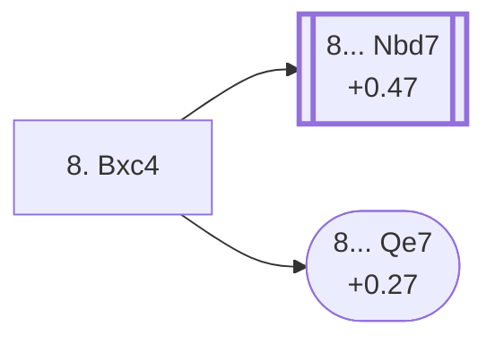

<a name="_TOP_"></a>

# E54 Nimzo-Indian Defense: Normal Variation, Gligoric System, Exchange Variation <br> 1. d4 Nf6 2. c4 e6 3. Nc3 Bb4 4. e3 O-O 5. Nf3 d5 6. Bd3 c5 7. O-O dxc4 8. Bxc4 #

Spun off from [E53's own "7.O-O" node](https://github.com/onclemarcel/chess_flashcards/blob/main/d4_openings/E53_Nimzo_Indian_Rubinstein_Main_Line_c5.md#_OO_): masters' second try at Black's own 7th move (31.9%), resolving the central tension and inviting White's bishop to a more active diagonal. Live-tagged the *Exchange Variation* — `eco.md`'s own entry just describes the move ("Gligoric System With 7...dc").

### Overview

<!-- content-diagram:start -->

<!-- content-diagram:end -->

<a name="_initial_move_"></a>

[](https://lichess.org/analysis/standard/rnbq1rk1/pp3ppp/4pn2/2p5/1bBP4/2N1PN2/PP3PPP/R1BQ1RK1_b_-_-_0_8)

*... 7... dxc4 8. Bxc4 — Exchange Variation*

```
rnbq1rk1/pp3ppp/4pn2/2p5/1bBP4/2N1PN2/PP3PPP/R1BQ1RK1 b - - 0 8
```

|  | +0.00 |
| --- | --- |

<!-- lichess-stats:start fen="rnbq1rk1/pp3ppp/4pn2/2p5/1bBP4/2N1PN2/PP3PPP/R1BQ1RK1 b - - 0 8" db="lichess,masters" speeds="bullet,blitz" ratings="1800,2000,2200,2500" moves="6" -->
| Move | Online | W/D/B | Masters | W/D/B | |
| :--- | ---: | :--- | ---: | :--- | :-- |
| cxd4 | 31 k (48.8%) | ⬜⬜⬜⬜🟫⬛⬛⬛⬛⬛ 46/6/48 | 1.3 k (40.2%) | ⬜⬜🟫🟫🟫🟫🟫🟫🟫⬛ 15/73/12 |  |
| Nc6 | 16 k (26.3%) | ⬜⬜⬜⬜⬜⬛⬛⬛⬛⬛ 47/7/47 | 536 (16.1%) | ⬜⬜🟫🟫🟫🟫🟫🟫⬛⬛ 19/56/25 |  |
| Nbd7 | 4.5 k (7.2%) | ⬜⬜⬜⬜🟫⬛⬛⬛⬛⬛ 42/6/52 | 1.1 k (33.0%) | ⬜⬜🟫🟫🟫🟫🟫🟫⬛⬛ 21/60/19 |  |
| a6 | 3.2 k (5.2%) | ⬜⬜⬜⬜⬜⬛⬛⬛⬛⬛ 47/5/48 | 0 | — | ⚠ |
| b6 | 2.9 k (4.6%) | ⬜⬜⬜⬜🟫⬛⬛⬛⬛⬛ 45/5/50 | 159 (4.8%) | ⬜⬜⬜🟫🟫🟫🟫🟫⬛⬛ 31/50/19 |  |
| Bxc3 | 2.6 k (4.1%) | ⬜⬜⬜⬜⬜🟫⬛⬛⬛⬛ 52/5/43 | 0 | — | ⚠ |
| Bd7 | 0 | — | 103 (3.1%) | ⬜⬜🟫🟫🟫🟫🟫🟫⬛⬛ 23/54/22 |  |
| Qe7 | 0 | — | 60 (1.8%) | ⬜⬜⬜🟫🟫🟫🟫⬛⬛⬛ 25/45/30 |  |

*Online: bullet/blitz, 1800+ — 63 k games. Masters: 3.3 k games. [Open in the explorer](https://lichess.org/analysis/standard/rnbq1rk1/pp3ppp/4pn2/2p5/1bBP4/2N1PN2/PP3PPP/R1BQ1RK1_b_-_-_0_8#explorer) — updated 2026-09-15*
<!-- lichess-stats:end -->

**8... cxd4** is masters' clear main try (40.2%), resolving the last central tension.

* **8... cxd4** (40.2% masters, +0.00): a real, secondary try — masters' actual top pick here — with no code of its own in this range. Not built out further here (backlog).
* [**8... Nbd7**](https://github.com/onclemarcel/chess_flashcards/blob/main/d4_openings/E55_Nimzo_Indian_Gligoric_Bronstein.md) (33.0% masters, +0.47): live-confirmed its own code, **E55**, the *Bronstein Variation* — covered on its own card.
* **8... Nc6** (16.1% masters): a real, secondary try with no code of its own in this range. Not built out further here (backlog).
* **8... b6** (4.8% masters): ditto.
* [**8... Qe7**](#_Qe7_) (1.8% masters, +0.27): the *Smyslov Variation* — covered below. Notably, this is `eco.md`'s only other named line from this node, yet it trails **three** uncoded tries (cxd4, Nc6, b6) in masters popularity — a genuine "coded line behind uncoded rivals" pattern, the same shape already seen repeatedly in this repo's D-series QGD sweep.

[*Back to TOP*](#_TOP_)

---

> [!NOTE]
> **8... Qe7 — Smyslov Variation.** At least the fourth or fifth reuse of "Smyslov Variation" across this repo's whole ECO sweep (the D98-D99 batch alone already found four in one cluster) — this one is unrelated to any of the others.
>
> <a name="_Qe7_"></a>
>
> ### 8... Qe7 — Smyslov Variation
>
> [](https://lichess.org/analysis/standard/rnb2rk1/pp2qppp/4pn2/2p5/1bBP4/2N1PN2/PP3PPP/R1BQ1RK1_w_-_-_1_9)
>
> ```
> rnb2rk1/pp2qppp/4pn2/2p5/1bBP4/2N1PN2/PP3PPP/R1BQ1RK1 w - - 1 9
> ```
>
> |  | +0.27 |
> | --- | --- |
>
> This exact node clears the *stadium* ("understudied everywhere") bar cleanly: masters 1.8% (well under 2%), online just 0.3% (well under 3%) — genuinely rare in both databases despite carrying its own code. **9. a3** is masters' main try from here (68.3%). Not built out further here (backlog).
>
> [*Back to previous move*](#_initial_move_)
> [*Back to TOP*](#_TOP_)
